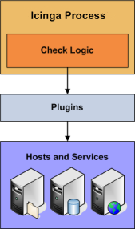

Aktive Prüfungen (Active Checks)
================================

Einführung
----------
Icinga ist in der Lage, Hosts und Services auf zwei Arten zu
überwachen: aktiv und passiv. Passive Prüfungen werden
[anderswo](passivechecks.md) beschrieben, so dass wir uns hier auf aktive
Prüfungen konzentrieren. Aktive Prüfungen sind die gebräuchlichste
Methode zur Überwachung von Hosts und Services. Die Hauptmerkmale von
aktiven Prüfungen sind

-   aktive Prüfungen werden vom NAME-ICINGA-Prozess veranlasst

-   aktive Prüfungen laufen auf einer regelmäßig geplanten Basis

Wie werden aktive Prüfungen durchgeführt?
-----------------------------------------

Aktive Prüfungen werden durch die Prüfungslogik im NAME-ICINGA-Daemon
veranlasst. Wenn NAME-ICINGA den Status eines Hosts oder Services prüfen
muss, wird es ein Plugin ausführen und die Informationen übergeben, was
geprüft werden soll. Das Plugin wird dann den Betriebszustand des Hosts
oder Service prüfen und die Ergebnisse an den NAME-ICINGA-Daemon
zurückmelden. NAME-ICINGA wird die Ergebnisse der Host- oder
Service-Prüfung verarbeiten und entsprechend notwendige Aktionen
ausführen (z.B. Benachrichtigungen versenden, Eventhandler ausfüren,
usw.).

Mehr Informationen, wie Plugins arbeiten, finden Sie [hier](#plugins).

Wann werden aktive Prüfungen ausgeführt?
----------------------------------------

Aktive Prüfungen werden ausgeführt

-   in regelmäßigen Intervallen, wie sie in den *check\_interval* und
    *retry\_interval*-Optionen in Ihren Host- und Service-Definitionen
    festgelegt sind

-   nach Bedarf

Regelmäßig geplante Prüfungen erfolgen in Intervallen, die den
Einstellungen in *check\_interval* oder *retry\_interval* in Ihren Host-
oder Service-Definitionen entsprechen, abhängig davon, in welchem
[Statustyp](#statetypes) sich der Host oder Service befindet.

Prüfungen nach Bedarf werden ausgeführt, wann immer NAME-ICINGA die
Notwendigkeit sieht, die neuesten Statusinformationen über einen
bestimmten Host oder Service zu ermitteln. Wenn NAME-ICINGA
beispielsweise die [Erreichbarkeit](#networkreachability) eines Hosts
feststellt, wird es oft Prüfungen von Eltern- und Kind-Hosts
durchführen, um den genauen Status eines bestimmten Netzwerk-Segments zu
ermitteln. Prüfungen nach Bedarf finden sich auch in der
[vorausschauenden Abhängigkeitsprüfung](#dependencychecks)s-Logik, um
sicherzustellen, dass NAME-ICINGA möglichst genaue Statusinformationen
hat.

Aktive Prüfungen
in regelmäßigen Abständen
Aktive Prüfungen
nach Bedarf
