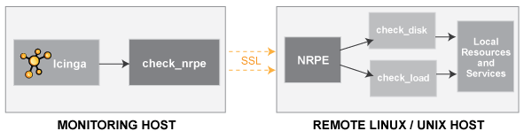
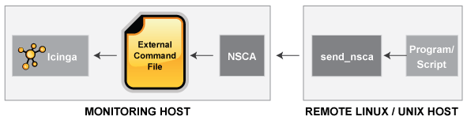
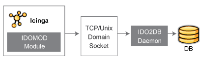

NAME-ICINGA Addons
==================

Einführung
----------

Es gibt eine Menge von "Addon"-Software-Paketen, die für NAME-ICINGA
verfügbar sind. Addons können genutzt werden, um die Funktionalität von
NAME-ICINGA zu erweitern oder NAME-ICINGA mit anderen Applikationen zu
integrieren.

Addons gibt es für:

-   die Verwaltung der Konfigurationsdateien über ein Web-Interface

    -   [NAME-NCONF](http://www.nconf.org),
        [NAME-NAGIOSQL](http://www.nagiosql.org),
        [NAME-LCONF](http://www.netways.de/nc/de/produkte/icinga/addons/lconf),
        [NAME-LILAC](http://sourceforge.net/projects/lilac--reloaded/),
        ...

-   die Überwachung von entfernten Hosts (\*NIX, Windows, etc.)

    -   [NAME-NSCA](#nsca), [NAME-NRPE](#nrpe),
        [NAME-CHECK\_MK](http://mathias-kettner.de/check_mk.html), ...

    -   [NAME-NSCLIENT](http://www.nsclient.org), ...

-   die Erteilung von passiven Prüfungen von entfernten Hosts

    -   [NAME-NSCLIENT](http://www.nsclient.org),
        [NAME-CHECK\_MK](http://mathias-kettner.de/check_mk.html), ...

-   die Vereinfachung/Erweiterung der Überwachungslogik

    -   [NAME-BP](http://bp-addon.monitoringexchange.org) ...

-   Visualisierung der Informationen

    -   [NAME-PNP](http://docs.pnp4nagios.org/de/pnp-0.6/start)

    -   [NAME-NAGVIS](http://www.nagvis.org)

-   alternative Web-Interfaces

    -   [NAME-THRUK](http://www.thruk.org),
        [NAME-MULTISITE](http://mathias-kettner.de/checkmk_multisite.html)

-   ... und vieles mehr

Sie finden viele Addons für NAME-ICINGA unter:

-   [URL-ICINGA](http://www.icinga.org//)

-   [SourceForge.net](http://www.sourceforge.net/)

-   [URL-MONITORINGEXCHANGE](http://www.monitoringexchange.org/)

Wir werden eine kurze Einführung für ein paar Addons geben, die Ethan
Galstad für NAME-NAGIOS entwickelt hat...

**NAME-NRPE**

NAME-NRPE ist ein Addon, das es Ihnen erlaubt, [Plugins](#plugins) auf
entfernten NAME-LINUX-/Unix-Hosts auszuführen. Dies ist nützlich, wenn
Sie lokale Ressourcen/Attribute wie Plattenbelegung, CPU-Last,
Speicherbelegung usw. auf entfernten Hosts überwachen wollen. Ähnliche
Funktionalitäten können durch das *check\_by\_ssh*-Plugin erreicht
werden, obwohl es auf dem Überwachungsrechner für eine höhere
CPU-Belastung sorgen kann - besonders dann, wenn Sie hunderte oder
tausende von Hosts überwachen.

Das NAME-NRPE-Addon finden Sie unter
[URL-NAGIOS-NRPE](http://sourceforge.net/projects/nagios/files/nrpe-2.x/).
Etwas [Dokumentation](#nrpe) finden Sie in nächsten Abschnitt.

**NAME-NSCA**

NAME-NSCA ist ein Addon, das es Ihnen erlaubt, [passive
Prüf](#passivechecks)-Resultate von entfernten NAME-LINUX-/Unix-Hosts an
den NAME-ICINGA-Daemon zu senden, der auf dem Überwachungs-Server läuft.
Das ist sehr hilfreich in [verteilten](#distributed) und
[redundanten/Failover](#redundancy)-Überwachungs-Umgebungen.

Das NAME-NSCA-Addon finden Sie unter
[https://git.icinga.org/?p=icinga-nsca.git](https://git.icinga.org/?p=icinga-nsca.git).
Die [Dokumentation](#nsca) finden Sie in nächsten Abschnitt.

**NAME-IDOUTILS**

NAME-IDOUTILS ist ein Addon, das es Ihnen erlaubt, alle
NAME-ICINGA-Statusinformationen in einer Datenbank zu speichern. Mehrere
Instanzen von NAME-ICINGA können all ihre Informationen in einer
gemeinsamen Datenbank für ein zentrales Berichtswesen speichern. Dies
wird wahrscheinlich in der Zukunft als Basis für ein neues
NAME-PHP-basiertes Web-Interface für NAME-ICINGA dienen. Neben
NAME-MYSQL werden auch NAME-ORACLE und NAME-POSTGRES unterstützt.

Das NAME-IDOUTILS-Addon und die Dokumentation finden Sie unter
[URL-ICINGADOCS](http://docs.icinga.org/).

Addons
NSCA
Addons
NRPE
Addons
NAME-IDOUTILS
NAME-NCONF
Addons
NAME-NCONF
NAME-LCONF
Addons
NAME-LCONF
NAME-LILAC
Addons
NAME-LILAC
NAME-NAGIOSQL
Addons
NAME-NAGIOSQL
NAME-NSCLIENT
Addons
NAME-NSCLIENT
NAME-CHECK\_MK
Addons
NAME-CHECK\_MK
NAME-BP
Addons
NAME-BP
NAME-PNP
Addons
NAME-PNP
NAME-NAGVIS
Addons
NAME-NAGVIS
NAME-THRUK
Addons
NAME-THRUK
NAME-MULTISITE
Addons
NAME-MULTISITE
