NAME-UI: Informationen über die CGIs
====================================

**Einführung in das NAME-UI**

Die verschiedenen mit dem NAME-ICINGA Core gelieferten CGIs werden hier
beschrieben, zusammen mit den Autorisierungsanforderungen für den
Zugriff und den Gebrauch jedes CGIs. Im Grundzustand erwarten die CGIs,
dass Sie sich dem Web-Server gegenüber authentifiziert haben und
autorisiert sind, jede Information zu sehen, die Sie anfordern. Mehr
Informationen über die Konfiguration der Autorisierung finden Sie
[hier](#cgiauth).

Die CGIs können über verschiedene Parameter gesteuert werden. Mehr
Informationen finden Sie [hier](#cgiparams).

**Index**

[Status CGI](#cgis-status_cgi)

[Status map CGI](#cgis-statusmap_cgi)

[Tactical overview CGI](#cgis-tac_cgi)

[Network outages CGI](#cgis-outages_cgi)

[Configuration CGI](#cgis-config_cgi)

[Command CGI](#cgis-cmd_cgi)

[Extended information CGI](#cgis-extinfo_cgi)

[Event log CGI](#cgis-showlog_cgi)

[Alert history CGI](#cgis-history_cgi)

[Notifications CGI](#cgis-notifications_cgi)

[Trends CGI](#cgis-trends_cgi)

[Availability reporting CGI](#cgis-avail_cgi)

[Alert histogram CGI](#cgis-histogram_cgi)

[Alert summary CGI](#cgis-summary_cgi)

[Änderungen am Classic UI](#cgis-changes)

**Status CGI**

  ------------------ ------------------ ------------------ ------------------
        status-b.png)      status-c.png)      status-d.png)
  ------------------ ------------------ ------------------ ------------------

Dateiname:***status.cgi***

**Beschreibung:**

Dies ist das wichtigste mit NAME-ICINGA gelieferte CGI. Es erlaubt Ihnen
den aktuellen Status aller überwachten Hosts und Services zu sehen. Das
Status-CGI kann zwei Arten von Ausgaben liefern - einen Status-Überblick
aller Hostgruppen (oder einer bestimmten Hostgruppe) und eine
detaillierte Anzeige aller Services (oder diese bezogen auf einen
bestimmten Host).

**Autorisierungsanforderungen:**

-   Wenn Sie [*für alle Hosts
    autorisiert*](#configcgi-authorized_for_all_hosts) sind, können Sie
    alle Hosts **und** alle Services ansehen.

-   Wenn Sie [*für alle Services
    autorisiert*](#configcgi-authorized_for_all_services) sind, können
    Sie alle Services ansehen.

-   Wenn Sie ein *authentifizierter Kontakt* sind, können Sie alle Hosts
    und Services ansehen, deren Kontakt Sie sind.

**Status Map CGI**

  ----------------------------------
  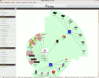
  ----------------------------------

Dateiname:***statusmap.cgi***

**Beschreibung:**

Dieses CGI erstellt eine Karte aller Hosts, die Sie in Ihrem Netzwerk
definiert haben. Das CGI nutzt Thomas Boutells
[gd](http://www.boutell.com/gd/)-Library (Version 1.6.3 oder höher), um
ein PNG-Bild Ihrer Netzwerk-Struktur zu erstellen. Die verwendeten
Koordinaten (zusammen mit den optionalen Icons) werden aus den
[Host](#objectdefinitions-host)-Definitionen genommen. Wenn Sie es
vorziehen, dass das CGI automatisch für Sie Koordinaten generiert,
nutzen Sie die
[default\_statusmap\_layout](#configcgi-default_statusmap_layout)-Direktive,
um einen Layout-Algorithmus zu definieren.

**Autorisierungsanforderungen:**

-   Wenn Sie [*für alle Hosts
    autorisiert*](#configcgi-authorized_for_all_hosts) sind, können Sie
    alle Hosts **und** alle Services ansehen.

-   Wenn Sie ein *authentifizierter Kontakt* sind, können Sie alle
    Services ansehen, deren Kontakt Sie sind.

> **Note**
>
> Anmerkung: Benutzer, die nicht autorisiert sind, bestimmte Hosts zu
> sehen, werden *unbekannte* Knoten an diesen Stellen sehen. Uns ist
> klar, dass sie eigentlich *überhaupt nichts* dort sehen sollten, aber
> es ist nicht sinnvoll, eine Karte zu generieren, wenn man nicht die
> ganzen Host-Abhängigkeiten sehen kann.

**Tactical Overview CGI**

  ----------------------------
  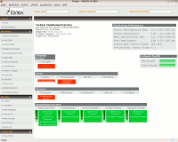
  ----------------------------

Dateiname:***tac.cgi***

**Beschreibung:**

Dieses CGI dient als Sicht aus der "Vogelperspektive" auf alle
Netzwerk-Überwachungs-Aktivitäten. Es erlaubt Ihnen schnell
Netzwerkausfälle sowie Host- und Service-Zustände zu erkennen. Es
unterscheidet zwischen Problemen, die auf irgendeine Weise "behandelt"
wurden (z.B. bestätigt oder Benachrichtigungen deaktiviert) und solchen,
die nicht behandelt wurden und die deshalb Beachtung erfordern. Das ist
sehr hilfreich, wenn Sie viele zu überwachende Hosts und Services haben
und einen einzelnen Bildschirm zur Alarmierung über Probleme einsetzen
möchten.

**Autorisierungsanforderungen:**

-   Wenn Sie [*für alle Hosts
    autorisiert*](#configcgi-authorized_for_all_hosts) sind, können Sie
    alle Hosts **und** alle Services ansehen.

-   Wenn Sie [*für alle Services
    autorisiert*](#configcgi-authorized_for_all_services) sind, können
    Sie alle Services ansehen.

-   Wenn Sie ein *authentifizierter Kontakt* sind, können Sie alle Hosts
    und Services ansehen, deren Kontakt Sie sind.

**Network Outages CGI**

  ------------------------------------------------------------------------
  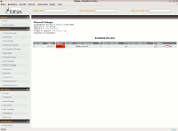
  ------------------------------------------------------------------------

Dateiname:***outages.cgi***

**Beschreibung:**

Dieses CGI zeigt eine Liste von "Problem"-Hosts, die Netzwerkausfälle
hervorrufen. Dies kann besonders dann hilfreich sein, wenn Sie ein
großes Netzwerk haben und schnell die Quelle des Problems identifizieren
möchten. Hosts werden sortiert nach der Schwere des Ausfalls, den sie
bewirken.

-   Wenn Sie [*für alle Hosts
    autorisiert*](#configcgi-authorized_for_all_hosts) sind, können Sie
    alle Hosts ansehen.

-   Wenn Sie ein *authentifizierter Kontakt* sind, können Sie alle Hosts
    ansehen, deren Kontakt Sie sind.

**Configuration CGI**

  ------------------------------------------------------------------------
  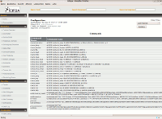
  ------------------------------------------------------------------------

Dateiname:***config.cgi***

**Beschreibung:**

Dieses CGI erlaubt es Ihnen, Objekte (z.B. Hosts, Hostgruppen, Kontakte,
Kontaktgruppen, Zeitfenster, Services, etc.) anzusehen, die Sie in
Ihrer/Ihren [Objekt-Konfigurationsdatei(en)](#configobject) definiert
haben.

**Autorisierungsanforderungen:**

-   Sie müssen [*für Konfigurationsinformationen
    autorisiert*](#configcgi-authorized_for_configuration_information)
    sein, um jegliche Konfigurationsinformationen ansehen zu können.

**Command CGI**

  ------------------------------------------------------------------------
  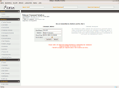
  ------------------------------------------------------------------------

Dateiname:***cmd.cgi***

**Beschreibung:**

Dieses CGI erlaubt es Ihnen, Befehle an den NAME-ICINGA-Prozess zu
senden. Obwohl dieses CGI mehrere Argumente hat, sollten Sie besser
darauf verzichten. Die meisten wechseln zwischen verschiedenen
Revisionen von NAME-ICINGA. Nutzen Sie das [extended information
CGI](#cgis-extinfo_cgi) als Startpunkt, um Befehle zu erteilen.

**Autorisierungsanforderungen:**

-   Sie müssen [*für System-Befehle
    autorisiert*](#configcgi-authorized_for_system_commands) sein, um
    Befehle zu erteilen, die den NAME-ICINGA-Prozess beeinflussen
    (Start, Stop, Modus-Wechsel, etc.).

-   Wenn Sie [*für alle Hosts-Befehle
    autorisiert*](#configcgi-authorized_for_all_hosts) sind, können Sie
    Befehle für alle Hosts **und** alle Services erteilen.

-   Wenn Sie [*für alle Service-Befehle
    autorisiert*](#configcgi-authorized_for_all_services) sind, können
    Sie Befehle für alle Services erteilen.

-   Wenn Sie ein *authentifizierter Kontakt* sind, können Sie Befehle
    für alle Hosts und Services erteilen, deren Kontakt Sie sind.

**Anmerkungen:**

-   Wenn Sie sich entschieden haben, die Option
    [use\_authentication](#configcgi-use_authentication) für die CGIs
    nicht zu nutzen, wird dieses CGI *jedem* die Möglichkeit verweigern,
    Befehle zu erteilen. Dies geschieht zu Ihrem eigenen Schutz. Wir
    würden empfehlen, dieses CGI komplett zu entfernen, wenn Sie die
    Authentifizierung für CGI nicht nutzen.

**Extended Information CGI**

  ------------------ ------------------ ------------------ ------------------
       extinfo-b.png)     extinfo-c.png)     extinfo-d.png)
  ------------------ ------------------ ------------------ ------------------

Dateiname:***extinfo.cgi***

**Beschreibung:**

Dieses CGI erlaubt es Ihnen, NAME-ICINGA-Prozess-Informationen, Host-
und Service-Zustandsstatistiken, Host- und Service-Kommentare und mehr
anzusehen. Es dient auch als Startpunkt, um über das [command
CGI](#cgis-cmd_cgi) Befehle an NAME-ICINGA zu erteilen. Obwohl dieses
CGI mehrere Argumente hat, sollten Sie besser darauf verzichten. Die
meisten wechseln zwischen verschiedenen Revisionen von NAME-ICINGA. Sie
können dieses CGI erreichen, indem Sie auf 'Network Health' bzw.
'Process Information' in der setilichen Navigationsleiste klicken oder
auf einen Host- oder Service-Link in der Ausgabe des [status
CGI](#cgis-status_cgi).

**Autorisierungsanforderungen:**

-   Sie müssen [*für Systeminformationen
    autorisiert*](#configcgi-authorized_for_system_information) sein, um
    NAME-ICINGA-Prozess-Informationen ansehen zu können.

-   Wenn Sie [*für lle Hosts
    autorisiert*](#configcgi-authorized_for_all_hosts) sind, können Sie
    erweiterte Informationen für alle Hosts **und** alle Services
    ansehen.

-   Wenn Sie [*für alle Services
    autorisiert*](#configcgi-authorized_for_all_services) sind, können
    Sie erweiterte Informationen für alle Services ansehen.

-   Wenn Sie ein *authentifizierter Kontakt* sind, können Sie erweiterte
    Informationen für alle Hosts und Services ansehen, deren Kontakt Sie
    sind.

**Event Log CGI**

  ------------------------------------------------------------------------
  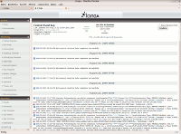
  ------------------------------------------------------------------------

Dateiname:***showlog.cgi***

**Beschreibung:**

Dieses CGI zeigt das [log file](#configmain-log_file). Wenn Sie die [log
rotation](#configmain-log_rotation_method) aktiviert haben, können Sie
in archivierten Log-Dateien blättern, indem Sie die Navigations-Links
oben auf der Seite benutzen.

**Autorisierungsanforderungen:**

-   Sie müssen [*für Systeminformationen
    autorisiert*](#configcgi-authorized_for_system_information) sein, um
    das Logfile ansehen zu können.

**Alert History CGI**

  ------------------------------------------------------------------------
  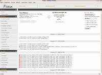
  ------------------------------------------------------------------------

Dateiname:***history.cgi***

**Beschreibung:**

Dieses CGI wird benutzt, um die Problem-Historie für einen oder alle
Hosts anzuzeigen. Die Ausgabe ist grundsätzlich ein Auszug der
Informationen, die über das [log file CGI](#cgis-showlog_cgi) angezeigt
werden. Sie haben die Möglichkeit, die Ausgabe zu filtern, um nur die
Problemtypen anzuzeigen, die Sie sehen wollen (z.B. Hard- und/oder
Soft-Alarme, verschiedene Typen von Service- und Host-Alarmen, alle
Arten von Alarmen, usw.). Wenn Sie die [log
rotation](#configmain-log_rotation_method) aktiviert haben, können Sie
in archivierten Log-Dateien blättern, indem Sie die Navigations-Links
oben auf der Seite benutzen.

**Autorisierungsanforderungen:**

-   Wenn Sie [*für alle Hosts
    autorisiert*](#configcgi-authorized_for_all_hosts) sind, können Sie
    historische Informationen für alle Hosts **und** alle Services
    ansehen.

-   Wenn Sie [*für alle Services
    autorisiert*](#configcgi-authorized_for_all_services) sind, können
    Sie historische Informationen für alle Services ansehen.

-   Wenn Sie ein *authentifizierter Kontakt* sind, können Sie
    historische Informationen für alle Hosts und Services ansehen, deren
    Kontakt Sie sind.

**Notifications CGI**

  ------------------------------------------------------------------------
  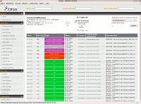
  ------------------------------------------------------------------------

Dateiname:***notifications.cgi***

**Beschreibung:**

Dieses CGI wird genutzt, um Host- und Service-Benachrichtigungen
anzuzeigen, die an verschiedene Kontakte versandt wurden. Die Ausgabe
ist grundsätzlich ein Auszug der Informationen, die über das [log file
CGI](#cgis-showlog_cgi) angezeigt werden. Sie haben die Möglichkeit, die
Ausgabe zu filtern, um nur die Benachrichtigungen anzuzeigen, die Sie
sehen wollen (z.B. Service-Benachrichtigungen, Host-Benachrichtigungen,
Benachrichtigungen, die an bestimmte Kontakte versandt wurden, usw.).
Wenn Sie die [log rotation](#configmain-log_rotation_method) aktiviert
haben, können Sie in archivierten Log-Dateien blättern, indem Sie die
Navigations-Links oben auf der Seite benutzen.

**Autorisierungsanforderungen:**

-   Wenn Sie [*für alle Hosts
    autorisiert*](#configcgi-authorized_for_all_hosts) sind, können Sie
    Benachrichtigungen für alle Hosts **und** alle Services ansehen.

-   Wenn Sie [*für alle Services
    autorisiert*](#configcgi-authorized_for_all_services) sind, können
    Sie Benachrichtigungen für alle Services ansehen.

-   Wenn Sie ein *authentifizierter Kontakt* sind, können Sie
    Benachrichtigungen für alle Hosts und Services ansehen, deren
    Kontakt Sie sind.

**Trends CGI**

  ------------------------------------------------------------------------
  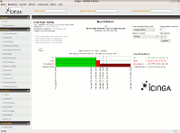
  ------------------------------------------------------------------------

Dateiname:***trends.cgi***

**Beschreibung:**

Dieses CGI wird genutzt, um einen Graphen über Host- oder
Service-Zustände für einen beliebigen Zeitraum zu erstellen. Damit
dieses CGI von Wert ist, sollten Sie [log
rotation](configmain-log_rotation_method) aktivieren und archivierte
Logs in dem Verzeichnis lagern, das durch die
[log\_archive\_path](configmain-log_archive_path)-Direktive angegeben
wird. Das CGI nutzt Thomas Boutells
[gd](http://www.boutell.com/gd/)-Library (Version 1.6.3 oder höher), um
die Trend-Grafiken zu erstellen.

**Autorisierungsanforderungen:**

-   Wenn Sie [*für alle Hosts
    autorisiert*](#configcgi-authorized_for_all_hosts) sind, können Sie
    Trends für alle Hosts **und** alle Services ansehen.

-   Wenn Sie [*für alle Services
    autorisiert*](#configcgi-authorized_for_all_services) sind, können
    Sie Trends für alle Services ansehen.

-   Wenn Sie ein *authentifizierter Kontakt* sind, können Sie Trends für
    alle Hosts und Services ansehen, deren Kontakt Sie sind.

**Availability Reporting CGI**

  ------------------------------------ ------------------------------------
  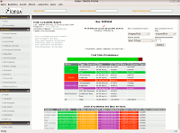       
  ------------------------------------ ------------------------------------

Dateiname:***avail.cgi***

**Beschreibung:**

Dieses CGI wird genutzt, um einen Bericht über die Verfügbarkeit von
Hosts oder Service für einen benutzerdefinierten Zeitraum zu erstellen.
Damit dieses CGI von Wert ist, sollten Sie [log
rotation](#configmain-log_rotation_method) aktivieren und archivierte
Logs in dem Verzeichnis lagern, das durch die
[log\_archive\_path](#configmain-log_archive_path)-Direktive angegeben
wird.

**Autorisierungsanforderungen:**

-   Wenn Sie [*für alle Hosts
    autorisiert*](#configcgi-authorized_for_all_hosts) sind, können Sie
    Verfügbarkeitsdaten für alle Hosts **und** alle Services ansehen.

-   Wenn Sie [*für alle Services
    autorisiert*](#configcgi-authorized_for_all_services) sind, können
    Sie Verfügbarkeitsdaten für alle Services ansehen.

-   Wenn Sie ein *authentifizierter Kontakt* sind, können Sie
    Verfügbarkeitsdaten für alle Hosts und Services ansehen, deren
    Kontakt Sie sind.

**Alert Histogram CGI**

  ------------------------------------------------------------------------
  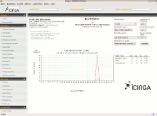
  ------------------------------------------------------------------------

Dateiname:***histogram.cgi***

**Beschreibung:**

Dieses CGI wird genutzt, um einen Bericht über die Verfügbarkeit von
Hosts oder Service für einen benutzerdefinierten Zeitraum zu erstellen.
Damit dieses CGI von Wert ist, sollten Sie [log
rotation](configmain-log_rotation_method) aktivieren und archivierte
Logs in dem Verzeichnis lagern, das durch die
[log\_archive\_path](configmain-log_archive_path)-Direktive angegeben
wird. Das CGI nutzt Thomas Boutells
[gd](http://www.boutell.com/gd/)-Library (Version 1.6.3 oder höher), um
die Histogramm-Grafiken zu erstellen.

**Autorisierungsanforderungen:**

-   Wenn Sie [*für alle Hosts
    autorisiert*](#configcgi-authorized_for_all_hosts) sind, können Sie
    Histogramme für alle Hosts **und** alle Services ansehen.

-   Wenn Sie [*für alle Services
    autorisiert*](#configcgi-authorized_for_all_services) sind, können
    Sie Histogramme für alle Services ansehen.

-   Wenn Sie ein *authentifizierter Kontakt* sind, können Sie
    Histogramme für alle Hosts und Services ansehen, deren Kontakt Sie
    sind.

**Alert Summary CGI**

  ------------------------------------------------------------------------
  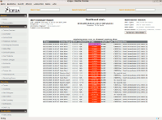
  ------------------------------------------------------------------------

Dateiname:***summary.cgi***

**Beschreibung:**

Dieses CGI stellt einige generische Berichte über Host- und
Service-Alarmdaten zur Verfügung, darunter Gesamtzahl Alarme,
Alarm-Spitzenreiter, etc.

**Autorisierungsanforderungen:**

-   Wenn Sie [*für alle Hosts
    autorisiert*](#configcgi-authorized_for_all_hosts) sind, können Sie
    Summary-Informationen für alle Hosts **und** alle Services ansehen.

-   Wenn Sie [*für alle Services
    autorisiert*](#configcgi-authorized_for_all_services) sind, können
    Sie Summary-Informationen für alle Services ansehen.

-   Wenn Sie ein *authentifizierter Kontakt* sind, können Sie
    Summary-Informationen für alle Hosts und Services ansehen, deren
    Kontakt Sie sind.

**Änderungen am Classic UI**

Diese Änderungen sind im Laufe der Zeit eingeflossen, so dass sie ggf.
nicht in Ihrer Version von NAME-ICINGA verfügbar sind.

-   Das Aussehen des "General"-Abschnitts auf der linke Seite hat sich
    erneut geändert

    **General CGI**

      ------------------------------------------------------------------------
      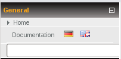
      ------------------------------------------------------------------------

      ------ -----------------------------------------------------------------
      File   ***general.cgi***
      Name:  
      ------ -----------------------------------------------------------------

    Beim Klick auf die entsprechende Flagge können Sie weiterhin auf die
    Dokumentation in der dargestellten Sprache zugreifen.

    > **Note**
    >
    > Es gibt keine Option, um die Sprache im Classic UI zu ändern.
    > Dafür sind Anpassungen im Source-Code notwendig.

    Nun können Sie wieder nach Hosts suchen, ohne weitere Dinge
    anzuklicken.

-   Das klassische Interface wird in regelmäßigen Intervallen
    aktualisiert. Manchmal ist das nicht erwünscht, z.B. wenn Sie ein
    bestimmtes Objekt betrachten möchten. In diesem Fall können Sie die
    automatische Aktualisierung durch Klicken auf [pause] deaktivieren
    (direkt neben dem Text "Updated every 90 seconds" links oben im
    Status-Fenster). Klicken auf [continue] aktiviert die Aktualisierung
    wieder.

    **Pause CGI**

      ------------------------------------------------------------------------
      
      ------------------------------------------------------------------------

      ------ -----------------------------------------------------------------
      File   ***pause.cgi***
      Name:  
      ------ -----------------------------------------------------------------

    **Continue CGI**

      ------------------------------------------------------------------------
      
      ------------------------------------------------------------------------

      ------ -----------------------------------------------------------------
      File   ***continue.cgi***
      Name:  
      ------ -----------------------------------------------------------------

-   Die Seiten "Host Detail" und "Service Detail" wurden erweitert, so
    dass Sie nun Befehle für mehrere Objekte gleichzeitig erteilen
    können (ab NAME-ICINGA 1.2). Nun können Sie ein oder mehrere Objekte
    durch Check-Boxen neben den Objekten auswählen. Durch aktivieren der
    Check-Box neben "Status information" werden alle Services eines
    Hosts ausgewählt.

    **Statusinfo CGI**

      ------------------------------------------------------------------------
      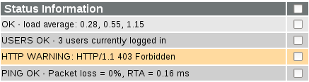
      ------------------------------------------------------------------------

      ------ -----------------------------------------------------------------
      File   ***statusinfo.cgi***
      Name:  
      ------ -----------------------------------------------------------------

    **Commands CGI**

      ------------------------------------------------------------------------
      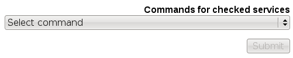
      ------------------------------------------------------------------------

      ------ -----------------------------------------------------------------
      File   ***commands.cgi***
      Name:  
      ------ -----------------------------------------------------------------

    Nach dem Klick auf "Select command" zeigt eine Drop-Down-Liste die
    verfügbaren Befehle. Nach der Auswahl einer Aktion und dem
    anschließenden Klick auf "Submit" wird der Befehl für die
    ausgewählten Objekte ausgeführt.

-   "Export to CSV" wurde auf verschiedenen Seiten hinzugefügt (ab
    NAME-ICINGA 1.2).

-   Die Zellen der Tabelle in extinfo.cgi haben Namen bekommen. Mit
    Hilfe von SSI-Fragmenten können Sie JavaScript-Code einbinden, um
    auf die Daten dieser Zellen zuzugreifen (ab NAME-ICINGA 1.2.1).

    Der Beispiel-Code benutzt Daten der Zelle "comment\_data", um einen
    Link zu erzeugen (Dank an Oliver Graf).

    common-header.ssi:

        

CGIs
Status CGI
CGIs
Status Map CGI
CGIs
Tactical Overview CGI
CGIs
Network Outages CGI
CGIs
Configuration CGI
CGIs
Command CGI
CGIs
Extended Information CGI
CGIs
Event log CGI
CGIs
Alert History CGI
CGIs
Notfication CGI
CGIs
Trends CGI
CGIs
Availability Reporting CGI
CGIs
Alert Histogram CGI
CGIs
Alert Summary CGI
CGIs
Änderungen am Classic UI
