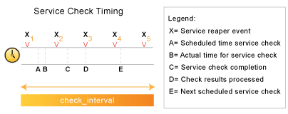

Service- und Host-Prüfungsplanung
=================================

Einführung
----------

Es gab eine Menge Fragen dazu, wie Service-Prüfungen in bestimmten
Situationen geplant werden, außerdem wie sich Planung und eigentliche
Ausführung unterscheiden und wie die Ergebnisse verarbeitet werden. Wir
werden versuchen, ein bisschen mehr ins Detail zu gehen, wie dies alles
funktioniert...

Konfigurationsoptionen
----------------------

Es gibt es verschiedene Konfigurationsoptionen, die beeinflussen, wie
Service-Prüfungen geplant, ausgeführt und verarbeitet werden. Als Anfang
enthält jede [Service-Definition](#objectdefinitions-service) drei
Optionen, die festlegen, wann und wie jede einzelne Service-Prüfung
geplant und ausgeführt wird Diese drei Optionen sind:

-   *check\_interval*

-   *retry\_interval*

-   *check\_period*

Es gibt außerdem vier Konfigurationsoptionen in der
[Hauptkonfigurationsdatei](#configmain), die Service-Prüfungen
beeinflussen. Dies sind:

-   [*service\_inter\_check\_delay\_method*](#configmain-service_inter_check_delay_method)

-   [*service\_interleave\_factor*](#configmain-service_interleave_factor)

-   [*max\_concurrent\_checks*](#configmain-max_concurrent_checks)

-   [*check\_result\_reaper\_frequency*](#configmain-check_result_reaper_frequency)

> **Note**
>
> Die letzte Direktive betrifft auch Host-Prüfungen.

Wir werden nun mehr ins Detail gehen, wie all diese Optionen die
Service-Prüfungsplaung beeinflussen. Lassen Sie uns zuerst betrachten,
wie Services beim ersten (Neu-)Start von NAME-ICINGA eingeplant
werden...

Initiale Planung
----------------

Wenn NAME-ICINGA (neu) startet, wird es versuchen, die initialen
Prüfungen aller Services in einer Art und Weise so zu planen, dass die
Load auf dem lokalen und den entfernten Hosts mimimiert wird. Dies wird
durch die Verteilung und das Verschachteln der Services erreicht. Die
Verteilung von Service-Prüfungen (auch als inter-check-delay bekannt)
wird benutzt, um die Last des lokalen NAME-ICINGA-Servers zu
minimieren/auszugleichen und die Verschachtelung wird benutzt, um die
Last auf entfernten Hosts zu minimieren/auszugleichen. Sowohl
inter-check-relay als auch Verschachtelungsfunktion werden nachfolgend
erläutert.

Selbst wenn die Service-Prüfungen initial geplant werden, um die Last
auf lokalen und entfernten Hosts auszubalancieren, werden die Dinge dem
eintretenden Chaos nachgeben und ein wenig zufällig werden. Gründe dafür
sind u.a., dass Services nicht alle mit dem gleichen Intervall geprüft
werden, dass die Ausführung einiger Services länger dauert als andere,
dass Host- und/oder Service-Probleme das Timing von ein oder mehreren
Services verändern können, etc. Wenigstens versuchen wir, die Dinge gut
zu beginnen. Hoffentlich hält die initiale Planung die Last auf dem
lokalen und den entfernten Hosts im Laufe der Zeit relativ
ausgeglichen...

> **Note**
>
> Wenn Sie die initiale Service-Prüfungs-Planungsinformationen ansehen
> möchten, dann starten Sie NAME-ICINGA mit der **-s**
> Kommandozeilenoption. Dabei werden Ihnen grundlegende
> Planungsinformationen (inter-check-Verzögerung,
> Verschachtelungsfaktor, erste und letzte Service-Prüfzeit, etc.,
> angezeigt) und es wird ein neues Status-Log angezeigt, das die genauen
> Zeiten darstellt, zu denen alle Services initial eingeplant werden.
> Weil diese Option das Status-Log überschreibt, sollte Sie sie nicht
> nutzen, solange eine weitere NAME-ICINGA-Instanz läuft. NAME-ICINGA
> wird *nicht* die Überwachung starten, wenn diese Option benutzt wird.

Inter-Check-Verzögerung (inter-check delay)
-------------------------------------------

Wie bereits erwähnt, versucht NAME-ICINGA die Last auf dem Rechner, auf
dem NAME-ICINGA läuft, auszugleichen, indem die Service-Prüfungen
verteilt werden. Der Abstand zwischen aufeinander folgenden
Service-Prüfungen wird "inter-check delay" genannt. Durch die Angabe
eines Werts für die Variable
[service\_inter\_check\_delay\_method](#configmain-service_inter_check_delay_method)
in der Hauptkonfigurationsdatei können Sie festlegen, wie diese
Verzögerung berechnet wird. Wir werden erläutern, wie die "schlaue"
Berechnung arbeitet, weil dies die Einstellung ist, die Sie für die
normale Verarbeitung benutzen sollten.

Wenn Sie die Einstellung "smart" bei der Variable
*service\_inter\_check\_delay\_method* angeben, wird NAME-ICINGA den
Wert für die inter-check-Verzögerung wie folgt berechnen:

*inter-check-Verzögerung = (durchschnittl. Check-Intervall für alle
Services) / (Gesamtzahl der Services)*

Nehmen wir ein Beispiel. Sagen wir, Sie haben 1.000 Services mit einem
normalen Prüfintervall von fünf Minuten (natürlich werden einige
Services mit anderen Intervallen geprüft, aber wir vereinfachen an
dieser Stelle...). Die gesamte Check-Intervall-Zeit ist 5.000 (1.000 \*
5). Das bedeutet, dass das durchschnittliche Check-Intervall für jeden
Service fünf Minuten ist (5.000 / 1.000). Aufgrund dieser Information
wissen wir, dass wir (im Durchschnitt) 1.000 Prüfungen pro fünf Minuten
benötigen. Das heißt, dass wir eine inter-check-Verzögerung von 0,005
Minuten (5 / 1000, also etwa 0,3 Sekunden) benutzen sollten, wenn die
Services das erste Mal verteilt werden. Durch die Verteilung alle 0,3
Sekunden können wir erreichen, dass NAME-ICINGA jede Sekunde drei
Service-Prüfungen einplant und/oder ausführt. Durch die gleichmäßige
Aufteilung über die Zeit können wir hoffen, dass die Last auf dem
lokalen Rechner, auf dem NAME-ICINGA läuft, in etwa gleich bleibt.

Service-Verschachtelung (service interleaving)
----------------------------------------------

Wie oben erläutert hilft die inter-check-Verzögerung dabei, die Last auf
dem lokalen Host auszugleichen. Was ist aber mit entfernten Hosts? Ist
es notwendig, die Last auf entfernten Hosts auszugleichen? Warum? Ja, es
ist wichtig, und ja, NAME-ICINGA kann dabei helfen. Wenn Sie eine große
Zahl von Services auf einem entfernten Host überwachen und die Prüfungen
nicht verteilt wären, dann könnte der entfernte Host denken, dass er das
Opfer einer SYN-Attacke wurde, wenn es viele offene Verbindungen auf dem
gleichen Port gibt. Außerdem ist es nett, wenn man versucht, die Last
auf den Hosts auszugleichen/zu minimieren...

Durch die Angabe eines Werts für die Variable
[service\_interleave\_factor](#configmain-service_interleave_factor) in
der Hauptkonfigurationsdatei können beeinflussen, wie dieser Faktor
berechnet wird. Wir werden erläutern, wie die "schlaue" Berechnung
arbeitet, weil dies die Einstellung ist, die Sie for die normale
Verarbeitung nutzen sollten. Sie können, natürlich, einen Wert vorgeben,
anstatt ihn von NAME-ICINGA berechnen zu lassen. Außerdem ist zu
beachten, dass die Verschachtelung bei einem Wert von 1 praktisch
deaktiviert ist.

Wenn Sie die Einstellung "smart" bei der Variable
*service\_interleave\_factor* angeben, wird NAME-ICINGA den Wert für den
Verschachtelungsfaktor wie folgt berechnen:

*interleave factor = ceil ( Gesamtzahl der Services / Gesamtzahl der
Hosts )*

Nehmen wir ein Beispiel. Sagen wir, Sie haben insgesamt 1.000 Services
und 150 Hosts, die Sie überwachen. NAME-ICINGA würde einen
Verschachtelungsfaktor von 7 berechnen (1000 / 150 = 6,6; aufgerundet
7). Das bedeutet, dass NAME-ICINGA bei der initialen Planung die erste
Service-Prüfung einplant, die es findet, dann die nächsten sechs
überspringt, den nächsten einplant, usw... Dieser Prozess wird
wiederholt, bis alles Service-Prüfungen eingeplant sind. Weil die
Services nach dem Namen des Hosts sortiert sind (und damit eingeplant
werden), mit dem sie verbunden sind, wird dies helfen, die Last auf
entfernten Hosts zu minimieren/auszugleichen.

Die folgenden Bilder zeigen, wie Service-Prüfungen eingeplant werden,
wenn sie nicht verschachtelt werden (*service\_interleave\_factor*=1)
und wenn sie mit einem Wert von 4 für *service\_interleave\_factor*
verschachtelt werden.

  ------------------------------------ ------------------------------------
  nicht verschachtelte Prüfungen       verschachtelte Prüfungen
     
     
                                       
  ------------------------------------ ------------------------------------

Maximale Zahl gleichzeitiger Service-Prüfungen
----------------------------------------------

Um NAME-ICINGA davon abzuhalten, all Ihre CPU-Ressourcen zu verbrauchen,
können Sie die maximale Zahl von gleichzeitigen Service-Prüfungen
beschränken, die zu einer beliebigen Zeit laufen können. Dies wird durch
die Option [max\_concurrent\_checks](#configmain-max_concurrent_checks)
in der Hauptkonfigurationsdatei festgelegt.

Gut daran ist, dass Sie mit dieser Einstellung NAME-ICINGAs CPU-Nutzung
beeinflussen können. Schlecht ist, dass Service-Prüfungen ins
Hintertreffen geraten können, wenn dieser Wert zu niedrig eingestellt
ist. Wenn es Zeit wird, eine Service-Prüfung auszuführen, wird
NAME-ICINGA sicherstellen, dass nicht mehr als x Service-Prüfungen
ausgeführt werden bzw. darauf warten, dass die Prüfergebnisse
verarbeitet werden (wobei x die Anzahl der Prüfungen ist, die Sie über
die Option *max\_concurrent\_checks* angegeben haben). Falls diese
Grenze erreicht ist, wird NAME-ICINGA die Ausführung von anstehenden
Prüfungen aufschieben, bis einige der vorherigen Prüfungen beendet sind.
Also wie kann man einen geeigneten Wert für die Option
*max\_concurrent\_checks* festlegen?

Zuerst müssen Sie einige Dinge wissen...

-   die inter-check-Verzögerung, die NAME-ICINGA benutzt, um die
    initialen Service-Prüfungen einzuplanen (nutzen Sie die Option
    **-s**, um den Wert zu kontrollieren)

-   die Häufigkeit (in Sekunden) von "reaper events", wie sie in der
    [check\_result\_reaper\_frequency](#configmain-check_result_reaper_frequency)-Variable
    in der Hauptkonfigurationsdatei angegeben ist

-   eine Vorstellung der durchschnittlichen Zeit, die Service-Prüfungen
    wirklich zur Ausführung benötigen (die meisten Plugins haben einen
    Timeout von 10 Sekunden, so dass der Durchschnitt wahrscheinlich
    niedriger liegt)

Dann benutzen Sie die folgende Berechnung, um einen geeigneten Wert für
die maximale Zahl von gleichzeitig erlaubten Prüfungen zu errechnen...

*max. Anzahl gleichzeitiger Prüfungen = ceil( max( check result reaper
frequency , average check execution time ) / inter-check delay )*

Die errechnete Zahl sollte einen guten Ausgangspunkt für die
*max\_concurrent\_checks*-Variable bieten. Es kann sein, dass Sie diesen
Wert noch ein wenig erhöhen müssen, falls Service-Prüfungen nach wie vor
nicht zur geplanten Zeit ausgeführt werden oder verringern Sie, falls
NAME-ICINGA zu viel CPU-Zeit beansprucht.

Nehmen wir an, dass Sie 875 Services, jeder mit einem durchschnittlichen
Intervall von zwei Minuten. Das bedeutet, dass die
inter-check-Verzögerung etwa 0,137 Sekunden ist. Wenn Sie die "check
result reaper frequency" auf zehn Sekunden einstellen, können Sie einen
ungefähren Wert für die maximale Zahl von gleichzeitigen Prüfungen wie
folgt berechnen (wir nehmen an, dass die durchschnittliche
Ausführungszeit für Service-Prüfungen kleiner als zehn Sekunden ist) ...

*max. Zahl gleichzeitiger Prüfungen = ceil( 10 / 0.137 )*

In diesem Fall ist der berechnete Wert 73. Das ergibt Sinn, denn
NAME-ICINGA wird etwas mehr als sieben neue Service-Prüfungen pro
Sekunde ausführen und es wird Service-Prüfergebnisse nur alle zehn
Sekunden verarbeiten. Das bedeutet, dass es zu einer beliebigen Zeit nur
etwas mehr als 70 Service-Prüfungen gibt, die ausgeführt werden bzw.
deren Ergebnisse verarbeitet werden. In diesem Fall würden wir
wahrscheinlich empfehlen, den Wert für die Zahl der gleichzeitigen
Prüfungen auf 80 zu erhöhen, weil es Verzögerungen gibt, wenn
NAME-ICINGA Service-Prüfergebnisse verarbeitet bzw. andere Dinge tut.
Sie werden offensichtlich ein wenig testen und verändern müssen, damit
alles reibungslos funktioniert, aber mit diesen Informationen sollten
Sie ein paar generelle Richtlinien an der Hand haben...

Zeitbeschränkungen
------------------

Die Option *check\_period* legt den [Zeitraum](#timeperiods) fest, in
dem NAME-ICINGA Service-Prüfungen ausführen kann. Falls die Zeit, zu der
eine Prüfung für einen bestimmten Service ausgeführt werden werden soll,
nicht innerhalb des angegebenen Zeitraum liegt, wird die Prüfung *nicht*
ausgeführt, und zwar unabhängig vom Status des Service. Statt dessen
wird NAME-ICINGA die Service-Prüfung für die nächste gültige Zeit des
Zeitraums einplanen. Wenn die Prüfung gestartet werden kann (d.h. die
Zeit ist gültig innerhalb des Zeitraums), wird die Service-Prüfung
ausgeführt.

> **Note**
>
> Auch wenn eine Service-Prüfung nicht zu einer bestimmten Zeit
> ausgeführt werden kann, könnte NAME-ICINGA sie trotzdem *einplanen*.
> Das wird höchstwahrscheinlich während der initialen Planung von
> Services passieren, aber es kann auch in anderen Fällen passieren. Das
> bedeutet nicht, dass NAME-ICINGA die Prüfung ausführen wird. Wenn es
> Zeit wird, die Prüfung tatsächlich *auszuführen*, wird NAME-ICINGA
> kontrollieren, ob die Prüfung zur angegeben Zeit gestartet werden
> kann. Falls nicht, wird NAME-ICINGA die Service-Prüfung nicht
> ausführen, sondern sie zu einer späteren Zeit einplanen. Lassen Sie
> sich nicht verwirren! Die Planung und Ausführunge von
> Service-Prüfungen sind zwei unterschiedliche (wenn auch,
> zusammenhängende) Dinge.

Normale Planung
---------------

In einer idealen Welt hätten Sie keine Netzwerkprobleme. Aber wenn das
so wäre, dann hätten Sie auch kein Netzwerküberwachungsprogramm. Wie
auch immer, wenn die Dinge reibungslos laufen und ein Service in einem
OK-Zustand ist, nennen wir das "normal". Service-Prüfungen werden
normalerweise in der Häufigkeit geplant, die in der Option
*check\_interval* angegeben ist. Das war's. Einfach, oder?

Planung bei Problemen
---------------------

Also, was passiert, wenn es Probleme mit einem Service gibt? Nun, eins
der Dinge ist, dass sich die Service-Prüfungsplanung ändert. Wenn Sie
die Option *max\_attempts* auf einen Wert größer als eins gesetzt haben,
wird NAME-ICINGA die Prüfung erneut einplanen, bevor es entscheidet,
dass ein wirkliches Problem existiert. Während der Service erneut
geprüft wird (bis zu *max\_attempts* Mal), wird er als in einem
"soft"-Status befindlich angesehen (wie [hier](#statetypes) beschrieben)
und die Service-Prüfungen werden mit einer Häufigkeit eingeplant, die in
der Option *retry\_interval* angegeben ist.

Wenn NAME-ICINGA den Service *max\_attempts* Mal erneut eingeplant hat
und er immer noch in einem nicht-OK Status ist, wird NAME-ICINGA den
Service in einen "Hard"-Status versetzen, Benachrichtigungen an Kontakte
versenden (falls zutreffend) und weitere Prüfungen des Service wieder
mit der Häufigkeit planen, die in der Option *check\_interval*
festgelegt ist.

Wie immer gibt es Ausnahmen der Regel. Wenn eine Service-Prüfung zu
einem nicht-OK-Status führt, wird NAME-ICINGA den mit diesem Service
verbundenen Host prüfen, um festzustellen, ob er "up" ist oder nicht
(siehe die Anmerkung [unten](#hostcheckscheduling) zu Informationen, wie
dies passiert). Wenn der Host nicht "up" ist (also "down" oder
"unreachable"), wird NAME-ICINGA den Service sofort in einen harten
nicht-OK-Status versetzen und die Zahl der aktuellen Versuche auf 1
zurücksetzen. Da der Service in einem harten nicht-OK-Status ist, wird
die Service-Prüfung mit der normalen Häufigkeit geplant, die in der
Option *check\_interval* angegeben ist, statt des Wertes aus der Option
*retry\_interval*.

Host-Prüfungen
--------------

Ein Fall, wo NAME-ICINGA den Status eines Hosts prüft, ist, wenn ein
Service-Prüfung einen nicht-OK-Zustand ergibt. NAME-ICINGA prüft den
Host, um zu entscheiden, ob der Host "up" ist oder nicht, bzw. ob der
Host "up", "down" oder "unreachable" ist. Wenn die erste Host-Prüfung
einen nicht-OK-Zustand ergibt, wird NAME-ICINGA Host-Prüfungen wie bei
den Services durchführen.

Planungsverzögerungen
---------------------

Es sollte erwähnt werden, dass Service-Prüfungsplanung und -ausführung
geschieht, so gut es geht. Individuelle Service-Prüfungen werden
inNAME-ICINGA als Ereignisse mit niedriger Priorität angesehen, so dass
sie verzögert werden können, wenn Ereignisse mit höherer Priorität
ausgeführt werden müssen. Beispiel von Ereignissen mit hoher Priorität
umfassen Log-Datei-Rotationen, externe Befehlsprüfungen und
Prüfergebnis-Ernteereignisse.

Planungsbeispiel
----------------

Die Planung von Service-Prüfungen, ihre Ausführung und die Verarbeitung
ihrer Ergebnisse können ein bisschen schwierig zu verstehen sein,
deshalb schauen wir uns ein einfaches Beispiel an. Betrachten wir das
folgende Diagramm - wir werden uns darauf beziehen, während wir die
Dinge erklären.

Zuallererst sind **X**~n~ Prüfergebnis-Ernteereignisse, die in der
Häufigkeit geplant werden, die durch die Option
[check\_result\_reaper\_frequency](#configmain-check_result_reaper_frequency)
in der Hauptkonfigurationsdatei angegeben ist.
Prüfergebnis-Ernteereignisse übernehmen die Arbeit,
Service-Prüfergebnisse zu sammeln und zu verarbeiten. SIe dienen als die
Kernlogik für NAME-ICINGA, starten Host-Prüfungen,
Ereignisbehandlung-Routinen und Benachrichtigungen, wenn das notwendig
ist.

Für das Beispiel hier ist die Ausführung eines Service für den Zeitpunkt
**A**geplant. Allerdings kam NAME-ICINGA in der Ereigniswarteschlange
ins Hintertreffen, so dass die Prüfung erst zum Zeitpunkt **B**
ausgeführt wird. Die Service-Prüfung endet zum Zeitpunkt **C**, so dass
die Differenz zwischen den Punkten **C** and **B** die Laufzeit der
Prüfung ist.

Die Ergebnisse der Service-Prüfungen werden nicht sofort nach der
Prüfung verarbeitet. Statt dessen werden die Ergebnisse für eine spätere
Verarbeitung durch einen Prüfergebnis-Ernteereignis gespeichert. Das
nächste Prüfergebnis-Ernteereignis findet zum Zeitpunkt **D** statt, so
dass dies ungefähr die Zeit ist, zu der die Ergebnisse verarbeitet
werden (die tatsächliche Zeit kann später als **D** sein, weil ggf.
andere Service-Prüfergebnisse vor diesem Service verarbeitet werden).

Zu der Zeit, zu der das Prüfergebnis-Ernteereignis die
Service-Prüfergebnisse verarbeitet, wird es die nächste Service-Prüfung
einplanen und in NAME-ICINGAs Ereigniswarteschlange stellen. Wir nehmen
an, dass die Service-Prüfung einen OK-Zustand ergibt, so dass die
nächste Prüfung zum Zeitpunkt **E** nach der ursprünglich geplanten
Prüfzeit geplant wird, mit einem zeitlichen Abstand, der in der
*check\_interval*-Option angegeben ist. Beachten Sie, dass der Service
*nicht* erneut eingeplant wird basierend auf der Zeit, zu der er
tatsächlich ausgeführt wird! Es gibt eine Ausnahme (es gibt immer eine,
oder?) - falls die Zeit, zu der die Service-Prüfung tatsächlich
ausgeführt wird (Punkt **B**) nach der nächsten Service-Prüfzeit liegt
(Punkt **E**), wird NAME-ICINGA das durch das Anpassen der nächsten
Prüfzeit ausgleichen. Das wird gemacht, damit NAME-ICINGA nicht verrückt
wird beim Versuch, mit den Service-Prüfungen Schritt zu halten, wenn
eine hohe Last auftritt. Außerdem, wie sinnvoll ist es, etwas in der
Vergangenheit zu planen...?

Service-Definitionsoptionen, die die Planung beeinflussen
---------------------------------------------------------

Jede Service-Definition enthält eine *check\_interval*- und eine
*retry\_interval*-Option. Hoffentlich klärt das Folgende, was diese zwei
Optionen tun, wie sie mit der *max\_check\_attempts*-Option in der
Service-Definition zusammenwirken, und wie sie die Planung des Service
beeinflussen.

Zuallererst gibt die *check\_interval*-Option das Intervall an, in dem
der Service unter "normalen" Umständen geprüft wird. "Normale" Umstände
bedeutet, wenn sich der Service in einem "OK"- oder einem
[harten](#statetypes) nicht-OK-Zustand befindet.

Wenn ein Service das erste Mal von einem OK- in einen nicht-OK-Zustand
wechselt, gibt Ihnen NAME-ICINGA die Möglichkeit, das Intervall temporär
zu verkleinern oder zu vergrößern, in dem nachfolgende Prüfungen für
diesen Service ausgeführt werden. Wenn der Service-Zustand das erste Mal
wechselt, wird NAME-ICINGA bis zu *max\_check\_attempts*-1 Versuche
durchführen, bevor es entscheidet, dass es sich um ein richtiges Problem
handelt. Während die Prüfungen wiederholt werden, werden sie gemäß der
*retry\_interval*-Option neu eingeplant, was schneller oder langsam als
die *check\_interval*-Option ist. Während der Service erneut geprüft
wird (bis zu *max\_check\_attempts*-1 mal), ist der Service in einem
[soft-Zustand](#statetypes). Wenn der Service *max\_check\_attempts*-1
mal geprüft wurde und sich immer noch in einem nicht-OK-Zustand
befindet, wird der Service in einen [hard-Zustand](#statetypes) wechseln
und wird nachfolgend wieder mit der normalen Rate eingeplant, die in der
*check\_interval*-Option festgelegt ist.

Als Randbemerkung, wenn Sie einen Wert von 1 für die
*max\_check\_attempts*-Option definieren, wird der Service niemals mit
dem Intervall geprüft, das in der *retry\_interval*-Option angegeben
ist. Statt dessen wird er sofort in einen [hard-Zustand](#statetypes)
wechseln und anschließend mit dem in der Option *check\_interval*
festgelegten Intervall geprüft.

TODO
----

**Host-Prüfungs-Direktiven**

Die meisten der o.g. Informationen treffen auch auf Host-Prüfungen zu.

Dieser Abschnitt wird aktualisiert. Voraussichtlich gibt es mehr
Informationen in einer der nächsten Ausgaben...

Scheduling
Service- und Host-Prüfungsplanung
Scheduling
Konfigurationsoptionen
Scheduling
Initiale Planung
Scheduling
Inter-Check-Verzögerung (inter-check delay)
Scheduling
Service-Verschachtelung (service interleaving)
Scheduling
Maximale Zahl gleichzeitiger Service-Prüfungen (maximum concurrent
service checks)
Scheduling
Zeitbeschränkungen
Scheduling
Normale Planung
Scheduling
Planung bei Problemen
Scheduling
Host-Prüfungen
Scheduling
Planungsverzögerungen
Scheduling
Planungsbeispiel
Scheduling
Service-Definitionssoptionen, die die Planung beeinflussen
Scheduling
Host-Prüfungsdirektiven
