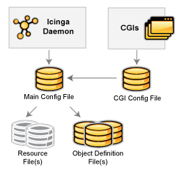

Konfigurationsüberblick
=======================

Konfigurationsüberblick
Einführung
----------

Es gibt verschiedene Konfigurationsdateien, die Sie erstellen oder
editieren müssen, bevor Sie irgendetwas überwachen können. Haben Sie
Geduld! NAME-ICINGA zu konfigurieren kann eine Weile dauern, besonders
wenn Sie ein Neuling sind. Sobald Sie herausgefunden haben, wie die
Dinge funktionieren, werden Sie feststellen, dass es die Mühe wert ist.
:-)

> **Note**
>
> Beispiel-Konfigurationsdateien werden im
> *URL-ICINGA-BASE/etc/*-Verzeichnis installiert, wenn Sie der
> [Schnellstart-Installationsanleitung](#quickstart) folgen.
>
> Falls Sie ein Paket installiert haben, dann fehlen die Beispieldateien
> möglicherweise. Sie finden den Inhalt [hier](#sample-config) zum
> Nachschlagen.

Dateinamen
----------

Die Namen und Positionen dieser Konfigurationsdateien können von Ihnen
nach Belieben festgelegt werden, aber es hat sich eingebürgert, die
Dateien `icinga.cfg`, `resource.cfg` und `cgi.cfg` im
Hauptkonfigurationsverzeichnis abzulegen.

Die Namen der Objektdefinitionsdaten können den Typ der Definitionen
enthalten (`contacts.cfg, commands.cfg`, `timeperiods.cfg`,
`notifications.cfg`), den Typ der Hardware (`printer.cfg`, `switch.cfg`)
oder das zu beschreibende Objekt (`localhost.cfg`). Wenn Ihre
Installation keine dieser Dateien enthält, dann ist das kein Grund zur
Panik. Wenn Sie ein web-basiertes Konfigurations-Tool, ein
datenbankgetriebenes Script, oder Ihren bevorzugten Editor benutzen,
dann können die Dateien pro geographischer Lage (Land, Filiale, ...) in
separaten Verzeichnissen abgelegt sein mit einer Datei pro physischer
oder logischer Einheit (Raum, Rack, Applikation, Entwicklung, ...) oder
abhängig vom Konzept, das für Sie am besten geeignet ist.

Konfigurationsüberblick
icinga.cfg, resource.cfg, cgi.cfg, commands.cfg, contacts.cfg,
notifications.cfg, timeperiods.cfg, printer.cfg, switch.cfg, windows.cfg
Hauptkonfigurationsdatei
------------------------

Die Hauptkonfigurationsdatei enthält eine Reihe von Direktiven, die die
Arbeitsweise des NAME-ICINGA-Daemon beeinflussen. Diese
Konfigurationsdatei wird vom NAME-ICINGA-Daemon und den CGIs gelesen.
Hier werden Sie in Ihr Konfigurationsabenteuer starten wollen.

Dokumentation zur Hauptkonfigurationsdatei finden Sie
[hier](#configmain).

Ressource-Datei(en)
-------------------

Ressource-Dateien können zur Speicherung von benutzerdefinierten Makros
genutzt werden. Der Hauptgrund für Ressource-Dateien liegt darin, dass
sie genutzt werden können, um sensible Informationen (wie z.B.
Passworte) zu speichern, ohne dass sie für CGIs zugänglich sind, weil
diese Dateien nicht von den CGIs gelesen werden.

Sie können eine oder mehrere optionale Ressource-Dateien mit Hilfe der
[resource\_file](#configmain-resource_file)-Direktive in Ihrer
Hauptkonfigurationsdatei angeben.

Objektdefinitionen-Dateien
--------------------------

Objektdefinitionen-Dateien werden genutzt, um Hosts, Services,
Hostgruppen, Kontakte, Kontaktgruppen, Befehle usw. zu definieren. Hier
definieren Sie, welche Dinge Sie überwachen wollen und wie Sie diese
überwachen wollen.

Sie können eine oder mehrere Objektdefinitionen-Dateien mit Hilfe der
[cfg\_file](#configmain-cfg_file)- und/oder
[cfg\_dir](#configmain-cfg_dir)-Direktiven in Ihrer
Hauptkonfigurationsdatei angeben, aber es wird empfohlen lediglich eine
der beiden Direktiventypen zu nutzen (also *entweder* cfg\_dir *oder*
cfg\_file bis Sie die Auswirkungen verstanden haben, wenn Sie beide
*gleichzeitig* verwenden).

Eine Einführung zu Objektdefinitionen und wie sie in Beziehung zu
einander stehen, finden Sie [hier](#configobject).

Ihre Objektkonfigurationsdateien können wiederum andere Dateien
einschließen mit Hilfe der [include\_file](#configobject-include_file)-
oder [include\_dir](#configobject-include_dir)-Direktiven. Sie können
lediglich außerhalb der eigentlichen Objektdefinitionen auftreten und
verhalten sich analog zu den [cfg\_file=](#configmain-cfg_file)- und
[cfg\_dir=](#configmain-cfg_dir)-Direktiven in der
Hauptkonfigurationsdatei.

CGI-Konfigurationsdatei
-----------------------

Die CGI-Konfigurationsdatei enthält eine Reihe von Direktiven, die die
Arbeitsweise der [CGIs](#cgis) beeinflussen. Sie enthält auch einen
Verweis auf die Hauptkonfigurationsdatei, so dass die CGIs wissen, wie
Sie NAME-ICINGA konfiguriert haben und wo Ihre Objektdefinitionen
gespeichert sind.

Dokumentation zur CGI-Konfigurationsdatei finden Sie [hier](#configcgi).
