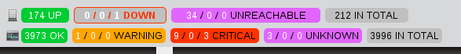

Optionen CGI-Konfigurationsdatei
================================

**Anmerkungen**

Wenn Sie Konfigurationsdateien erstellen oder anpassen, beachten Sie
bitte folgendes:

1.  Zeilen, die mit einem '\#'-Zeichen beginnen, werden als Kommentar
    betrachtet und nicht verarbeitet

2.  Variablennamen müssen am Zeilenanfang beginnen - "white space" sind
    vor dem Namen NICHT erlaubt

3.  Variablennamen sind abhängig von Groß- und Kleinschreibung

**Beispielkonfiguration**

 Hinweis: eine Beispiel-CGI-Konfigurationsdatei
(*URL-ICINGA-BASE/etc/cgi.cfg*) wird für Sie installiert, wenn Sie der
[Schnellstart-Anleitung](#quickstart) folgen.

**Position der Konfigurationsdatei**

Als Standard erwartet NAME-ICINGA, dass die CGI-Konfigurationsdatei
**cgi.cfg** heißt und zusammen mit der
[Hauptkonfigurationsdatei](#configmain) im Verzeichnis für die
Konfigurationsdateien liegt. Wenn Sie den Namen der Datei oder die
Position ändern müssen, dann können Sie NAME-APACHE so konfigurieren,
dass eine Umgebungsvariable namens ICINGA\_CGI\_CONFIG übergeben wird
(die auf die korrekte Position der CGIs verweist). Lesen Sie in der
NAME-APACHE-Dokumentation nach, wie das zu tun ist.

**Variablen der Konfigurationsdatei**

Nachfolgend finden Sie Beschreibungen jeder Option der
Hauptkonfigurationsdatei...

**Position der Hauptkonfigurationsdatei**

  ------ -----------------------------------------------------------------
  Format **main\_config\_file=\<file\_name\>**
  :      

  Beispi ***main\_config\_file=URL-ICINGA-BASE/etc/icinga.cfg***
  el:    
  ------ -----------------------------------------------------------------

Dies gibt die Position Ihrer [Hauptkonfigurationsdatei](#configmain) an.
Die CGIs müssen wissen, wo sie zu finden ist, um Informationen zu
Konfigurationsinformationen, aktuellen Host- und Service-Zuständen usw.
zu bekommen.

**vollständiger (physical) HTML-Pfad**

  ------ -----------------------------------------------------------------
  Format **physical\_html\_path=\<Pfad\>**
  :      

  Beispi ***physical\_html\_path=URL-ICINGA-BASE/share***
  el:    
  ------ -----------------------------------------------------------------

Dies ist der *vollständige* Pfad zu den HTML-Dateien von NAME-ICINGA auf
Ihrer Workstation oder Ihrem Server. NAME-ICINGA nimmt an, dass die
Dokumentation und die Bilddateien (die von den CGIs benutzt werden) in
Unterverzeichnissen namens *docs/* und *images/* gespeichert sind.

**URL-HTML-Pfad**

  ------ -----------------------------------------------------------------
  Format **url\_html\_path=\<Pfad\>**
  :      

  Beispi ***url\_html\_path=/icinga***
  el:    
  ------ -----------------------------------------------------------------

Wenn Sie NAME-ICINGA über einen Web-Browser mit einem URL wie
**http://www.myhost.com/icinga**, aufrufen, sollte dieser Wert */icinga*
sein. Grundsätzlich ist es der Pfadanteil des URL, der zum Aufruf der
NAME-ICINGA-HTML-Seiten benutzt wird.

**URL Stylesheet Path**

  ------ -----------------------------------------------------------------
  Format **url\_stylesheet\_path=\<path\>/stylesheets**
  :      

  Beispi ***url\_stylesheet\_path=/icinga/stylesheets***
  el:    
  ------ -----------------------------------------------------------------

Diese Option erlaubt Ihnen die Angabe einer alternativen Stylesheet URL.
Dies ist nützlich, wenn Sie benutzerdefinierte Stylesheets aus einem
anderen Verzeichnis hinzufügen möchten.Wird sie nicht gesetzt, wird der
Standard-Speicherort verwendet
(url\_stylesheets\_path=url\_html\_path/stylesheets).

**Nutzung der Authentifizierung**

  ------ -----------------------------------------------------------------
  Format **use\_authentication=[0/1]**
  :      

  Beispi ***use\_authentication=1***
  el:    
  ------ -----------------------------------------------------------------

Diese Option kontrolliert, ob die CGIs die Authentifizierungs- und
Autorisierungsfunktionalität nutzen, um den Zugang von Benutzern zu
Informationen und Befehlen zu prüfen oder nicht. Wir möchten dringend
raten, dass Sie die Authentifizierungsfunktionalität für die CGIs
nutzen. Wenn Sie sich entscheiden, die Authentifizierung nicht zu
nutzen, dann stellen Sie sicher, dass das [command CGI](#cgis-cmd_cgi)
entfernt wird, um nicht autorisierte Benutzer an der Ausführung von
NAME-ICINGA-Befehlen zu hindern. Das CGI wird keine Befehle ausführen,
wenn Authentifizierung deaktiviert ist, aber wir würden trotzdem dazu
raten, das CGI zu entfernen, damit man auf der sicheren Seite ist. Mehr
Informationen zur Einstellung der Authentifizierung und der
Konfiguration von Autorisierung für die CGIs finden Sie
[hier](#cgiauth).

-   0 = die Authentifizierungsfunktionalität nicht nutzen

-   1 = die Authentifizierungs- und Autorisierungsfunktionalität nutzen
    (Default)

**Nutzung von Client-Zertifikaten**

  ------ -----------------------------------------------------------------
  Format **use\_ssl\_authentication=[0/1]**
  :      

  Beispi ***use\_ssl\_authentication=0***
  el:    
  ------ -----------------------------------------------------------------

Diese Option kontrolliert, ob der Inhalt der
Web-Server-Umgebungsvariable `REMOTE_USER` oder `SSL_CLIENT_S_DN_CN`
benutzt wird. Der Name der Direktive ist ein wenig irreführend, denn
solange Sie keine Client-Zertifikate einsetzen, muss der Wert auf Null
(0) gesetzt werden. Das Setzen des Wertes auf Eins (1) erfordert
"`SSLUserName SSL_CLIENT_S_DN_CN`" und verschiedene andere Optionen in
Ihrer Web-Server-Konfiguration. Bitte lesen Sie die
Web-Server-Dokumentation für weitere Einzelheiten..

-   0 = Die Web-Server-Umgebungsvariable `REMOTE_USER` verwenden. Keine
    Client-Zertifikate benutzen (Default)

-   1 = Die Web-Server-Umgebungsvariable `SSL_CLIENT_S_DN_CN` verwenden.
    Client-Zertifikate benutzen

**Standard-Benutzername**

  ------ -----------------------------------------------------------------
  Format **default\_user\_name=\<username\>**
  :      

  Beispi ***default\_user\_name=guest***
  el:    
  ------ -----------------------------------------------------------------

Das Setzen dieser Variable definiert einen Standard-Benutzernamen, der
die CGIs aufrufen kann. Dies erlaubt es Leuten in einer sicheren Domäne
(d.h. hinter einer Firewall) die CGIs aufzurufen, ohne dass sie sich am
Web-Server authentifizieren müssen. Sie können das benutzen, um die
Basis-Authentifizierung zu verhindern, wenn Sie keinen sicheren Server
einsetzen, weil Basis-Authentifizierung Passwörter im Klartext über das
Internet überträgt.

**Wichtig:** Definieren Sie *keinen* Standard-Benutzernamen, solange Sie
nicht einen sicheren Web-Server haben und sicher sind, dass sich jeder,
der die CGIs aufruft, in irgendeiner Weise authentifiziert hat. Wenn Sie
diese Variable definieren, dann wird jeder, der sich am Web-Server
authentifiziert, alle Rechte dieses Benutzers erben!

**Zugang zu System/Prozessinformationen**

  ------ -----------------------------------------------------------------
  Format **authorized\_for\_system\_information=\<user1\>,\<user2\>,\<user
  :      3\>,...\<usern\>**

  Beispi ***authorized\_for\_system\_information=icingaadmin,theboss***
  el:    
  ------ -----------------------------------------------------------------

Dies ist eine Komma-separierte Liste von Namen von *authentifizierten
Benutzern*, die System/Prozessinformationen im [extended information
CGI](#cgis-extinfo_cgi) ansehen können. Benutzer in dieser Liste sind
*nicht* automatisch autorisiert, System/Prozessbefehle zu erteilen. Wenn
Sie möchten, dass Benutzer auch System/Prozessbefehle erteilen können,
dann müssen Sie diese der
[authorized\_for\_system\_commands](#configcgi-authorized_for_system_commands)-Variable
hinzufügen. Mehr Informationen, wie man Authentifizierung einrichtet und
Autorisierung für die CGIs konfiguriert, finden Sie [hier](#cgiauth).

> **Note**
>
> Ab NAME-ICINGA 1.5.0 können Sie alternativ
> `authorized_contactgroup_for_system_information` angeben, um statt
> eines contact eine contactgroup zu autorisieren.

**Zugang zu System/Prozessbefehlen**

  ------ -----------------------------------------------------------------
  Format **authorized\_for\_system\_commands=\<user1\>,\<user2\>,\<user3\>
  :      ,...\<usern\>**

  Beispi ***authorized\_for\_system\_commands=icingaadmin***
  el:    
  ------ -----------------------------------------------------------------

Dies ist eine Komma-separierte Liste von Namen von *authentifizierten
Benutzern*, die System/Prozessbefehle über das [command
CGI](#cgis-extinfo_cgi) erteilen können. Benutzer in dieser Liste sind
*nicht* automatisch autorisiert, System/Prozessinformationen anzusehen.
Wenn Sie möchten, dass Benutzer auch System/Prozessinformationen ansehen
können, dann müssen Sie diese der
[authorized\_for\_system\_information](#configcgi-authorized_for_system_information)-Variable
hinzufügen. Mehr Informationen, wie man Authentifizierung einrichtet und
Autorisierung für die CGIs konfiguriert, finden Sie [hier](#cgiauth).

> **Note**
>
> Ab NAME-ICINGA 1.5.0 können Sie alternativ
> `authorized_contactgroup_for_system_commands` angeben, um statt eines
> contact eine contactgroup zu autorisieren.

**Zugang zu Konfigurationsinformationen**

  ------ -----------------------------------------------------------------
  Format **authorized\_for\_configuration\_information=\<user1\>,\<user2\>
  :      ,\<user3\>,...\<usern\>**

  Beispi ***authorized\_for\_configuration\_information=icingaadmin***
  el:    
  ------ -----------------------------------------------------------------

Dies ist eine Komma-separierte Liste von Namen von *authentifizierten
Benutzern*, die Konfigurationsinformationen im [configuration
CGI](#cgis-config_cgi) ansehen können. Benutzer in dieser Liste können
Informationen zu allen konfigurierten Hosts, Hostgruppen, Kontakten,
Kontaktgruppen, Zeitfenstern und Befehlen ansehen. Mehr Informationen,
wie man Authentifizierung einrichtet und Autorisierung für die CGIs
konfiguriert, finden Sie [hier](#cgiauth).

> **Note**
>
> Ab NAME-ICINGA 1.5.0 können Sie alternativ
> `authorized_contactgroup_for_configartion_information` angeben, um
> statt eines contact eine contactgroup zu autorisieren.

**Global Host Information Access**

  ------ -----------------------------------------------------------------
  Format **authorized\_for\_all\_hosts=\<user1\>,\<user2\>,\<user3\>,...\<
  :      usern\>**

  Beispi ***authorized\_for\_all\_hosts=icingaadmin,theboss***
  el:    
  ------ -----------------------------------------------------------------

Dies ist eine Komma-separierte Liste von Namen von *authentifizierten
Benutzern*, die Status- und Konfigurationsinformationen im für alle
Hosts ansehen können. Benutzer in dieser Liste sind automatisch
autorisiert, Informationen zu allen Services anzusehen. Benutzer in
dieser Liste sind *nicht* automatisch berechtigt, Befehle für alle Hosts
oder Services zu erteilen. Wenn Sie möchten, dass Benutzer auch Befehle
für alle Hosts oder Services erteilen können, dann müssen Sie diese der
[authorized\_for\_all\_host\_commands](#configcgi-authorized_for_all_host_commands)-Variable
hinzufügen. Mehr Informationen, wie man Authentifizierung einrichtet und
Autorisierung für die CGIs konfiguriert, finden Sie [hier](#cgiauth).

> **Note**
>
> Ab NAME-ICINGA 1.5.0 können Sie alternativ
> `authorized_contactgroup_for_all_hosts` angeben, um statt eines
> contact eine contactgroup zu autorisieren.

**Zugang zu globalen Host-Befehlen**

  ------ -----------------------------------------------------------------
  Format **authorized\_for\_all\_host\_commands=\<user1\>,\<user2\>,\<user
  :      3\>,...\<usern\>**

  Beispi ***authorized\_for\_all\_host\_commands=icingaadmin***
  el:    
  ------ -----------------------------------------------------------------

Dies ist eine Komma-separierte Liste von Namen von *authentifizierten
Benutzern*, die Befehle für alle Hosts über das [command
CGI](#cgis-cmd_cgi) erteilen können. Benutzer in dieser Liste sind auch
automatisch autorisiert, Befehle für alle Services zu erteilen. Benutzer
in dieser Liste sind *nicht* automatisch berechtigt, Status- oder
Konfigurationsinformationen für alle Hosts oder Services anzusehen. Wenn
Sie möchten, dass Benutzer auch Status- und Konfigurationsinformationen
für alle Hosts oder Services ansehen können, dann müssen Sie diese der
[authorized\_for\_all\_hosts](#configcgi-authorized_for_all_hosts)-Variable
hinzufügen. Mehr Informationen, wie man Authentifizierung einrichtet und
Autorisierung für die CGIs konfiguriert, finden Sie [hier](#cgiauth).

> **Note**
>
> Ab NAME-ICINGA 1.5.0 können Sie alternativ
> `authorized_contactgroup_for_all_host_commands` angeben, um statt
> eines contact eine contactgroup zu autorisieren.

**Zugang zu globalen Service-Informationen**

  ------ -----------------------------------------------------------------
  Format **authorized\_for\_all\_services=\<user1\>,\<user2\>,\<user3\>,..
  :      .\<usern\>**

  Beispi ***authorized\_for\_all\_services=icingaadmin,theboss***
  el:    
  ------ -----------------------------------------------------------------

Dies ist eine Komma-separierte Liste von Namen von *authentifizierten
Benutzern*, die Status- und Konfigurationsinformationen für alle
Services ansehen können. Benutzer in dieser Liste sind *nicht*
automatisch autorisiert, Informationen zu allen Hosts anzusehen.
Benutzer in dieser Liste sind *nicht* automatisch berechtigt, Befehle
für alle Services zu erteilen. Wenn Sie möchten, dass Benutzer auch
Befehle für alle Services erteilen können, dann müssen Sie diese der
[authorized\_for\_all\_service\_commands](#configcgi-authorized_for_all_service_commands)-Variable
hinzufügen. Mehr Informationen, wie man Authentifizierung einrichtet und
Autorisierung für die CGIs konfiguriert, finden Sie [hier](#cgiauth).

> **Note**
>
> Ab NAME-ICINGA 1.5.0 können Sie alternativ
> `authorized_contactgroup_for_all_services` angeben, um statt eines
> contact eine contactgroup zu autorisieren.

**Zugang zu globalen Service-Befehlen**

  ------ -----------------------------------------------------------------
  Format **authorized\_for\_all\_service\_commands=\<user1\>,\<user2\>,\<u
  :      ser3\>,...\<usern\>**

  Beispi ***authorized\_for\_all\_service\_commands=icingaadmin***
  el:    
  ------ -----------------------------------------------------------------

Dies ist eine Komma-separierte Liste von Namen von *authentifizierten
Benutzern*, die Befehle für alle Services über das [command
CGI](#cgis-cmd_cgi) erteilen können. Benutzer in dieser Liste sind
*nicht* automatisch autorisiert, Befehle für alle Hosts zu erteilen.
Benutzer in dieser Liste sind *nicht* automatisch berechtigt, Status-
oder Konfigurationsinformationen für alle Hosts anzusehen. Wenn Sie
möchten, dass Benutzer auch Status- und Konfigurationsinformationen für
alle Services ansehen können, dann müssen Sie diese der
[authorized\_for\_all\_services](#configcgi-authorized_for_all_services)-Variable
hinzufügen. Mehr Informationen, wie man Authentifizierung einrichtet und
Autorisierung für die CGIs konfiguriert, finden Sie [hier](#cgiauth).

> **Note**
>
> Ab NAME-ICINGA 1.5.0 können Sie alternativ
> `authorized_contactgroup_for_all_service_commands` angeben, um statt
> eines contact eine contactgroup zu autorisieren.

**Zeige alle Services für einen berechtigten Host**

  ------ -----------------------------------------------------------------
  Format **show\_all\_services\_host\_is\_authorized\_for=[0|1]**
  :      

  Beispi ***show\_all\_services\_host\_is\_authorized\_for=1***
  el:    
  ------ -----------------------------------------------------------------

Per Default kann ein Benutzer alle Services eines Hosts sehen, wenn er
als Kontakt für den Host autorisiert ist. Durch deaktivieren dieser
Option muss der Benutzer auch autorisierter Kontakt des Service sein, um
diesen ansehen zu können. Bitte beachten Sie, dass diese Option keine
Auswirkung hat, wenn die Option authorized\_for\_all\_services für den
Benutzer gesetzt ist (seit NAME-ICINGA 1.0.2).

**Zugang zu Befehlen und Kommentaren verweigern**

  ------ -----------------------------------------------------------------
  Format **authorized\_for\_read\_only=\<user1\>,\<user2\>,\<user3\>,...\<
  :      usern\>**

  Beispi ***authorized\_for\_read\_only=icingalook***
  el:    
  ------ -----------------------------------------------------------------

Dies ist eine Komma-separierte Liste von Namen von *authentifizierten
Benutzern*, die Nur-Lesen-Zugriff auf die CGIs haben. Dies blockiert
jegliche Host- oder Service-Befehle. Es werden auch keine Kommentare
angezeigt. Benutzer in dieser Liste sind *nicht* automatisch
autorisiert, Befehle für alle Hosts zu erteilen. Benutzer in dieser
Liste sind *nicht* automatisch berechtigt, Status- oder
Konfigurationsinformationen für alle Hosts anzusehen. Wenn Sie möchten,
dass Benutzer auch Status- und Konfigurationsinformationen für alle
Services ansehen können, dann müssen Sie diese der
[authorized\_for\_all\_services](#configcgi-authorized_for_all_services)-Variable
hinzufügen. Mehr Informationen, wie man Authentifizierung einrichtet und
Autorisierung für die CGIs konfiguriert, finden Sie [hier](#cgiauth).

> **Note**
>
> Ab NAME-ICINGA 1.5.0 können Sie alternativ
> `authorized_contactgroup_for_read_only` angeben, um statt eines
> contact eine contactgroup zu autorisieren.

**Read-Only für Kommentare**

  ---- ---------------------------- --------------------------------------
  Form **authorized\_for\_comments\ **authorized\_contactgroup\_for\_comme
  at:  _read\_only=\<user1\>,\<user nts\_read\_only=\<contactgroup1\>,\<co
       2\>,\<user3\>,...\<usern\>** ntactgroup2\>,...\<contactgroupn\>**

  Exam ***authorized\_for\_comments ***authorized\_contactgroup\_for\_comm
  ple: \_read\_only=icingalook***   ents\_read\_only=readonlyusers***
  ---- ---------------------------- --------------------------------------

Dies ist eine Komma-separierte Liste von Namen von *authentifizierten
Benutzern* die Nur-Lesen-Zugriff auf die Kommentare der CGIs haben. Wenn
der Benutzer bzw. die Benutzergruppe als "authorized\_for\_read\_only"
definiert wurde, kann er bzw. die Gruppe mit dieser Option berechtigt
werden die Kommentare zu lesen. Wird bei dieser Option ein Benutzer bzw.
eine Gruppe angegeben die NICHT als "authorized\_for\_read\_only"
definiert wurde, bewirkt "authorized\_for\_comments\_read\_only", dass
der Benutzer nur noch lesenden Zugriff auf die Kommentare hat.

> **Note**
>
> Diese Option ist ab NAME-ICINGA 1.8 verfügbar.

**Read-Only für Downtimes**

  ---- ---------------------------- --------------------------------------
  Form **authorized\_for\_downtimes **authorized\_contactgroup\_for\_downt
  at:  \_read\_only=\<user1\>,\<use imes\_read\_only=\<contactgroup1\>,\<c
       r2\>,\<user3\>,...\<usern\>* ontactgroup2\>,...\<contactgroupn\>**
       *                            

  Exam ***authorized\_for\_downtime ***authorized\_contactgroup\_for\_down
  ple: s\_read\_only=icingalook***  times\_read\_only=readonlyusers***
  ---- ---------------------------- --------------------------------------

Dies ist eine Komma-separierte Liste von Namen von *authentifizierten
Benutzern* die Lesen-Zugriff auf die Downtimes der CGIs haben. Wenn der
Benutzer bzw. die Benutzergruppe als "authorized\_for\_read\_only"
definiert wurde, kann er bzw. die Gruppe mit dieser Option berechtigt
werden die Downtimes anzusehen.Wird bei dieser Option ein Benutzer bzw.
eine Gruppe angegeben die NICHT als "authorized\_for\_read\_only"
definiert wurde, bewirkt "authorized\_for\_downtimes\_read\_only", dass
der Benutzer keine Downtimes mehr löschen kann, die Option delete
downtime in der extinfo.cgi wird nicht mehr angezeigt.

> **Note**
>
> Diese Option ist ab NAME-ICINGA 1.8 verfügbar.

**Autorennamen sperren**

  ------ -----------------------------------------------------------------
  Format **lock\_author\_names=[0/1]**
  :      

  Beispi ***lock\_author\_names=1***
  el:    
  ------ -----------------------------------------------------------------

Diese Option erlaubt es Ihnen, Benutzer daran zu hindern, den
Autorennamen zu ändern, wenn sie Kommentare, Bestätigungen und geplanten
Ausfallzeiten über das Web-Interface eingeben. Wenn diese Option
aktiviert ist, können Benutzer nicht mit der Befehlsanfrage verbundene
Autorennamen ändern.

-   0 = Benutzern erlauben, den Autorennamen bei der Erteilung von
    Befehlen zu ändern

-   1 = Benutzer daran hindern, den Autorennamen zu ändern (default)

**Standard- Verfallsdauer für global deaktivierte Benachrichtigungen**

  ------ -----------------------------------------------------------------
  Format **default\_expiring\_disabled\_notifications\_duration=[seconds]*
  :      *

  Beispi *******default\_expiring\_disabled\_notifications\_duration=86400
  el:    *******
  ------ -----------------------------------------------------------------

Ab NAME-ICINGA 1.8 kann die globale Deaktivierung von Benachrichtigungen
mit einer Ablaufzeit versehen werden. Der Standardwert ist 86400
Sekunden (1Tag), wünschen Sie eine kürzere oder längere Dauer passen Sie
diesen Wert an. Wenn Sie in den CGI's (Process Info, extinfo.cgi) die
Benachrichtigungen global deaktivieren und die Option **Expire time**
verwenden, werden nach 1 Tag die Benachrichtigungen wieder global
aktiviert.

**Status Show Long Plugin Output**

  ------ -----------------------------------------------------------------
  Format **status\_show\_long\_plugin\_output=[0/1]**
  :      

  Beispi ***status\_show\_long\_plugin\_output=1***
  el:    
  ------ -----------------------------------------------------------------

Diese Option erlaubt es Ihnen, den Umfang der Statusinformationen von
Plugins festzulegen, die in der status.cgi angezeigt werden. Wenn Sie
den Wert auf 1 setzen, dann wird die komplette Ausgabe angezeigt, sonst
nur die erste Zeile.

-   0 = Nur die erste Zeile der Plugin-Ausgabe anzeigen (default)

-   1 = Die komplette Plugin-Ausgabe anzeigen

> **Note**
>
> Diese Option ist verfügbar ab NAME-ICINGA 1.0.3.

**Statusmap CGI Background Image**

  ------ -----------------------------------------------------------------
  Format **statusmap\_background\_image=\<image\_file\>**
  :      

  Beispi ***statusmap\_background\_image=smbackground.gd2***
  el:    
  ------ -----------------------------------------------------------------

Diese Option erlaubt es Ihnen, ein Bild anzugeben, das als Hintergrund
im [statusmap CGI](#cgis-statusmap_cgi) benutzt wird, wenn Sie die
Layout-Methode mit benutzerdefinierten Koordinaten benutzen. Das
Hintergrundbild ist nicht in anderen Layout-Methoden verfügbar. Es wird
angenommen, dass sich das Bild im HTML-Image-Pfad befindet (d.h. in
URL-ICINGA-BASE/share/images). Dieser Pfad wird automatisch durch das
Anhängen von "/images" an den in der
[physical\_html\_path](#configcgi-physical_html_path)-Direktive
ermittelt. Anmerkung: Die Bilddatei kann im GIF-, JPEG-, PNG- oder
NAME-GD2-Format sein. Das NAME-GD2-Format (vorzugsweise im
unkomprimierten Format) wird empfohlen, weil es die CPU-Belastung
reduziert, wenn das CGI das Kartenbild generiert.

**Statusmap Transparency Index Colour**

  ------ -----------------------------------------------------------------
  Format **color\_transparency\_index\_r=\<0...255\>**
  :      
         **color\_transparency\_index\_g=\<0...255\>**
         
         **color\_transparency\_index\_b=\<0...255\>**

  Beispi ***color\_transparency\_index\_r=255***
  el:    
  ------ -----------------------------------------------------------------

Diese Optionen geben die RGB-Werte der Hintergrundfarbe an, die in der
Statusmap-CGI benutzt werden soll, so dass bei Browsern, die keine
PNG-Transparenz anzeigen können, stattdessen diese Farbe angezeigt wird.
Default ist weiß: (R,G,B) = (255,255,255).

**Standard-Statusmap-Layout-Methode**

  ------ -----------------------------------------------------------------
  Format **default\_statusmap\_layout=\<layout\_number\>**
  :      

  Beispi ***default\_statusmap\_layout=4***
  el:    
  ------ -----------------------------------------------------------------

Gültige Werte sind:

  ------ -----------------------------------------------------------------
  **\<la **Layout-Methode**
  yout\_ 
  number 
  \>-Wer 
  t**    

  0      User-defined coordinates

  1      Depth layers

  2      Collapsed tree

  3      Balanced tree

  4      Circular

  5      Circular (Marked Up)

  6      Circular (Balloon)
  ------ -----------------------------------------------------------------

**CGI-Aktualisierungsrate**

  ------ -----------------------------------------------------------------
  Format **refresh\_rate=\<rate\_in\_seconds\>**
  :      

  Beispi ***refresh\_rate=90***
  el:    
  ------ -----------------------------------------------------------------

Diese Option erlaubt es Ihnen, die Anzahl von Sekunden zwischen
Seitenaktualisierungen für die [status](#cgis-status_cgi)-,
[statusmap](#cgis-statusmap_cgi)- und [extinfo](#cgis-extinfo_cgi)-CGIs
festzulegen.

**CGI-Refresh-Typ**

  ------ -----------------------------------------------------------------
  Format **refresh\_type=\<0|1\>**
  :      

  Beispi ***refresh\_type=1***
  el:    
  ------ -----------------------------------------------------------------

Diese Option legt fest, welche Art von Refresh benutzt wird. Sie können
zwischen HTTP-Header und JavaScript wählen. Als Standard ist JavaScript
(1) aktiviert. Falls Sie Schwierigkeiten damit haben, dann sollten Sie
HTTP-Header (0) einstellen.

> **Note**
>
> Diese Option ist verfügbar ab NAME-ICINGA 1.7.

**Audio-Alarme**

  ------ -----------------------------------------------------------------
  Format **host\_unreachable\_sound=\<sound\_file\>**
  :      
         **host\_down\_sound=\<sound\_file\>**
         
         **service\_critical\_sound=\<sound\_file\>**
         
         **service\_warning\_sound=\<sound\_file\>**
         
         **service\_unknown\_sound=\<sound\_file\>**
         
         **normal\_sound=\<sound\_file\>**

  Beispi ***host\_unreachable\_sound=hostu.wav***
  ele:   
         ***host\_down\_sound=hostd.wav***
         
         ***service\_critical\_sound=critical.wav***
         
         ***service\_warning\_sound=warning.wav***
         
         ***service\_unknown\_sound=unknown.wav***
         
         ***normal\_sound=noproblem.wav***
  ------ -----------------------------------------------------------------

Diese Option erlaubt es Ihnen, eine Audio-Datei anzugeben, die in Ihrem
Browser abgespielt wird, wenn es ein Problem gibt, während Sie das
[status CGI](#cgis-status_cgi) ansehen. Wenn es mehrere Probleme gibt,
wird die Datei für das kritischste Problem abgespielt. Das kritischste
Problem sind ein oder mehrere nicht erreichbare Host, während das am
wenigsten kritische Problem Services in einem UNKNOWN-Zustand sind
(beachten Sie die Reihenfolge im obigen Beispiel). Audio-Dateien werden
im **media**-Unterverzeichnis Ihres HTML-Verzeichnisses erwartet (d.h.
*URL-ICINGA-BASE/share/media*).

**Escape HTML Tags Option**

  ------ -----------------------------------------------------------------
  Format **escape\_html\_tags=[0/1]**
  :      

  Beispi ***escape\_html\_tags=1***
  el:    
  ------ -----------------------------------------------------------------

Diese Option legt fest, ob HTML-Tags in Host- und
Service-(Plugin-)Ausgaben in CGIs unberücksichtigt bleiben oder nicht.
Wenn Sie diese Option aktivieren, wird die Plugin-Ausgabe keine
anklickbaren Hyperlinks enthalten.

**Notes URL Target**

  ------ -----------------------------------------------------------------
  Format **notes\_url\_target=[target]**
  :      

  Beispi ***notes\_url\_target=\_blank***
  el:    
  ------ -----------------------------------------------------------------

Diese Option legt den Namen des Ziel-Frames fest, in dem Anmerkungs-URLs
angezeigt werden sollen. Gültige Optionen umfassen *\_blank*, *\_self*,
*\_top*, *\_parent* oder jeden anderen gültigen Zielnamen.

**Action URL Target**

  ------ -----------------------------------------------------------------
  Format **action\_url\_target=[target]**
  :      

  Beispi ***action\_url\_target=\_blank***
  el:    
  ------ -----------------------------------------------------------------

Diese Option legt den Namen des Ziel-Frames fest, in dem Aktions-URLs
angezeigt werden sollen. Gültige Optionen umfassen *\_blank*, *\_self*,
*\_top*, *\_parent* oder jeden anderen gültigen Zielnamen.

**Tac Show Only Hard State**

  ------ -----------------------------------------------------------------
  Format **tac\_show\_only\_hard\_state=[0/1]**
  :      

  Beispi ***tac\_show\_only\_hard\_state=1***
  el:    
  ------ -----------------------------------------------------------------

Diese Option erlaubt Ihnen in der Tactical Overview nur HARD States von
Host und Services anzeigen zu lassen. Standardmäßig ist diese Option
deaktiviert. Setzen Sie tac\_show\_only\_hard\_state=1, werden in der
Tactical Overview nur noch HARD States angezeigt.

**Splunk-Integrationsoption**

  ------ -----------------------------------------------------------------
  Format **enable\_splunk\_integration=[0/1]**
  :      

  Beispi ***enable\_splunk\_integration=1***
  el:    
  ------ -----------------------------------------------------------------

Diese Option legt fest, ob die Integration mit Splunk im Web-Interface
aktiviert ist oder nicht. Wenn sie aktiviert ist, werden an
verschiedenen Stellen "Splunk It"-Links in den CGIs angezeigt
(Log-Datei, Alarmhistorie, Host-/Service-Details, usw.). Das ist
nützlich, wenn Sie nach den Ursachen suchen, warum ein bestimmtes
Problem auftrat. Für mehr Informationen über Splunk besuchen Sie
[URL-SPLUNK](http://www.splunk.com/).

**Splunk-URL**

  ------ -----------------------------------------------------------------
  Format **splunk\_url=\<path\>**
  :      

  Beispi ***splunk\_url=http://127.0.0.1:8000/***
  el:    
  ------ -----------------------------------------------------------------

Diese Option wird benutzt, um den Basis-URL zu Ihrem Splunk-Interface zu
definieren. Dieser URL wird von den CGIs benutzt, wenn Links erzeugt
werden, falls die
[enable\_splunk\_integration](#configcgi-enable_splunk_integration)-Option
aktiviert ist.

**Persistente Bestätigungskommentare**

  ------ -----------------------------------------------------------------
  Format **persistent\_ack\_comments=\<0|1\>**
  :      

  Beispi ***persistent\_ack\_comments=1***
  el:    
  ------ -----------------------------------------------------------------

Diese Option legt fest, ob die Check-Box "persistent comment" zur
Bestätigung von Problem-Hosts oder -Services aktiviert ist. Sie kann
benutzt werden, um das Verhalten von NAME-NAGIOS 2 wiederherzustellen.
Default ist "0", um kompatibel mit NAME-NAGIOS 3 zu sein.

-   0 = Check-Box "persistent comment" deaktiviert lassen (Default)

-   1 = Check-Box "persistent comment" aktivieren

> **Note**
>
> Diese Option ist verfügbar ab NAME-ICINGA 1.0.3.

**Feldtrennzeichen für CSV-Export setzen**

  ------ -----------------------------------------------------------------
  Format **csv\_delimiter=\<char\>**
  :      

  Beispi ***csv\_delimiter=,***
  el:    
  ------ -----------------------------------------------------------------

Diese Option legt fest, welche Zeichen als Feldtrenner benutzt werden
soll. Default ist Semikolon (;).

> **Note**
>
> Diese Option ist verfügbar seit NAME-ICINGA 1.2.

**Set field enclosure character for CSV export**

  ------ -----------------------------------------------------------------
  Format **csv\_data\_enclosure=\<char\>**
  :      

  Beispi ***csv\_data\_enclosure='***
  el:    
  ------ -----------------------------------------------------------------

Diese Option legt fest, mit welchem Zeichen Felder begrenzt werden
sollen. Default ist ein Apostroph (').

> **Note**
>
> Diese Option ist verfügbar seit NAME-ICINGA 1.2.

**Initialen Status anzeigen**

  ------ -----------------------------------------------------------------
  Format **showlog\_initial\_states=\<0|1\>**
  :      

  Beispi ***showlog\_initial\_states=1***
  el:    
  ------ -----------------------------------------------------------------

Diese Option legt fest, ob die initialen Zustände von Hosts und Services
in showlog.cgi angezeigt werden sollen.

> **Note**
>
> Diese Option hat nur Auswirkungen, wenn die Option
> "log\_initial\_states" in der icinga.cfg gesetzt wurde.

-   0 = initiale Zustände in showlog.cgi nicht anzeigen (Default)

-   1 = initiale Zustände in showlog.cgi anzeigen

> **Note**
>
> Diese Option ist verfügbar ab NAME-ICINGA 1.3.

**Aktuellen Status anzeigen**

  ------ -----------------------------------------------------------------
  Format **showlog\_current\_states=\<0|1\>**
  :      

  Beispi ***showlog\_current\_states=1***
  el:    
  ------ -----------------------------------------------------------------

Diese Option legt fest, ob die aktuellen Zustände von Hosts und Services
in showlog.cgi angezeigt werden sollen.

> **Note**
>
> Diese Option hat nur Auswirkungen, wenn die Option
> "log\_current\_states" in der icinga.cfg gesetzt wurde.

-   0 = aktuelle Zustände in showlog.cgi nicht anzeigen

-   1 = aktuelle Zustände in showlog.cgi anzeigen (Default)

> **Note**
>
> Diese Option ist verfügbar ab NAME-ICINGA 1.3.

**Objekttyp in Tab-Titel anzeigen**

  ------ -----------------------------------------------------------------
  Format **tab\_friendly\_titles=\<0|1\>**
  :      

  Beispi ***tab\_friendly\_titles=1***
  el:    
  ------ -----------------------------------------------------------------

Durch Aktivieren dieser Option ändern sich die Titel der Reiter im
Browser, um den jeweiligen Objekttyp anzuzeigen. Sie zeigen dann:

-   [Host]

-   {Hostgruppe}

-   Service-Beschreibung @ Host

-   (Servicegruppe)

Diese sind einfache zu lesen (und zu finden), wenn Sie (viele) Reiter in
Ihrem Browser anzeigen.

-   0 = Objekttyp im Reiter nicht anzeigen

-   1 = Objekttyp im Reiter anzeigen (Default)

> **Note**
>
> Diese Option ist verfügbar ab NAME-ICINGA 1.3.

**Service-Zustand und Benachrichtigungsnummer anzeigen**

  ------ -----------------------------------------------------------------
  Format **add\_notif\_num\_hard=n**
  :      

         **add\_notif\_num\_soft=n**

  Beispi ***add\_notif\_num\_hard=28***
  el:    
  ------ -----------------------------------------------------------------

Wenn der Wert der Direktive(n) größer Null ist, werden in der status.cgi
neben dem "Versuch" (z.B. "3/3" für einen Hard-Nicht-OK-Zustand mit
max\_check\_attempts=3) auch die aktuelle Benachrichtigungsnummer
("(\#0)" falls noch keine Benachrichtigung versandt wurde) angezeigt.
Dies ist hilfreich, um Services zu identifizieren, die oft zwischen
verschiedenen Nicht-OK-Zuständen wechseln, oder Services, bei denen
first\_notification\_delay gesetzt ist, die aber noch nicht "in
Schwierigkeiten" sind.

Relevante Werte aus include/statusdata.h (sehen Sie \*dort\* nach, um
\*wirklich\* sicher zu sein):

     #define    SERVICE_PENDING     1
     #define    SERVICE_OK          2
     #define    SERVICE_WARNING     4
     #define    SERVICE_UNKNOWN     8
     #define    SERVICE_CRITICAL   16

Sie werden wahrscheinlich add\_notif\_num\_hard=0 (Default) oder
add\_notif\_num\_hard=28 (warn+crit+unknown) setzen.

Der Vollständigkeit halber gibt es auch add\_notif\_num\_soft für
Services im SOFT-Zustand.

> **Note**
>
> Diese Option ist verfügbar ab NAME-ICINGA 1.3.

**HTTP-Zeichensatz einstellen**

  ------ -----------------------------------------------------------------
  Format **http\_charset=\<Zeichensatz\>**
  :      

  Beispi ***http\_charset=utf-8***
  el:    
  ------ -----------------------------------------------------------------

Hiermit kann der Zeichensatz eingestellt werden, der mit den
HTTP-Headern gesendet wird. Default ist utf-8.

> **Note**
>
> Diese Option ist verfügbar ab NAME-ICINGA 1.3.

**Ersten Tag der Woche setzen**

  ------ -----------------------------------------------------------------
  Format **first\_day\_of\_week=\<0|1\>**
  :      

  Beispi ***first\_day\_of\_week=1***
  el:    
  ------ -----------------------------------------------------------------

Diese Option legt den ersten Tag der Woche fest, der in verschiedenen
CGI-Reports benutzt wird. Default ist 0 = Sonntag. 1 = Montag gilt für
Länder, die sich nach ISO 8601 richten.

> **Note**
>
> Diese Option ist verfügbar ab NAME-ICINGA 1.4.

**CGI-Protokoll** (use logging)

  ------ -----------------------------------------------------------------
  Format **use\_logging=\<0|1\>**
  :      

  Beispi ***use\_logging=1***
  el:    
  ------ -----------------------------------------------------------------

Diese Variable gibt an, ob die CGI-Kommandos protokolliert werden
sollen. 0 = nicht protokollieren (Default), 1 = protokollieren.

> **Note**
>
> Diese Option ist verfügbar ab NAME-ICINGA 1.4.

**CGI-Protokolldatei** (CGI-Log File)

  ------ -----------------------------------------------------------------
  Format **cgi\_log\_file=\<file\_name\>**
  :      

  Beispi ***cgi\_log\_file=URL-ICINGA-BASE/share/log/icinga-cgi.log***
  el:    
  ------ -----------------------------------------------------------------

Diese Variable gibt an, wo NAME-ICINGA die CGI-Protokolldatei anlegen
soll.

> **Note**
>
> Diese Option ist verfügbar ab NAME-ICINGA 1.4.

**CGI-Protokollrotationsmethode** (CGI Log Rotation Method)

  ------ -----------------------------------------------------------------
  Format **cgi\_log\_rotation\_method=\<d/w/m\>**
  :      

  Beispi ***cgi\_log\_rotation\_method=d***
  el:    
  ------ -----------------------------------------------------------------

Dies ist die Rotationsmethode, die NAME-ICINGA für Ihre
CGI-Protokolldatei nutzen soll. Die Werte sind wie folgt:

-   n = niemals ("none" - die Protokolldatei wird nie rotieren)

-   h = stündlich ("hourly" - die Protokolldatei jede volle Stunde
    rotieren)

-   d = täglich ("daily" - die Protokolldatei jeden Tag um Mitternacht
    rotieren - Default)

-   w = wöchentlich ("weekly" - die Protokolldatei jeden Samstag um
    Mitternacht rotieren)

-   m = monatlich ("monthly" - die Protokolldatei am letzten Tag des
    Monats um Mitternacht rotieren)

> **Note**
>
> Diese Option ist verfügbar ab NAME-ICINGA 1.4.

**CGI-Protokollarchiv-Pfad** (CGI Log Archiv Path)

  ------ -----------------------------------------------------------------
  Format **cgi\_log\_archive\_path=\<path\>**
  :      

  Beispi ***cgi\_log\_archive\_path=URL-ICINGA-BASE/share/log/***
  el:    
  ------ -----------------------------------------------------------------

Dies ist das Verzeichnis, in dem NAME-ICINGA die CGI-Protokolldateien
ablegen soll, die rotiert wurden. Diese Option wird ignoriert, wenn Sie
die Funktionalität der
[CGI-Protokollrotation](#configcgi-cgi_log_rotation_method) (CGI log
rotation) nicht nutzen.

> **Note**
>
> Diese Option ist verfügbar ab NAME-ICINGA 1.4.

**Erzwingen von Kommentaren bei Aktionen**

  ------ -----------------------------------------------------------------
  Format **enforce\_comments\_on\_actions=\<0|1\>**
  :      

  Beispi ***enforce\_comments\_on\_actions=1***
  el:    
  ------ -----------------------------------------------------------------

Erzwingt die Notwendigkeit zur Eingabe eines Kommentares bei Aktionen
per CGI. 0 = keine Kommentare erzwingen (Default), 1 = Kommentar
erzwingen.

> **Note**
>
> Die Option use\_logging muss aktiviert sein, anderenfalls werden keine
> Kommentare protokolliert.

> **Note**
>
> Diese Option ist verfügbar ab NAME-ICINGA 1.4.

**Tactical Overview-Header anzeigen**

  ------ -----------------------------------------------------------------
  Format **show\_tac\_header=\<0|1\>**
  :      

  Beispi ***show\_tac\_header=0***
  el:    
  ------ -----------------------------------------------------------------

Innerhalb der CGIs gibt es einen neuen Header, der per Default aktiviert
ist. Die neue Ansicht hat ein ähnliches Aussehen wie der Header in
NAME-WEB und enthält wichtige taktische und
Überwachungs-Performance-Informationen, so dass Sie immer über die
aktuelle Situation informiert sind.

Wenn Sie die alte minimalistische Ansicht beibehalten möchte, dann kann
der neue Header durch folgenden Eintrag deaktiviert werden:
`show_tac_header=0`

Das Layout der Anzeige für die Einträge jedes Typs lautet "X / Y / Z",
wobei:

  ------------------------------------------------------------------------
  X = Aktiv, unbestätigt (active unacknowledged)
  Y = Passiv, unbestätigt (passive unacknowledged)
  Z = Bestätigt (acknowledged)
  ------------------------------------------------------------------------

Die X/Y/Z-Zahlen selbst sind anklickbar und führen Sie zu einer Liste
mit allen Hosts bzw. Services mit der o.g. Eigenschaft.

Die Farbgebung dieser Einträge richtet sich nach folgendem Schema:

     1+ / *  / *  = Vollfarbe
     0  / 1+ / *  = Farbe abgeschwächt, Rand Vollfarbe
     0  / 0  / 1+ = Rand Vollfarbe, Text fett und farbig
     0  / 0  / *  = Grau
      

Diese Farben sind in `html/stylesheets/tacheader.css` abgelegt, damit
sie einfach angepasst werden können. Wenn Sie z.B. eine verteilte
Umgebung haben und primär passive Prüfungen einsetzen, dann möchten Sie
ggf., dass passive Prüfungen farblich wie aktive Prüfungen dargestellt
werden.

> **Note**
>
> Diese Option ist verfügbar ab NAME-ICINGA 1.4.

**Pending-Anzahlen in Tactical Overview-Header anzeigen**

  ------ -----------------------------------------------------------------
  Format **show\_tac\_header\_pending=\<0|1\>**
  :      

  Beispi ***show\_tac\_header\_pending=0***
  el:    
  ------ -----------------------------------------------------------------

Diese Option aktiviert die Anzeige von Pending-Anzahlen im
Tactical-Overview-Header. Wenn Ihre Auflösung kleiner als 1024x768 und
diese Option aktiviert ist, dann passen die taktischen Informationen
ggf. nicht in den verfügbaren Platz. Diese Option ist per Default
deaktiviert.

> **Note**
>
> Diese Option ist verfügbar ab NAME-ICINGA 1.4.1.

**Default-Ausfallzeit-Dauer setzen**

  ------ -----------------------------------------------------------------
  Format **default\_downtime\_duration=n**
  :      

  Beispi ***default\_downtime\_duration=7200***
  el:    
  ------ -----------------------------------------------------------------

Diese Option setzt die Default-Dauer (in Sekunden) von festen und
flexiblen Ausfallzeiten. Default ist 7200 Sekunden (2 Stunden).

> **Note**
>
> Diese Option ist verfügbar ab NAME-ICINGA 1.5.

**Maintenance/Downtime anzeigen**

  ------ -----------------------------------------------------------------
  Format **suppress\_maintenance\_downtime=\<0|1\>**
  :      

  Beispi ***suppress\_maintenance\_downtime=0***
  el:    
  ------ -----------------------------------------------------------------

Die aktuelle Classic-UI-Ansicht zeigt den Status von Hosts zusammen mit
Aufmerksamkeit erregenden Farben, selbst wenn der Host/ Service sich in
einer Ausfallzeit befindet. Dies führt zur Ablenkung von tatsächlich
existierenden Problemen durch geplante oder erwartete Ausfälle. Die
Option ist per Default deaktiviert, um das alte Verhalten beizubehalten.
Falls die Option aktiviert ist, werden die Ausgaben nicht mehr in der
regulären Farbe, sondern in grau angezeigt (wie im Pending-Status). Der
Status jedoch zeigt weiterhin den tatsächlichen Zustand und das ist
beabsichtigt, damit der Benutzer den Zustand sieht, bevor die
Ausfallzeit endet. Ein sinnvolles Beispiel dafür ist, dass ein
Host/Service wieder online ist, an dem gearbeitet wird. Außerdem werden
Hosts in einer geplanten Ausfallzeit in der statusmap.cgi in grau
dargestellt.

> **Note**
>
> Diese Option ist verfügbar ab NAME-ICINGA 1.5.

**Unvollständige Hostgruppen anzeigen**

  ------ -----------------------------------------------------------------
  Format **show\_partial\_hostgroups=\<0|1\>**
  :      

  Beispi ***show\_partial\_hostgroups=1***
  el:    
  ------ -----------------------------------------------------------------

Per Default (gleichbedeutend mit einer nicht vorhandenen oder
deaktivierten Direktive) sieht ein Benutzer eine Hostgruppe und deren
Hosts nur, wenn er ein autorisierter Kontakt für *alle* Hosts der
jeweiligen Gruppe ist. Das Verhalten kann mit der Direktive
`show_partial_hostgroups=1` geändert werden.

Wenn sie aktiviert ist, wird der Hostgruppen-Überblick auch
unvollständige Hostgruppen aufführen, bei denen lediglich die Hosts
angezeigt werden, für die der Benutzer ein autorisierter Kontakt ist.

Außerdem wird der Hinweis "(Partial Hostgroups Enabled)" oberhalb des
Hostgruppen-Überblicks angezeigt, damit keine Verwirrung darüber
entsteht, ob diese Direktive aktiviert ist oder nicht. Aus
Geheimhaltungsgründen werden unvollständige Hostgruppen nicht als solche
gekennzeichnet.

KOMPATIBILITÄTSHINWEIS: Wie bei jeder Änderung an der Ausgabe der CGIs
kann die Aktivierung dieser Direktive die Funktion von
Drittanbieter-Tools beeinträchtigen, die sich auf eine bestimmte
(Bildschirm-)Struktur verlassen. Wenn Sie auf ein solches Problem
stoßen, dann deaktivieren Sie diese Option wieder und ermuntern Sie
den/die Entwickler des Programms, statt dessen JSON zur Ermittlung der
Daten zu nutzen.

> **Note**
>
> Diese Option ist verfügbar ab NAME-ICINGA 1.5.

**Zeilen in status.cgi hervorheben**

  ------ -----------------------------------------------------------------
  Format **highlight\_table\_rows=\<0|1\>**
  :      

  Beispi ***highlight\_table\_rows=0***
  el:    
  ------ -----------------------------------------------------------------

Mit dieser Option können Zeilen in der status.cgi hervorgehoben werden.
Das kann bei vielen Zeilen oder einer hohen Bildschirmauflösung nützlich
sein. Werte: 0 = deaktivieren der Hervorhebung, 1 = aktivieren der
Hervorhebung (Default).

> **Note**
>
> Diese Option ist verfügbar ab NAME-ICINGA 1.5.

**Anzeige für PENDING-Status auswählen**

  ------ -----------------------------------------------------------------
  Format **use\_pending\_states=\<0|1\>**
  :      

  Beispi ***use\_pending\_states=0***
  el:    
  ------ -----------------------------------------------------------------

Diese Option legt fest, welcher Zustand im Web-Interface für
Hosts/Services angezeigt werden soll, die bisher noch nicht geprüft
wirden. Werte: 0 = Hosts/Services, die noch nicht geprüft wurden, in
ihrem ursprünglichen Zustand belassen; 1 = Hosts/Services, die noch
nicht geprüft wurden, als PENDING anzeigen (default).

**Verfallszeit von Bestätigungen setzen**

  ------ -----------------------------------------------------------------
  Format **default\_expiring\_acknowledgement\_duration=\<n\>**
  :      

  Beispi ***default\_expiring\_acknowledgement\_duration=86400***
  el:    
  ------ -----------------------------------------------------------------

Mit dieser Option kann die Verfallszeit von Bestätigungen
(acknowledgements) festgelegt werden. Nach Ablauf dieser Zeit werden
Bestätigungen automatisch gelöscht. Default ist 86.400 Sekunden (ein
Tag).

> **Note**
>
> Diese Option ist verfügbar ab NAME-ICINGA 1.6.

**Child-Host(s) zeigen**

  ------ -----------------------------------------------------------------
  Format **extinfo\_show\_child\_hosts=\<0|1|2\>**
  :      

  Beispi ***extinfo\_show\_child\_hosts=1***
  el:    
  ------ -----------------------------------------------------------------

Mit dieser Option wird festgelegt, ob Child-Host(s) für den ausgewählten
Host im Hostextinfo-CGI angezeigt werden.

-   0 = deaktiviert (Default)

-   1 = nur direkte Child-Hosts anzeigen

-   2 = direkte und darunter liegende Child-Hosts anzeigen

> **Important**
>
> Option 2 kann ein richtiger Performance-Killer in großen
> Installationen sein, deshalb bitte mit Vorsicht einsetzen.

> **Note**
>
> Diese Option ist per Default deaktiviert, da sie die gesamte
> Performance beeinträchtigen kann.

> **Note**
>
> Diese Option ist verfügbar ab NAME-ICINGA 1.6.

**Benutzer(n) VOLLEN Zugriff auf Kommandozeilenanzeigen erlauben**

  ------ -----------------------------------------------------------------
  Format **authorized\_for\_full\_command\_resolution=\<user1\>,\<user2\>,
  :      \<user3\>,...\<usern\>**

  Beispi ***authorized\_for\_full\_command\_resolution=icingaadmin***
  el:    
  ------ -----------------------------------------------------------------

Diese Option ist eine kommaseparierte Liste von Benutzern, die im
"Config Command Expander" den Befehl so sehen, wie er von NAME-ICINGA
ausgeführt würde. Damit alle MACROS aufgelöst werden können, benötigt
der Web-Server zusätzlich Lesezugriff auf `resource.cfg`.

Alternativ können Sie auch Kontaktgruppen angeben.

> **Important**
>
> \$USERn\$- und benutzerdefinierte Variable können sensible Daten
> enthalten, so dass Sie den Zugriff strikt begrenzen sollten.

> **Note**
>
> Diese Option ist verfügbar ab NAME-ICINGA 1.6.

**Host-/Service-Status-Gesamtanzahlen anzeigen**

  ------ -----------------------------------------------------------------
  Format **display\_status\_totals=0|1**
  :      

  Beispi ***display\_status\_totals=0***
  el:    
  ------ -----------------------------------------------------------------

Diese Option legt fest, ob die Gesamtanzahlen von
Host-/Service-Zuständen angezeigt werden sollen. Default ist 0.

> **Note**
>
> Diese Option ist verfügbar ab NAME-ICINGA 1.7.

**Anzahl anzuzeigender Seiteneinträge beschränken**

  ------ -----------------------------------------------------------------
  Format **result\_limit=\<n\>**
  :      

  Beispi ***result\_limit=50***
  el:    
  ------ -----------------------------------------------------------------

Mit dieser Option können Sie die Anzahl von Einträgen pro Seite in
diversen CGI's einstellen. Um standardmäßig alle Einträge anzeigen zu
lassen, setzen Sie diese Option auf 0.

> **Note**
>
> Diese Option ist verfügbar ab NAME-ICINGA 1.8

**Benutzername in Kleinbuchstaben umwandeln**

  ------ -----------------------------------------------------------------
  Format **lowercase\_user\_name=0|1**
  :      

  Beispi ***lowercase\_user\_name=1***
  el:    
  ------ -----------------------------------------------------------------

Diese Option legt fest, ob der Benutzername in Kleinbuchstaben
umgewandelt werden soll. Das kann sinnvoll sein, wenn der Benutzername
im Active Directory gespeichert wird.

> **Note**
>
> Diese Option ist verfügbar ab NAME-ICINGA 1.8

**Initialwert für "send notifications"-Checkbox setzen**

  ------ -----------------------------------------------------------------
  Format **send\_ack\_notifications=0|1**
  :      

  Exampl ***send\_ack\_notifications=1***
  e:     
  ------ -----------------------------------------------------------------

Diese Option legt den Initialwert der "send notification"-Checkbox fest,
wenn ein Problem bestätigt wird. Setzen Sie den Wert auf 1, um
standardmäßig Benachrichtigungen zu versenden bzw. auf 0, damit das
nicht passiert. Dieser Standardwert kann ggf. durch den CGI-Dialog
übersteuert werden. Der Standard ist 1 (Benachrichtigungen bei
Problembestätigungen versenden).

> **Note**
>
> Diese Option ist verfügbar ab NAME-ICINGA 1.9

**Initialwert für "set expire time"-Checkbox setzen**

  ------ -----------------------------------------------------------------
  Format **set\_expire\_ack\_by\_default=0|1**
  :      

  Exampl ***set\_expire\_ack\_by\_default=1***
  e:     
  ------ -----------------------------------------------------------------

Diese Option legt den Initialwert der "set expire time"-Checkbox fest,
wenn ein Problem bestätigt wird. Setzen Sie den Wert auf 1, um
Bestätigungen automatisch verfallen zu lassen bzw. auf 0, damit das
nicht passiert. Dieser Standardwert kann ggf. durch den CGI-Dialog
übersteuert werden. Der Standard ist 0 (Bestätigungen nicht automatisch
verfallen zu lassen).

> **Note**
>
> Diese Option ist verfügbar ab NAME-ICINGA 1.9

**Classic UI Standalone Installation**

  ------ -----------------------------------------------------------------
  Format **standalone\_installation=0|1**
  :      

  Exampl ***standalone\_installation=1***
  e:     
  ------ -----------------------------------------------------------------

Diese Option legt fest, ob die Classic UI "standalone" installiert und
verwendet wird. Diese Option wurde mehrheitlich für Icinga 2 und dessen
Compat Layer implementiert, kann aber auch in anderen Installationen
verwendet werden, beispielsweise als zusätzliches Dashboard. Wenn Sie
diese Option aktivieren, wird die Classic UI die Option
main\_config\_file ignorieren, und stattdessen alle benötigten
Einstellungen in der cgi.cfg suchen. Sie finden diese in der
Beispielkonfiguration in der Sektion "Standalone (Icinga 2)".

> **Note**
>
> This option is available starting with NAME-ICINGA 1.9

CGI-Konfiguration
Optionen der CGI-Konfigurationsdatei
main\_cfg\_file=
Position der Hauptkonfigurationsdatei
physical\_html\_path=
vollständiger (physical) HTML-Pfad
url\_html\_path=
URL-HTML-Pfad
use\_authentication=
Nutzung der Authentifizierung
use\_ssl\_authentication=
Nutzung von Client-Zertifikaten
default\_user\_name=
Standard-Benutzername
authorized\_for\_system\_information=
Zugang zu System/Prozess-Informationen (contact)
authorized\_contactgroup\_for\_system\_information=
Zugang zu System/Prozess-Informationen (contactgroup)
authorized\_for\_system\_commands=
Zugang zu System/Prozess-Befehlen (contact)
authorized\_contactgroup\_for\_system\_commands=
Zugang zu System/Prozess-Befehlen (contactgroup)
authorized\_for\_configuration\_information=
Zugang zu Konfigurationsinformationen (contact)
authorized\_contactgroup\_for\_configuration\_information=
Zugang zu Konfigurationsinformationen (contactgroup)
authorized\_for\_all\_hosts=
Zugang zu globalen Host-Informationen (contact)
authorized\_contactgroup\_for\_all\_hosts=
Zugang zu globalen Host-Informationen (contactgroup)
authorized\_for\_host\_commands=
Zugang zu globalen Host-Befehlen (contact)
authorized\_contactgroup\_for\_host\_commands=
Zugang zu globalen Host-Befehlen (contactgroup)
authorized\_for\_all\_services=
Zugang zu globalen Service-Informationen (contact)
authorized\_contactgroup\_for\_all\_services=
Zugang zu globalen Service-Informationen (contactgroup)
authorized\_for\_all\_service\_commands=
Zugang zu globalen Service-Befehlen (contact)
authorized\_contactgroup\_for\_all\_service\_commands=
Zugang zu globalen Service-Befehlen (contactgroup)
authorized\_for\_read\_only=
Zugang zu Befehlen/Kommentaren sperren (contact)
authorized\_contactgroup\_for\_read\_only=
Zugang zu Befehlen/Kommentaren sperren (contactgroup)
authorized\_for\_comments\_read\_only=
Lesenden Zugang für Kommentare erlauben
authorized\_for\_downtimes\_read\_only=
Lesenden Zugang für Downtimes erlauben
default\_expiring\_disabled\_notifictions\_duration=
Standard- Ablaufdauer für global deaktivierte Benachrichtigungen
lock\_author=
Autorennamen sperren
statusmap\_background\_image=
Statusmap-CGI-Hintergrundbild
color\_transparency\_index=
Statusmap Transparency Index Colour
default\_statusmap\_layout=
Default-Statusmap-Layout
refresh\_rate=
CGI-Refresh-Rate
refresh\_type=
CGI-Refresh-Typ
audio\_alerts=
Audio-Alarme
escape\_html\_tags=
Maskieren von HTML-Tags
notes\_url\_target=
Notes-URL-Ziel
action\_url\_target=
Action-URL-Ziel
tac\_show\_only\_hard\_state=
Tac Show Only Hard State
enable\_splunk\_integration=
Splunk-Integrationsoption
splunk\_url=
Splunk-URL
persistent\_ack\_comments=
Persistente Bestätigungskommentare
csv\_delimiter=
CSV Export Field Separator Character
csv\_data\_enclosure=
CSV Export Field Enclosure Character
showlog\_initial\_states=
Initiale Zustände anzeigen
showlog\_current\_states=
Aktuelle Zustände anzeigen
tab\_friendly\_titles=
Objekttyp im Browser-Reiter anzeigen
add\_notif\_num\_hard=
Service-Zustand und Benachrichtigungsnummer anzeigen (hard)
add\_notif\_num\_soft=
Service-Zustand und Benachrichtigungsnummer anzeigen (soft)
http\_charset=
first\_day\_of\_week=
Ersten Tag der Woche festlegen
use\_logging=
CGI-Protokollierung (de)aktivieren
cgi\_log\_file=
Name der CGI-Protokolldatei
cgi\_log\_rotation\_method=
Rotationsmethode der CGI-Protokolldatei
cgi\_log\_archive\_path=
Pfad des CGI-Protokolldatei-Archivs
enforce\_comments\_on\_actions=
Erzwingen von Kommentaren bei Aktionen
show\_tac\_header=
Tactical Overview-Header anzeigen
show\_tac\_header\_pending=
Pending-Anzahlen in Tactical Overview-Header anzeigen
default\_downtime\_duration=
Default-Ausfallzeit-Dauer setzen
suppress\_maintenance\_downtime=
Maintenance/Downtime anzeigen
highlight\_table\_rows=
Zeilen in status.cgi hervorheben
use\_pending\_states=
Anzeige für PENDING-Status auswählen
default\_expiring\_acknowledgement\_duration=
Setzt die Verfallszeit von Bestätigungen (acknowledgements)
extinfo\_show\_child\_hosts=
Zeigt Child-Host(s) des gewählten Hosts
authorized\_for\_full\_command\_resolution=
Benutzer(n) VOLLEN Zugriff auf Kommandozeilenanzeige erlauben
display\_status\_totals=
Host-/Service-Status-Gesamtanzahlen anzeigen
lowercase\_user\_name=
Benutzername in Kleinbuchstaben umwandeln
result\_limit=
Anzahl anzuzeigender Seiteneinträge beschränken
send\_ack\_notifications=
Initialwert für "send notifications"-Checkbox setzen
send\_ack\_notifications=
Initialwert für "set expire time"-Checkbox setzen
standalone\_installation=
Classic UI Standalone Installation Modus
