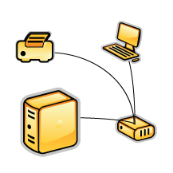
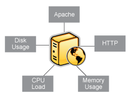

Überblick Objektkonfiguration
=============================

**Was sind Objekte?**

Objekte sind alle Elemente, die an der Überwachungs- und
Benachrichtigungslogik beteiligt sind. Objekttypen umfassen:

-   Services

-   Servicegruppen

-   Hosts

-   Hostgruppen

-   Kontakte

-   Kontaktgruppen

-   Befehle

-   Zeitfenster

-   Benachrichtigungseskalationen

-   Benachrichtigungs- und Ausführungsabhängigkeiten

Mehr Informationen darüber, was Objekte sind und wie sie in Beziehung
zueinander stehen, finden Sie nachstehend.

**Wo werden Objekte definiert?**

Objekte können in einer oder mehreren Konfigurationsdateien und/oder
Verzeichnissen definiert werden, die Sie mit den
[cfg\_file](#configmain-cfg_file)- und/oder
[cfg\_dir](#configmain-cfg_dir)-Direktiven in der
Hauptkonfigurationsdatei angeben.

**include\_file / include\_dir**

Eine Objektdefinitionsdatei kann andere Objektdefinitionsdateien
einschließen mit Hilfe der **include\_file=\< file\_name\>**- und
**include\_dir=\<directory\_name\>** -Direktiven. Die erste schließt nur
die einzelne angegebene Datei ein, die zweite wird im angegebenen
Verzeichnis alle Dateien mit der Endung *.cfg* einschließen. Diese
Direktiven können mehrfach angegeben werden, um mehrere Dateien und/oder
Verzeichnisse einzuschließen.

Die Direktiven sind nicht in den eigentlichen Definitionen eines
Objektes erlaubt, sondern sollten vor, nach oder zwischen
Objektdefinitionen auftreten. Sie sind eng mit den
[cfg\_file=](#configmain-cfg_file)- und
[cfg\_dir=](#configmain-cfg_dir)-Direktiven in der
Hauptkonfigurationsdatei verwandt.

Diese Direktiven können verkettet werden, d.h. eine
Objektdefinitionsdatei, die in der Hauptkonfigurationsdatei durch eine
**cfg\_file=**- oder **cfg\_dir=**-Direktive eingeschlossen wird, kann
**include\_file=** oder **include\_dir=** enthalten, um eine weitere
Objektdefinitionsdatei einzuschließen, die ebenfalls **include\_file=**
oder **include\_dir=** enthält, um eine weitere Datei einzuschließen,
und so fort.

 Hinweis: Wenn Sie der
[Schnellstart-Installationsanleitung](#quickstart) folgen, werden
verschiedene Beispiel-Objektkonfigurationsdateien in
*URL-ICINGA-BASE/etc/objects/* abgelegt. Sie können diese
Beispieldateien benutzen, um zu sehen, wie Objektvererbung funktioniert
und lernen, wie Sie Ihre eigenen Objektdefinitionen anlegen.

**Wie werden Objekte definiert?**

Objekte werden in einem flexiblen Vorlagenformat definiert, das es viel
einfacher machen kann, Ihre NAME-ICINGA-Konfiguration auf lange Sicht zu
verwalten. Grundlegende Informationen, wie Objekte in Ihren
Konfigurationsdateien definiert werden, finden Sie
[hier](#objectdefinitions).

Sobald Sie mit den Grundlagen vertraut sind, wie Objekte zu definieren
sind, sollten Sie bei [Objektvererbung](#objectinheritance) weiterlesen,
weil es Ihre Konfiguration robuster für die Zukunft macht. Erfahrene
Benutzer können einige fortgeschrittene Möglichkeiten der
Objektdefinition ausnutzen, die in der Dokumentation zu
[Objekt-Tricks](#objecttricks) beschrieben sind.

**Objekte erklärt**

Einige der Hauptobjekttypen werden nachfolgend genauer erklärt...

  ------------------------------------ ------------------------------------
  [**Hosts**](#objectdefinitions-host) 
  sind eins der zentralen Objekte in   
  der Überwachungslogik. Wichtige      
  Attribute von Hosts sind:            
                                       
  -   Hosts sind normaler Weise        
      physikalische Geräte in Ihrem    
      Netzwerk (Server, Workstations,  
      Router, Switches, Drucker usw.). 
                                       
  -   Hosts haben eine Adresse         
      irgendeiner Art (z.B. eine IP-   
      oder MAC-Adresse).               
                                       
  -   Hosts haben einen oder mehrere   
      Services, die mit ihm verbunden  
      sind.                            
                                       
  -   Hosts können                     
      Eltern/Kind-Beziehungen mit      
      anderen Hosts haben, oftmals     
      dargestellt durch reale          
      Netzwerkverbindungen, die in der 
      [Netzwerk-Erreichbarkeits](#netw 
  orkreachability)-Logik               
      benutzt wird.                    
                                       
  [**Hostgruppen**](#objectdefinitions 
  -hostgroup)                          
  sind Gruppen von einem oder mehreren 
  Hosts. Hostgruppen können es         
  einfacher machen, (1) den Status von 
  in Beziehung stehenden Hosts im      
  NAME-ICINGA-Web-Interface anzusehen  
  und (2) Ihre Konfiguration mit Hilfe 
  von [Objekt-Tricks](#objecttricks)   
  zu vereinfachen.                     
  ------------------------------------ ------------------------------------

  ------------------------------------ ------------------------------------
  [**Services**](#objectdefinitions-se 
  rvice)                               
  sind eins der zentralen Objekte in   
  der Überwachungslogik. Services sind 
  mit Hosts verbunden und können:      
                                       
  -   Attribute eines Hosts sein       
      (CPU-Auslastung,                 
      Plattenbelegung, Laufzeit, usw.) 
                                       
  -   Services sein, die durch den     
      Host zur Verfügung gestellt      
      werden (HTTP, POP3, FTP, SSH,    
      usw.)                            
                                       
  -   andere Dinge sein, die mit dem   
      Host verbunden sind (DNS         
      records, usw.)                   
                                       
  [**Servicegruppen**](#objectdefiniti 
  ons-servicegroup)                    
  sind Gruppen von einem oder mehreren 
  Services. Servicegruppen können es   
  einfacher machen, (1) den Status von 
  in Beziehung stehenden Services im   
  NAME-ICINGA-Web-Interface anzusehen  
  und (2) Ihre Konfiguration mit Hilfe 
  von [Objekt-Tricks](#objecttricks)   
  zu vereinfachen.                     
  ------------------------------------ ------------------------------------

  ------------------------------------ ------------------------------------
  [**Kontakte**](#objectdefinitions-co 
  ntact)                               
  sind Leute, die am                   
  Benachrichtigungsprozess beteiligt   
  sind:                                
                                       
  -   Kontakte haben eine oder mehrere 
      Benachrichtigungsmethoden        
      (Handy, Pager, e-Mail,           
      Sofortnachrichten, usw.)         
                                       
  -   Kontakte erhalten                
      Benachrichtigungen zu Hosts und  
      Services, für die sie            
      verantwortlich sind              
                                       
  [**Kontaktgruppen**](#objectdefiniti 
  ons-contactgroup)                    
  sind Gruppen von einem oder mehreren 
  Kontakten. Kontaktgruppen können es  
  einfacher machen, alle Leute zu      
  definieren, die informiert werden,   
  wenn bestimmte Host- oder            
  Serviceprobleme auftreten.           
  ------------------------------------ ------------------------------------

  ------------------------------------ ------------------------------------
  [**Zeitfenster**](#objectdefinitions                          g)
  werden benutzt, um zu kontrollieren: 
                                       
  -   wann Hosts und Services          
      überwacht werden                 
                                       
  -   wann Kontakte Benachrichtigungen 
      erhalten                         
                                       
  Informationen darüber, wie           
  Zeitfenster arbeiten, finden Sie     
  [hier](#timeperiods).                
  ------------------------------------ ------------------------------------

  ------------------------------------ ------------------------------------
  [**Befehle**](#objectdefinitions-com 
  mand)                                
  werden benutzt, um NAME-ICINGA       
  mitzuteilen, welche Programme,       
  Scripte usw. es ausführen soll:      
                                       
  -   Host- und Service-Prüfungen      
                                       
  -   Benachrichtigungen               
                                       
  -   Eventhandler                     
                                       
  -   und mehr...                      
                                       
                                       
  ------------------------------------ ------------------------------------

Konfiguration
Überblick Objektkonfiguration
include\_dir
Object Configuration Overview
include\_dir
Object Configuration Overview
include\_file
include\_file
