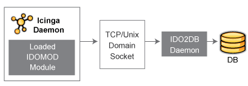
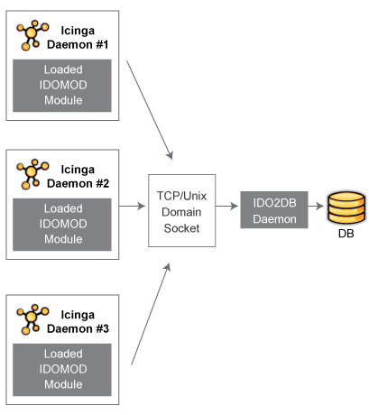
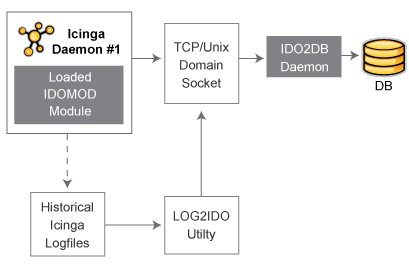

Beispielkonfigurationen
=======================

Einzelner Server, einzelne Instanz
----------------------------------

Die einfachste Konfiguration tritt auf, wenn in Ihrem Netzwerk eine
einzelne NAME-ICINGA-Instanz läuft. In diesem Fall ist die Installation
und Konfiguration der einzelnen Komponenten ziemlich geradeaus.

Das folgende Schaubild zeigt, wie die einzelnen Komponenten in diesem
Einzelserver, Einzel-NAME-ICINGA-Instanz-Aufbau zusammenspielen...

Hier eine Beschreibung, was an jedem Punkt des Schaubilds passiert:

1.  Das IDOMOD-Modul wird mit einem Instanznamen "default" konfiguriert,
    weil es lediglich eine NAME-ICINGA-Instanz im Netzwerk gibt.

2.  Während der NAME-ICINGA-Daemon läuft und die üblichen Aufgaben zur
    Überwachung des Netzwerks ausführt, sendet das IDOMOD-Modul
    Konfigurationsdaten und Ereignisinformationen an den TCP- oder
    Unix-Domain-Socket, der durch den IDO2DB-Daemon angelegt wurde.

3.  Der IDO2DB-Daemon liest die Daten, die durch den Socket vom
    IDOMOD-Modul kommen.

4.  Der IDO2DB-Daemon verarbeitet und überträgt die Daten, die vom
    IDOMOD-Modul empfanden wurden.

5.  Die verarbeiteten Daten werden für spätere Abfragen und Verarbeitung
    in einer Datenbank gespeichert.

Dieses Beispiel setzt voraus, dass:

1.  NAME-ICINGA konfiguriert wurde, um das IDOMOD-Modul beim Start zu
    laden.

2.  Der IDO2DB-Daemon läuft (der ein separater, vom NAME-ICINGA-Daemon
    unabhängiger, Prozess ist).

Einzelner Server, mehrere Instanzen
-----------------------------------

Eine weitere einfache Konfiguration kann genutzt werden, wenn Sie
mehrere NAME-ICINGA-Instanzen haben, die auf einem einzigen Server
laufen. Installation und Konfiguration der verschiedenen Komponenten des
NAME-IDOUTILS-Addons ist ähnlich zum vorigen Beispiel.

Das folgende Schaubild zeigt, wie die verschiedenen Komponenten in
diesem "einzelner Server, mehrere NAME-ICINGA-Instanzen"-Aufbau
zusammenspielen...

Sie werden bemerken, dass das obige Schaubild ähnlich zu dem "einzelner
Server, einzelne Instanz"-Aufbau ist. Der Hauptunterschied besteht
darin, dass es nun drei (3) verschiedene NAME-ICINGA-Daemons statt eines
einzelnen gibt.

1.  Jeder NAME-ICINGA-Daemon lädt das IDOMOD-Modul beim Start mit einem
    eindeutigen Instanznamen. In diesem Beispiel werden die Instanzen
    einfach "NAME-ICINGA1", "NAME-ICINGA2" und "NAME-ICINGA3" benannt.

2.  Jedes IDOMOD-Modul sendet Konfigurationsdaten und
    Ereignisinformationen seiner Instanz des NAME-ICINGA-Daemons an den
    TCP- oder Unix-Domain-Sockets, der vom IDO2DB-Daemon angelegt wurde.

3.  Der IDO2DB-Daemon liest die Daten, die durch den Socket von den drei
    IDOMOD-Modulen kommen.

4.  Der IDO2DB-Daemon verarbeitet und überträgt die Daten, die von den
    IDOMOD-Modules empfangen wurden.

5.  Die verarbeiteten Daten werden für spätere Abfragen und Verarbeitung
    in einer Datenbank gespeichert. Die Daten jeder NAME-ICINGA-Instanz
    werden (mit Hilfe des eindeutigen Instanznamens) in der Datenbank
    getrennt voneinander gehalten.

Einzelner Server, einzelne Instanz, Log-Datei-Import
----------------------------------------------------

Es gibt zwei Gründe, warum Sie vielleicht Ihre NAME-ICINGA-Log-Dateien
in die gleiche Datenbank importieren möchte, die
NAME-ICINGA-Konfigurations- und Ereignisdaten enthält:

1.  Historische Log-Datei-Daten werden nicht automatisch in die
    Datenbank importiert und möglicherweise ist es wünschenswert,
    Einträge von Ereignisse zu haben, die vor der Implementierung des
    NAME-IDOUTILS-Addon eintraten.

2.  Das IDOMOD-Modul ist nicht in der Lage, Echtzeit-Log-Einträge von
    direkt nach dem Start des NAME-ICINGA-Daemon bis zum Zeitpunkt des
    Ladens des IDOMOD-Moduls durch den NAME-ICINGA-Daemon zu
    verarbeiten. Diese "Blackout-Periode" ist unvermeidbar und führt zu
    Log-Einträgen wie "NAME-ICINGA 1.0 starting...", die das
    IDOMOD-Modul nicht mitbekommt. Daher wird das Importieren der
    Logdateien des vorangegangenen Tages auf täglicher Basis (über einen
    cron-Job) empfohlen.

Hier eine Beschreibung, was an jedem Punkt des Schaubilds passiert:

1.  Historische NAME-ICINGA-Log-Dateien werden vom LOG2IDO-Utility
    gelesen.

2.  Das LOG2IDO-Utility verarbeitet den Inhalt der Log-Dateien und
    versieht sie mit dem Instanznamen "default". Dieser Instanzname muss
    mit dem Instanznamen übereinstimmen, der vom IDOMOD-Modul im
    NAME-ICINGA-Daemon verwendet wird.

3.  Historische Log-Datei-Daten werden in einem Format an den TCP- oder
    Unix-Domain-Socket geschickt, das der IDO2DB-Daemon verstehen kann.

4.  Der IDO2DB-Daemon liest die Log-Datei-Daten vom TCP- oder
    Unix-Domani-Socket.

5.  Der IDO2DB-Daemon verarbeitet die Log-Datei-Daten.

6.  Historische Log-Datei-Daten werden für spätere Abfragen und
    Verarbeitung in einer Datenbank gespeichert. Der IDO2DB-Daemon wird
    einige Prüfungen durchführen, um das mehrfache importieren der
    gleichen historischen Log-Einträge zu verhindern, so dass der Aufruf
    des LOG2IDO-Utilitys mit den gleichen Dateien keine negativen
    Auswirkungen haben sollte.

Das war's! Ziemlich einfach.
