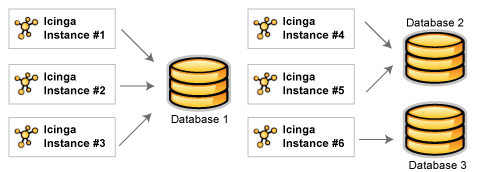
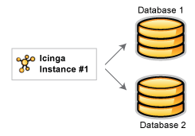
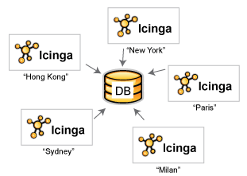
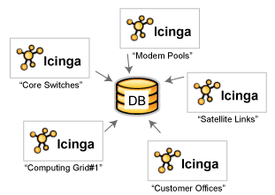

Einleitung
==========

Das NAME-IDOUTILS-Addon (Icinga Data Output Utils) basiert auf den
NAME-NDOUTILS, die ursprünglich vom NAME-NAGIOS (R)-Entwickler Ethan
Galstad erstellt wurden, so dass die Grundlagen sowohl auf NAME-NAGIOS
als auch auf NAME-ICINGA zutreffen.

Zweck
-----

Das NAME-IDOUTILS-Addon dient dazu, alle Konfigurations- und
Ereignisdaten (Statusdaten, historische Daten von NAME-ICINGA in einer
relationalen Datenbank abzulegen. Das Speichern der Informationen von
NAME-ICINGA in einem RDBMS erlaubt die schnellere Abfrage und
Verarbeitun der Daten. NAME-WEB verwendet diese Daten, sowie auch andere
Addons wie NAME-NAGVIS dies als Datenquelle heranziehen können. NAME-WEB
stellt seine eigene REST API zur Verfügung, über diese kann Icinga
Mobile seine Daten beziehen. Die NAME-ICINGA-API nutzt diese Daten.

Bisher werden MySQL, Oracle und PostgreSQL von NAME-IDOUTILS
unterstützt. Andere Datenbanksysteme werden ggf. unterstützt, wenn sich
genügend interessierte Benutzer und vor allem Benutzer finden, die Tests
durchführen.

Design-Überblick
----------------

Das NAME-IDOUTILS-Addon wurde entwickelt für Benutzer mit:

-   einer NAME-ICINGA-Installation

-   mehrere einzelnen oder "Vanilla"-NAME-ICINGA-Installationen

-   mehrere NAME-ICINGA-Installationen in verteilten, redundanten
    und/oder Umgebungen mit Ausfallsicherung

Daten eines NAME-ICINGA-Prozesses (im weiteren als "Instanz" bezeichnet)
können entweder in der gleichen oder in verschiedenen Datenbanken wie
die Daten von anderen NAME-ICINGA-Instanzen gespeichert werden.

Obwohl es bisher nicht unterstützt wird, könnten in der Zukunft die
Daten einer beliebigen Instanz in mehrere Datenbanken gespeichert
werden, falls das gewünscht wird..

Instanzen
---------

Jeder NAME-ICINGA-Prozess, egal ob es ein einzelner Überwachungsserver
oder Teil eines verteilten, redundanten Setups ist, ggf. mit
Ausfallsicherung, wird als "Instanz" bezeichnet. Um die Integrität der
gespeicherten Daten zu gewährleisten muss jede NAME-ICINGA-Instanz mit
einem eindeutigen Bezeichner oder Namen gekennzeichnet werden.

Sie können den Namen jeder NAME-ICINGA-Instanz Ihren Bedürfnissen
anpassen. So können Sie z.B. die NAME-ICINGA-Instanzen aufgrund des
geografischen Standorts bezeichnen....

Oder Sie können die NAME-ICINGA-Instanzen nach dem Zweck benennen...

Wie Sie die NAME-ICINGA-Instanzen nennen, bestimmen Sie. Wichtig ist
dabei lediglich, dass jeder einzelne NAME-ICINGA-Prozess einen
eindeutigen Instanznamen erhält.

Mehr Informationen dazu, welche Rolle die Instanznamen spielen, gibt es
in den nächsten Abschnitten.

Installation
------------

Die installation der NAME-IDOUTILS wird im [Quickstart
NAME-IDOUTILS](#quickstart-idoutils) beschrieben.
