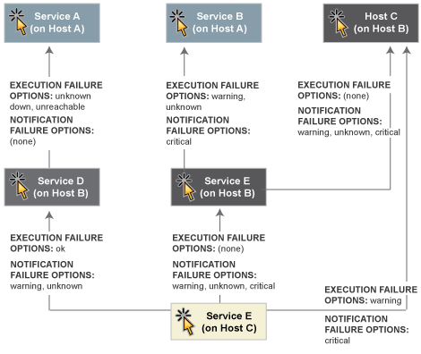
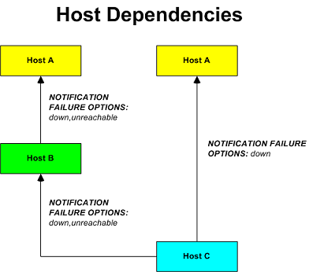

Host- und Service-Abhängigkeiten
================================

Einführung
----------

Service- und Hostabhängigkeiten sind ein fortgeschrittenes Feature von
NAME-ICINGA, dass Ihnen die Kontrolle über Hosts und Services erlaubt
basierend auf dem Status von einem oder mehreren anderen Hosts oder
Services. Wir werden erklären, wie Abhängigkeiten arbeiten, zusammen mit
den Unterschieden zwischen Host- und Service-Abhängigkeiten.

Überblick Service-Abhängigkeiten
--------------------------------

Es gibt ein paar Dinge, die Sie über Service-Abhängigkeiten wissen
sollten:

1.  ein Service kann von einem oder mehreren Services abhängig sein

2.  ein Service kann von Services abhängig sein, die nicht mit dem
    gleichen Host verbunden sind

3.  Service-Abhängigkeiten werden nicht vererbt (solange es nicht
    explizit konfiguriert wurde)

4.  Service-Abhängigkeiten können benutzt werden, um Service-Prüfungen
    auszuführen und Service-Benachrichtigungen können unter
    verschiedenen Umständen unterdrückt werden (OK, WARNING, UNKNOWN
    und/oder CRITICAL-Zustände)

5.  Service-Abhängigkeiten sind ggf. nur während bestimmter
    [Zeitfenster](#timeperiods) gültig

Service-Abhängigkeiten definieren
---------------------------------

Zuerst die Grundlagen. Sie erstellen Service-Abhängigkeiten durch
Hinzufügen von
[Service-Abhängigkeitsdefinitionen](#objectdefinitions-servicedependency)
in der/n [Objekt-Konfigurationsdatei(en)](#configobject). In jeder
Definition geben Sie den *abhängigen* Service an, den Service, von dem
sie *abhängen* und die Kriterien (falls vorhanden), die die Ausführung
und Benachrichtungsabhängigkeiten fehlschlagen lassen (diese werden
später beschrieben).

Sie können mehrere Abhängigkeiten für einen bestimmten Service
erstellen, aber Sie müssen eine eigene Service-Abhängigkeitsdefinition
anlegen für jede Abhängigkeit, die Sie erstellen.

Beispiel Service-Abhängigkeiten
-------------------------------

Das folgende Bild zeigt ein beispielhaftes Logik-Layout von
Service-Benachrichtigungen und Ausführungsabhängigkeiten. Verschiedene
Services sind abhängig von anderen Services bzgl. Benachrichtigungen und
Prüfausführung.

In diesem Beispiel würde die Abhängigkeitsdefinition für *Service F* auf
*Host C* wie folgt aussehen:

     define servicedependency{
            host_name                       Host B
            service_description             Service D
            dependent_host_name             Host C
            dependent_service_description   Service F
            execution_failure_criteria      o
            notification_failure_criteria   w,u
            }
     define servicedependency{
            host_name                       Host B
            service_description             Service E
            dependent_host_name             Host C
            dependent_service_description   Service F
            execution_failure_criteria      n
            notification_failure_criteria   w,u,c
            }
     define servicedependency{
            host_name                       Host B
            service_description             Service C
            dependent_host_name             Host C
            dependent_service_description   Service F
            execution_failure_criteria      w
            notification_failure_criteria   c
            }

Die anderen im obigen Bild gezeigten Abhängigkeitsdefinitionen würden
wie folgt definiert:

     define servicedependency{
            host_name                       Host A
            service_description             Service A
            dependent_host_name             Host B
            dependent_service_description   Service D
            execution_failure_criteria      u
            notification_failure_criteria   n
            }
     define servicedependency{
            host_name                       Host A
            service_description             Service B
            dependent_host_name             Host B
            dependent_service_description   Service E
            execution_failure_criteria      w,u
            notification_failure_criteria   c
            }
     define servicedependency{
            host_name                       Host B
            service_description             Service C
            dependent_host_name             Host B
            dependent_service_description   Service E
            execution_failure_criteria      n
            notification_failure_criteria   w,u,c
            }

Wie Service-Abhängigkeiten getestet werden
------------------------------------------

Bevor NAME-ICINGA eine Service-Prüfung ausführt oder Benachrichtigungen
für einen Service versendet, wird es prüfen, ob der Service irgendwelche
Abhängigkeiten hat. Wenn es keine Abhängigkeiten gibt, wird die Prüfung
ausgeführt oder die Benachrichtigung versandt, wie es sein sollte. Falls
der Service ein oder mehrere Abhängigkeiten *hat*, wird NAME-ICINGA
jeden Abhängigkeitseintrag wie folgt prüfen:

1.  NAME-ICINGA erhält den aktuellen
    Status^[\*](#dependencies-hard_dependencies)^ des Services, von dem
    der Eintrag *abhängig* ist.

2.  NAME-ICINGA vergleicht den Status des Services, von dem der Eintrag
    *abhängig* ist, gegen die Ausführungs- oder
    Benachrichtigungsfehleroptionen in der Abhängigkeitsdefinition (je
    nachdem, welche zu dieser Zeit relevant ist).

3.  wenn der aktuelle Status des Services, von dem der Eintrag
    *abhängig* ist, mit einer der Fehleroptionen übereinstimmt, dann
    wird die Abhängigkeit als fehlerhaft angesehen und NAME-ICINGA
    verlässt die Abhängigkeits-Prüfschleife.

4.  wenn der aktuelle Status des Services, von dem der Eintrag
    *abhängig* ist, nicht mit einer der Fehleroptionen übereinstimmt,
    dann wird die Abhängigkeit als korrekt durchlaufen angesehen und
    NAME-ICINGA wird fortfahren und den nächsten Abhängigkeitseintrag
    prüfen.

Dieser Ablauf wird ausgeführt, bis entweder alle Abhängigkeiten für
diesen Service geprüft wurden oder eine Abhängigkeitsprüfung
fehlschlägt.

 Anmerkung: ^\*^Bitte beachten Sie, dass
NAME-ICINGA per Default den aktuellsten [Hard-Status](#statetypes) des/r
Services benutzt, von dem der Eintrag abhängig ist, wenn es die
Abhängigkeitsprüfungen durchführt. Wenn NAME-ICINGA den aktuellsten
Status des/r Services benutzen soll (egal, ob es sich um einen Hard-
oder Soft-Zustand handelt), dann aktivieren Sie die
[soft\_state\_dependencies](#configmain-soft_state_dependencies)-Option.

Ausführungsabhängigkeiten
-------------------------

Ausführungsabhängigkeiten werden benutzt, um einzuschränken, wann
[aktive Prüfungen](#activechecks) eines Service ausgeführt werden
können. [Passive Prüfungen](#passivechecks) werden durch
Ausführungsabhängigkeiten nicht eingeschränkt.

Wenn *alle* der Ausführungsabhängigkeitstests für den Service
*erfolgreich* durchlaufen wurden, wird NAME-ICINGA die Prüfung für den
Service durchführen, wie es das normal tun würde. Wenn auch nur einer
der Ausführungsabhängigkeiten für einen Service fehlschlägt, wird
NAME-ICINGA vorübergehend die Ausführung von Prüfungen für diesen
(abhängigen) Service verhindern. Irgendwann in der Zukunft können die
Ausführungsabhängigkeitstests für den Service erfolgreich durchlaufen
werden. Wenn dies geschieht, wird NAME-ICINGA mit der Prüfung des
Service beginnen, wie es das normal tun würde. Mehr Informationen über
die Logik der Prüfungsplanung finden Sie [hier](#checkscheduling).

Im obigen Beispiel wären die Tests der Ausführungsabhängigkeiten für
**Service E** fehlgeschlagen, wenn **Service B** in einem WARNING- oder
UNKNOWN-Zustand ist. Falls dies der Fall ist, würde die Service-Prüfung
nicht ausgeführt und die Prüfung würde für eine (mögliche) Ausführung zu
einem späteren Zeitpunkt geplant.

Benachrichtigungsabhängigkeiten
-------------------------------

Wenn *alle* der Benachrichtigungsabhängigkeitstests für den Service
*erfolgreich* durchlaufen wurden, wird NAME-ICINGA Benachrichtigungen
für den Service versenden, wie es das normal tun würde. Wenn auch nur
einer der Benachrichtigungsabhängigkeiten für einen Service fehlschlägt,
wird NAME-ICINGA vorübergehend die Benachrichtigungen für diesen
(abhängigen) Service unterdrücken. Irgendwann in der Zukunft können die
Benachrichtigungsabhängigkeitstests für den Service erfolgreich
durchlaufen werden. Wenn dies geschieht, wird NAME-ICINGA mit dem
Versand von Benachrichtigungen für diesen Service beginnen, wie es das
normal tun würde. Mehr Informationen über die Benachrichtigungslogik
finden Sie [hier](#notifications).

Im obigen Beispiel wären die Tests der Benachrichtigungsabhängigkeiten
für **Service F** fehlgeschlagen, wenn **Service C** in einem
CRITICAL-Zustand *und/oder***Service D** in einem WARNING- oder
UNKNOWN-Zustand *und/oder***Service E** in einem WARNING-, UNKNOWN- oder
CRITICAL-Zustand ist. Falls dies der Fall ist, würden keine
Benachrichtigungen versandt werden.

Abhängigkeitsvererbung
----------------------

Wie bereits erwähnt werden Service-Abhängigkeiten *nicht* per Default
vererbt. Im obigen Beispiel sehen Sie, dass Service F von Service E
abhängig ist. Trotzdem erbt er nicht automatisch die Abhängigkeiten von
Service E zu Service B und Service C. Um Service F von Service C
abhängig zu machen, müssen wir eine weitere
Service-Abhängigkeitsdefinition hinzufügen. Es gibt keine
Abhängigkeitsdefinition für Service B, also ist Service F *nicht*
abhängig von Service B.

Wenn Sie Service-Abhängigkeiten vererbbar machen *wollen*, müssen Sie
die *inherits\_parent*-Direktive in der
[Service-Abhängigkeits](#objectdefinitions-servicedependency)-Definition
benutzen. Wenn diese Direktive aktiviert ist, bedeutet das, dass der
Abhängige die Abhängigkeiten des Service erbt, von dem er abhängt (auch
als Master-Service bezeichnet). Mit anderen Worten, wenn der
Master-Service von anderen Services abhängt und eine von diesen
Abhängigkeiten fehlschlägt, wird auch dieser Service fehlschlagen.

Stellen Sie sich für das obige Beispiel vor, Sie möchten eine neue
Abhängigkeit für Service F hinzufügen, um ihn von Service A abhängig zu
machen. Sie können eine neue Abhängigkeitsdefinition erzeugen, die
Service F als den *abhängigen* Service und Service A als den
*Master*-Service angibt (d.h. der Service, auf den F *angewiesen* ist).
Sie können alternativ die Abhängigkeitsdefinition der Services D und F
verändern, die dann wie folgt aussehen:

     define servicedependency{
            host_name                       Host B
            service_description             Service D
            dependent_host_name             Host C
            dependent_service_description   Service F
            execution_failure_criteria      o
            notification_failure_criteria   n
            inherits_parent                 1
            }

Weil die *inherits\_parent*-Direktive aktiviert ist, werden die
Abhängigkeiten zwischen den Services A und D getestet, wenn die
Abhängigkeiten zwischen den Services F und D getestet werden.

Abhängigkeiten können mehrere Vererbungsebenen haben. Wenn bei der
Abhängigkeitsdefinition zwischen A und D die
*inherits\_parent*-Direktive aktiviert ist und Service A von einem
anderen Service abhängig ist (sagen wir Service G), dann wäre Service F
von den Services D, A und G abhängig (jeder mit möglicherweise
unterschiedlichen Kriterien).

Host-Abhängigkeiten
-------------------

Wie Sie vielleicht erwarten, arbeiten Host-Abhängigkeiten in einer
ähnlichen Weise wie Service-Abhängigkeiten. Der Unterschied ist, dass
sie für Hosts gelten und nicht für Services.

 Hinweis: Verwechseln Sie Host-Abhängigkeiten
nicht mit Eltern/Kind-Beziehungen. Sie sollten in den meisten Fällen
Eltern/Kind-Beziehungen (mit Hilfe der *parents*-Direktive in den
[Host](#objectdefinitions-host)-Definitionen) benutzen statt
Host-Abhängigkeiten. Eine Beschreibung, wie Eltern/Kind-Beziehungen
arbeiten, finden Sie in der Dokumentation zur
[Netzwerkerreichbarkeit](#networkreachability).

Hier die Grundlagen zu Host-Abhängigkeiten:

1.  ein Host kann von einem oder mehreren Hosts abhängig sein

2.  Host-Abhängigkeiten werden nicht vererbt (solange es nicht explizit
    konfiguriert wurde)

3.  Host-Abhängigkeiten können genutzt werden, um Host-Prüfungen
    auszuführen und Host-Benachrichtigungen unter bestimmten Umständen
    zu unterdrücken (UP, DOWN- und/oder UNREACHABLE-Zustände)

4.  Host-Abhängigkeiten sind ggf. nur während bestimmter
    [Zeitfenster](#timeperiods) gültig

Beispiel Host-Abhängigkeiten
----------------------------

Das folgende Bild zeigt ein Beispiel für das logische Layout von
Benachrichtigungsabhängigkeiten. Verschiedene Hosts sind bzgl.
Benachrichtigungen abhängig von anderen Hosts.

Im obigen Beispiel würden die Abhängigkeitsdefinitionen für *Host C* wie
folgt aussehen:

     define hostdependency{
            host_name                       Host A
            dependent_host_name             Host C
            notification_failure_criteria   d
            }
     define hostdependency{
            host_name                       Host B
            dependent_host_name             Host C
            notification_failure_criteria   d,u
            }

Wie bei Service-Abhängigkeiten werden Host-Abhängigkeiten nicht vererbt.
Im Beispielbild sehen Sie, dass Host C nicht die Host-Abhängigkeiten von
Host B erbt. Um Host C von Host A abhängig zu machen, muss eine neue
Host-Abhängigkeitsdefinition erstellt werden.

Host-Benachrichtigungsabhängigkeiten arbeiten in einer ähnlichen Weise
wie Service-Benachrichtigungsabhängigkeiten. Wenn *alle* der
Benachrichtigungsabhängigkeitstests für den Host *erfolgreich*
durchlaufen wurden, wird NAME-ICINGA Benachrichtigungen für den Host
versenden, wie es das normal tun würde. Wenn auch nur einer der
Benachrichtigungsabhängigkeiten für einen Host fehlschlägt, wird
NAME-ICINGA vorübergehend die Benachrichtigungen für diesen (abhängigen)
Host unterdrücken. Irgendwann in der Zukunft können die
Benachrichtigungsabhängigkeitstests für den Host erfolgreich durchlaufen
werden. Wenn dies geschieht, wird NAME-ICINGA mit dem Versand von
Benachrichtigungen für diesen Host beginnen, wie es das normal tun
würde. Mehr Informationen über die Benachrichtigungslogik finden Sie
[hier](#notifications).

Abhängigkeiten
Host- und Service-Abhängigkeiten
Abhängigkeiten
"harte" Abhängigkeiten
