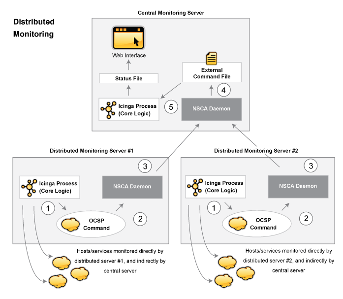

Verteilte Überwachung
=====================

Einführung
----------

NAME-ICINGA kann konfiguriert werden, so dass es verteilte Überwachung
von Netzwerk-Services und Ressourcen unterstützt. Wir werden versuchen,
kurz zu beschreiben, wie das erreicht werden kann...

Ziele
-----

Das Ziel der verteilten Überwachungsumgebung, das wir beschreiben
wollen, ist die Reduzierung des Overheads (CPU-Belastung, etc.) bei der
Service-Prüfung von einem "zentralen" Server auf ein oder mehrere
"verteilte" Server. Die meisten kleinen bis mittleren Unternehmen werden
keinen wirklichen Bedarf für das Aufsetzen solch einer Umgebung haben.
Wenn Sie allerdings hunderte oder sogar tausende von *Hosts* (und ein
Mehrfaches an Services) mit NAME-ICINGA überwachen wollen, dann kann das
ziemlich wichtig werden.

Referenzdiagramm
----------------

Das folgende Diagramm soll Ihnen eine generelle Idee davon geben, wie
verteilte Überwachung mit NAME-ICINGA arbeitet. Wir werden uns auf die
Elemente im Diagramm beziehen, während wir die Dinge erklären...

Zentraler Server vs. Verteilte Server
-------------------------------------

Beim Einrichten einer verteilten Überwachungsumgebung mit NAME-ICINGA
gibt es Unterschiede in der Art, wie zentrale und verteilte Server
konfiguriert sind. Wir werden Ihnen zeigen, wie beide Arten von Servern
konfiguriert werden und erklären, welche Auswirkungen die gemachten
Änderungen auf die gesamte Überwachung haben. Für den Anfang beschreiben
wir den Zweck der verschiedenen Server-Typen...

Die Funktion eines *verteilten Servers* ist es, aktiv Prüfungen für alle
Services durchzuführen, die Sie für eine "Gruppe" (Cluster) von Hosts
definieren. Wir benutzen den Begriff "Gruppe" locker - er meint
lediglich eine willkürliche Gruppe von Hosts in Ihrem Netzwerk. Abhängig
von Ihrem Netzwerk-Layout können Sie mehrere Gruppen in einem physischen
Standort haben oder jede Gruppe kann durch ein WAN voneinander getrennt
sein, mit einer eigenen Firewall, usw. Wichtig anzumerken ist, dass es
für jede Gruppe von Hosts (wie immer Sie diese definieren mögen) einen
verteilten Server gibt, auf dem NAME-ICINGA läuft, und der die Services
der Hosts dieser Gruppe überwacht. Ein verteilter Server enthält
meistens eine simple Installation von NAME-ICINGA. Es muss kein
Web-Interface installiert sein, keine Benachrichtigungen versenden,
keine Eventhandler-Scripts ausführen, noch etwas anderes tun außer
Service-Prüfungen ausführen, wenn Sie das nicht wollen. Detaillierte
Informationen zur Konfiguration eines verteilten Services gibt es
später...

Der Zweck des *zentralen* Servers ist es lediglich, auf
Service-Prüfungsergebnisse von einem oder mehreren verteilten Servern zu
horchen. Obwohl Services ab und zu aktiv durch den zentralen Server
geprüft werden, werden diese aktiven Prüfungen nur unter schlimmen
Umständen ausgeführt, also lassen Sie uns im Moment sagen, dass der
zentrale Server lediglich passive Prüfungen annimmt. Da der zentrale
Server Ergebnisse von [passiven Service-Prüfungen](#passivechecks) von
einem oder mehreren verteilten Servern erhält, dient er als Mittelpunkt
der gesamten Überwachungslogik (d.h., er versendet Benachrichtigungen,
startet Eventhandler-Scripts, legt den Zustand von Hosts fest, enthält
das Web-Interface, usw.).

Service-Prüfungsinformationen von verteilten Servern erhalten
-------------------------------------------------------------

Bevor wir näher auf Konfigurationsdetails eingehen, müssen wir wissen,
wie die Service-Prüfungsergebnisse von den verteilten Servern zum
zentralen Server geschickt werden. Wir haben bereits erwähnt, wie man
passive Prüfungsergebnisse an den gleichen Host schickt, auf dem
NAME-ICINGA läuft (wie in der Dokumentation zu [passive
Prüfungen](#passivechecks) beschrieben), aber wir haben keinerlei
Informationen darüber gegeben, wie man passive Prüfergebnisse von
anderen Hosts verschickt.

Um den Versand von passiven Prüfergebnissen an einen anderen Host zu
erleichtern, haben wir das [nsca-Addon](#addons-nsca) geschrieben. Das
Addon besteht aus zwei Teilen. Das erste ist ein Client-Programm
(send\_nsca), das auf einem entfernten Host läuft und benutzt wird, um
die Service-Prüfergebnisse an einen anderen Server zu senden. Das zweite
Teil ist der nsca-Daemon (nsca), der entweder als eigenständiger Daemon
oder unter inetd läuft und auf Verbindungen von Client-Programmen
horcht. Nach dem Empfang von Service-Prüfinformationen von einem Client
wird der Daemon die Prüfinformationen an NAME-ICINGA (auf dem zentralen
Server) weiterleiten, indem ein *PROCESS\_SVC\_CHECK\_RESULT* zusammen
mit den Prüfergebnissen in das [external command
file](#configmain-command_file) eingefügt wird. Das nächste Mal, wenn
NAME-ICINGA auf [externe Befehle](#extcommands) prüft, wird es die
passiven Prüfergebnisse finden, die von den verteilten Servern geschickt
wurden und sie verarbeiten. Einfach, oder?

Verteilte Server-Konfiguration
------------------------------

Also wie genau wird NAME-ICINGA auf einem verteilten Server
konfiguriert? Grundsätzlich ist es eine einfache Installation. Sie
müssen weder ein Web-Interface installieren noch Benachrichtigungen
versenden, weil dies alles vom zentralen Server aus erledigt wird.

Haupt-Konfigurationsanpassungen:

-   Nur die direkt durch den verteilten Server zu überwachenden Services
    werden in der [Objekt-Konfigurationsdatei](#configobject) definiert.

-   Die
    [enable\_notifications](#configmain-enable_notifications)-Direktive
    auf dem verteilten Server wird auf 0 gesetzt. Das verhindert das
    Versenden von Benachrichtigungen.

-   Die [obsess over
    services](#configmain-obsess_over_services)-Direktive auf dem
    verteilten Server wird aktiviert.

-   Auf dem verteilten Server ist ein [ocsp
    command](#configmain-ocsp_command) definiert (wie unten
    beschrieben).

Damit alles zusammenkommt und ordentlich arbeitet, wollen wir, dass der
verteilte Server die Ergebnisse *aller* Service-Prüfungen an NAME-ICINGA
meldet. Wir können [Eventhandler](#eventhandlers) benutzen, um
*Änderungen* am Zustand eines Service mitzuteilen, aber das bringt's
nicht. Um den verteilten Server zu zwingen, alle Prüfergebnisse zu
melden, müssen Sie die
[obsess\_over\_services](#configmain-obsess_over_services)-Option in der
Hauptkonfigurationsdatei aktivieren und ein
[ocsp\_command](#configmain-ocsp_command) bereitstellen, was nach jeder
Service-Prüfung ausgeführt wird. Wir werden das ocsp-Kommando benutzen,
um die Ergebnisse aller Service-Prüfungen an den zentralen Server zu
senden und den send\_nsca-Client sowie den nsca-Daemon benutzen (wie
oben beschrieben), um die Übertragung zu erledigen.

Um dies zu erreichen, müssen Sie ein ocsp-Kommando wie folgt definieren:

ocsp\_command=submit\_check\_result
-----------------------------------

Die Definition für den *submit\_check\_result*-Befehl sieht ungefähr so
aus:

     define command{ 
        command_name submit_check_result
        command_line URL-ICINGA-LIBEXEC/eventhandlers/submit_check_result $HOSTNAME$ '$SERVICEDESC$' $SERVICESTATE$ '$SERVICEOUTPUT$'
     }

Die *submit\_check\_result* Shell-Scripte sehen ungefähr so aus
(ersetzen Sie *central\_server* durch die IP-Adresse des zentralen
Servers):

     #!/bin/sh
     # Arguments:
     #  $1 = host_name (Short name of host that the service is
     #       associated with)
     #  $2 = svc_description (Description of the service)
     #  $3 = state_string (A string representing the status of
     #       the given service - "OK", "WARNING", "CRITICAL"
     #       or "UNKNOWN")
     #  $4 = plugin_output (A text string that should be used
     #       as the plugin output for the service checks)
     #
     # Convert the state string to the corresponding return code
     return_code=-1
     case "$3" in
         OK)
             return_code=0
             ;;
         WARNING)
             return_code=1
             ;;
         CRITICAL)
             return_code=2
             ;;
         UNKNOWN)
             return_code=-1
             ;;
     esac
     # pipe the service check info into the send_nsca program, which
     # in turn transmits the data to the nsca daemon on the central
     # monitoring server
     /bin/printf "%s\t%s\t%s\t%s\n" "$1" "$2" "$return_code" "$4" | URL-ICINGA-BASE/bin/send_nsca -H  -c URL-ICINGA-BASE/etc/send_nsca.cfg

Das Script oben geht davon aus, dass das send\_nsca-Programm und die
Konfigurationsdatei (send\_nsca.cfg) in den Verzeichnissen
*URL-ICINGA-BASE/bin/* und *URL-ICINGA-BASE/etc/* zu finden sind.

Das ist alles! Wir haben erfolgreich einen entfernten Host konfiguriert,
auf dem NAME-ICINGA als ein verteilter Überwachungs-Server läuft. Lassen
Sie uns genau betrachten, was mit dem verteilten Server passiert und wie
er Service-Prüfungsergebnisse an NAME-ICINGA schickt (die unten
skizzierten Schritte entsprechen den Zahlen im obigen Referenzdiagramm):

1.  Nachdem der verteilte Server eine Service-Prüfung beendet hat, führt
    er den Befehl aus, den Sie mit der Variable
    [ocsp\_command](#configmain-ocsp_command) definiert haben. In
    unserem Beispiel ist dies das
    *URL-ICINGA-LIBEXEC/eventhandlers/submit\_check\_result*-Script.
    Beachten Sie, dass die Definition für den
    *submit\_check\_result*-Befehl vier Parameter für das Script
    übergibt: den Namen des Hosts, der mit dem Service verbunden ist,
    die Service-Beschreibung, den Rückgabewert der Service-Prüfung und
    die Plugin-Ausgabe der Service-Prüfung.

2.  das *submit\_check\_result*-Script übergibt die Informationen der
    Service-Prüfung (Host-Name, Beschreibung, Rückgabewert und Ausgabe)
    an das *send\_nsca*-Client-Programm.

3.  das *send\_nsca*-Programm überträgt die Informationen der
    Service-Prüfung an den *nsca*-Daemon auf dem zentralen
    Überwachungs-Server.

4.  der *nsca*-Daemon auf dem zentralen Server nimmt die Informationen
    der Service-Prüfung und schreibt sie in das external command file,
    damit NAME-ICINGA sie später dort aufsammeln kann.

5.  der NAME-ICINGA-Prozess auf dem zentralen Server liest das external
    command file und verarbeitet die passiven
    Service-Prüfungsergebnisse, die vom verteilten Überwachungs-Server
    stammen.

zentrale Server-Konfiguration
-----------------------------

Wir haben betrachtet, wie verteilte Überwachungs-Server konfiguriert
werden sollten, daher wenden wir uns nun dem zentralen Server zu. Für
alle wichtigen Dinge wird der zentrale so konfiguriert wie ein einzelner
Server. Dessen Setup ist wie folgt:

-   auf dem zentralen Server ist das Web-Interface installiert
    (optional, aber empfohlen)

-   auf dem zentralen Server ist die
    [enable\_notifications](#configmain-enable_notifications)-Direktive
    auf 1 gesetzt. Das aktiviert Benachrichtungen (optional, aber
    empfohlen)

-   auf dem zentralen Server sind [aktive
    Service-Prüfungen](#configmain-execute_service_checks) deaktiviert
    (optional, aber empfohlen - beachten Sie die folgenden Anmerkungen)

-   auf dem zentralen Server sind [external command
    checks](#configmain-check_external_commands) aktiviert
    (erforderlich)

-   auf dem zentralen Server sind [passive
    Service-Prüfungen](#configmain-accept_passive_service_checks)
    aktiviert (erforderlich)

Es gibt drei andere sehr wichtige Dinge, die Sie beachten sollten, wenn
Sie den zentralen Server konfigurieren:

-   Der zentrale Server muss Service-Definitionen für *alle Services*
    haben, die auf allen verteilten Servern überwacht werden.
    NAME-ICINGA wird passive Prüfungsergebnisse ignorieren, wenn sie
    nicht zu einem Service passen, den Sie definiert haben.

-   Wenn Sie den zentralen Server nur benutzen, um Services zu
    verarbeiten, deren Ergebnisse von verteilten Hosts stammen, können
    Sie alle aktiven Service-Prüfungen auf programmweiter Basis durch
    das Setzen der
    [execute\_service\_checks](#configmain-execute_service_checks)-Direktive
    auf 0 deaktivieren. Wenn Sie den zentralen Server nutzen, um selbst
    einige Services aktiv zu überwachen (ohne die Hilfe von verteilten
    Servern), dann sollten Sie die *active\_checks\_enabled*-Option der
    Service-Definitionen auf 0 setzen, die von den verteilten Servern
    überwacht werden. Das hindert NAME-ICINGA daran, diese Services
    aktiv zu prüfen.

Es ist wichtig, dass Sie entweder alle Service-Prüfungen auf einer
programmweiten Basis deaktivieren oder die
*enable\_active\_checks*-Option in jeder Service-Definition
deaktivieren, die von einem verteilten Server überwacht werden. Das
stellt sicher, dass aktive Service-Prüfungen unter normalen Umständen
niemals ausgeführt werden. Die Services werden weiterhin im normalen
Prüfintervall geplant (3 Min., 5 Min., usw.), aber nicht ausgeführt. Wir
werden bald erklären, warum das so ist...

Das war's! Einfach, oder?

Probleme bei passiven Prüfungen
-------------------------------

Für alle wichtigen Dinge können wir sagen, dass sich der zentrale Server
bei Überwachungen allein auf passive Prüfungen verlässt. Das
Hauptproblem daran, sich komplett auf passive Prüfungen zu verlassen
besteht darin, dass NAME-ICINGA darauf vertrauen muss, dass jemand
anders die Daten liefert. Was passiert, wenn der entfernte Host, der
passive Prüfergebnisse sendet, herunterfährt oder unerreichbar wird?
Wenn NAME-ICINGA nicht aktiv die Services auf dem Host prüft, wie soll
es wissen, wann es ein Problem gibt?

Glücklicherweise gibt es einen Weg, diese Art von Problemen zu
behandeln...

Frische-Prüfung (Freshness Checking)
------------------------------------

NAME-ICINGA unterstützt ein Feature, das eine "Frische"-Prüfung für die
Ergebnisse von Service-Prüfungen durchführt. Mehr Informationen über
Frische-Prüfung finden Sie [hier](#freshness). Dieses Feature sorgt für
etwas Schutz gegen Situationen, in denen entfernte Hosts keine passiven
Service-Prüfungen mehr an den zentralen Überwachungs-Server schicken.
Der Zweck der "Frische"-Prüfung besteht darin, sicherzustellen, dass
Service-Prüfungen entweder regelmäßig passiv durch verteilte Server oder
aktiv durch den zentralen Server durchgeführt werden, falls dies
notwendig sein sollte. Wenn die Service-Prüfergebnisse von verteilten
Servern als "abgestanden" angesehen werden, kann NAME-ICINGA so
konfiguriert werden, um aktive Prüfungen des Service vom zentralen
Überwachungs-Server aus zu erzwingen.

Wie machen Sie das? Auf dem zentralen Überwachungs-Server müssen Sie
Services konfigurieren, die von verteilten Server wie folgt überwacht
werden:

-   Die *check\_freshness*-Option in der Service-Definition ist auf 1 zu
    setzen. Das aktiviert "Frische"-Prüfungen für den Service.

-   Die *freshness\_threshold*-Option in den Service-Definitionen sollte
    auf einen Wert (in Sekunden) gesetzt werden, der widerspiegelt, wie
    "frisch" die (von den entfernten Servern gelieferten) Ergebnisse der
    Service-Prüfungen sein sollten.

-   Die *check\_command*-Option in den Service-Definitionen sollte
    gültige Befehle enthalten, die genutzt werden können, um den Service
    aktiv vom zentralen Server aus zu prüfen.

NAME-ICINGA prüft periodisch die "Frische" der Ergebnisse aller
Services, für die Frische-Prüfungen aktiviert sind. Die
*freshness\_threshold*-Option in jeder Service-Definition wird benutzt,
um festzulegen, wie "frisch" die Ergebnisse für jeden Service sein
sollen. Wenn Sie z.B. diesen Wert für einen Ihrer Services auf 300
setzen, wird NAME-ICINGA das Service-Ergebnis als "abgestanden"
betrachten, wenn es älter als 5 Minuten (300 Sekunden) ist. Falls Sie
keinen Wert für die *freshness\_threshold*-Option angeben, wird
NAME-ICINGA automatisch einen "Frische"-Schwellwert berechnen, indem es
die Werte der *check\_interval*- oder der *retry\_interval*-Option
betrachtet (abhängig vom [Statustyp](#statetypes), in dem sich der
Service befindet). Wenn die Service-Ergebnisse als "abgestanden"
angesehen werden, wird NAME-ICINGA den Service-Prüf-Befehl ausführen,
der in der *check\_command*-Option der Service-Definition angegeben ist,
und dadurch den Service aktiv prüfen.

Denken Sie daran, dass Sie eine *check\_command*-Option in den
Service-Definitionen angeben müssen, die genutzt werden kann, um den
Status des Service aktiv vom zentralen Server aus zu prüfen. Unter
normalen Umständen wird dieser Prüfbefehl niemals ausgeführt (weil
aktive Prüfungen auf programmweiter Ebene bzw. für den einzelnen Service
deaktiviert wurden). Wenn Frische-Prüfungen aktiviert sind, wird
NAME-ICINGA diesen Befehl ausführen, um den Zustand des Service aktiv zu
prüfen, *auch wenn aktive Prüfungen auf einer programmweiten Ebene oder
Service-spezifischen Basis deaktiviert sind*.

Falls Sie es nicht schaffen, Befehle zu definieren, um aktiv einen
Service vom zentralen Überwachungs-Host aus zu prüfen (oder wenn es zu
einer großen Qual wird), können Sie ganz einfach bei all Ihren Services
in der *check\_command*-Option ein Dummy-Script angeben, das einen
kritischen Status zurückliefert. Hier ein Beispiel... Lassen Sie uns
annehmen, Sie definieren einen Befehl namens 'service-is-stale' und
benutzen den Befehlsnamen in der *check\_command*-Option Ihrer Services.
Hier nun, wie die Definition aussehen könnte...

     define command{
        command_name service-is-stale
        command_line URL-ICINGA-LIBEXEC/check_dummy 2 "CRITICAL: Service results are stale"
     }

Wenn NAME-ICINGA feststellt, dass das Service-Ergebnis abgestanden ist
und das **service-is-stale**-Kommando aufruft, wird das
*URL-ICINGA-LIBEXEC/check\_dummy*-Plugin ausgeführt und der Service geht
in einen kritischen Zustand. Das wird wahrscheinlich dazu führen, dass
Benachrichtigungen versandt werden, so dass Sie wissen, dass es ein
Problem gibt.

Host-Prüfungen durchführen
--------------------------

An diesem Punkt wissen Sie, wie man Service-Ergebnisse von verteilten
Servern auf passive Weise erhält. Das bedeutet, der zentrale Server
nicht aktiv Service-Prüfungen ausführt. Aber was ist mit Host-Prüfungen?
Sie müssen sie trotzdem erledigen, aber wie?

Nachdem Host-Prüfungen normalerweise einen kleinen Teil der
Überwachungsaktivität verbrauchen (sie werden nur ausgeführt, wenn es
dringend notwendig ist), raten wir dazu, dass Sie die Host-Prüfungen
aktiv vom zentralen Server aus durchführen. Das bedeutet, dass Sie
Host-Prüfungen auf dem zentralen Server genau wie auf den verteilten
Servern definieren (und auf die gleiche Weise, wie Sie das in einer
normalen, nicht-verteilten Umgebung tun würden).

Passive Host-Prüfungen sind verfügbar (lesen Sie
[hier](#passivechecks)), so dass Sie diese in Ihrer verteilten Umgebung
nutzen können, allerdings gibt es dabei ein paar Probleme. Das größte
Problem besteht darin, dass NAME-ICINGA Ergebnisse von passiven
Host-Prüfungen (die Problemzustände DOWN und UNREACHABLE) nicht
übersetzt, wenn sie verarbeitet werden. Das bedeutet, falls Ihre
Überwachungs-Server eine unterschiedliche Eltern-/Kind-Host-Struktur
haben (und das werden sie, wenn Ihre Überwachungs-Server an
unterschiedlichen Standorten stehen), wird der zentrale
Überwachungs-Server eine ungenaue Sicht Ihrer Host-Zustände haben.

Falls Sie in Ihrer verteilten Überwachungs-Umgebung passive
Host-Prüfungen an einen zentralen Server senden möchten, dann stellen
Sie sicher:

-   dass auf dem zentralen Server [passive
    Host-Prüfungen](#configmain-accept_passive_host_checks) aktiviert
    sind (notwendig)

-   dass auf dem verteilten Server [obsess over
    hosts](#configmain-obsess_over_hosts) aktiviert ist.

-   dass auf dem verteilten Server ein [ochp
    command](#configmain-ochp_command) definiert ist.

Der ochp-Befehl, der zur Verarbeitung von Host-Prüfergebnissen genutzt
wird, arbeitet ähnlich wie der ocsp-Befehl, der für die Verarbeitung von
Service-Prüfergebnissen benutzt wird (siehe oben). Um sicherzustellen,
dass passive Host-Prüfergebnisse aktuell sind, sollten Sie
[Frische-Prüfungen](#freshness) für Hosts aktivieren (ähnlich zu dem,
was weiter oben für Services beschrieben wird).

Verteilte Überwachung
