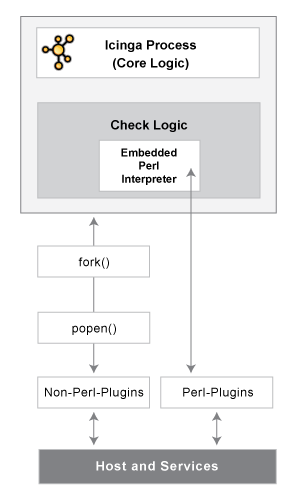

Benutzen des Embedded Perl Interpreters
=======================================

  ------------------------------------ ------------------------------------
  **Einführung**                       
                                       
  NAME-ICINGA kann für die             
  Unterstützung eines eingebetteten    
  Perl-Interpreters (embedded perl     
  interpreter) kompiliert werden. Dies 
  erlaubt es NAME-ICINGA, Perl-Plugins 
  effizienter als sonst auszuführen,   
  also mag es interessant sein, wenn   
  Sie sich viel auf Plugins verlassen, 
  die in Perl geschrieben sind.        
                                       
  Ohne den eingebetteten               
  Perl-Interpreter führt NAME-ICINGA   
  Perl- (und andere) Plugins durch     
  "forking" und ausführen als einen    
  externen Befehl aus. Wenn der        
  eingebettete Perl-Interpreter        
  benutzt wird, kann NAME-ICINGA       
  Perl-Plugins durch einen einfachen   
  Library-Call ausführen.              
                                       
   Hinweis: Der  
  Perl-Interpreter arbeitet mit allen  
  Perl-Scripten, die NAME-ICINGA       
  ausführt - nicht nur Plugins. Diese  
  Dokumentation behandelt den          
  eingebetteten Perl-Interpreter in    
  Verbindung mit Plugins für Host- und 
  Service-Prüfungen, aber sie trifft   
  genauso auf andere Arten von         
  Perl-Scripten zu, die Sie vielleicht 
  für andere Arten von Befehlen        
  benutzen (z.B.                       
  Benachrichtigungs-Scripte,           
  Eventhandler-Scripte usw.).          
                                       
  Stephen Davis hat den originalen     
  eingebetteten Perl-Interpreter-Code  
  vor einigen Jahren beigetragen.      
  Stanley Hopcroft war die erste       
  Person, die geholfen hat, den        
  eingebetteten Perl-Interpreter-Code  
  zu verbessern und die die Vor- und   
  Nachteile bei der Benutzung          
  kommentiert hat. Er hat auch         
  verschiedene hilfreiche Hinweise zur 
  Erstellung von Perl-Plugins gegeben, 
  die sauber mit dem eingebetteten     
  Interpreter arbeiten.                
                                       
  Es sollte angemerkt werden, dass     
  sich "ePN" - wie in dieser           
  Dokumentation benutzt - auf          
  "embedded Perl NAME-ICINGA" bezieht, 
  oder wenn Sie das bevorzugen,        
  NAME-ICINGA mit eingebettetem        
  Perl-Interpreter.                    
  ------------------------------------ ------------------------------------

Vorteile
--------

Einige Vorteile von ePN (embedded Perl NAME-ICINGA) umfassen:

-   NAME-ICINGA wird viel weniger Zeit bei der Ausführung Ihrer
    Perl-Plugins verbringen, weil es nicht länger "fork"t, um das Plugin
    auszuführen (das Laden des Perl-Interpreters entfällt). Statt dessen
    führt es das Plugin durch einen Library-Call durch.

-   es reduziert die Systembelastung durch Perl-Plugins und/oder erlaubt
    es Ihnen, mehr Prüfungen mit Perl-Plugins durchzuführen, als Ihnen
    das sonst möglich wäre. Mit anderen Worten haben Sie weniger Anreiz,
    Plugins in anderen Sprachen wie z.B. C/C++, oder Expect/TCL zu
    schreiben, die bei den Entwicklungszeiten eine Zehnerpotenz
    langsamer angesehen werden als Perl (wobei sie auch zehnmal
    schneller ablaufen, von TCL mal abgesehen).

-   Wenn Sie kein C-Programmierer sind, dann können Sie trotzdem eine
    Menge mit Perl erledigen, ohne dass es NAME-ICINGA viel langsamer
    macht. Beachten Sie, dass ePN Ihre Plugins nicht schneller macht
    (außer, dass es die Ladezeit eliminiert). Wenn Sie schnelle Plugins
    wollen, dann berücksichtigen Sie Perl XSUBs (XS) oder C, *nachdem*
    Sie sicher sind, dass Sie Ihr Perl getuned haben und dass Sie einen
    angemessenen Algorithmus haben (Benchmark.pm is *unbezahlbar* für
    den Vergleich von Perl-Sprachelementen).

-   ePN zu benutzen ist eine exzellente Gelegenheit, mehr über Perl zu
    lernen.

Nachteile
---------

Die Nachteile von ePN (embedded Perl NAME-ICINGA) sind ziemlich die
gleichen wie bei NAME-APACHE mod\_perl (d.h. NAME-APACHE mit einem
eingebetteten Interpreter) verglichen mit einem schlichten NAME-APACHE:

-   Ein Perl-Programm, das *wunderbar* mit schlichtem NAME-ICINGA
    arbeitet, muss *nicht* mit ePN funktionieren. Möglicherweise müssen
    Sie Ihre Plugins modifizieren, damit sie funktionieren.

    > **Important**
    >
    > Bitte beachten Sie, dass Ihr Plugin ggf. "Memory-Leaks" enthält,
    > so dass es wichtig ist, dass Sie es mit `new_mini_epn`
    > testen/verifizieren (das Sie im contrib-Verzeichnis finden).

-   Perl-Plugins sind unter ePN schwieriger zu debuggen als unter
    schlichtem NAME-ICINGA.

-   Ihr ePN wird eine größere SIZE (Speichernutzung) haben als ein
    schlichtes NAME-ICINGA.

-   Einige Perl-Konstrukte können nicht genutzt werden oder mögen sich
    anders verhalten als Sie das erwarten würden.

-   Sie sollte sich bewusst sein, dass es 'mehr als einen Weg gibt, es
    zu tun' und ggf. einen Weg wählen, der weniger attraktiv oder
    offensichtlich ist.

-   Sie werden mehr Perl-Know-How benötigen (aber nichts sehr
    esoterisches oder Zeug über Perl-Interna - außer, wenn Ihre Plugins
    XSUBS benutzen).

Benutzung des eingebetteten Perl-Interpreters
---------------------------------------------

Wenn Sie den eingebetteten Perl-Interpreter benutzen wollen, um Ihre
Perl-Plugins und Scripts auszuführen, dann lesen Sie hier, was Sie tun
müssen:

1.  Kompilieren Sie NAME-ICINGA mit Unterstützung für den eingebetteten
    Perl-Interpreter (Anweisungen s.u.).

2.  aktivieren Sie die
    [enable\_embedded\_perl](#configmain-enable_embedded_perl)-Option in
    der Hauptkonfigurationsdatei.

3.  setzen Sie die
    [use\_embedded\_perl\_implicitly](#configmain-use_embedded_perl_implicitly)-Option
    entsprechend Ihren Anforderungen. Diese Option legt fest, ob der
    Perl-Interpreter per Default für einzelne Perl-Plugins und Scripts
    benutzt werden sollte.

4.  Optional sollten Sie bei verschiedenen Perl-Plugins und Scripts die
    Ausführung durch den eingebetteten Perl-Interpreter aktivieren oder
    deaktivieren. Das kann nützlich sein, wenn bestimmte Perl-Scripte
    Probleme bei der Ausführung mit dem Perl-Interpreter haben. Beachten
    Sie die Anweisungen weiter unten für mehr Informationen, wie das zu
    tun ist.

NAME-ICINGA mit eingebettetem Perl kompilieren
----------------------------------------------

Wenn Sie den eingebetteten Perl-Interpreter benutzen möchten, müssen Sie
zuerst NAME-ICINGA mit der Unterstützung dafür kompilieren. Um dies zu
tun, starten Sie einfach das configure-Script zusätzlich mit der
**--enable-embedded-perl** -Option. Wenn Sie aktivieren wollen, dass der
Perl-Interpreter intern kompilierte Scripts in einem Cache ablegen soll,
dann nutzen Sie die **--with-perlcache** -Option. Beispiel:

     ./configure --enable-embedded-perl --with-perlcache  

Sobald Sie das configure-Script mit den neuen Optionen ausgeführt haben,
müssen Sie NAME-ICINGA erneut kompilieren.

Paket-Bauer können eine andere Option nutzen, um das Verzeichnis der
`p1.pl` Datei anzugeben:

     ./configure --with-p1-file-dir=<path>

Plugin-spezifische Benutzung des Perl-Interpreters
--------------------------------------------------

Beginnend mit NAME-ICINGA VER-ICINGA können Sie angeben, welche
Perl-Plugins oder Scripts mit dem eingebetteten Perl-Interpreter
ablaufen sollen und welche nicht. Das ist besonders dann nützlich, wenn
Sie Perl-Scripte haben, die nicht sauber mit dem Perl-Interpreter
laufen.

Um NAME-ICINGA *explizit* mitzuteilen, ob der Perl-Interpreter benutzt
werden soll oder nicht, fügen Sie Ihrem Perl-Script/Plugin einen der
folgenden Einträge hinzu...

Um NAME-ICINGA mitzuteilen, den Perl-Interpreter für ein bestimmtes
Script zu nutzen, fügen Sie dem Perl-Script diese Zeile hinzu:

     # icinga: +epn

Um NAME-ICINGA mitzuteilen, den Perl-Interpreter für ein bestimmtes
Script NICHT zu nutzen, fügen Sie dem Perl-Script diese Zeile hinzu:

     # icinga: -epn

Eine der beiden Zeilen muss innerhalb der ersten zehn Zeilen stehen,
damit sie von NAME-ICINGA erkannt wird.

> **Note**
>
> "icinga: +/- epn" wird seit NAME-ICINGA 1.2.1 unterstützt. Vorher
> mussten Sie "nagios: +/-epn" benutzen, was aus Kompatibilitätsgründen
> weiterhin unterstützt wird.

 Hinweis: Wenn Sie nicht *explizit* die oben
genannte Methode nutzen, um NAME-ICINGA mitzuteilen, den
Perl-Interpreter für ein einzelnes Plugin zu nutzen, wird NAME-ICINGA
eine Entscheidung für Sie treffen. Dieser Entscheidungsprozess wird von
der
[use\_embedded\_perl\_implicitly](#configmain-use_embedded_perl_implicitly)-Variable
kontrolliert. Wenn der Wert auf 1 gesetzt ist, werden alle
Perl-Plugins/Scripts (bei denen nicht explizit der ePN
aktiviert/deaktiviert ist) mit dem Perl-Interpreter ausgeführt. Wenn der
Wert auf 0 gesetzt ist, werden sie NICHT mit dem Perl-Interpreter
ausgeführt.

Plugins für die Nutzung mit Embedded Perl entwickeln
----------------------------------------------------

Informationen über die Entwicklung von Plugins zur Nutzung mit dem
eingebetteten Perl-Interpreter finden Sie [hier](#epnplugins).

Embedded Perl Interpreter
benutzen des ...
