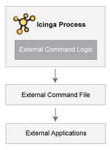

Externe Befehle
===============

Einführung
----------

NAME-ICINGA kann Befehle aus externen Applikationen verarbeiten
(einschließlich der CGIs) und verschiedene Aspekte seiner
Überwachungsfunktionen aufgrund der Befehle verändern, die es erhält.
Externe Applikationen können Befehle "einreichen", indem sie in das
[command file](#configmain-command_file) schreiben, das regelmäßig vom
NAME-ICINGA-Daemon verarbeitet wird.

Externe Befehle aktivieren
--------------------------

Damit NAME-ICINGA externe Befehle verarbeitet, müssen Sie folgendes tun:

-   aktivieren Sie die Prüfung auf externe Befehle mit der
    [check\_external\_commands](#configmain-check_external_commands)-Option.

-   setzen Sie die Wiederholrate von Befehlsprüfungen mit der
    [command\_check\_interval](#configmain-command_check_interval)-Option.

-   definieren Sie den Ort des Command-File mit der
    [command\_file](#configmain-command_file)-Option.

-   setzen Sie korrekte Berechtigungen für das Verzeichnis, welches das
    External-Command-File enthält, wie in der
    [Schnellstartanleitung](#quickstart) beschrieben.

Wann prüft NAME-ICINGA auf externe Befehle?
-------------------------------------------

-   in regelmäßigen Intervallen, wie sie durch die Option
    [command\_check\_interval](#configmain-command_check_interval) in
    der Hauptkonfigurationsdatei angegeben sind

-   direkt nachdem [Eventhandler](#eventhandlers) ausgeführt werden. Das
    passiert zusätzlich zum regelmäßigen Zyklus von externen
    Befehlsprüfungen und wird getan, um unverzügliche Aktivitäten zu
    ermöglichen, falls ein Eventhandler Befehle an NAME-ICINGA schickt.

Externe Befehle benutzen
------------------------

Externe Befehle können benutzt werden, um eine Reihe von Dingen zu
erreichen, während NAME-ICINGA läuft. Beispiele dafür, was getan werden
kann, umfassen u.a. vorübergehend Benachrichtigungen für Services und
Hosts zu deaktivieren, vorübergehend Service-Prüfungen zu deaktivieren,
sofortige Service-Prüfungen zu erzwingen, Kommentare für Hosts und
Services hinzuzufügen usw.

Befehlsformat
-------------

Externe Befehle, die in das [command file](#configmain-command_file)
geschrieben werden, haben das folgende Format...

     [] ; 

...wobei *Zeit* die Zeit (im *time\_t*-Format) ist, zu der die externe
Applikation den externen Befehl an das Command-File geschickt hat. Die
Werte für die *Befehls-ID* und die *Befehlsargumente* hängen davon ab,
welcher Befehl an NAME-ICINGA geschickt wird.

### External Commands Liste

Eine komplette Liste der Befehle, die benutzt werden können, finden Sie
in der [Liste der externen Befehle](#extcommands2).

Externe Befehle (external commands)
