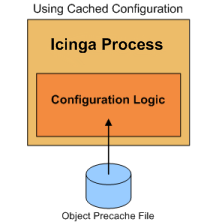

Schnellstart-Optionen
=====================

Einführung
----------

Es gibt einige Dinge, die Sie tun können, um die Zeit zu verringern, die
NAME-ICINGA zum (Neu-)Start benötigt. Diese Beschleunigung umfasst u.a.
Änderungen bei der Verarbeitung Ihrer Konfigurationsdateien.

Diese Techniken zu benutzen ist besonders dann sinnvoll, wenn bei Ihnen
einer oder mehrere der folgenden Punkte zutreffen:

-   große Konfigurationen

-   komplexe Konfigurationen (massiver Einsatz von Template-Features)

-   Installationen, bei denen häufige Neustarts notwendig sind

Hintergrund
-----------

Bei jedem (erneuten) Start von NAME-ICINGA müssen die
Konfigurationsdateien verarbeitet werden, bevor die Überwachung beginnen
kann. Dieser Konfigurationsanlaufprozess umfasst eine Reihe von
Schritten:

-   Lesen der Konfigurationsdateien

-   Auflösen von Template-Definitionen

-   "Recombobulating" Ihrer Objekte (ein [ausgedachter] Begriff für die
    verschiedenen Arten von Arbeiten, die auftreten)

-   duplizieren von Objektdefinitionen

-   vererben von Objekteigenschaften

-   sortieren Ihrer Objektdefinitionen

-   überprüfen der Objektbeziehungsintegrität

-   prüfen von zirkulären Pfaden

-   und mehr...

Einige dieser Schritte können ziemlich zeitintensiv sein, wenn Sie große
oder komplexe Konfigurationen haben. Gibt es einen Weg, einen dieser
Schritte zu beschleunigen? Ja!

Bewertung von Anlaufzeiten
--------------------------

Bevor wir weitermachen, die Dinge zu beschleunigen, müssen wir sehen was
möglich ist und ob wir uns mit der ganzen Sache beschäftigen sollten
oder nicht. Das ist einfach - starten Sie NAME-ICINGA mit der **-s**
oder **--test-scheduling**-Option, um Zeiten und Planungsinformationen
zu bekommen.

Beginnend mit NAME-ICINGA 1.0.2 gibt es eine zusätzliche Option **-S**
oder **--show-scheduling**. Damit erhalten Sie weitere Informationen zur
Scheduling Queue.

Ein Beispiel für die Ausgabe (gekürzt, um nur relevante Teile zu zeigen)
sehen Sie nachfolgend. In diesem Beispiel nutzen wir eine
NAME-ICINGA-Konfigurations mit 25 Host und etwas mehr als 10.000
Services.

     #> URL-ICINGA-BIN -s URL-ICINGA-CFG
    NAME-ICINGA VER-ICINGA
    Copyright (c) 1999-2007 Ethan Galstad (URL-NAGIOS)
    Last Modified: 01-27-2007
    License: GPL
    Timing information on object configuration processing is listed
    below.  You can use this information to see if precaching your
    object configuration would be useful.
    Object Config Source: Config files (uncached)
    OBJECT CONFIG PROCESSING TIMES      (* = Potential for precache savings with -u option)
    ----------------------------------
    Read:                 0.486780 sec
    Resolve:              0.004106 sec  *
    Recomb Contactgroups: 0.000077 sec  *
    Recomb Hostgroups:    0.000172 sec  *
    Dup Services:         0.028801 sec  *
    Recomb Servicegroups: 0.010358 sec  *
    Duplicate:            5.666932 sec  *
    Inherit:              0.003770 sec  *
    Recomb Contacts:      0.030085 sec  *
    Sort:                 2.648863 sec  *
    Register:             2.654628 sec
    Free:                 0.021347 sec
                          ============
    TOTAL:                11.555925 sec  * = 8.393170 sec (72.63%) estimated savings
    Timing information on configuration verification is listed below.
    CONFIG VERIFICATION TIMES          (* = Potential for speedup with -x option)
    ----------------------------------
    Object Relationships: 1.400807 sec
    Circular Paths:       54.676622 sec  *
    Misc:                 0.006924 sec
                          ============
    TOTAL:                56.084353 sec  * = 54.676622 sec (97.5%) estimated savings

Okay, lassen Sie uns ansehen was passiert ist. Wenn wir die Summen
ansehen, dauerte es ungefähr **11,6** Sekunden, die
Konfigurationsdateien zu verarbeiten und weitere **56** Sekunden, die
Konfigurations zu verifizieren. Das bedeutet, dass es fast **68
Sekunden** dauert, bis die erste Überwachung beginnen kann! Das ist
nicht akzeptierbar, wenn wir NAME-ICINGA ziemlich regelmäßig neu starten
müsseb.

Was kann man daran ändern? Werfen Sie einen erneuten Blick auf die
Ausgabe und Sie sehen, dass NAME-ICINGA schätzt, dass wir etwa **8,4**
Sekunden bei der Verarbeitung der Konfiguration und weitere **54,7** bei
der Verifizierung einsparen können. NAME-ICINGA denkt, dass wir **63
Sekunden** der normalen Anlaufzeit sparen können, wenn einige
Optimierungen vorgenommen werden.

Wow! Von **68 Sekunden** auf gerade mal **5 Sekunden**? Yep, lesen Sie
weiter, um zu sehen, wie das geht.

Pre-Caching der Objektkonfiguration
-----------------------------------

NAME-ICINGA kann einige Zeit beim analysieren Ihrer
Konfigurationsdateien verbringen, besonders dann, wenn Sie
Template-Features wie z.B. Vererbung usw. nutzen. Um die Zeit der
Analyse Ihrer Konfiguration zu verringern, können Sie NAME-ICINGA
veranlassen, Ihre Konfigurationsdateien für die Zukunft vorzuverarbeiten
(pre-process) und vor-zwischenzuspeichern (pre-cache).

  ------------------------------------ ------------------------------------
  Wenn Sie NAME-ICINGA mit der         
  **-p**-Kommandozeilenoption starten, 
  wird NAME-ICINGA Ihre                
  Konfigurationsdateien einlesen,      
  verarbeiten und sie in einer         
  vor-zwischengespeicherten            
  (pre-cached) (durch die              
  [precached\_object\_file](#configmai 
  n-precached_object_file)-Direktive   
  angegebene) Konfigurationsdatei      
  sichern. Diese Konfigurationsdatei   
  enthält vorverarbeitete              
  Konfigurationseinträge, die          
  NAME-ICINGA in Zukunft               
  einfacher/schneller verarbeiten      
  kann.                                
                                       
  Sie müssen die                       
  **-p**-Kommandozeilenoption zusammen 
  mit der **-v** oder                  
  **-s**-Kommandozeilenoption          
  benutzen, wie nachfolgend gezeigt.   
  Dies stellt sicher, dass Ihre        
  Konfiguration überprüft wird, bevor  
  die precached-Datei erstellt wird.   
                                       
       #> URL-ICINGA-BIN -pv URL-ICING 
  A-CFG                                
                                       
  Die precached-Konfigurationsdatei    
  wird wahrscheinlich um einiges       
  größer sein als die Summe Ihrer      
  Objektkonfigurationsdateien. Das ist 
  normal und beabsichtigt.             

  Sobald die                           
  precached-Objektkonfigurationdatei   
  erstellt wurde, können Sie           
  NAME-ICINGA starten und mit der      
  **-u**-Kommandozeilenoption angeben, 
  dass diese Datei statt Ihrer         
  Konfigurationsdatei(en) benutzt      
  werden soll.                         
                                       
       #> URL-ICINGA-BIN -ud URL-ICING 
  A-CFG                                
                                       
   Wenn    
  Sie Ihre Konfigurationsdateien       
  ändern, müssen Sie diese erneut      
  überprüfen und die                   
  precached-Konfigurationsdatei neu    
  erstellen, bevor Sie NAME-ICINGA     
  erneut starten. Wenn Sie die         
  precached-Konfigurationsdatei nicht  
  neu generieren, wird NAME-ICINGA     
  Ihre alte Konfiguration benutzen,    
  weil die                             
  precached-Konfigurationsdatei        
  gelesen wird und nicht Ihre          
  geänderten Konfigurationsdateien.    
  ------------------------------------ ------------------------------------

Überspringen der Tests von zirkulären Pfaden
--------------------------------------------

\>
Der zweite (und zeitintensivste) Teil der Konfigurationsanlaufphase ist
die Prüfung auf zirkuläre Pfade. Im obigen Beispiel dauerte es fast eine
Minute, um diesen Schritt der Konfigurationsprüfung auszuführen.

Was ist diese zirkuläre-Pfad-Prüfung und warum dauert sie so lange? Die
zirkuläre-Pfad-Prüfung soll verhindern, dass Sie zirkuläre Pfade in
Ihren Host-, Host-Abhängigkeits- oder Service-Abhängigkeitsdefinitionen
haben. Wenn ein zirkulärer Pfad in Ihren Konfigurationsdateien
existiert, könnte NAME-ICINGA in einer Deadlock-Situation enden. Der
wahrscheinlichste Grund dafür, dass die Prüfung so lange dauert, dürfte
darin liegen, dass wir keinen effizienten Algorithmus benutzen. Ein
effizienterer Algorithmus wäre daher willkommen. Wink: das bedeutet,
dass alle Absolventen der Computerwissenschaften, die ihre Thesen zu
NAME-ICINGA gemailt haben, ein wenig Code liefern könnten. :-)

Wenn Sie die Prüfung auf zirkuläre Pfade überspringen möchten, wenn Sie
NAME-ICINGA starten, dann fügen Sie die **-x**-Option wie folgt hinzu:

     #> URL-ICINGA-BIN -xd URL-ICINGA-CFG 

 Es ist von äußerster Wichtigkeit, dass Sie
Ihre Konfiguration überprüfen, bevor Sie NAME-ICINGA (erneut) starten,
wenn Sie auf die Prüfung auf zirkuläre Pfade verzichten. Wenn Sie es
nicht tun, kann dies zu Deadlocks führen. Sie sind gewarnt worden.

Alles zusammenfassen
--------------------

Folgen Sie diesen Schritten, wenn Sie mögliche Beschleunigungen durch
pre-Caching Ihrer Konfiguration und überspringen der Prüfungen auf
zirkuläre Pfade nutzen wollen.

​1. Überprüfen Sie Ihre Konfiguration und legen Sie die precache-Datei
mit den folgenden Befehlen an:

     #> URL-ICINGA-BIN -vp URL-ICINGA-CFG

​2. Stoppen Sie NAME-ICINGA, wenn es momentan läuft.

​3. Starten Sie NAME-ICINGA wie folgt, um die
precached-Konfigurationsdatei zu nutzen und auf Prüfung auf zirkuläre
Pfade zu überspringen:

     #> URL-ICINGA-BIN -uxd URL-ICINGA-CFG

​4. Wenn Sie in Zukunft Ihre Konfigurationsdateien verändern und
NAME-ICINGA erneut starten müssen, damit diese Änderungen aktiv werden,
dann wiederholen Sie Schritt 1, um Ihre Konfiguration erneut zu
überprüfen und die precached-Konfigurationsdatei zu erstellen. Sobald
das getan ist, können Sie NAME-ICINGA über das Web-Interface oder durch
das Senden eines SIGHUP-Signals neustarten. Wenn Sie die
precached-Objektdatei nicht neu erstellen, wird NAME-ICINGA wieder Ihre
alte Konfiguration benutzen, weil es die precached-Datei liest statt
Ihrer Konfigurationsdateien.

​5. Das war's! Erfreuen Sie sich am Geschwindigkeitsgewinn beim Start.

Schnellstartoptionen (Fast Startup Options)
Fast Startup Options
NAME-ICINGA-Kommandozeilenoptionen
Option -s (Timing- und Scheduling-Informationen)
NAME-ICINGA-Kommandozeilenoptionen
Option -S (Timing- und Scheduling-Informationen sowie Scheduling-Queue)
NAME-ICINGA-Kommandozeilenoptionen
Option -p (Precache von Objekten)
NAME-ICINGA-Kommandozeilenoptionen
Option -u (Precached-Objekte benutzen)
NAME-ICINGA-Kommandozeilenoptionen
Option -x (nicht auf zirkuläre Pfade prüfen)
