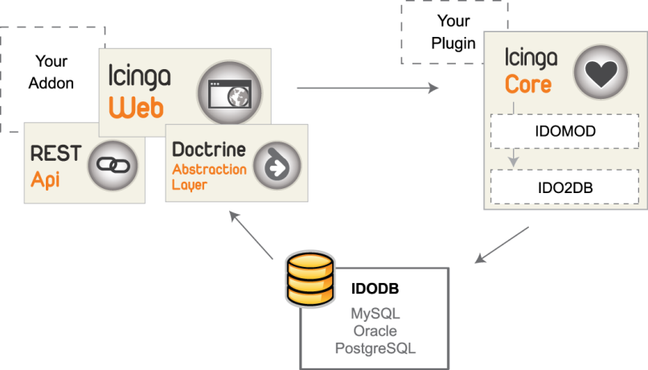

Keine NAME-API mehr zu installieren
===================================

> **Important**
>
> In der Zeit vor dem Release der Version 1.5 sagten wir unserer
> NAME-API "Tschüss" und führten ein neues API- und Web-Konzept ein.
>
> Sie fragen sich vielleicht, was war diese API überhaupt? In der Tat,
> wenn Sie keine Erweiterungen oder Anpassungen für das neue
> Web-Interface entwickelt haben, dann hatten Sie wahrscheinlich wenig
> Kontakt mit dieser wichtigen Projektkomponente. Als NAME-ICINGA
> konzipiert wurde, war eines der Hauptziele die Unterstützung der
> Entwicklung von Addons und Plugins. Die API stellte einen Satz von
> allgemein verwendbaren Abfragebefehlen zur Verfügung, um die
> Notwendigkeit zu beseitigen, SQL-Abfragen und generell eine Menge
> überflüssigen Code zu schreiben.
>
> Alles war in Ordnung, bis wir uns entschieden, etwas mehr zusätzliche
> Datenbankflexibilität anzubieten. Als wir neben NAME-MYSQL
> Unterstützung für NAME-ORACLE and NAME-POSTGRES hinzufügten, gaben wir
> auch dem NAME-API-Team etwas zusätzliche Arbeit. Mit jeder Änderung,
> jedem Bugfix oder neuer Funktionalität mussten Marius, Michael L und
> Jannis die Abfragen für jedes Datenbank-Backend separat anpassen.
> Dieser Prozess war nicht nur kompliziert und fehlerbehaftet, sondern
> auch ein Zeichen dafür, dass wir eine neue flexiblere Architektur
> benötigten.
>
> Mit NAME-ICINGA 1.5 wurde die externe NAME-API durch eine interne
> Datenbankschicht namens Doctrine ersetzt und mit NAME-WEB
> verschmolzen. Ähnlich wie vorher laufen Abfragen durch diese Schicht
> zwischen der Datenbank (NAME-IDOUTILS) und dem Web-Interface. Trotzdem
> können wir dank Doctrine mehrere Datenbank-Backends benutzen und das
> Abfragen der Datenbank ist nun viel einfacher. Im Gegensatz zu SQL
> nutzt der "object relational mapper" (ORM) die Doctrine Query
> Language, so dass wir nun die Flexibilität ohne die Code-Duplizierung
> haben.
>
> 
>
> Allerdings funktionieren Abfragen mit der alten API nach wie vor, dank
> des 'Legacy Layer', der alte API-Abfragen in diesen neuen ORM-Typ
> umwandelt. Auf diese Weise erhalten wir die Kompatibilität mit Addons,
> die für ältere NAME-ICINGA-Versionen erstellt wurden. Das Rest-API ist
> also weiterhin vorhanden als ein Teil von NAME-WEB, und erweitert
> unsere Doctrine-Schicht mit HTTP für Addons, die nur bestimmte Teile
> der Überwachungsinformationen benötigen.
>
> Durch den Wegfall einer eigenständigen API wird der durchschnittliche
> NAME-ICINGA-Benutzer kaum einen Unterschied bemerken, außer der
> Tatsache, dass die Konfiguration nun in die `databases.xml` verschoben
> wurde. Das Beste daran ist, dass jeder Modul-Entwickler nun einfach,
> ohne viel Code-Overhead, auf die NAME-ICINGA-Datenbank zugreifen kann-
> also Adddon-Entwickler, legt los!
>
> Mehr (englischsprachige) Informationen gibt es in unserem Wiki:
>
> -   [Development Guide for
>     NAME-WEB](https://wiki.icinga.org/display/Dev/Development+guide+for+Icinga-Web)
>
> -   [Icinga Database
>     Essentials](https://wiki.icinga.org/display/Dev/Icinga+Database+essentials)
>
> -   [NAME-WEB REST
>     API](https://wiki.icinga.org/display/Dev/Icinga-Web+REST+API)
>
> **Important**
>
> Das Folgende ist veraltet

Installation und Benutzung der NAME-ICINGA API
----------------------------------------------

-   **Voraussetzungen**

    Sie benötigen installierte und lauffähige Versionen von NAME-ICINGA
    und NAME-IDOUTILS oder NAME-MKLIVE, um die NAME-API nutzen zu
    können.

    > **Note**
    >
    > Falls Sie NAME-ICINGA noch nicht installiert haben, folgen Sie den
    > Anweisungen in der
    > [quickstart-idoutils](#quickstart-idoutils)-Dokumentation.

    Wenn Sie die NAME-IDOUTILS-Datenbank als Datenquelle verwenden,
    installieren Sie bitte PHP-PDO.

    -   **NAME-RHEL/NAME-FEDORA/NAME-CENTOS**

        Stellen Sie sicher, dass Sie ein Repository/Packages für PHP
        5.2.x zur Verfügung haben - RHEL/CentOS (CentOS \<= 5.4)
        unterstützen lediglich 5.1.6.

             # yum install php-pdo php-mysql|pgsql 

    -   **NAME-DEBIAN/NAME-UBUNTU**

             # apt-get install php5 php5-mysql|pgsql 

    -   **NAME-OPENSUSE;**

        Bitte benutzen Sie yast zur Installation der Pakete php5,
        php5-pdo und php5-mysql bzw. php5-pgsql.

    **Installation und Konfiguration**

    1.  **Software**

        Klonen Sie von icinga-api.git, um einen neuen Branch zu
        bekommen:

             # git clone git://git.icinga.org/icinga-api.git

        oder laden Sie die Software von
        [https://git.icinga.org/index?p=icinga-api.git;a=snapshot;h=refs/heads/master;sf=tgz](https://git.icinga.org/index?p=icinga-api.git;a=snapshot;h=refs/heads/master;sf=tgz).

    2.  **Installation**

        > **Note**
        >
        > Die NAME-API ist innerhalb des Pakets von NAME-ICINGA Core,
        > NAME-IDOUTILS und Docs enthalten und wird während 'make
        > install' mit installiert. Sofern Sie das schon durchgeführt
        > haben, befindet sich die API standardmäßig in
        > /usr/local/icinga/share/icinga-api/ und Sie können diesen
        > Abschnitt überspringen.

        > **Note**
        >
        > Wenn Sie die NAME-API für das neue NAME-WEB benötigen und
        > schon NAME-ICINGA Core mit den NAME-IDOUTILS installiert
        > haben, können Sie diesen Guide verlassen und direkt
        > [NAME-WEB](#icinga-web-scratch) installieren.

        **Download**

        Sie können die NAME-API direkt aus dem GIT Repository beziehen,
        für einen frischen Clone führen Sie folgenden Befehl aus:

             # git clone git://git.icinga.org/icinga-api.git

        Sofern Sie lediglich ein Update benötigen:

             # cd icinga-api && git pull origin master

        Oder laden Sie einen Snapshot direkt über das Gitweb:
        [https://git.icinga.org/index?p=icinga-api.git;a=snapshot;h=refs/heads/master;sf=tgz](https://git.icinga.org/index?p=icinga-api.git;a=snapshot;h=refs/heads/master;sf=tgz).

        **Installation**

        Entpacken Sie die NAME-API, führen Sie configure aus und
        installieren Sie die NAME-API

             # tar xzvf icinga-api-(version).tar.gz

             # ./configure

        Sie können den Präfix definieren, wohin die NAME-API installiert
        wird, sowie den Ort der Systemkonfiguration für NAME-ICINGA Core
        und NAME-IDOUTILS und die ausführenden Benutzer. All diese
        Informationen werden bei einer Installation durch das Core Paket
        direkt gesetzt.

             # ./configure --datarootdir=/usr/local/icinga/share \
                --sysconfdir=/usr/local/icinga/etc \
                --with-command-user=icinga-cmd \
                --with-command-group=icinga-cmd \
                --with-icinga-user=icinga \
                --with-icinga-group=icinga \
                --with-web-user=www-data \
                --with-web-group=www-data

        > **Note**
        >
        > Die --with-web...-Direktiven müssen gesetzt sein. Anderenfalls
        > werden die Web-Logs nicht korrekt erstellt. Außerdem kann dies
        > zu einem leeren Haupt-Cronk führen. Bitte beachten Sie, dass
        > die Werte von 'user' und 'group' abhängig von der Distribution
        > sind.

             # make install

Konfiguration
-------------

Wenn Sie Ihr eigenes Addon auf Basis der NAME-API entwickeln möchten,
benötigen Sie das folgende assoziative Array:

     $idoConfig = array (
        'type'         => '<Type of database>',
        'host'         => '<Database hostname>', 
        'database'     => '<Databasename>',
        'user'         => '<Username>',
        'password'     => '<password>',
        'persistent'   => <true | false>,
        'table_prefix' => '<table prefix>', 
     );

Beispiel:

     $idoConfig = array (
        'type'         => 'mysql',
        'host'         => 'localhost',
        'database'     => 'ido',
        'user'         => 'idouser',
        'password'     => 'idopassword',
        'persistent'   => true,
        'table_prefix' => 'icinga_',
     );

Unterstützte Backends
---------------------

Aktuell sind folgende Backend Typen verfügbar. Mehr Information finden
Sie unter doc/icinga-api-types.txt.

-   NAME-IDOUTILS DB - OK

-   Livestatus Modul - experimentell, noch nicht produktiv einsetzbar.

-   Dateibasierend, status.dat - experimentell, noch nicht produktiv
    einsetzbar.

**Benutzung**

1.  **Datenermittlung**

    Host-Namen und zugehörige Zustände

    Erzeugen Sie eine Instant der Klasse IcingaApi:

         $api = IcingaApi::getConnection(IcingaApi::CONNECTION_IDO, $idoConfig);

    Erzeugen Sie die Suchkriterien:

         $apiRes = $api->createSearch()
         ->setSearchTarget(IcingaApi::TARGET_HOST)
         ->setResultColumns(array('HOST_NAME', 'HOST_CURRENT_STATE'))
         ->fetch();

    Mit Hilfe von setSearchFilter() können Sie Filter benutzen, um die
    Suche einzuschränken:

         $apiRes = $api->createSearch()
         ->setSearchTarget(IcingaApi::TARGET_HOST)
         ->setResultColumns(array('HOST_NAME', 'HOST_CURRENT_STATE'))
         ->setSearchFilter(HOST_NAME, 'Switch%', IcingaApi::MATCH_LIKE)
         ->fetch();

2.  **Verarbeiten der Ergebnisse**

         foreach($apiRes as $apiHandle){
            echo 'Host '.$apiHandle->HOST_NAME.' has state '.$apiHandle->HOST_CURRENT_STATE.' ';
         }

    Ausgabe ohne Filter:

         Host localhost has state 0
         Host MySql has state 0
         Host router-01 has state 0
         Host windows100 has state 0
         Host Apache_01 has state 0

    Ausgabe mit Filter:

         Host switch70 has the current state 0
         Host switch71 has the current state 0
         Host switch72 has the current state 0
         Host switch73 has the current state 0
         Host switch74 has the current state 0
         Host switch75 has the current state 0
         Host switch76 has the current state 0
         Host switch77 has the current state 0

3.  **Kompletter Code ohne die Nutzung von Filtern**

         <?
         // Path to icinga api file
         $apiFile = 'icinga-api/IcingaApi.php';
         
         // Database connection
         $idoConfig = array (
            'type'         => 'mysql',
            'host'         => 'localhost',
            'database'     => 'ido',
            'user'         => 'idouser',
            'password'     => 'idopassword',
            'persistent'   => true,
            'table_prefix' => 'icinga_',
         );
         
         // Include required files
         require_once($apiFile);
         
         // Instance the class
         $api = IcingaApi::getConnection(IcingaApi::CONNECTION_IDO, $idoConfig);
         
         // Create search
         $apiRes = $api->createSearch()
         ->setSearchTarget(IcingaApi::TARGET_HOST)
         ->setResultColumns(array('HOST_NAME', 'HOST_CURRENT_STATE'))
         ->fetch();
         
         // Create output
         foreach($apiRes as $apiHandle){
            echo 'Host '.$apiHandle->HOST_NAME.' has the current state '.$apiHandle->HOST_CURRENT_STATE.' ';
         }
         ?>

    Für nähere Informationen werfen Sie bitte einen Blick in das [git
    repository](http://git.icinga.org/) oder die Beispiele im
    doc/examples-Verzeichnis.

Icinga-API
API/Icinga
