Einführung in NAME-WEB (\<= 1.2.x)
==================================

Wenn Sie den Schnellstart-Anleitungen
([NAME-IDOUTILS](#quickstart-idoutils) und
[NAME-WEB](#icinga-web-scratch)) gefolgt sind, sollten Sie nun
http://\<icinga server\>/icinga-web aufrufen können und den
Login-Bildschirm sehen

Sie können sich mittels "root" und "password" einloggen. Dies wird Sie
auf eine Überblickseite weiterleiten, wo der Status von überwachten
Hosts und Services dargestellt wird.

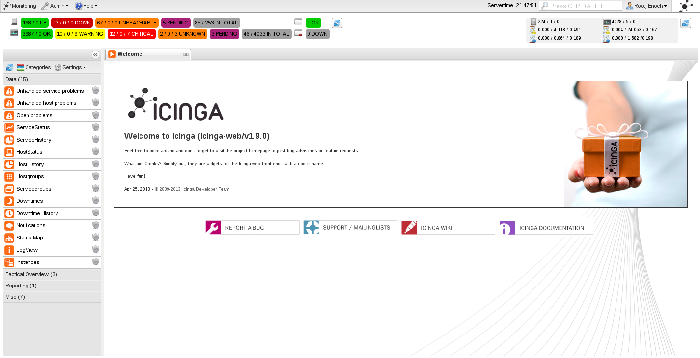

*Zentrale Übersicht*

Hier findet sich alles zusammen: Sie können mittels drag-and-drop neue
Fenster hereinziehen. Die Ansichten für den aktuellen Benutzer sind
konfigurierbar (diese sind persistent), z.B. durch verschieben der
Spaltenüberschrift an die gewünschte Stelle. Rechtsklicken auf die
Spaltenüberschrift ermöglicht die Einstellung der Sortierreihenfolge
oder das Verstecken von Spalten. Zu öffnende Suchresultate werden
ebenfalls hier in einem neuen Tab geöffnet; das gilt auch für das Öffnen
verfügbarer Cronks.

*Status-Cronk*

Der Status Cronk zeigt die aktuelle Anzahl von Hosts und Services
aufgeteilt nach ihren aktuellen Zuständen. Sofern ein Zähler Null (0)
ist, wird dieser grau hinterlegt angezeigt. Klicken Sie auf einen
Zustand, um einen neuen Tab zu öffnen, der nur den gewählten Zustand
anzeigt.

-   Hosts|Services (aktiv/passiv)

-   Host|Service Ausführungszeit (min/avg/max)

-   Host|Services Latenzzeit (min/avg/max)

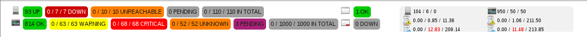

*Oberes Menü*

Das obere Menü beherbergt generelle Informationen zu NAME-ICINGA sowie
ein Benutzer-, Gruppen- sowie Log-Administrierungsmenü. Rechts oben
können Sie den gerade eingeloggten Benutzer bearbeiten oder sich aus
NAME-WEB ausloggen.

*Linkes Menü*

Im linken (versteckbaren) Menü können Sie aus verschiedenen Widgets (wir
nennen diese "Cronks") auswählen, die das Arbeiten mit NAME-WEB
erleichtern werden. Sie können entweder einen Cronk doppelklicken oder
diesen mit dem Mauszeiger in die zentrale Tab-Leiste ziehen. Die
Kategorien sind wie folgt aufgeteilt:

-   "Data", um Status-, historische und Konfigurationsdaten zu erhalten

    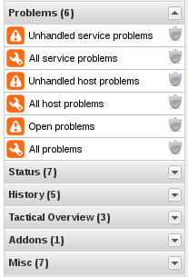

-   "Tactical Overview" bietet generelle Charts und eigene angepasste an
    (Custom Variables)

    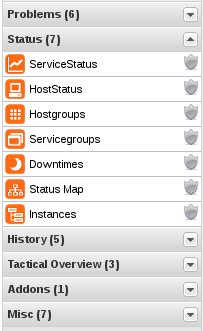

-   "Misc" enthält verschiedene nützliche Cronks, wie iframe für externe
    Webseiten oder 1,2,3-Spaltenansichten

    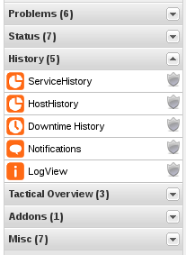

*Suche*

Die Suche zeigt live Resultate, während Sie tippen. Diese werden in
einem eigenen Inlay-Fenster angezeigt. Indem Sie ein Ergebnis anklicken,
wird ein neuer Tab mit näheren Informationen geöffnet.

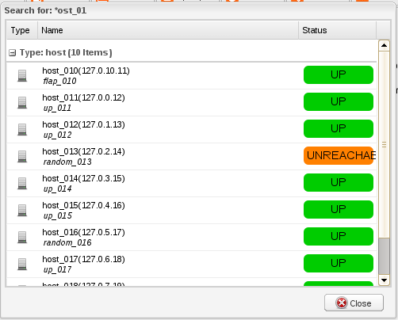

*Log*

Am unteren Fensterrand wird das aktuelle Icinga-Protokoll eingeblendet.
Das Log wird automatisch aktualisiert, und kann auch minimiert werden,
um mehr Platz für die zentrale Übersicht zu schaffen.

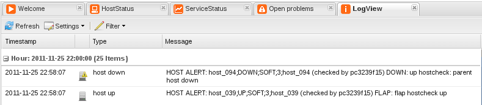

****

**Cronks und Views**

NAME-WEB erlaubt es, mehrere Cronks für verschiedene Anwendungsgebiete
zu öffnen und zu verwalten. Damit können Sie Daten einsehen, Filter für
unterschiedliche Views setzen oder Kommandos absenden. Die folgende
Übersicht fasst die generellen Möglichkeiten zusammen (einige Cronks
bieten zusätzliche Items, wie etwas das Senden von Kommandos).

-   Refresh

    Manuelle Aktualisierung der Anzeige

-   Settings

    (De)aktivieren der automatischen Aktualisierung

    Get this \<item\> by url

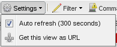

-   Filter

    Modify/Remove

*Commands*

In NAME-WEB gibt es verschiedene Kommandos (siehe Kapitel ["External
Commands"](#extcommands) für mehr Informationen), die an den Core
geschickt werden können. Selektieren Sie die Einträge, die davon
betroffen sein sollen, und dann das Kommando, das ausgeführt werden
soll.

-   Host Commands

-   Service Commands

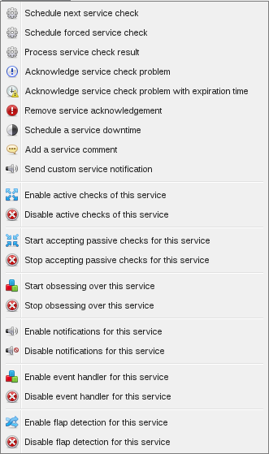

*Filters*

Filter erlauben NAME-WEB eigene, angepasste Ansichten (Views) die auch
in eigenen persistenten Cronks gespeichert werden können. Als erstes
wählen Sie bitte "Filter" und "Modify". Fügen Sie eine Restriktion aus
dem Dropdown-Menü hinzu (dies ist von Cronk zu Cronk unterschiedlich).
Wiederholen Sie diesen Schritt, um verschiedene Restriktionen zu setzen.

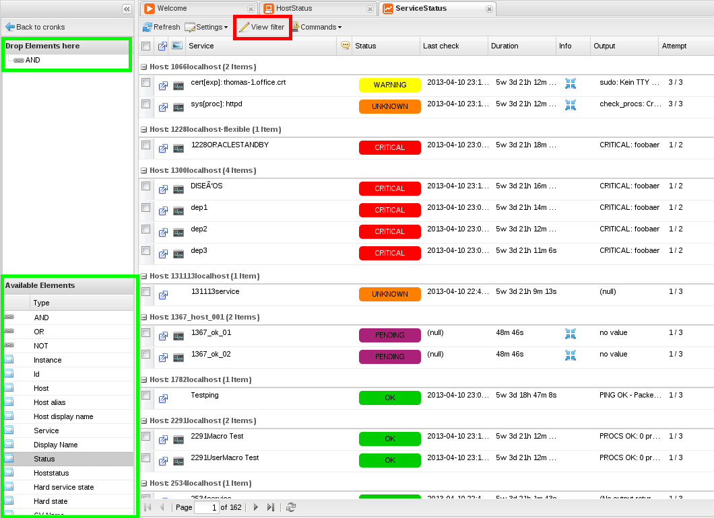

Anschließend spezifizieren Sie die Bedingung(en), unter welchen der
Filter die Anzeige generieren soll (contain, does not contain, is, is
not). Fügen Sie zu jeder Bedingung einen Wert hinzu; Vorschläge werden
eingeblendet, sobald Sie tippen.

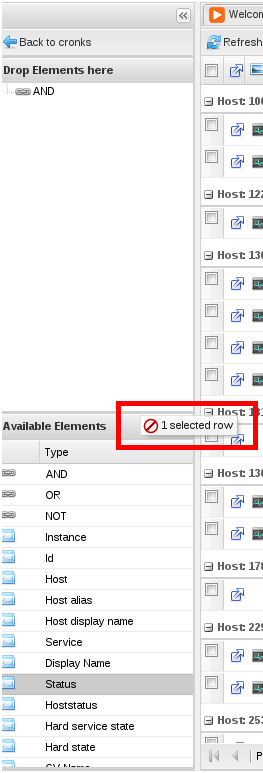

Wenden Sie den Filter auf den aktuellen Cronk an. Sofern benötigt,
können Sie den Filter später modifizieren und weitere Restriktionen und
Bedingungen hinzufügen/entfernen. Ein aktiver Filter wird rot markiert.

****

**Administration**

Steigen Sie in die Administrationsübersicht ein, indem Sie "Admin" im
oberen Menü auswählen. Danach wählen Sie "Users", "Groups" oder "Logs".

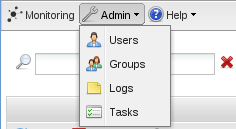

*Benutzer*

Sie können Benutzer hinzufügen, löschen oder editieren.

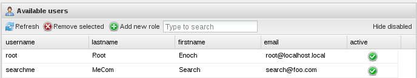

Doppelklicken Sie einen Benutzer um ein neues Inlay Fenster zu öffnen,
das Ihnen erlaubt, weitere Details zu spezifizieren. Dieselben Optionen
stehen zur Verfügung, wenn Sie einen neuen Benutzer anlegen. Sie können
die Grösse des Fensters mittels Mauszeigerbewegung an den Ecken
beeinflussen.

-   General information

-   Change password (and optional AuthKey for API)

-   Permissions; z.B. zu welcher Gruppen zugehörig

-   Principals für spezielle Rollen

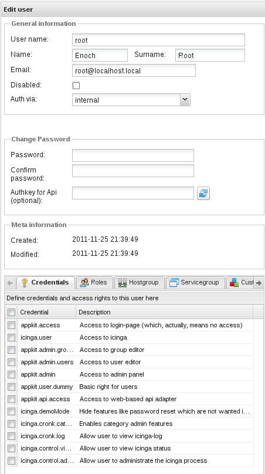

*Gruppen*

Sie können Gruppen hinzufügen, löschen oder editieren. Die
Gruppenvererbung lässt sich direkt im Gruppenbaum auf der rechten Seite
anpassen.

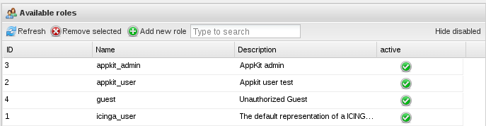

Doppelklicken Sie eine Gruppe, um ein neues Inlay-Fenster zu öffnen, das
Ihnen erlaubt, weitere Details zu spezifizieren. Dieselben Optionen
stehen zur Verfügung, wenn Sie eine neue Gruppe anlegen. Sie können die
Größe des Fensters mittels Mauszeigerbewegung an den Ecken beeinflussen.

-   General information + Permissions (welche Benutzer gehören zu dieser
    Gruppe)

-   Principals für spezielle Rollen

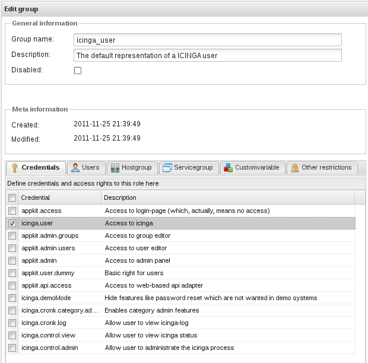

*Principals*

In der der Benutzer- und Gruppenübersicht im Administrationsbereich
können Sie Principals hinzufügen/entfernen/editieren. Nachfolgend eine
Liste der verfügbaren Principals:

*Logs*

Hier können Sie verschiedene Logs betrachten, um diese als Hilfe bei
Ihrer Fehlersuche zu verwenden.

NAME-WEB
Überblick (\<= 1.2.x)
