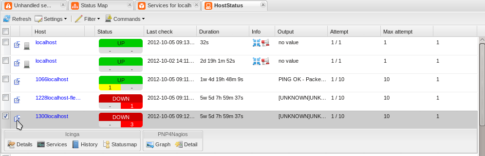
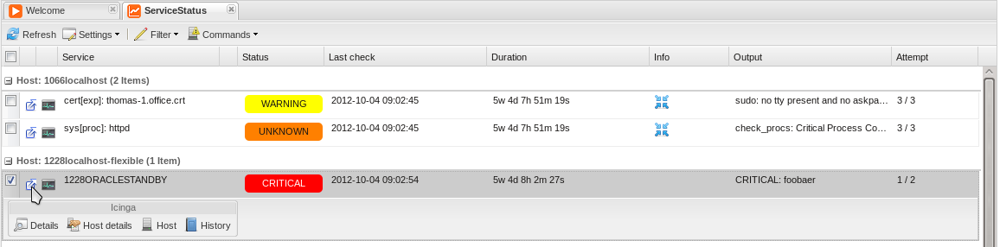

Einführung in NAME-WEB (\>= 1.9)
================================

Wenn Sie den Schnellstart-Anleitungen
([NAME-IDOUTILS](#quickstart-idoutils) und
[NAME-WEB](#icinga-web-scratch)) gefolgt sind, sollten Sie nun
http://\<icinga server\>/icinga-web aufrufen können und den
Login-Bildschirm sehen

Sie können sich mittels "root" und "password" einloggen. Dies wird Sie
auf eine Überblickseite weiterleiten, wo der Status von überwachten
Hosts und Services dargestellt wird.

*Oberes Menü*

Das obere Menü beherbergt generelle Informationen zu NAME-ICINGA sowie
ein Benutzer-, Gruppen-, Log- sowie Task-Administrierungsmenü. Die
Live-Such öffnet sich, wenn Sie auf das Vergrößerungsglas neben der
Uhrzeit klicken. Rechts oben können Sie den gerade eingeloggten Benutzer
bearbeiten oder sich aus NAME-WEB ausloggen.

*Suche*

Die Suche zeigt live Resultate, während Sie tippen. Diese werden in
einem eigenen Inlay-Fenster angezeigt. Indem Sie ein Ergebnis anklicken,
wird ein neuer Tab mit näheren Informationen geöffnet. Die Suche beginnt
am Anfang der Zeichenkette, aber Sie können auch Wildcards benutzen.

*Status-Cronk*

Der Status-Cronk zeigt die aktuelle Anzahl von Hosts und Services
aufgeteilt nach ihren aktuellen Zuständen. Sofern ein Zähler Null (0)
ist, wird dieser grau hinterlegt angezeigt. Klicken Sie auf einen
Zustand, um einen neuen Tab zu öffnen, der nur den gewählten Zustand
anzeigt. Daneben finden Sie die Anzahl und den Zustand der
Icinga-Instanzen. Der verbleibende Platz wird für die Anzeige
allgemeiner Informationen benutzt, das sind:

-   Hosts|Services (aktiv/passiv)

-   Host|Service Ausführungszeit (min/avg/max)

-   Host|Services Latenzzeit (min/avg/max)

*Linkes Menü*

Im linken (versteckbaren) Menü können Sie aus verschiedenen Widgets (wir
nennen diese "Cronks") auswählen, die das Arbeiten mit NAME-WEB
erleichtern werden. Sie können entweder einen Cronk doppelklicken oder
diesen mit dem Mauszeiger in die zentrale Tab-Leiste ziehen. Die
Kategorien sind wie folgt aufgeteilt:

-   "Data", um Status-, historische und Konfigurationsdaten zu erhalten.
    In Icinga 1.6 gibt es zwei neue Cronks: eins für Informationen über
    Instanzen und eins für die "Tackle View"

    

-   "Tactical Overview" bietet generelle Charts und eigene angepasste an
    (Custom Variables)

    

-   "Reporting" bietet Auswertungen

    

-   "Misc" enthält verschiedene nützliche Cronks, wie iframe für externe
    Webseiten oder 1,2,3-Spaltenansichten sowie Links auf die englische
    bzw. deutsche Dokumentation

    

Sie können im Settings-Menü auch zur alten Ansicht mit den größeren
Icons wechseln. In der Konfigurationsdatei `userpreferences.xml` können
Sie einen globalen Defaultwert setzen.

*Zentrale Übersicht*

Hier findet sich alles zusammen: Sie können mittels drag-and-drop neue
Fenster hereinziehen. Die Ansichten für den aktuellen Benutzer sind
konfigurierbar (diese sind persistent), z.B. durch verschieben der
Spaltenüberschrift an die gewünschte Stelle. Rechtsklicken auf die
Spaltenüberschrift ermöglicht die Einstellung der Sortierreihenfolge
oder das Verstecken von Spalten. Zu öffnende Suchresultate werden
ebenfalls hier in einem neuen Tab geöffnet; das gilt auch für das Öffnen
verfügbarer Cronks.

*Host Status*

Die HostStatus-Ansicht zeigt den Host-Status und darunter die Anzahl von
Warning/Critical der zugehörigen Services. Über die erweitere Ansicht
können Sie in die Servicestatus- Ansicht und die Historie des Hosts
wechseln, die Statusmap ansehen sowie die Performancedaten des Hosts
anzeigen lassen, sofern Sie PNP4Nagios nutzen.

Links sehen Sie das "Expander"-Icon. Nach dem Klicken öffnet sich
darunter ein Balken.

Nach Rechts-Klick auf eins der neuen Icons und auswählen von "Move into
grid" wird das entsprechende Icon ins Raster verschoben.

Auswählen des neuen Icons öffnet ein kleinen Fenster oder es wird ein
neuer Reiter erstellt, in dem die gewünschten Informationen zu sehen
sind.

Klicken auf "Setting" und auswählen von "Reset grid action icons"
entfernt die eingefügten Icons und stellt die Standardansicht wieder
her.

*Host Informationen*

Über Details in der erweiterten HostStatus-Ansicht sehen Sie
detaillierte Host- Status Informationen, zugeordnete Kontakte und
Hostgruppen und externe Referenzen.

*Service Status*

Die ServiceStatus-Ansicht zeigt die Services für jeden Host.

*Service Informationen*

Über die erweitere ServiceStatus-Ansicht können Sie detaillierte
Service- Status- und Host- Status- Informationen ansehen, die Historie
des Services aufrufen und in die HostStatus- Ansicht wechseln.

*Hostgroup Status*

Die Hostgroup-Ansicht zeigt den Status und die Anzahl der Hosts mit dem
jeweiligen Status gruppiert nach den Hostgruppen.

*Log*

Am unteren Fensterrand wird das aktuelle Icinga-Protokoll eingeblendet.
Das Log wird automatisch aktualisiert, und kann auch minimiert werden,
um mehr Platz für die zentrale Übersicht zu schaffen.

**Cronks und Views**

NAME-WEB erlaubt es, mehrere Cronks für verschiedene Anwendungsgebiete
zu öffnen und zu verwalten. Damit können Sie Daten einsehen, Filter für
unterschiedliche Views setzen oder Kommandos absenden. Die folgende
Übersicht fasst die generellen Möglichkeiten zusammen (einige Cronks
bieten zusätzliche Items, wie etwas das Senden von Kommandos).

-   Refresh

    Manuelle Aktualisierung der Anzeige

-   Settings

    (De)aktivieren der automatischen Aktualisierung

    Get this \<item\> by url

-   Filter

    Modify/Remove

*Commands*

In NAME-WEB gibt es verschiedene Kommandos (siehe Kapitel ["External
Commands"](#extcommands) für mehr Informationen), die an den Core
geschickt werden können. Selektieren Sie die Einträge, die davon
betroffen sein sollen, und dann das Kommando, das ausgeführt werden
soll.

  --------------- ------------------
  Host Commands   Service Commands
  --------------- ------------------

*Filter*

Filter erlauben NAME-WEB eigene, angepasste Ansichten (Views) die auch
in eigenen persistenten Cronks gespeichert werden können. Als erstes
wählen Sie bitte "View Filter". Auf der linken Seite öffnet sich an
Stelle des Cronk Menüs die Auswahl der Filterattribute und -bedingungen
im unteren Bereich, sowie die Anzeige des aktuellen Filters im oberen
Bereich.

Anschließend spezifizieren Sie die Bedingung(en), unter welchen der
Filter die Anzeige generieren soll, indem Sie Filterattribute und
-bedingung mittels Drag and Drop verschieben.

  ------------- -------------
  drag filter   drop filter
  ------------- -------------

Sobald Sie den Attributfilter auf eine Bedingung gezogen haben, können
Sie dessen Werte einstellen (abhängig vom Attribut. Das Beispiel zeigt
lediglich jene Auswahl des Status an). Klicken Sie "Add filter" an
sobald Sie fertig sind.

Der aktive Filter zeigt nun nur die gefilterte Ansicht und dessen
Einträge.

Sie können auch mehrere Filter (auch desselben Typs) durch Bedingungen
miteinander verknüpfen. DAs Beispiel zeigt eine Oder-Verknüpfung
zwischen dem Status Critical und Warning.

****

**Administration**

Steigen Sie in die Administrationsübersicht ein, indem Sie "Admin" im
oberen Menü auswählen. Danach wählen Sie "Users", "Groups", "Logs" oder
"Tasks".

*Benutzer*

Sie können Benutzer hinzufügen, löschen oder editieren. Sie können auch
Benutzer suchen.

Doppelklicken Sie einen Benutzer um ein neues Inlay Fenster zu öffnen,
das Ihnen erlaubt, weitere Details zu spezifizieren. Dieselben Optionen
stehen zur Verfügung, wenn Sie einen neuen Benutzer anlegen. Sie können
die Größe des Fensters mittels Mauszeigerbewegung an den Ecken
beeinflussen.

-   General information

-   Change password (and optional AuthKey for API)

-   Permissions; z.B. zu welcher Gruppen zugehörig

-   Principals für spezielle Rollen

*Gruppen*

Sie können Gruppen hinzufügen, löschen oder editieren. Die
Gruppenvererbung lässt sich direkt im Gruppenbaum auf der rechten Seite
anpassen. Sie können auch nach Gruppen suchen.

Doppelklicken Sie eine Gruppe, um ein neues Inlay-Fenster zu öffnen, das
Ihnen erlaubt, weitere Details zu spezifizieren. Dieselben Optionen
stehen zur Verfügung, wenn Sie eine neue Gruppe anlegen. Sie können die
Größe des Fensters mittels Mauszeigerbewegung an den Ecken beeinflussen.

*Rollen*

In der Benutzer- und Gruppenübersicht im Administrationsbereich können
Sie Rollen hinzufügen/entfernen/editieren. Nachfolgend eine Liste der
verfügbaren Rollen:

> **Note**
>
> Weitere Informationen zum Berechtigungskonzept von NAME-WEB finden Sie
> im
> [Wiki.](https://wiki.icinga.org/display/Dev/Object+Credentials+-+How+they+work)

*Logs*

Hier können Sie verschiedene Logs betrachten, um diese als Hilfe bei
Ihrer Fehlersuche zu verwenden.

*Task*

Verschiedene Dinge erfordern das Löschen des Cache. Anstatt auf die
Kommandozeile zu wechseln können Sie den Befehl über das "Tasks"-Menü
ausführen.

NAME-WEB
Überblick Version 1.9
