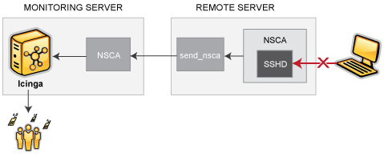

TCP-Wrapper-Integration
=======================

Einführung
----------

Dieses Dokument erklärt, wie einfach in NAME-ICINGA Alarme für
Verbindungsversuche generiert werden können, die von TCP-Wrappern
zurückgewiesen werden. Wenn zum Beispiel ein unautorisierter Host
versucht, sich mit Ihrem SSH-Server zu verbinden, können Sie in
NAME-ICINGA einen Alarm empfangen, der den Namen des Hosts enthält, der
zurückgewiesen wurde. Wenn Sie das auf Ihren NAME-LINUX/Unix-Boxen
installieren, dann werden Sie erstaunt sein, wie viele Port-Scans Sie in
Ihrem Netzwerk entdecken.

Diese Anweisungen gehen davon aus, dass

1.  Sie bereits mit [passiven Prüfungen](#passivechecks) vertraut sind
    und wissen, wie sie arbeiten.

2.  Sie bereits mit [sprunghaften Services](#volatileservices) vertraut
    sind und wissen, wie sie arbeiten.

3.  der Host, für den Sie Alarme generieren (d.h. der Host, auf dem Sie
    TCP-Wrapper benutzen), ein entfernter Host ist (in diesem Beispiel
    *firestorm* genannt). Wenn Sie Alarme auf dem gleichen Host
    generieren möchten, müssen Sie ein paar Anpassungen an den
    Beispielen machen, die wir bereitstellen.

4.  Sie den [NAME-NSCA-Daemon](#addons-nsca) auf Ihrem
    Überwachungs-Server und den NAME-NSCA client (*send\_nsca*) auf der
    entfernten Maschine installiert haben, für die Sie
    TCP-Wrapper-Alarme generieren möchten.

Einen Service definieren
------------------------

Wenn Sie es nicht bereits getan haben, erstellen Sie eine
[Host-Definition](#objectdefinitions-host) für den entfernten Host
(*firestorm*).

Als nächstes definieren Sie einen Service in einer Ihrer
[Objektkonfigurationsdateien](#configobject) für die TCP-Wrapper-Alarme
auf dem Host *firestorm*. Die Service-Definition könnte wie folgt
aussehen:

     define service{
            host_name                       firestorm
            service_description             TCP Wrappers
            is_volatile                     1
            active_checks_enabled           0
            passive_checks_enabled          1
            max_check_attempts              1
            check_command                   check_none
            ...
            }

Es gibt einige wichtige Dinge zu der obigen Service-Definition
anzumerken:

1.  Die *volatile*-Option ist aktiviert. Wir wollen, dass diese Option
    aktiviert ist, weil wir eine Benachrichtigung für jeden Alarm haben
    wollen, der herein kommt.

2.  Aktive Prüfungen für den Service sind deaktiviert, während passive
    Prüfungen aktiviert sind. Das bedeutet, dass der Service niemals
    aktiv von NAME-ICINGA geprüft wird - alle Alarminformationen müssen
    passiv von einer externen Quelle empfangen werden.

3.  Der *max\_check\_attempts*-Wert wird auf 1 gesetzt. Das
    gewährleistet, dass Sie eine Benachrichtigung erhalten, sobald der
    erste Alarm generiert wird.

TCP-Wrapper konfigurieren
-------------------------

Nun müssen Sie die */etc/hosts.deny*-Datei auf *firestorm* editieren.
Damit die TCP-Wrapper einen Alarm an den Überwachungs-Host senden,
sobald ein Verbindungsversuch verweigert wird, müssen Sie eine Zeile
hinzufügen, die der folgenden ähnlich ist.

     ALL: ALL: RFC931: twist (URL-ICINGA-LIBEXEC/eventhandlers/handle_tcp_wrapper %h %d) &

Diese Zeile nimmt an, dass es ein Script namens *handle\_tcp\_wrapper*
im *URL-ICINGA-LIBEXEC/eventhandlers/*-Verzeichnis auf *firestorm* gibt.
Wir werden dieses Script als nächstes schreiben.

Das Script schreiben
--------------------

Als letztes müssen Sie das *handle\_tcp\_wrapper*-Script auf *firestorm*
schreiben, das den Alarm zurück an den NAME-ICINGA-Server schickt. Es
könnte ungefähr so aussehen:

     #!/bin/sh 
    URL-ICINGA-LIBEXEC/eventhandlers/submit_check_result firestorm "TCP Wrappers" 2 "Denied $2-$1" > /dev/null 2> /dev/null

Beachten Sie, dass das *handle\_tcp\_wrapper*-Script das
*submit\_check\_result*-Script aufruft, um den Alarm zurück an den
Überwachungs-Host zu schicken. Angenommen, Ihr NAME-ICINGA-Server heißt
*monitor*, dann könnte das *submit check\_result*-Script wie folgt
aussehen:

     #!/bin/sh
     # Arguments
     #       $1 = name of host in service definition
     #       $2 = name/description of service in service definition
     #       $3 = return code
     #       $4 = output
     /bin/echo -e "$1\t$2\t$3\t$4\n" | URL-ICINGA-BASE/bin/send_nsca monitor -c URL-ICINGA-BASE/etc/send_nsca.cfg

Aufräumen
---------

Sie haben nun alles konfiguriert, was Sie brauchen, so dass Sie nur noch
den *inetd*-Prozess auf *firestorm* und NAME-ICINGA auf Ihrem
Überwachungs-Server neu starten müssen. Das war's! Wenn die TCP-Wrapper
auf *firestorm* einen Verbindungsversuch verweigern, dann sollten Sie
Alarme in NAME-ICINGA erhalten. Die Plugin-Ausgabe für den Alarm könnte
wie folgt aussehen:

     Denied sshd2-sdn-ar-002mnminnP321.dialsprint.net

Integration
TCP-Wrapper-Integration
