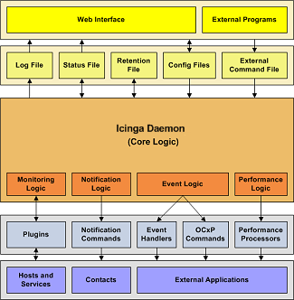

Integrationsüberblick
=====================

Einführung
----------

Einer der Gründe, warum NAME-ICINGA solch eine populäre
Überwachungsapplikation ist, liegt in der Tatsache, dass es einfach in
Ihre vorhandene Infrastruktur integriert werden kann. Es gibt mehrere
Methoden, um NAME-ICINGA mit der Management-Software zu integrieren, die
Sie bereits nutzen und Sie können fast jede Art von neuer oder
angepasster Hardware, Service oder Applikation überwachen, die Sie
haben.

Integrationsstellen
-------------------

Um neue Hardware, Services oder Applikationen zu überwachen, prüfen Sie
die Dokumentationen zu:

-   [Plugins](#plugins)

-   [Plugin API](#pluginapi)

-   [Passive Prüfungen](#passivechecks)

-   [Eventhandler](#eventhandlers)

Um Daten aus externen Applikationen in NAME-ICINGA zu bekommen, prüfen
Sie die Dokumentationen zu:

-   [Passive Prüfungen](#passivechecks)

-   [Externe Befehle](#extcommands)

Um Zustands-, Leistungs- oder Benachrichtigungsinformationen von
NAME-ICINGA an externe Applikationen zu senden, prüfen Sie die
Dokumentationen zu:

-   [Eventhandlers](#eventhandlers)

-   [OCSP](#configmain-ocsp_command) - und
    [OCNAME-HP](#configmain-ochp_command)-Befehlen

-   [Performance-Daten](#perfdata)

-   [Benachrichtigungen](#notifications)

Integrationsbeispiele
---------------------

Wir haben ein paar Beispiele dokumentiert, wie NAME-ICINGA mit externen
Applikationen integriert wird:

-   [TCP-Wrappers](#int-tcpwrappers) (Sicherheitsalarme)

-   [SNMP-Traps](#int-snmptrap) (Arcserve Backup-Job-Status)

-   [mklivestatus](#int-mklivestatus) (Interface von NAME-ICINGA zu
    verschiedenen Addons wie [NAME-NAGVIS]() und [NAME-THRUK]())

Integration
Überblick
