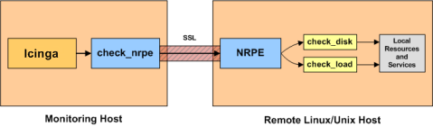

NAME-LINUX/Unix-Rechner überwachen
==================================

Überwachung
Linux/Unix-Rechner überwachen
Monitoring
Linux/Unix-Rechner überwachen
Einführung
----------

Dieses Dokument beschreibt, wie Sie "private" Dienste und Attribute auf
NAME-LINUX/UNIX-Servern überwachen, wie z.B.:

-   CPU-Auslastung

-   Speichernutzung

-   Plattenbelegung

-   angemeldete Benutzer

-   laufende Prozesse

-   etc.

Öffentlich nutzbare Dienste, die von NAME-LINUX-Servern zur Verfügung
gestellt werden (HTTP, FTP, SSH, SMTP, etc.), können einfach mit Hilfe
der Dokumentation [öffentlich zugängliche Dienste
überwachen](#monitoring-publicservices) kontrolliert werden.

 Anmerkung: Diese Anweisungen gehen davon aus,
dass Sie NAME-ICINGA anhand der [Schnellstartanleitung](#quickstart)
installiert haben. Die nachfolgenden Beispiel-Konfigurationseinträge
beziehen sich auf Objekte, die in den Beispiel-Konfigurationsdateien
(*commands.cfg*, *templates.cfg*, etc.) definiert sind. Diese Dateien
werden installiert, wenn Sie der Schnellstartanleitung folgen.

Falls Sie ein Paket installiert haben, dann fehlen die Beispieldateien
möglicherweise. Sie finden den Inhalt [hier](#sample-config) zum
Nachschlagen.

Überblick
---------

[Anmerkung: Dieses Dokument ist noch nicht vollständig. Wir würden
empfehlen, die Dokumentation zum [NAME-NRPE-Addon](#addons-nrpe) zu
lesen, um zu sehen, wie ein entfernter NAME-LINUX/Unix-Server zu
überwachen ist.]

Es gibt verschiedene Wege, Attribute oder entfernte
NAME-LINUX/Unix-Server zu überwachen. Einer benutzt gemeinsame
SSH-Schlüssel und das *check\_by\_ssh*-Plugin auf entfernten Servern.
Diese Methode wird hier nicht behandelt, kann aber zu hoher Last auf
Ihrem Überwachungs-Server führen, wenn Sie hunderte oder tausende von
Services überwachen. Der Overhead durch das Auf- und Abbauen von
SSH-Verbindungen ist der Grund dafür.

Eine andere gebräuchliche Methode der Überwachung von entfernten
NAME-LINUX/Unix-Hosts ist die Nutzung des
[NAME-NRPE-Addons](#addons-nrpe). NAME-NRPE erlaubt Ihnen, Plugins auf
entfernten NAME-LINUX/Unix-Hosts auszuführen. Das ist nützlich, wenn Sie
lokale Ressourcen/Attribute wie z.B. Plattenbelegung, CPU-Auslastung,
Speichernutzung auf einem entfernten Host überwachen wollen.
