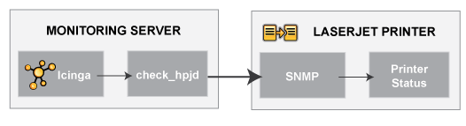

Netzwerk-Drucker überwachen
===========================

Überwachung
Netzwerk-Drucker überwachen
Monitoring
Netzwerk-Drucker überwachen
Einführung
----------

Dieses Dokument beschreibt, wie Sie den Status von Netzwerkdruckern
überwachen können. NAME-HP-Drucker haben interne/externe
JetDirect-Karten/Devices, andere Print-Server (wie der Troy PocketPro
100S oder der Netgear PS101) unterstützen das JetDirect-Protokoll.

Das *check\_hpjd*-Plugin (das Bestandteil der NAME-ICINGA-Distribution
ist), erlaubt Ihnen die Überwachung des Zustands von JetDirect-fähigen
Druckern, auf denen SNMP aktiviert ist. Das Plugin kann die folgenden
Druckerzustände erkennen:

-   Papierstau

-   Kein Papier mehr

-   Drucker Offline

-   Benutzereingriff erforderlich

-   Tonerstand niedrig

-   Speicher unzureichend

-   Klappe offen

-   Ausgabefach voll

-   und weitere...

 Anmerkung: Diese Anweisungen gehen davon aus,
dass Sie NAME-ICINGA anhand der [Schnellstartanleitung](#quickstart)
installiert haben. Die nachfolgenden Beispiel-Konfigurationseinträge
beziehen sich auf Objekte, die in den Beispiel-Konfigurationsdateien
(*commands.cfg*, *templates.cfg*, etc.) definiert sind. Diese Dateien
werden installiert, wenn Sie der Schnellstartanleitung folgen.

Falls Sie ein Paket installiert haben, dann fehlen die Beispieldateien
möglicherweise. Sie finden den Inhalt [hier](#sample-config) zum
Nachschlagen.

Überblick
---------

Die Überwachung des Zustands eines Netzwerkdruckers ist ziemlich
einfach. Bei JetDirect-fähigen Druckern ist normalerweise SNMP
aktiviert, so dass NAME-ICINGA ihren Zustand mit Hilfe des
*check\_hpjd*-Plugins überwachen kann.

> **Important**
>
> Das *check\_hpjd*-Plugin wird nur dann kompiliert und installiert,
> wenn Sie die net-snmp- und net-snmp-utils-Pakete auf Ihrem System
> haben. Stellen Sie sicher, dass das Plugin im
> *URL-ICINGA-LIBEXEC*-Verzeichnis existiert, bevor Sie fortfahren.
> Falls nicht, installieren Sie net-snmp und net-snmp-utils und
> kompilieren und installieren Sie die NAME-ICINGA-Plugins erneut,
> nachdem Sie "make clean" im Source-Verzeichnis ausgeführt haben.
> Einzelheiten finden Sie in der
> [Schnellstartanleitung](#quickstart-icinga).

Schritte
--------

Es gibt einige Schritte, die Sie durchführen müssen, um einen neuen
Netzwerkdrucker zu überwachen. Das sind:

1.  erfüllen Sie einmalige Voraussetzungen

2.  erstellen Sie neue Host- und Service-Definitionen zur Überwachung
    des Druckers

3.  starten Sie den NAME-ICINGA-Daemon neu

Was bereits für Sie vorbereitet wurde
-------------------------------------

Um Ihnen das Leben ein wenig zu erleichtern, wurden bereits ein paar
Konfigurationsaufgaben für Sie erledigt:

-   Eine *check\_hpjd*-Befehlsdefinition ist in der *commands.cfg*-Datei
    vorhanden. Das erlaubt Ihnen die Nutzung des *check\_hpjd*-Plugins
    zur Überwachung von Netzwerkdruckern.

-   Eine Host-Vorlage für Drucker (namens *generic-printer*) wurde
    bereits in der *templates.cfg*-Datei erstellt. Das erlaubt es Ihnen,
    Drucker-Host-Definitionen auf einfache Weise hinzuzufügen.

Die o.g. Konfigurationsdateien finden Sie im
*URL-ICINGA-BASE/etc/objects/*-Verzeichnis. Sie können diese und andere
Definitionen anpassen, damit Sie Ihren Anforderungen besser entsprechen.
Allerdings empfehlen wir Ihnen, noch ein wenig damit zu warten, bis Sie
besser mit der Konfiguration von NAME-ICINGA vertraut sind. Für den
Moment folgen Sie einfach den nachfolgenden Anweisungen und Sie werden
im Nu Ihre Netzwerkdrucker überwachen.

Voraussetzungen
---------------

Wenn Sie NAME-ICINGA das erste Mal konfigurieren, um einen
Netzwerkdrucker zu überwachen, dann müssen Sie ein paar zusätzliche
Dinge tun. Denken Sie daran, dass Sie dies nur für den \*ersten\*
Netzwerkdrucker machen müssen, den Sie überwachen wollen.

Editieren Sie die Hauptkonfigurationsdatei.

     vi URL-ICINGA-BASE/etc/icinga.cfg

Entfernen Sie das führende Hash-(\#)-Zeichen der folgenden Zeile in der
Hauptkonfigurationsdatei:

     #cfg_file=URL-ICINGA-BASE/etc/objects/printer.cfg

Speichern Sie die Datei und verlassen den Editor.

Was haben Sie gerade getan? Sie haben NAME-ICINGA mitgeteilt, in der
*URL-ICINGA-BASE/etc/objects/printer.cfg*-Datei nach weiteren
Objektdefinitionen zu schauen. Dort werden Sie Drucker-Host- und
Service-Definitionen einfügen. Diese Konfigurationsdatei enthält bereits
einige Beispiel-Host-, Hostgroup- und Service-Definitionen. Für den
\*ersten\* Netzwerkdrucker, den Sie überwachen, passen Sie einfach die
Beispiel-Host- und Service-Definitionen an, statt neue zu erstellen.

NAME-ICINGA konfigurieren
-------------------------

Sie müssen einige [Objektdefinitionen anlegen](#objectdefinitions), um
einen neuen Drucker zu überwachen.

Öffnen Sie die *printer.cfg*-Datei.

     vi URL-ICINGA-BASE/etc/objects/printer.cfg

Fügen Sie eine neue [Host](#objectdefinitions-host)-Definition für den
Netzwerkdrucker hinzu, den Sie überwachen möchten. Wenn dies der
\*erste\* Netzwerkdrucker ist, den Sie überwachen, dann können Sie
einfach die Beispiel-Definitionen in der *printer.cfg*-Datei anpassen.
Ändern Sie die *host\_name*-, *alias*- und *address*-Felder auf die
entsprechenden Werte des Netzwerkdruckers.

     define host{
            use             generic-printer   ; Inherit default values from a template
            host_name       hplj2605dn        ; The name we're giving to this printer
            alias           NAME-HP LaserJet 2605dn      ; A longer name associated with the printer
            address         192.168.1.30      ; IP address of the printer
            hostgroups      allhosts          ; Host groups this printer is associated with
            }

Nun können Sie (in der gleichen Konfigurationsdatei) einige
Service-Definitionen hinzufügen, um NAME-ICINGA mitzuteilen, welche
Dinge auf dem Drucker zu überwachen sind. Wenn dies der \*erste\*
Drucker ist, den Sie überwachen, dann können Sie einfach die
Beispiel-Definitionen in der *printer.cfg*-Datei anpassen.

 Anmerkung: Ersetzen Sie "*hplj2605dn*" in der
folgenden Beispiel-Definition durch den Namen, den Sie in der
*host\_name*-Direktive der Host-Definition angegeben haben, die Sie
gerade hinzugefügt haben.

Fügen Sie die folgende Service-Definition hinzu, um den Zustand des
Druckers zu prüfen. Der Service benutzt das *check\_hpjd*-Plugin, um den
Drucker alle zehn Minuten zu prüfen. Der Wert für die SNMP-Community
lautet in diesem Beispiel "public".

     define service{
            use                   generic-service   ; Inherit values from a template
            host_name             hplj2605dn        ; The name of the host the service is associated with
            service_description   Printer Status    ; The service description
            check_command         check_hpjd!-C public    ; The command used to monitor the service
            check_interval        10                ; Check the service every 10 minutes under normal conditions
            retry_interval        1                 ; Re-check every minute until its final/hard state is determined
            }

Fügen Sie die folgende Service-Definition hinzu, um alle zehn Minuten
einen Ping an den Drucker zu senden. Das ist nützlich, um die generelle
Netzwerkverbindung und Werte für RTA und Paketverlust zu überwachen.

     define service{
            use                     generic-service
            host_name               hplj2605dn
            service_description     PING
            check_command           check_ping!3000.0,80%!5000.0,100%
            check_interval          10
            retry_interval          1
            }

Speichern Sie die Datei.

NAME-ICINGA neu starten
-----------------------

Sobald Sie die neuen Host- und Service-Definitionen in der
*printer.cfg*-Datei hinzugefügt haben, sind Sie bereit, mit der
Überwachung des Druckers zu beginnen. Um dies zu tun, müssen Sie [die
Konfigurationsdateien überprüfen](#verifyconfig) und [NAME-ICINGA neu
starten](#startstop).

Wenn die Überprüfung irgendwelche Fehler enthält, dann müssen Sie diese
beheben, bevor Sie fortfahren. Stellen Sie sicher, dass Sie NAME-ICINGA
nicht (erneut) starten, bevor die Überprüfung ohne Fehler durchgelaufen
ist!
