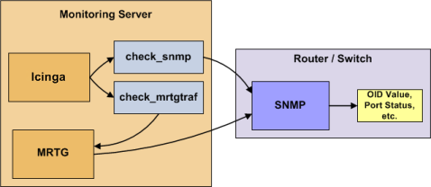

Router und Switches überwachen
==============================

Überwachung
Router und Switches überwachen
Monitoring
Router und Switches überwachen
Einführung
----------

Dieses Dokument beschreibt, wie Sie den Zustand von Netzwerk-Switches
und Routern überwachen können. Einige preiswerte "unmanaged" Switches
und Router haben keine IP-Adresse und sind in Ihrem Netzwerk nicht
sichtbar, so dass es keinen Weg gibt, um sie zu überwachen. Teurere
Switches und Router haben eigene Adressen und können durch Ping
überwacht oder über SNMP nach Statusinformationen abgefragt werden.

Ich werde beschreiben, wie Sie die folgenden Dinge auf "managed"
Switches, Hubs und Routern überwachen können:

-   Paketverlust, durchschnittliche Umlaufzeiten (round trip average,
    RTA)

-   SNMP-Statusinformationen

-   Bandbreite / Übertragungsrate (traffic rate)

 Anmerkung: Diese Anweisungen gehen davon aus,
dass Sie NAME-ICINGA anhand der [Schnellstartanleitung](#quickstart)
installiert haben. Die nachfolgenden Beispiel-Konfigurationseinträge
beziehen sich auf Objekte, die in den Beispiel-Konfigurationsdateien
(*commands.cfg*, *templates.cfg*, etc.) definiert sind. Diese Dateien
werden installiert, wenn Sie der Schnellstartanleitung folgen.

Falls Sie ein Paket installiert haben, dann fehlen die Beispieldateien
möglicherweise. Sie finden den Inhalt [hier](#sample-config) zum
Nachschlagen.

Überblick
---------

Die Überwachung von Switches und Routern kann entweder einfach oder auch
aufwändiger sein - abhängig davon, welches Equipment Sie haben und was
Sie überwachen wollen. Da es sich um kritische Infrastrukturkomponenten
handelt, werden Sie diese ohne Zweifel mindestens in grundlegender Art
und Weise überwachen.

Switches und Router können einfach per "Ping" überwacht werden, um
Paketverlust, RTA usw. zu ermitteln. Wenn Ihr Switch SNMP unterstützt,
können Sie mit dem *check\_snmp*-Plugin z.B. den Port-Status und (wenn
Sie MRTG benutzen) mit dem *check\_mrtgtraf*-Plugin die Bandbreite
überwachen.

Das *check\_snmp*-Plugin wird nur dann kompiliert und installiert, wenn
Sie die net-snmp- und net-snmp-utils-Pakete auf Ihrem System haben.
Stellen Sie sicher, dass das Plugin im *URL-ICINGA-LIBEXEC*-Verzeichnis
existiert, bevor Sie fortfahren. Falls nicht, installieren Sie net-snmp
und net-snmp-utils und kompilieren und installieren Sie die
NAME-ICINGA-Plugins erneut.

Schritte
--------

Es gibt einige Schritte, die Sie durchführen müssen, um einen neuen
Router oder Switch zu überwachen. Das sind:

1.  erfüllen Sie einmalige Voraussetzungen

2.  erstellen Sie neue Host- und Service-Definitionen zur Überwachung
    des Geräts

3.  starten Sie den NAME-ICINGA-Daemon neu

Was bereits für Sie vorbereitet wurde
-------------------------------------

Um Ihnen das Leben ein wenig zu erleichtern, wurden bereits ein paar
Konfigurationsaufgaben für Sie erledigt:

-   Zwei Befehlsdefinitionen (*check\_snmp* und
    *check\_local\_mrtgtraf*) sind bereits in der *commands.cfg*-Datei
    vorhanden. Das erlaubt Ihnen die Nutzung des *check\_snmp*- bzw.
    *check\_mrtgtraf*-Plugins zur Überwachung von Routern und Switches.

-   Eine Host-Vorlage für Switches (namens *generic-switch*) wurde
    bereits in der *templates.cfg*-Datei erstellt. Das erlaubt es Ihnen,
    Router/Switch-Host-Definitionen auf einfache Weise hinzuzufügen.

Die o.g. Konfigurationsdateien finden Sie im
*URL-ICINGA-BASE/etc/objects/*-Verzeichnis. Sie können diese und andere
Definitionen anpassen, damit Sie Ihren Anforderungen besser entsprechen.
Allerdings empfehlen wir Ihnen, noch ein wenig damit zu warten, bis Sie
besser mit der Konfiguration von NAME-ICINGA vertraut sind. Für den
Moment folgen Sie einfach den nachfolgenden Anweisungen und Sie werden
im Nu Ihre Router/Switches überwachen.

Voraussetzungen
---------------

Wenn Sie NAME-ICINGA das erste Mal konfigurieren, um einen
Netzwerk-Switch zu überwachen, dann müssen Sie ein paar zusätzliche
Dinge tun. Denken Sie daran, dass Sie dies nur für den \*ersten\* Switch
machen müssen, den Sie überwachen wollen.

Editieren Sie die Hauptkonfigurationsdatei.

    #> vi URL-ICINGA-BASE/etc/icinga.cfg

Entfernen Sie das führende Hash-(\#)-Zeichen der folgenden Zeile in der
Hauptkonfigurationsdatei:

     #cfg_file=URL-ICINGA-BASE/etc/objects/switch.cfg

Speichern Sie die Datei und verlassen den Editor.

Was haben Sie gerade getan? Sie haben NAME-ICINGA mitgeteilt, in der
*URL-ICINGA-BASE/etc/objects/switch.cfg*-Datei nach weiteren
Objektdefinitionen zu schauen. Dort werden Sie Host- und
Service-Definitionen für Router- und Switches einfügen. Diese
Konfigurationsdatei enthält bereits einige Beispiel-Host-, Hostgroup-
und Service-Definitionen. Für den \*ersten\* Router/Switch, den Sie
überwachen, passen Sie einfach die Beispiel-Host- und
Service-Definitionen an, statt neue zu erstellen.

NAME-ICINGA konfigurieren
-------------------------

Sie müssen einige [Objektdefinitionen anlegen](#objectdefinitions), um
einen neuen Router/Switch zu überwachen.

Öffnen Sie die *switch.cfg*-Datei.

    #> vi URL-ICINGA-BASE/etc/objects/switch.cfg

Fügen Sie eine neue [Host](#objectdefinitions-host)-Definition für den
Switch hinzu, den Sie überwachen möchten. Wenn dies der \*erste\* Switch
ist, den Sie überwachen, dann können Sie einfach die
Beispiel-Definitionen in der *switch.cfg*-Datei anpassen. Ändern Sie die
*host\_name*-, *alias*- und *address*-Felder auf die entsprechenden
Werte des Switches.

     define host{
            use             generic-switch          ; Inherit default values from a template
            host_name       linksys-srw224p         ; The name we're giving to this switch
            alias           Linksys SRW224P Switch  ; A longer name associated with the switch
            address         192.168.1.253           ; IP address of the switch
            hostgroups      allhosts,switches       ; Host groups this switch is associated with
            }

**Services überwachen**

Nun können Sie einige Service-Definitionen hinzufügen (in der gleichen
Konfigurationsdatei), um NAME-ICINGA mitzuteilen, welche Dinge auf dem
Switch zu überwachen sind. Wenn dies der \*erste\* Switch ist, den Sie
überwachen, dann können Sie einfach die Beispiel-Definitionen in der
*switch.cfg*-Datei anpassen.

 Anmerkung: Ersetzen Sie "*linksys-srw224p*" in
der folgenden Beispiel-Definition durch den Namen, den Sie in der
*host\_name*-Direktive der Host-Definition angegeben haben, die Sie
gerade hinzugefügt haben.

-   **Paketverlust und RTA überwachen**

    Fügen Sie die folgende Service-Definition hinzu, um unter normalen
    Bedingungen alle fünf Minuten Paketverlust und Round-Trip-Average
    zwischen dem NAME-ICINGA-Host und dem Switch zu überwachen.

         define service{
                use                     generic-service ; Inherit values from a template
                host_name               linksys-srw224p ; The name of the host the service is associated with
                service_description     PING            ; The service description
                check_command           check_ping!200.0,20%!600.0,60%  ; The command used to monitor the service
                check_interval          5               ; Check the service every 5 minutes under normal conditions
                retry_interval          1               ; Re-check every minute until its final/hard state is determined
                }

    Dieser Service wird:

    -   CRITICAL, falls der Round-Trip-Average (RTA) größer als 600
        Millisekunden oder der Paketverlust 60% oder mehr ist

    -   WARNING, falls der Round-Trip-Average (RTA) größer als 200
        Millisekunden oder der Paketverlust 20% oder mehr ist

    -   OK, falls der Round-Trip-Average (RTA) kleiner als 200
        Millisekunden oder der Paketverlust kleiner als 20% ist

-   **SNMP-Statusinformationen überwachen**

    Wenn Ihr Switch oder Router SNMP unterstützt, können Sie eine Menge
    an Informationen mit dem *check\_snmp*-Plugin überwachen. Wenn
    nicht, dann überspringen Sie diesen Abschnitt.

    Fügen Sie die folgende Service-Definition hinzu, um die Laufzeit des
    Switches zu überwachen.

         define service{
                use                     generic-service ; Inherit values from a template
                host_name               linksys-srw224p
                service_description     Uptime  
                check_command           check_snmp!-C public -o sysUpTime.0
                }

    In der *check\_command*-Direktive der obigen Service-Definition sagt
    "-C public", dass der zu benutzende SNMP-Community-Name "public"
    lautet und "-o sysUpTime.0" gibt an, welche OID überprüft werden
    soll.

    Wenn Sie sicherstellen wollen, dass sich ein bestimmter Port/ein
    bestimmtes Interface des Switches in einem "UP"-Zustand befindet,
    dann sollten Sie eine Service-Definition hinzufügen:

         define service{
                use                     generic-service ; Inherit values from a template
                host_name               linksys-srw224p
                service_description     Port 1 Link Status
                check_command           check_snmp!-C public -o ifOperStatus.1 -r 1 -m RFC1213-MIB
                }

    In dem obigen Beispiel bezieht sich "-o ifOperStatus.1" auf die OID
    des Betriebszustands von Port 1 des Switches. Die "-r 1"-Option
    teilt dem *check\_snmp*-Plugin mit, einen OK-Zustand
    zurückzuliefern, wenn "1" im SNMP-Ergebnis gefunden wird (1 deutet
    einen "UP"-Zustand des Ports an) und CRITICAL, wenn es nicht
    gefunden wird. "-m RFC1213-MIB" ist optional und teilt dem
    *check\_snmp*-Plugin mit, nur die "RFC1213-MIB" zu laden statt jeder
    einzelnen MIB, die auf Ihrem System installiert ist, was die Dinge
    beschleunigen kann.

    Das war's mit dem SNMP-Überwachungsbeispiel. Es gibt eine Million
    Dinge, die mit SNMP überwacht werden können, also liegt es an Ihnen
    zu entscheiden, was Sie brauchen und was Sie überwachen wollen. Viel
    Erfolg!

     Hinweis: Normalerweise können Sie mit dem
    folgenden Befehl die OIDs eines Switches (oder eines anderen
    SNMP-fähigen Gerätes) herausfinden, die überwacht werden können
    (ersetzen Sie *192.168.1.253* durch die IP-Adresse des Switches):
    *snmpwalk -v1 -c public 192.168.1.253 -m ALL .1*

-   **Bandbreite / Übertragungsrate überwachen**

    Wenn Sie die Bandbreitennutzung Ihres Switches oder Routers mit
    [MRTG](http://oss.oetiker.ch/mrtg/) überwachen, dann können Sie
    durch NAME-ICINGA alarmiert werden, wenn die Übertragungsraten
    Schwellwerte überschreiten, die Sie angeben. Mit dem
    *check\_mrtgtraf*-Plugin (das in der NAME-ICINGA-Plugin-Distribution
    enthalten ist) können Sie das tun.

    Sie müssen dem *check\_mrtgtraf*-Plugin mitteilen, in welcher
    Log-Datei die MRTG-Daten gespeichert sind, zusammen mit
    Schwellwerten, usw. In unserem Beispiel überwachen wir einen Port
    eines Linksys-Switches. Die MRTG-Log-Datei ist abgelegt unter
    */var/lib/mrtg/192.168.1.253\_1.log*. Hier ist die
    Service-Definition, die wir benutze, um die Bandbreitendaten zu
    überwachen, die in der Log-Datei gespeichert sind...

         define service{
                use                     generic-service ; Inherit values from a template
                host_name               linksys-srw224p
                service_description     Port 1 Bandwidth Usage
                check_command           check_local_mrtgtraf!/var/lib/mrtg/192.168.1.253_1.log!AVG!1000000,2000000!5000000,5000000!10
                }

    In dem obigen Beispiel teilt "/var/lib/mrtg/192.168.1.253\_1.log" im
    *check\_local\_mrtgtraf*-Befehl dem Plugin mit, welche
    MRTG-Log-Datei auszulesen ist. Die "AVG"-Option gibt an, dass
    Durchschnitts-Bandbreitenstatistiken verwendet werden sollen.
    "1000000,2000000" sind die Schwellwerte (in Bytes) für Warnungen bei
    eingehenden Übertragungsraten. "5000000,5000000" sind die kritischen
    Schwellwerte (in Bytes) bei ausgehenden Übertragungsraten. "10" gibt
    an, dass das Plugin einen CRITICAL-Zustand zurückliefern soll, wenn
    die MRTG-Log-Datei älter als zehn Minuten ist (sie sollte alle fünf
    Minuten aktualisiert werden).

Speichern Sie die Datei.

NAME-ICINGA neu starten
-----------------------

Sobald Sie die neuen Host- und Service-Definitionen in der
*switch.cfg*-Datei hinzugefügt haben, sind Sie bereit, mit der
Überwachung des Routers/Switches zu beginnen. Um dies zu tun, müssen Sie
[die Konfigurationsdateien überprüfen](#verifyconfig) und [NAME-ICINGA
neu starten](#startstop).

Wenn die Überprüfung irgendwelche Fehler enthält, dann müssen Sie diese
beheben, bevor Sie fortfahren. Stellen Sie sicher, dass Sie NAME-ICINGA
nicht (erneut) starten, bevor die Überprüfung ohne Fehler durchgelaufen
ist!
