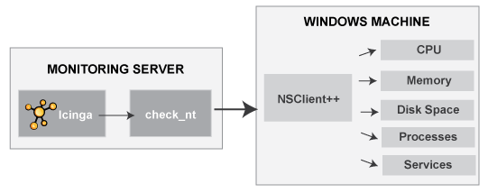
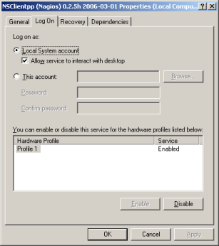

Windows-Maschinen überwachen
============================

Überwachung
Windows-Rechner überwachen
Monitoring
Windows-Rechner überwachen
NSClient++
Windows-Rechner überwachen
Einführung
----------

Dieses Dokument beschreibt, wie Sie "private" Dienste und Attribute von
Windows-Rechnern überwachen können, wie z.B.:

-   Speicherbelegung

-   CPU-Auslastung

-   Plattenbelegung

-   Zustände von Diensten

-   laufende Prozesse

-   etc.

Öffentlich nutzbare Dienste, die von Windows-Rechnern zur Verfügung
gestellt werden (HTTP, FTP, POP3, etc.), können einfach mit Hilfe der
Dokumentation [öffentlich zugängliche Dienste
überwachen](#monitoring-publicservices) kontrolliert werden.

 Anmerkung: Diese Anweisungen gehen davon aus,
dass Sie NAME-ICINGA anhand der [Schnellstartanleitung](#quickstart)
installiert haben. Die nachfolgenden Beispiel-Konfigurationseinträge
beziehen sich auf Objekte, die in den Beispiel-Konfigurationsdateien
(*commands.cfg*, *templates.cfg*, etc.) definiert sind. Diese Dateien
werden installiert, wenn Sie der Schnellstartanleitung folgen.

Falls Sie ein Paket installiert haben, dann fehlen die Beispieldateien
möglicherweise. Sie finden den Inhalt [hier](#sample-config) zum
Nachschlagen.

Überblick
---------

Die Überwachung von privaten Diensten oder Attributen eines
Windows-Rechners erfordert die Installation eines Agenten. Dieser Agent
dient als ein Bindeglied zwischen der Überwachung und dem eigentlichen
Dienst oder Attribut auf dem Windows-Rechner. Ohne diesen Agenten wäre
NAME-ICINGA nicht in der Lage, private Dienste oder Attribute auf dem
Window-Rechner zu überwachen.

Für dieses Beispiel installieren wir das
[NAME-NSCLIENT](http://sourceforge.net/projects/nscplus)-Addon auf dem
Windows-Rechner und werden das *check\_nt*-Plugin zur Kommunikation mit
dem NAME-NSCLIENT-Addon benutzen. Das *check\_nt*-Plugin sollte bereits
auf dem NAME-ICINGA-Server installiert sein, wenn Sie der
Schnellstartanleitung gefolgt sind.

Andere Windows-Agenten (wie
[NC\_Net](http://sourceforge.net/projects/nc-net)) können statt
NAME-NSCLIENT genutzt werden, wenn Sie möchten - vorausgesetzt, Sie
passen die Befehls- und Service-Definitionen usw. entsprechend an. Aus
Gründen der Einfachheit werden wir nur das NAME-NSCLIENT-Addon in diesen
Anweisungen berücksichtigen.

Schritte
--------

Es gibt einige Schritte, die Sie durchführen müssen, um einen neuen
Windows-Rechner zu überwachen. Das sind:

1.  erfüllen Sie einmalige Voraussetzungen

2.  installieren Sie einen Überwachungsagenten auf dem Windows-Rechner

3.  erstellen Sie neue Host- und Service-Definitione zur Überwachung des
    Windows-Rechners

4.  starten Sie den NAME-ICINGA-Daemon neu

Was bereits für Sie vorbereitet wurde
-------------------------------------

Um Ihnen das Leben ein wenig zu erleichtern, wurden bereits ein paar
Konfigurationsaufgaben für Sie erledigt:

-   Eine *check\_nt*-Befehlsdefinition ist in der *commands.cfg*-Datei
    vorhanden. Das erlaubt Ihnen die Nutzung des *check\_nt*-Plugins zur
    Überwachung von Windows-Diensten.

-   Eine Host-Vorlage für Windows-Server (namens *windows-server*) wurde
    bereits in der *templates.cfg*-Datei erstellt. Das erlaubt es Ihnen,
    Windows-Host-Definitionen auf einfache Weise hinzuzufügen.

Die o.g. Konfigurationsdateien finden Sie im
*URL-ICINGA-BASE/etc/objects/*-Verzeichnis. Sie können diese und andere
Definitionen anpassen, damit Sie Ihren Anforderungen besser entsprechen.
Allerdings empfehlen wir Ihnen, noch ein wenig damit zu warten, bis Sie
besser mit der Konfiguration von NAME-ICINGA vertraut sind. Für den
Moment folgen Sie einfach den nachfolgenden Anweisungen und Sie werden
im Nu Ihre Windows-Rechner überwachen.

Voraussetzungen
---------------

Wenn Sie NAME-ICINGA das erste Mal konfigurieren, um einen
Windows-Rechner zu überwachen, dann müssen Sie ein paar zusätzliche
Dinge tun. Denken Sie daran, dass Sie dies nur für den \*ersten\*
Windows-Rechner machen müssen, den Sie überwachen wollen.

Editieren Sie die Hauptkonfigurationsdatei.

    #> vi URL-ICINGA-BASE/etc/icinga.cfg

Entfernen Sie das führende Hash-(\#)-Zeichen der folgenden Zeile in der
Hauptkonfigurationsdatei:

    #cfg_file=URL-ICINGA-BASE/etc/objects/windows.cfg

Speichern Sie die Datei und verlassen den Editor.

Was haben Sie gerade getan? Sie haben NAME-ICINGA mitgeteilt, in der
*URL-ICINGA-BASE/etc/objects/windows.cfg*-Datei nach weiteren
Objektdefinitionen zu schauen. Dort werden Sie Host- und
Service-Definitionen für Windows-Rechner einfügen. Diese
Konfigurationsdatei enthält bereits einige Beispiel-Host-, Hostgroup-
und Service-Definitionen. Für den \*ersten\* Windows-Rechner, den Sie
überwachen, passen Sie einfach die Beispiel-Host- und
Service-Definitionen an, statt neue zu erstellen.

Installation des Windows-Agenten
--------------------------------

Bevor Sie mit der Überwachung von privaten Diensten und Attributen von
Windows-Rechnern beginnen, müssen Sie einen Agenten auf diesen Rechnern
installieren. Wir empfehlen das NAME-NSCLIENT-Addon zu nutzen, das Sie
unter [URL-SF-PROJECTSnscplus](http://sourceforge.net/projects/nscplus)
finden. Diese Anweisungen werden Sie durch eine Basisinstallation des
NAME-NSCLIENT-Addons und die NAME-ICINGA-Konfiguration für die
Überwachung des Windows-Rechners führen.

​1. Laden Sie die letzte stabile Version des NAME-NSCLIENT-Addons von
[URL-SF-PROJECTSnscplus](http://sourceforge.net/projects/nscplus)

​2. Entpacken Sie die NAME-NSCLIENT-Dateien in ein neues
C:\\NAME-NSCLIENT-Verzeichnis

​3. Gehen Sie auf die Kommandozeile und wechseln Sie in das
C:\\NAME-NSCLIENT-Verzeichnis

​4. Registrieren Sie den NAME-NSCLIENT-Dienst mit dem folgenden Befehl:

     nsclient++ /install

​5. Öffnen Sie die Dienste-Applikation und stellen Sie sicher, dass der
NAME-NSCLIENT-Dienst mit dem Desktop kommunizieren darf (Reiter
"Anmelden", Häkchen bei "Datenaustausch zwischen Dienst und Desktop
zulassen" gesetzt). Setzen Sie ggf. das Häkchen.

​6. Editieren Sie die NSC.INI-Datei (im C:\\NAME-NSCLIENT-Verzeichnis)
und machen Sie folgende Änderungen:

-   entfernen Sie die Kommentarzeichen (;) im [modules]-Abschnitt, außer
    für CheckWMI.dll und RemoteConfiguration.dll

-   definieren Sie optional ein Passwort für Clients, indem Sie die
    'password'-Option im [Settings]-Abschnitt setzen.

-   entfernen Sie das Kommentarzeichen (;) vor der
    'allowed\_hosts'-Option im [Settings]-Abschnitt. Fügen Sie die
    IP-Adresse des NAME-ICINGA-Servers ein, mit ip.add.ress/Bits einen
    Bereich oder lassen Sie diese Angabe leer, so dass sich alle Hosts
    verbinden können.

-   entfernen Sie ggf. das Kommentarzeichen vor der 'port'-Option im
    [NSClient]-Abschnitt und setzen Sie den Wert auf '12489' (Standard).

​7. Starten Sie den NAME-NSCLIENT-Dienst mit dem folgenden Befehl:

     nsclient++ /start

​8. Geschafft! Der Windows-Rechner kann nun der
NAME-ICINGA-Überwachungskonfiguration hinzugefügt werden...

NAME-ICINGA konfigurieren
-------------------------

Nun ist es Zeit, einige [Objektdefinitionen](#objectdefinitions) in
Ihren NAME-ICINGA-Konfigurationsdateien anzulegen, um den neuen
Windows-Rechner zu überwachen.

Editieren Sie die *windows.cfg*-Datei.

    #> vi URL-ICINGA-BASE/etc/objects/windows.cfg

Fügen Sie eine neue [Host](#objectdefinitions-host)-Definition für den
Windows-Rechner hinzu, den Sie überwachen möchten. Wenn dies der
\*erste\* Windows-Rechner ist, den Sie überwachen, dann können Sie
einfach die Beispiel-Definitionen in der *windows.cfg*-Datei anpassen.
Ändern Sie die *host\_name*-, *alias*- und *address*-Felder auf die
entsprechenden Werte des Windows-Rechners.

     define host{
            ; Standard-Werte von einer Windows-Server-Vorlage erben
            use             windows-server  ; diese Zeile nicht löschen!
            host_name       winserver
            alias           My Windows Server
            address         192.168.1.2
            }

Gut. Nun können Sie (in der gleichen Konfigurationsdatei) einige
Service-Definitionen hinzufügen, um NAME-ICINGA mitzuteilen, welche
Dinge auf dem Windows-Server zu überwachen sind. Wenn dies der \*erste\*
Windows-Rechner ist, den Sie überwachen, dann können Sie einfach die
Beispiel-Definitionen in der *windows.cfg*-Datei anpassen.

> **Note**
>
> Ersetzen Sie "*winserver*" in den folgenden Beispiel-Definitionen
> durch den Namen, den Sie in der *host\_name*-Direktive der
> Host-Definitionen angegeben haben, die Sie gerade hinzugefügt haben.

Fügen Sie die folgende Service-Definition hinzu, um die Version des
NAME-NSCLIENT-Addons zu überwachen, das auf dem Windows-Rechner läuft.
Dies ist nützlich, wenn Sie Ihre Windows-Server mit einer neueren
Version des Addons aktualisieren möchten, weil Sie sehen können, welche
Windows-Rechner noch auf die neueste Version des NAME-NSCLIENT-Addon
aktualisiert werden muss.

     define service{
            use                     generic-service
            host_name               winserver
            service_description     NAME-NSCLIENT Version
            check_command           check_nt!CLIENTVERSION
            }

Fügen Sie die folgende Service-Definition hinzu, um die Laufzeit des
Windows-Servers zu überwachen.

     define service{
            use                     generic-service
            host_name               winserver
            service_description     Uptime
            check_command           check_nt!UPTIME
            }

Fügen Sie die folgende Service-Definition hinzu, um die CPU-Belastung
des Windows-Servers zu überwachen und einen CRITICAL-Alarm zu erzeugen,
wenn die 5-Minuten-Belastung mindestens 90% beträgt oder einen
WARNING-Alarm, wenn die 5-Minuten-Belastung mindestens 80% beträgt.

     define service{
            use                     generic-service
            host_name               winserver
            service_description     CPU Load
            check_command           check_nt!CPULOAD!-l 5,80,90
            }

Fügen Sie die folgende Service-Definition hinzu, um die Speicherbelegung
des Windows-Servers zu überwachen und einen CRITICAL-Alarm zu erzeugen,
wenn die Belegung mindestens 90% beträgt oder einen WARNING-Alarm, wenn
die Belegung mindestens 80% beträgt.

     define service{
            use                     generic-service
            host_name               winserver
            service_description     Memory Usage
            check_command           check_nt!MEMUSE!-w 80 -c 90
            }

Fügen Sie die folgende Service-Definition hinzu, um die Plattenbelegung
von Laufwerk C: des Windows-Servers zu überwachen und einen
CRITICAL-Alarm zu erzeugen, wenn die Belegung mindestens 90% beträgt
oder einen WARNING-Alarm, wenn die Belegung mindestens 80% beträgt.

     define service{
            use                     generic-service
            host_name               winserver
            service_description     C:\ Drive Space
            check_command           check_nt!USEDDISKSPACE!-l c -w 80 -c 90
            }

Fügen Sie die folgende Service-Definition hinzu, um den W3SVC-Dienst des
Windows-Servers zu überwachen und einen CRITICAL-Alarm zu erzeugen, wenn
der Dienst gestoppt ist.

     define service{
            use                     generic-service
            host_name               winserver
            service_description     W3SVC
            check_command           check_nt!SERVICESTATE!-d SHOWALL -l W3SVC
            }

Fügen Sie die folgende Service-Definition hinzu, um den
Explorer.exe-Prozess des Windows-Servers zu überwachen und einen
CRITICAL-Alarm zu erzeugen, wenn der Prozess nicht läuft.

     define service{
            use                     generic-service
            host_name               winserver
            service_description     Explorer
            check_command           check_nt!PROCSTATE!-d SHOWALL -l Explorer.exe
            }

> **Note**
>
> Nun ja. Eigentlich ist es ziemlich unsinnig, zu überwachen, ob der
> Explorer läuft. Allerdings läßt sich auf diese Weise sehr einfach
> prüfen, ob alles wie gewünscht funktioniert ;-)

Das war es vorerst. Sie haben einige grundlegende Dienste hinzugefügt,
die auf dem Windows-Rechner überwacht werden sollen. Speichern Sie die
Konfigurationsdatei.

Passwortschutz
--------------

Wenn Sie ein Passwort in der NAME-NSCLIENT-Konfigurationsdatei auf dem
Windows-Rechner angegeben haben, dann müssen Sie die
*check\_nt*-Befehlsdefinition anpassen, damit sie das Passwort enthält.
Öffnen Sie die *commands.cfg*-Datei.

     #> vi URL-ICINGA-BASE/etc/objects/commands.cfg

Ändern Sie die Definition des *check\_nt*-Befehls, damit sie das "-s
\<PASSWORD\>"-Argument enthält (wobei PASSWORD das Passwort ist, das Sie
auf dem Windows-Rechner angegeben haben):

     define command{
            command_name    check_nt
            command_line    $USER1$/check_nt -H $HOSTADDRESS$ -p 12489 -s PASSWORD -v $ARG1$ $ARG2$
            }

Speichern Sie die Datei

NAME-ICINGA neu starten
-----------------------

Sie sind fertig mit der Anpassung der NAME-ICINGA-Konfiguration, so dass
Sie nun [die Konfigurationsdateien überprüfen](#verifyconfig) und
[NAME-ICINGA neu starten](#startstop) müssen.

Wenn die Überprüfung irgendwelche Fehler enthält, dann müssen Sie diese
beheben, bevor Sie fortfahren. Stellen Sie sicher, dass Sie NAME-ICINGA
nicht (erneut) starten, bevor die Überprüfung ohne Fehler durchgelaufen
ist!

Troubleshooting
---------------

Manchmal funktioniert es nicht. Der einfachste Weg ist es, das Plugin
als NAME-ICINGA-Benutzer auf der Kommandozeile auszuführen:

     $> /usr/local/icinga/libexec/check_nt -H <ip address> -p <port> -s <password> -v UPTIME

\<ip address\> ist die Adresse des Windows-Rechners, \<port\> und
\<password\> die Werte aus `nsc.ini`. Bitte beachten Sie, dass ein
leeres Passwort ggf. als "" (zwei Anführungszeichen) anzugeben ist. Das
Ergebnis könnte eins der folgenden sein:

-   CRITICAL: Socket timeout after 10 seconds

    -   Eine Firewall blockiert auf dem Windows-Rechner, auf dem
        NAME-ICINGA-Server oder dazwischen.

    -   Der NSClient++-Dienst läuft nicht

    -   Der angegebene Port ist falsch

-   could not fetch information from server

    -   Der angegebene Port ist falsch (ältere NSClient-Versionen)

-   NSCLIENT: wrong password

    -   Die Lösung bleibt dem Leser überlassen

