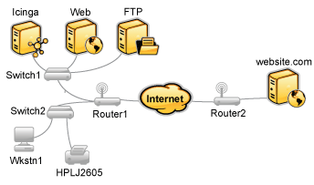
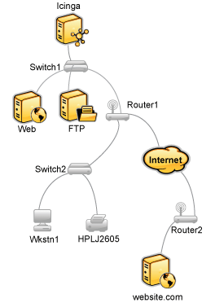
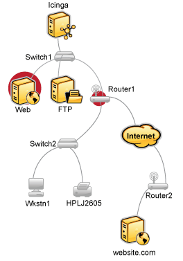
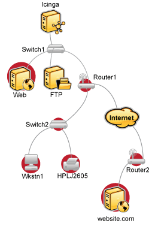

Ermitteln des Zustands und der Erreichbarkeit von Netzwerk-Hosts
================================================================

Einführung
----------

Falls Sie jemals im technischen Support gearbeitet haben, hatten Sie
zweifelsohne Benutzer, die Ihnen erzählt haben, "das Internet sei down".
Als Techniker waren Sie ziemlich sicher, daß keiner den Stromstecker aus
dem Internet gezogen hatte. Irgendetwas muss schiefgehen zwischen dem
Stuhl des Benutzers und dem Internet.

Angenommen es ist ein technisches Problem, dann werden Sie nach dem
Problem suchen. Vielleicht ist der PC des Benutzers ausgeschaltet oder
das Netzwerkkabel ist gezogen oder der zentrale Router Ihres Unternehmen
nimmt gerade eine Auszeit. Was immer das Problem sein mag, eines ist
sehr sicher - das Internet ist nicht down. Es ist lediglich nicht für
den Benutzer erreichbar.

NAME-ICINGA ist in der Lage festzustellen, ob die Hosts, die Sie
überwachen, in einem DOWN- oder UNREACHABLE-Zustand sind. Dies sind sehr
unterschiedliche (obwohl durchaus verwandte) Zustände und können Ihnen
helfen, schnell die Grundursache für Netzwerkprobleme festzustellen.
Hier nun, wie die Netzwerk-Erreichbarkeitslogik arbeitet, um zwischen
diesen beiden Zuständen zu unterscheiden...

Beispiel-Netzwerk
-----------------

Werfen Sie einen Blick auf das einfache Netzwerk-Diagramm. Lassen Sie
uns annehmen, dass Sie alle Hosts (Server, Router, Switches, etc.)
überwachen, die abgebildet sind. NAME-ICINGA ist installiert und
lauffähig auf dem *NAME-ICINGA*-Host.

Definieren von Eltern/Kind-Beziehungen
--------------------------------------

Um NAME-ICINGA in die Lage zu versetzen, zwischen DOWN und
UNREACHABLE-Zuständen der überwachten Hosts zu unterscheiden, müssen Sie
NAME-ICINGA mitteilen, wie diese Hosts miteinander verbunden sind - vom
Standpunkt des NAME-ICINGA-Daemons aus gesehen. Um dies zu tun verfolgen
Sie den Weg, den ein Datenpaket vom NAME-ICINGA-Daemon zu jedem
einzelnen Host nehmen würde. Jeder Switch, Router und Server, den das
Paket trifft oder passiert, wird als "Hop" angesehen und erfordert, dass
Sie eine Eltern/Kind-Beziehung in NAME-ICINGA definieren. Hier nun, wie
die Host-Eltern/Kind-Beziehung aus der Sicht von NAME-ICINGA aussieht:

Nun, da Sie wissen, wie die Eltern/Kind-Beziehungen für überwachte Hosts
aussehen, wie konfigurieren Sie NAME-ICINGA, um sie abzubilden? Die
*parents*-Direktive in Ihren
[Host-Definitionen](#objectdefinitions-host) erlaubt Ihnen, das zu tun.
Hier nun, wie die (verkürzten) Host-Definitionen mit
Eltern/Kind-Beziehung für dieses Beispiel aussehen würden:

     define host{
            host_name               NAME-ICINGA   ; <-- der lokale Host hat keine Eltern - es ist der am weitesten oben stehende Host
            }
     define host{
            host_name       Switch1
            parents         NAME-ICINGA
            }
     define host{
            host_name       Web
            parents         Switch1
            }
     define host{
            host_name       FTP
            parents         Switch1
            }
     define host{
            host_name       Router1
            parents         Switch1
            }
     define host{
            host_name       Switch2
            parents         Router1
            }
     define host{
            host_name       Wkstn1
            parents         Switch2
            }
     define host{
            host_name       NAME-HPLJ2605
            parents         Switch2
            }
     define host{
            host_name       Router2
            parents         Router1
            }
     define host{
            host_name       somewebsite.com
            parents         Router2
            }

Erreichbarkeits-Logik in Aktion
-------------------------------

Nachdem Sie NAME-ICINGA mit den passenden Eltern/Kind-Beziehungen
konfiguriert haben, lassen Sie uns sehen, was passiert, wenn Probleme
auftauchen. Nehmen Sie an, dass zwei Hosts, *Web* und *Router1*, offline
gehen...

Wenn Hosts den Status wechseln (d.h. von UP zu DOWN) wird die
Host-Erreichbarkeitslogik in NAME-ICINGA anspringen. Die
Erreichbarkeits-Logik wird parallele Prüfungen der Eltern und Kinder
aller Hosts veranlassen, deren Status sich ändert. Dies erlaubt es
NAME-ICINGA schnell den aktuellen Status Ihrer Netzwerk-Infrastruktur zu
ermitteln, wenn Änderungen auftreten.

In diesem Beispiel wird NAME-ICINGA feststellen, dass *Web* und
*Router1* beide im DOWN-Status sind, weil der "Pfad" zu diesen Hosts
nicht blockiert ist.

NAME-ICINGA wird feststellen, dass alle Hosts "unterhalb" *Router1* alle
in einem UNREACHABLE Status sind, weil NAME-ICINGA sie nicht erreichen
kann. *Router1* ist DOWN und blockiert den Weg zu diesen anderen Hosts.
Diese Hosts können wunderbar funktionieren oder offline sein -
NAME-ICINGA weiß es nicht, weil es sie nicht erreichen kann. Deshalb
wird NAME-ICINGA sie als UNREACHABLE ansehen anstatt DOWN.

UNREACHABLE Zustände und Benachrichtigungen
-------------------------------------------

Standardmäßig wird NAME-ICINGA Kontakte über Hosts im DOWN und
UNREACHABLE-Status informieren. Als ein Admin/Techniker möchten Sie
vielleicht keine Benachrichtigungen über Hosts erhalten, die UNREACHABLE
sind. Sie kennen Ihre Netzwerkstruktur und wenn NAME-ICINGA Sie
informiert, dass der Router/die Firewall unten ist, dann wissen Sie,
dass alles dahinter nicht erreichbar ist.

Falls Sie sich eine Flut von Benachrichtigungen über
UNREACHABLE-Zustände während eines Netzwerkausfalls ersparen möchten,
können Sie die unreachable (u)-Option der
*notification\_options*-Direktive in Ihren
[Host](#objectdefinitions-host)-Definitionen und/oder die
*host\_notification\_options*-Direktive in Ihren
[Kontakt](#objectdefinitions-contact)-Direktiven ausschließen.

Netzwork-Hosts
Ermitteln des Zustands und der Erreichbarkeit von Netzwerk-Hosts
Erreichbarkeit
Ermitteln des Zustands und der Erreichbarkeit von Netzwerk-Hosts
