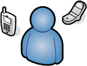

Benachrichtigungen
==================

Einführung
----------

Es gab eine Menge Fragen, wie genau Benachrichtigungen arbeiten. Wir
werden versuchen, genau zu erklären, wann und wie Host- und
Service-Benachrichtigungen versandt werden und ebenso, wer sie bekommt.

Benachrichtigungs-Eskalationen werden [hier](#escalations) beschrieben.

Wann erfolgen Benachrichtigungen?
---------------------------------

Die Entscheidung, Benachrichtigungen zu senden, wird in der Service- und
Host-Prüflogik getroffen. Die Ermittlung, ob eine Benachrichtigung
versandt wird oder nicht, erfolgt nur dann, wenn eine Host- oder
Service-Prüfung zu dieser Benachrichtigung verarbeitet wird. Es reicht
nicht, dass die in der Direktive \<notification\_interval\> angegebene
Zeit seit der letzten Benachrichtigung vergangen ist. Host- und
Service-Benachrichtigungen erfolgen in den folgenden Fällen...

-   wenn ein HARD-Statuswechsel erfolgt. Mehr Informationen über
    Statustypen und Hard-Statuswechsel finden Sie [hier](#statetypes).

-   wenn ein Host oder Service in einem Hard nicht-OK-Zustand bleibt und
    die in der \<*notification\_interval*\>-Option der Host- oder
    Service-Definition angegebene Zeit seit der letzten versandten
    Benachrichtigung verstrichen ist (für den angegebenen Host oder
    Service).

Wer wird benachrichtigt?
------------------------

Jede Host- und Service-Definition hat eine \<*contact\_groups*\>-Option,
die angibt, welche Kontaktgruppen Benachrichtigungen für bestimmte Hosts
oder Services erhalten. Kontaktgruppen können ein oder mehrere einzelne
Kontakte enthalten.

Wenn NAME-ICINGA eine Host- oder Service-Benachrichtigung versendet,
wird es jeden Kontakt informieren, der Mitglied in einer der
Kontaktgruppen ist, die in der \<*contactgroups*\>-Option der
Service-Definition angegeben ist. NAME-ICINGA bemerkt, wenn ein Kontakt
Mitglied von mehr als einer Kontaktgruppe ist und entfernt mehrfache
Kontaktbenachrichtigungen, bevor es irgendetwas tut.

Welche Filter müssen durchlaufen werden, damit Benachrichtigungen versandt werden?
----------------------------------------------------------------------------------

Nur weil Benachrichtigungen für einen Host- oder Service versandt werden
müssen, bedeutet das nicht, dass irgendein Kontakt informiert wird. Es
gibt mehrere Filter, die potenzielle Benachrichtungen durchlaufen
müssen, bevor sie als würdig genug angesehen werden, um versandt zu
werden. Lassen Sie uns einen genaueren Blick auf die Filter werfen, die
zu durchlaufen sind...

Programmweite Filter:
---------------------

Der erste Filter, den Benachrichtigungen durchlaufen müssen, ist ein
Test, ob Benachrichtigungen auf einer programmweiten Basis aktiviert
sind. Dies wird ursprünglich durch die
[enable\_notifications](#configmain-enable_notifications)-Option in der
Hauptkonfigurationsdatei festgelegt, kann aber während der Laufzeit über
das Web-Interface verändert werden. Falls Benachrichtigungen auf
programmweiter Basis deaktiviert sind, werden keine Benachrichtigungen
für Hosts oder Services versandt - Punkt. Wenn sie auf programmweiter
Basis aktiviert sind, müssen weitere Tests durchlaufen werden...

Service- und Host-Filter:
-------------------------

Der erste Filter für Host- oder Service-Benachrichtigungen ist eine
Prüfung, ob sich der Host oder Service in einer [geplanten
Ausfallzeit](#downtime) (downtime) befindet. Falls es eine geplante
Ausfallzeit ist, **wird niemand informiert**. Wenn es keine Ausfallzeit
ist, geht es weiter zum nächsten Filter. Als kleine Randnotiz:
Service-Benachrichtigungen werden unterdrückt, falls sich der mit ihnen
verbundene Host in einer geplanten Ausfallzeit befindet.

Der zweite Filter für Host- oder Service-Benachrichtigungenen ist eine
Prüfung, ob der Host oder Service [flattert](#flapping) (wenn Sie
Flatter-Erkennung aktiviert haben). Falls der Service oder Host gerade
flattert, **wird niemand informiert**. Andernfalls geht es weiter zum
nächsten Filter.

Der dritte für Hosts oder Services zu durchlaufende Filter sind die
Host- oder Service-spezifischen Benachrichtigungsoptionen. Jede
Service-Definition enthält Optionen, die festlegen, ob Benachrichtungen
für Warnungen, kritische Zustände oder Erholungen versandt werden oder
nicht. Ähnlich ist es bei Hosts, wo festgelegt wird, ob
Benachrichtigungen versandt werden, wenn der Host down geht,
unerreichbar wird oder sich wieder erholt. Falls die Host- oder
Service-Benachrichtigungen diese Optionen nicht passieren, **wird
niemand informiert**. Wenn sie die Optionen durchlaufen, geht es zum
nächsten Filter... Anmerkung: Benachrichtigungen über Host- oder
Service-Erholungen werden nur dann versandt, wenn auch eine
Benachrichtigung über das ursprüngliche Problem versandt wurde. Es ist
nicht sinnvoll, eine Benachrichtigung über eine Erholung zu bekommen,
wenn Sie nicht wussten, dass ein Problem existiert.

Der vierte Host- oder Service-Filter, der durchlaufen werden muss, ist
der Zeitfenster-Test. Jede Host- und Service-Definition hat eine
\<*notification\_period*\>-Option, die angibt, welches Zeitfenster
gültige Benachrichtigungszeiten für den Host oder Service enthält. Wenn
die Zeit der Benachrichtigung nicht in einen gültigen Bereich des
Zeitfensters fällt, **wird niemand informiert**. Wenn sie in einen
gültigen Bereich fällt, geht es zum nächsten Filter... Anmerkung: falls
der Zeitfenster-Filter nicht erfolgreich durchlaufen wird, plant
NAME-ICINGA die nächste Benachrichtigung für den Host oder Service
(falls er sich in einem nicht-OK-Status befindet) für die nächste
verfügbare gültige Zeit im Zeitfenster. Dies stellt sicher, dass der
Kontakt so früh wie möglich über Probleme informiert wird, wenn die
nächste gültige Zeit erreicht wird.

Der letzte Satz von Host- oder Service-Filter ist abhängig von zwei
Dingen: (1) zu einem Zeitpunkt in der Vergangenheit wurde bereits eine
Benachrichtigung über ein Problem mit dem Host oder Service versandt und
(2) blieb der Host oder Service im gleichen nicht-OK-Zustand, der zur
Zeit der Benachrichtigung vorlag. Wenn diese beiden Kriterien zutreffen,
wird NAME-ICINGA prüfen und sicherstellen, dass die seit der letzten
Benachrichtigung vergangene Zeit den in der Option
\<*notification\_interval*\> angegebenen Wert in der Host- oder
Service-Definition erreicht oder übertrifft. Falls nicht genug Zeit seit
der letzten Benachrichtigung vergangen ist, **wird niemand
benachrichtigt**. Wenn entweder genug Zeit seit der letzten
Benachrichtigung vergangen ist oder die beiden Kriterien dieses Filters
erfüllt wurden, wird die Benachrichtigung versandt. Ob sie tatsächlich
an einzelne Kontakte versandt wird, hängt von einem weiteren Satz von
Filtern ab...

Kontakt-Filter:
---------------

An diesem Punkt hat die Benachrichtigung die programmweiten und alle
Host- und Service-Filter durchlaufen und NAME-ICINGA beginnt, [alle
betroffenen Leute zu informieren](#objectdefinitions-contact). Bedeutet
dies, dass jeder Kontakt die Benachrichtigung erhalten wird? Nein. Jeder
Kontakt hat seinen eigenen Satz von Filtern, den die Benachrichtigung
passieren muss. Anmerkung: Kontaktfilter sind spezifisch für jeden
Kontakt und beeinflussen nicht, ob andere Kontakte Benachrichtigungen
erhalten oder nicht.

Der erste zu passierende Filter für jeden Kontakt sind die
Benachrichtigungsoptionen. Jede Kontaktdefinition enthält Optionen, die
festlegen, ob Service-Benachrichtigungen für Warning- und
Critital-Zustände und Erholungen versandt werden können. Jede
Kontakt-Definition enthält auch Optionen, die festlegen, ob
Host-Benachrichtigungen versandt werden, wenn der Host "down" geht,
unerreichbar wird oder sich erholt. Falls die Host- oder
Service-Benachrichtigung diese Optionen nicht passieren kann, **wird der
Kontakt nicht informiert**. Wenn es diese Optionen passiert, wird die
Benachrichtigung an den nächsten Filter weitergereicht... Anmerkung:
Benachrichtigungen über die Erholung von Host oder Service werden nur
dann versandt, wenn eine Benachrichtigung für das ursprüngliche Problem
versandt wurde. Es ist sinnlos, eine Benachrichtigung über eine Erholung
zu versenden, wenn Sie nicht wussten, dass ein Problem existiert...

Der letzte zu passierende Filter für jeden Kontakt ist der
Zeitfenster-Test. Jede Kontaktdefinition hat eine
\<*notification\_period*\>-Option, die angibt, welches Zeitfenster
gültige Benachrichtigungszeiten für den Kontakt enthält. Wenn die Zeit,
in der die Benachrichtigung erstellt wird, nicht in ein gültiges
Zeitfenster fällt, **wird der Kontakt nicht informiert**. Wenn sie in
ein gültiges Zeitfenster fällt, wird der Kontakt informiert!

Benachrichtigungs-Methoden
--------------------------

NAME-ICINGA kann Sie über Probleme und Erholungen auf vielfältige Weise
informieren: Pager, Handy, e-Mail, SMS, Audio-Hinweis usw. Wie
Benachrichtigungen versandt werden, hängt von den
[Benachrichtigungs-Befehlen](#objectdefinitions-command) ab, die in
Ihren [Objekt-Definitionsdateien](#config) definiert werden.

 Anmerkung: Wenn Sie NAME-ICINGA nach den
[Schnellstart-Anleitungen](#quickstart) installieren, sollte es zum
Versand von e-Mail-Benachrichtigungen konfiguriert sein. Sie können die
benutzten e-Mail-Befehle ansehen, indem Sie den Inhalt der Datei
*URL-ICINGA-BASE/etc/objects/commands.cfg* betrachten.

Spezielle Benachrichtigungs-Methoden (Paging usw.) sind nicht direkt in
den NAME-ICINGA-Code integriert, denn es ist nicht sinnvoll. Der "Kern"
von NAME-ICINGA ist nicht als eierlegene Wollmilchsau gedacht. Wenn
Service-Prüfungen im NAME-ICINGA-Kern enthalten wären, hätten Benutzer
große Schwierigkeiten, neue Prüfmethoden hinzuzufügen, bestehende
Prüfungen zu modifizieren usw. Benachrichtigungen arbeiten in ähnlicher
Weise. Es gibt tausend verschiedene Wege, Benachrichtigungen zu
versenden und es gibt bereits viele Pakete, die die schmutzige Arbeit
tun, also warum das Rad neu erfinden und sich dann auf einen
Fahrrad-Reifen beschränken? Es ist viel einfacher, ein externes Gebilde
(das kann ein einfaches Script sein oder ein ausgewachsenes
Message-System) die ganze Arbeit tun zu lassen. Einige Message-Pakete,
die Benachrichtigungen für Pager und Handys verarbeiten können, sind
weiter unten aufgeführt.

Benachrichtigungstyp-Makro
--------------------------

Wenn Sie Benachrichtigungs-Befehle erstellen, müssen Sie beachten, um
welchen Typ von Benachrichtigung es sich handelt. Das Makro
[\$NOTIFICATIONTYPE\$](#macrolist-notificationtype) enthält eine
Zeichenkette, die genau das angibt. Die nachfolgende Tabelle zeigt die
möglichen Werte und deren entsprechende Beschreibungen:

  ------------ ------------------------------------------------------------
  **Wert**     **Beschreibung**

  PROBLEM      Ein Host oder Service hat gerade einen Problemzustand
               erreicht (oder ist noch in einem). Wenn dies eine
               Service-Benachrichtigung ist, bedeutet das, dass der Service
               in einem WARNING-, UNKNOWN- oder CRITICAL-Zustand ist. Wenn
               dies eine Host-Benachrichtigung ist, bedeutet das, dass der
               Host in einem DOWN- oder UNREACHABLE-Zustand ist.

  RECOVERY     Ein Service oder Host hat sich erholt. Wenn dies eine
               Service-Benachrichtigung ist, bedeutet es, dass der Service
               gerade wieder in einen OK-Zustand zurückgekehrt ist. Wenn
               dies eine Host-Benachrichtigung ist, bedeutet das, dass der
               Host gerade wieder in einen UP-Zustand zurückgekehrt ist.

  ACKNOWLEDGEM Diese Benachrichtigung ist eine Bestätigung für ein Host-
  ENT          oder Service-Problem. Bestätigungen werden von Kontakten für
               diesen Host oder Service über das Web-Interface ausgelöst.

  FLAPPINGSTAR Der Host oder Service hat gerade angefangen zu
  T            [flattern](#flapping).

  FLAPPINGSTOP Der Host oder Service hat gerade aufgehört zu
               [flattern](#flapping).

  FLAPPINNAME- Der Host oder Service hat gerade aufgehört zu
  GDISABLED    [flattern](#flapping), weil die Flatter-Erkennung
               deaktiviert wurde.

  DOWNTIMESTAR Der Host oder Service hat gerade ein [geplante
  T            Downtime](#downtime) begonnen. Weitere Benachrichtigungen
               werden unterdrückt.

  DOWNTIMESTOP Der Host oder Service hat gerade eine [geplante
               Downtime](#downtime) beendet. Benachrichtungen über Probleme
               werden wieder versandt.

  DOWNTIMECANC Die Phase der [geplanten Downtime](#downtime) für den Host
  ELLED        oder Service wurde gerade annulliert. Benachrichtungen über
               Probleme werden wieder versandt.
  ------------ ------------------------------------------------------------

Hilfreiche Quellen
------------------

Es gibt viele Wege, wie Sie NAME-ICINGA konfigurieren können, damit
Benachrichtigungen versandt werden. Sobald Sie dies tun, müssen Sie
notwendige Software installieren und Benachrichtigungs-Befehle
konfigurieren, bevor Sie diese benutzen können. Hier sind nur ein paar
mögliche Benachrichtigungs-Methoden:

-   e-Mail

-   Pager

-   Telefon (SMS)

-   WinPopup-Meldung

-   Yahoo-, ICQ- oder MSN-Sofortnachricht

-   Audio-Hinweise

-   etc...

Im Grunde genommen kann alles, was Sie von einer Kommandozeile aus tun
können, so angepasst werden, dass Sie es in einem
Benachrichtigungs-Befehl nutzen können.

Wenn Sie nach einer Alternative suchen, um Meldungen per e-Mail an Ihren
Pager oder Ihr Handy zu versenden, sollten Sie diese Pakete
ausprobieren. Sie können in Verbindung mit NAME-ICINGA dazu benutzt
werden, Benachrichtigungen über ein Modem zu versenden, wenn ein Problem
auftritt. Auf diese Weise müssen Sie sich nicht auf e-Mail verlassen, um
Benachrichtigungen zu versenden (bedenken Sie, dass e-Mail ggf.
\*nicht\* funktioniert, wenn es ein Netzwerk-Problem gibt). Wir haben
diese Pakete nicht selbst ausprobiert, aber andere haben von
erfolgreichem Einsatz berichtet...

-   [Gnokii](http://www.gnokii.org/) (SMS-Software, um Nokia-Telefone
    über das GSM-Netzwerk zu erreichen)

-   [QuickPage](http://www.qpage.org/) (Alphanumerische Pager-Software)

-   [Sendpage](http://www.sendpage.org/) (Paging-Software)

Wenn Sie eine nicht-traditionelle Methode für Benachrichtigungen
ausprobieren möchten, können Sie ggf. Audio-Hinweise nutzen. Wenn Sie
Audio-Hinweise auf dem Überwachungs-Rechner (mit synthetischer Stimme)
abspielen möchten, probieren Sie
[Festival](http://www.cstr.ed.ac.uk/projects/festival/). Wenn Sie den
Überwachungs-Rechner lieber in Ruhe lassen und Audio-Hinweise auf einem
anderen Rechner abspielen möchten, dann sehen Sie sich die Projekte
[Network Audio System (NAS)](http://radscan.com/nas.html) und
[rplay](http://rplay.doit.org/) an.

Benachrichtigungen
Benachrichtigungen
Filter
Benachrichtigungen
Audio-Alarme
Gnokii
