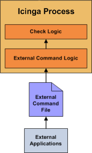
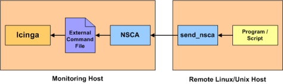

Passive Prüfungen (Passive Checks)
==================================

Einführung
----------

In den meisten Fällen werden Sie NAME-ICINGA nutzen, um Ihre Hosts und
Services mit Hilfe von regelmäßig geplanten [aktiven
Prüfungen](#activechecks) zu überwachen. Aktive Prüfungen können genutzt
werden, um ein Gerät oder Service gelegentlich "abzufragen". NAME-ICINGA
unterstützt auch einen Weg, Hosts und Services passiv zu überwachen
statt aktiv. Die Hauptmerkmale von passiven Prüfungen sind wie folgt:

-   passive Prüfungen werden von externen Anwendungen/Prozessen
    veranlasst und ausgeführt

-   Ergebnisse von passiven Prüfungen werden an NAME-ICINGA zur
    Verarbeitung übermittelt

Der Hauptunterschied zwischen aktiven und passiven Prüfungen ist, dass
aktive Prüfungen von NAME-ICINGA veranlasst und ausgeführt werden,
während passive Prüfungen von externen Applikationen durchgeführt
werden.

Einsatzmöglichkeiten für passive Prüfungen
------------------------------------------

passive Prüfungen sind nützlich, um Services zu überwachen, die

-   von Natur aus asynchron sind und nicht effektiv durch Abfrage ihres
    Zustands auf einer regelmäßig geplanten Basis überwacht werden
    können

-   sich hinter einer Firewall befinden und nicht aktiv vom
    überwachenden Host aus geprüft werden können

Beispiele für asynchrone Services, bei denen sich eine passive
Überwachung lohnt, sind u.a. SNMP-Traps und Sicherheits-Alarme. Sie
wissen nie, wie viele (falls überhaupt) Traps oder Alarme Sie innerhalb
eines vorgegebenen Zeitfensters erhalten, so dass es nicht sinnvoll ist,
ihren Status alle paar Minuten zu überwachen.

Passive Prüfungen werden auch genutzt, um [verteilte](#distributed) oder
[redundante](#redundancy) Überwachungsinstallationen zu konfigurieren.

Wie passive Prüfungen arbeiten
------------------------------

Hier nun mehr Details, wie passive Prüfungen arbeiten...

1.  eine externe Applikation prüft den Status eines Hosts oder Service.

2.  die externe Applikation schreibt die Ergebnisse der Prüfung in das
    [external command file](#configmain-command_file).

3.  das nächste Mal, wenn NAME-ICINGA das "external command file" liest,
    wird es die Ergebnisse aller passiven Prüfungen zur späteren
    Verarbeitung in eine Queue stellen. Dieselbe Queue, die für die
    Speicherung von Ergebnissen von aktiven Prüfungen genutzt wird, wird
    auch für die Speicherung von Ergebnissen von aktiven Prüfungen
    verwendet.

4.  NAME-ICINGA wird periodisch ein [check result reaper
    event](#configmain-check_result_reaper_frequency) ausführen und die
    Ergebnis-Queue abfragen. Jedes Service-Prüfungs-Ergebnis, das in der
    Queue gefunden wird, wird in der gleichen Weise bearbeitet -
    unabhängig davon, ob die Prüfung aktiv oder passiv war. NAME-ICINGA
    kann abhängig vom Prüfergebnis Benachrichtigungen senden, Alarme
    protokollieren, usw.

Die Verarbeitung von aktiven und passiven Prüfungsergebnissen ist
tatsächlich identisch. Dies erlaubt eine nahtlose Integration von
externen Applikationen mit NAME-ICINGA.

Passive Prüfungen aktivieren
----------------------------

Um passive Prüfungen in NAME-ICINGA zu aktivieren, müssen Sie folgendes
tun:

-   setzen Sie die
    [accept\_passive\_service\_checks](#configmain-accept_passive_service_checks)-Direktive
    auf 1.

-   setzen Sie die *passive\_checks\_enabled*-Direktive in Ihren Host-
    und Service-Definitionen auf 1.

Wenn Sie die Verarbeitung von passiven Prüfungen global deaktivieren
wollen, setzen Sie die
[accept\_passive\_service\_checks](#configmain-accept_passive_service_checks)-Direktive
auf 0.

Wenn Sie die Verarbeitung von passiven Prüfungen nur für ein paar Hosts
oder Services deaktivieren wollen, nutzen Sie die
*passive\_checks\_enabled*-Direktive in den Host- und/oder
Service-Definitionen.

Übermitteln von passiven Service-Prüfungsergebnissen
----------------------------------------------------

Externe Applikationen können passive Prüfungsergebisse an NAME-ICINGA
übermitteln, indem sie ein PROCESS\_SERVICE\_CHECK\_RESULT [external
command](#extcommands) in das "external command file" schreiben.

Das Format des Befehls lautet wie folgt:

     [<Zeitstempel>] PROCESS_SERVICE_CHECK_RESULT;<host_name>;<svc_description>;<return_code>;<plugin_output>

wobei...

-   *timestamp* ist die Zeit im time\_t-Format (Sekunden seit der
    UNIX-Epoche), zu der die Service-Prüfung durchgeführt (oder
    übermittelt) wurde. Bitte beachten Sie das einzelne Leerzeichen nach
    der rechten Klammer.

-   *host\_name* ist der Kurzname des Hosts, der mit dem Service in der
    Service-Definition verbunden ist

-   *svc\_description* ist die Beschreibung des Service wie in der
    Service-Definition angegeben

-   *return\_code* ist der Return-Code der Prüfung (0=OK, 1=WARNING,
    2=CRITICAL, 3=UNKNOWN)

-   *plugin\_output* ist die Textausgabe der Service-Prüfung (also die
    Ausgabe des Plugins)

 Anmerkung: ein Service muss in NAME-ICINGA
definiert sein, bevor Sie passive Prüfungen für ihn abliefern können!
NAME-ICINGA wird alle Prüfergebnisse für Services ignorieren, die nicht
konfiguriert waren, bevor es das letzte Mal (neu) gestartet wurde.

 Ein Beispiel-Shell-Script, wie man passive
Service-Prüfungsergebnisse an NAME-ICINGA übermittelt, finden Sie in der
Dokumentation zu [sprunghaften Services](#volatileservices).

Übermitteln von passiven Host-Prüfungsergebnissen
-------------------------------------------------

Externe Applikationen können passive Host-Prüfungsergebisse an
NAME-ICINGA übermitteln, indem sie ein PROCESS\_HOST\_CHECK\_RESULT
[external command](#extcommands) in das "external command file"
schreiben.

Das Format des Befehls lautet wie folgt:

     [<timestamp>] PROCESS_HOST_CHECK_RESULT;<host_name>;<host_status>;<plugin_output>

wobei...

-   *timestamp* ist die Zeit im time\_t-Format (Sekunden seit der
    UNIX-Epoche), zu der die Host-Prüfung durchgeführt (oder
    übermittelt) wurde. Bitte beachten Sie das einzelne Leerzeichen nach
    der rechten Klammer.

-   *host\_name* ist der Kurzname des Hosts (wie in der Host-Definition
    angegeben)

-   *host\_status* ist der Status des Hosts (0=UP, 1=DOWN,
    2=UNREACHABLE)

-   *plugin\_output* ist die Textausgabe der Host-Prüfung (also die
    Ausgabe des Plugins)

 Anmerkung: ein Host muss in NAME-ICINGA
definiert sein, bevor Sie passive Prüfungen für ihn abliefern können!
NAME-ICINGA wird alle Prüfergebnisse für Hosts ignorieren, die nicht
konfiguriert waren, bevor es das letzte Mal (neu) gestartet wurde.

Passive Prüfungen und Host-Zustände
-----------------------------------

NAME-ICINGA versucht bei passiven Prüfungen - anders bei aktiven
Prüfungen - nicht festzustellen, ob der Host DOWN oder UNREACHABLE ist.
Statt dessen nimmt NAME-ICINGA das passive Prüfergebnis als den wahren
Status des Hosts und versucht nicht, den wahren Host-Status mit Hilfe
der [Erreichbarkeitslogik](#networkreachability) zu ermitteln. Dies kann
Probleme verursachen, wenn Sie passive Prüfungen von einem entfernten
Host übermitteln oder Sie ein [verteiltes
Überwachungs-Setup](#distributed) haben, in dem Eltern/Kind-Verhältnisse
unterschiedlich sind.

Sie können NAME-ICINGA anweisen, die passiven Prüfergebnisse
DOWN/UNREACHABLE-Zustände mit Hilfe der
[translate\_passive\_host\_checks](#configmain-translate_passive_host_checks)-Variable
in ihre "sauberen" Zustände zu übersetzen. Mehr Informationen wie dies
funktioniert, finden Sie [hier](#passivestatetranslation).

 Anmerkung: Passive Host-Prüfungen werden
normalerweise als [HARD-Zustände](#statetypes) behandelt, falls nicht
die
[passive\_host\_checks\_are\_soft](#configmain-passive_host_checks_are_soft)-Option
aktiviert ist.

Übermitteln von passiven Prüfungsergebnissen von entfernten Hosts
-----------------------------------------------------------------

Wenn eine Applikation, die sich auf dem gleichen Host wie NAME-ICINGA
befindet, passive Host- oder Service-Prüfungsergebnisse sendet, kann es
die Ergebisse einfach direkt in das "external command file" schreiben
wie oben skizziert. Allerdings können entfernte Hosts das nicht so
einfach tun.

Um es entfernten Hosts zu erlauben, passive Prüfungsergebnisse an den
überwachenden Host zu senden, hat Ethan Galstad das
[NAME-NSCA](#addons-nsca)-Addon entwickelt. Das NAME-NSCA-Addon besteht
aus einem Daemon, der auf dem NAME-ICINGA-Host läuft und einem Client,
der auf entfernten Hosts ausgeführt wird. Der Daemon lauscht auf
Verbindungen von entfernten Hosts, führt mit den Ergebnissen einige
grundlegende Gültigkeitsprüfungen durch und schreibt die Prüfergebnisse
direkt in das "external command file" (wie oben beschrieben). Mehr
Informationen über das NAME-NSCA-Addon finden Sie [hier](#addons-nsca).

Passive Prüfungen
