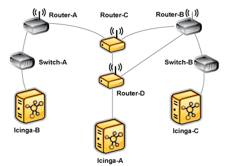

Passive Host-Zustandsübersetzung
================================

Einführung
----------

Wenn NAME-ICINGA passive Host-Prüfungen von entfernten Quellen erhält
(d.h. andere NAME-ICINGA-Instanzen in verteilten oder
Failover-Umgebungen), gibt der von der entfernten Quelle gelieferte
Host-Status ggf. nicht genau den aus NAME-ICINGA-Sicht zutreffenden
Zustand wieder. Weil verteilte und Failover-Überwachungs-Installationen
ziemlich identisch sind, ist es wichtig einen Mechanismus anzubieten, um
exakte Host-Zustände zwischen verschiedenen NAME-ICINGA-Instanzen
sicherzustellen.

Verschiedene Sichten
--------------------

Das folgende Bild zeigt eine vereinfachte Sicht für ein
Failover-Überwachungsaufbau.

-   *NAME-ICINGA-A* ist der primäre Überwachungsserver, der aktiv alle
    Switches und Router überwacht.

-   *NAME-ICINGA-B* und *NAME-ICINGA-C* sind Backup-Überwachungsserver,
    die passive Prüfergebnisse von *NAME-ICINGA-A* erhalten.

-   Sowohl *Router-C* als auch *Router-D* sind fehlerhaft und daher
    offline.

In welchem Status sind *Router-C* und *Router-D* gerade? Die Antwort
hängt davon ab, welche NAME-ICINGA-Instanz Sie fragen.

-   *NAME-ICINGA-A* sieht *Router-D* als DOWN und *Router-C* als
    UNREACHABLE

-   *NAME-ICINGA-B* sollte *Router-C* als DOWN und *Router-D* als
    UNREACHABLE sehen

-   *NAME-ICINGA-C* sollte beide Router als DOWN sehen.

Jede NAME-ICINGA-Instanz hat eine unterschiedliche Sicht des Netzwerks.
Die Backup-Überwachungsserver sollten nicht blind passive Host-Zustände
vom primären Überwachungsserver akzeptieren oder Sie werden inkorrekte
Informationen über den aktuellen Zustand des Netzwerks haben.

Ohne die Übersetzung von passiven Host-Prüfergebnissen vom primären
Überwachungsserver (*NAME-ICINGA-A*) würde *NAME-ICINGA-C* den
*Router-D* als UNREACHABLE sehen, obwohl dieser vom eigenen Standpunkt
aus eigentlich DOWN ist. Ähnliches gilt für die
DOWN/UNREACHABLE-Zustände von *Router-C* und *Router-D* (vom Standpunkt
von *NAME-ICINGA-A* aus), die aus Sicht von *NAME-ICINGA-B* umgedreht
werden sollten.

 Anmerkung: Es kann einige Situationen geben, in
denen Sie nicht möchten, dass NAME-ICINGA die DOWN/UNREACHABLE-Zustände
von entfernten Quellen in ihre "korrekten" Zustände vom Standpunkt der
lokalen NAME-ICINGA-Instanz aus umsetzt. Zum Beispiel möchten Sie
vielleicht in verteilten Überwachungsumgebungen, dass die zentrale
NAME-ICINGA-Instanz weiß, wie verteilte Instanzen ihre jeweiligen Teile
des Netzwerks sehen.

Status-Übersetzung aktivieren
-----------------------------

Per Default wird NAME-ICINGA *nicht* automatisch die
DOWN/UNREACHABLE-Zustände von passiven Prüfergebnissen übersetzen. Sie
müssen dieses Feature aktivieren, wenn Sie es benötigen und nutzen
wollen.

Die automatische Übersetzung von passiven Host-Prüfzuständen wird durch
die
[translate\_passive\_host\_checks](#configmain-translate_passive_host_checks)-Variable
kontrolliert. Durch die Aktivierung wird NAME-ICINGA automatisch DOWN-
und UNREACHABLE-Zustände von entfernten Quellen in die korrekten
Zustände für die lokale Instanz übersetzen.

Passive Host-Zustandsübersetzung
