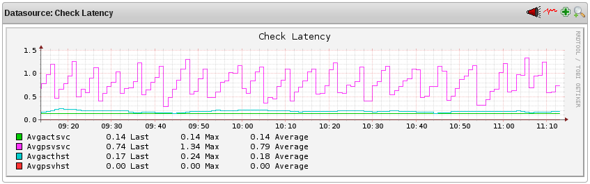
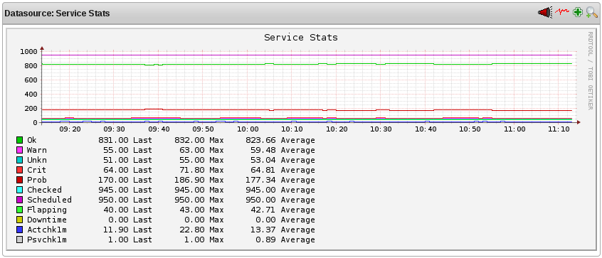
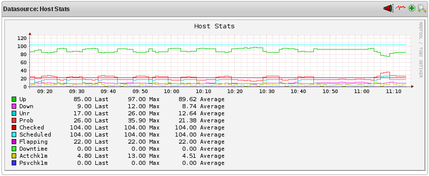
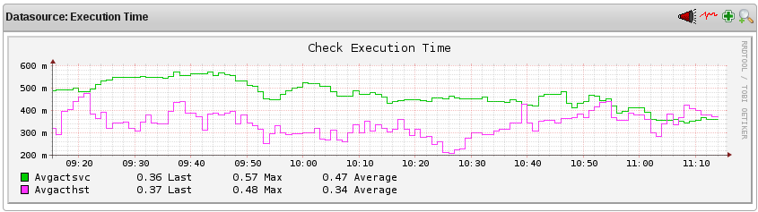
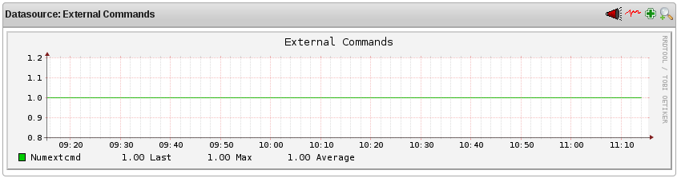
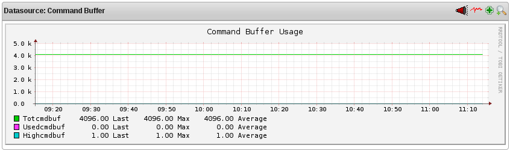
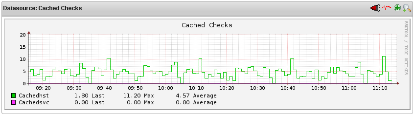
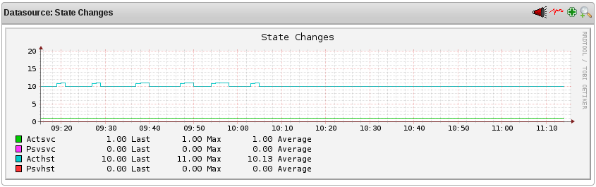

Grafische Darstellung von Performance-Informationen mit NAME-PNP
================================================================

Einführung
----------

Das [NAME-STATS](icingastats.html)-Utility erlaubt Ihnen zusammen mit
[NAME-PNP](http://docs.pnp4nagios.org/pnp-0.6/start), verschiedene
NAME-ICINGA-Performance-Statistiken über eine bestimmten Zeitraum
grafisch darzustellen. Das ist wichtig, weil es Ihnen helfen kann

-   dass NAME-ICINGA effizient arbeitet

-   um Problembereiche im Überwachungsprozess zu lokalisieren

-   um die Einflüsse von Änderungen in Ihrer NAME-ICINGA-Konfiguration
    zu beobachten

Voraussetzungen
---------------

NAME-PNP ist eines der populärsten Addons wegen der einfachen
Installation und geringem Wartungsaufwand während des Betriebs. Die
Dokumentation zusammen mit weiteren Links zum Download der Software
finden Sie unter
[URL-PNP-DE](http://docs.pnp4nagios.org/de/pnp-0.6/start).

[check\_nagiostats](https://www.monitoringexchange.org/inventory/Check-Plugins/Software/Nagios/check_nagiostats)
wurde von [Jochen
Bern](http://www.nagios-portal.org/wbb/index.php?page=User&userID=7773)
erstellt. Es kann als aktive Service-Prüfung aufgerufen werden oder über
die crontab und liefert die Daten dann als passive Prüfergebnisse. Trotz
des Namens funktioniert das Plugin auch mit NAME-ICINGA.

-   Nach dem Herunterladen des Plugins und Ablegen im Plugin-Verzeichnis
    (z.B. `URL-ICINGA-BASE/libexec`, falls Sie die Schnellstartanleitung
    benutzt haben) müssen Sie die Werte im Konfigurationsabschnitt des
    Scripts anpassen.

    -   Am **wichtig**sten ist "`EXEC=``/path/to/icingastats`" (z.B.
        `URL-ICINGA-BASE/bin/icingastats`), das auf das
        `icingastats`-Binary zeigen muss.

    -   Abhängig von Ihren Bedürfnissen möchten Sie ggf. den Wert für
        `CUMULATE` von "AVG" auf "MIN" oder "MAX" ändern: Die
        Einstellung von `TIMEFRAME` beeinflusst die Zeitperiode, die für
        die Ausgabe von kumulierten Werten benutzt wird

    -   Das Ändern der Werte von `PASSIVE_EMERGENCY_HOST` und
        `PASSIVE_EMERGENCY_SERVICE` sollte nicht notwendig sein, weil
        diese Werte als Parameter an das Script übergeben werden.

-   Sie können das Plugin mit aktiven oder passiven Prüfungen aufrufen

    -   Aktiv

        Stellen Sie sicher, dass Ihre Objektkonfigurationsdateien eine
        passende Service-Definition enthalten, wie z.B.

             define service{
                host_name               <the NAME-ICINGA server>
                service_description     icingastats # (oder etwas Passendes)
                check_command           check_stats
                check_interval          1
                retry_interval          1
                ...
             }

        und eine Command-Definition

             define command{
                command_name            check_stats
                command_line            $USER1$/check_nagiostats
              }

        Vergessen Sie nicht den Neustart von NAME-ICINGA nach diesen
        Änderungen.

    -   Passiv

        Stellen Sie sicher, dass Ihre Objektkonfigurationsdateien eine
        passende Service-Definition enthalten, wie z.B.

             define service{
                host_name               <the NAME-ICINGA server>
                service_description     icingastats # (oder etwas Passendes)
                active_checks_enabled   0
                check_command           check_stats!3!Frische-Schwellwert ueberschritten
                check_freshness         1
                freshness_threshold     180         # Pruefintervall + x Sekunden
                ...
             }

        und eine Command-Definition

             define command{
                command_name            check_stats
                command_line            $USER1$/check_dummy $ARG1$ $ARG2$
             }

        Vergessen Sie nicht den Neustart von NAME-ICINGA nach dieser
        Änderung.

        Fügen Sie eine Zeile zur crontab des NAME-ICINGA-Benutzers
        hinzu, die das `icingastats`-Binary aufruft und die Ergebnisse
        an die Command-Pipe weiterleitet

             * * * * * URL-ICINGA-BASE/libexec/check_nagiostats --passive <host> icingastats >> URL-ICINGA-BASE/var/rw/icinga.cmd

        Auf diese Weise werden die Werte in regelmäßigen Intervallen
        aktualisiert.

-   Legen Sie einen logischen Link im (Benutzer) templates-Verzeichnis
    von NAME-PNP an

         $> ln -s ../templates.dist/nagiostats.php check_stats.php

    Stellen Sie sicher, dass *check\_stats* (ohne die Endung .php) zu
    dem Wert passt, den Sie als ersten Parameter im check\_command
    angegeben haben

**Beispiel-Graphen**

Wir werden beschreiben, was die durch `check_nagiostats` erzeugten
Graphen bedeuten und wofür sie benutzt werden können...

Durchschnittliche Host-/Service-Prüfungslatenz
----------------------------------------------

Dieser Graph zeigt die durchschnittlichen Latenzzeiten von Hosts und
Services über die Zeit gesehen, getrennt nach aktiven und passiven
Prüfungen. Das ist nützlich zum Verständnis von:

-   [Host-Prüfungen](#hostchecks)

-   [Service-Prüfungen](#servicechecks)

-   [Aktiven Prüfungen](#activechecks)

-   [Passiven Prüfungen](#passivechecks)

-   [Performance-Tuning](#tuning)

Durchgehend hohe Latenzen können ein Hinweis darauf sein, dass eine oder
mehrere der folgenden Variablen angepasst werden sollten:

-   [max\_concurrent\_checks](#configmain-max_concurrent_checks)

-   [check\_result\_reaper\_frequency](#configmain-check_result_reaper_frequency)

-   [max\_check\_result\_reaper\_time](#configmain-max_check_result_reaper_time)

Service-Statistiken
-------------------

Dieser Graph zeigt die Werte für die einzelnen Service-Zustände zusammen
mit der durchschnittlichen Zahl von geprüften Services an, die aktiv
bzw. passiv in der von Ihnen angegebenen Zeitperiode geprüft wurden. Das
ist nützlich zum Verständnis von:

-   [Service-Prüfungen](#servicechecks)

-   [Vorausschauenden Service-Abhängigkeitsprüfungen (predictive service
    dependency checks)](#dependencychecks)

-   [Zwischengespeicherten Prüfungen (cached checks)](#cachedchecks)

-   [Flattererkennung (flap detection)](#flapping)

Host-Statistiken
----------------

Dieser Graph zeigt die Werte für die einzelnen Host-Zustände zusammen
mit der durchschnittlichen Zahl von geprüften Hosts an, die aktiv bzw.
passiv in der von Ihnen angegebenen Zeitperiode geprüft wurden. Das ist
nützlich zum Verständnis von:

-   [Host-Prüfungen](#hostchecks)

-   [Vorausschauenden Host-Abhängigkeitsprüfungen (predictive host
    dependency checks)](#dependencychecks)

-   [Zwischengespeicherten Prüfungen (cached checks)](#cachedchecks)

-   [Flattererkennung (flap detection)](#flapping)

Durchschnittliche Ausführungszeiten
-----------------------------------

Dieser Graph zeigt die durchschnittlichen Ausführungszeit von Host- und
Service-Prüfungen über die Zeit gesehen. Das ist nützlich zum
Verständnis von:

-   [Host-Prüfungen](#hostchecks)

-   [Service-Prüfungen](#servicechecks)

-   [Performance-Tuning](#tuning)

> **Note**
>
> Um ehrlich zu sein: Wir haben die Graphen ein wenig verändert, bezogen
> auf die Farben. Gelb ist teilweise schwierig vom Hintergrund zu
> unterscheiden so dass wir einige Zeilen in der NAME-PNP-Template-Datei
> `template.dist/nagiostats.php` von `$i=0;` in `$i=1;` geändert haben.

**Zusätzliche Graphen**

Nun ja, wir haben das Template noch ein bisschen mehr verändert, weil
das Plugin zwar die Daten liefert, aber keine dazugehörigen Graphen.
(Beim Blick in das Template ist es aber sehr schnell anzupassen, falls
Sie die folgenden Graphen wirklich benötigen.

Externe Befehle (external commands)
-----------------------------------

Dieser Graph zeigt, wie viele externe Befehle vom NAME-ICINGA-Daemon
über die Zeit gesehen verarbeitet wurden. Solange Sie keine große Anzahl
von externen Befehlen verarbeiten (wie z.B. im Falle einer verteilten
Überwachungsumgebung), dann kann dieser Graph fast leer sein. Die
Überwachung von externen Befehlen kann nützlich sein für das Verständnis
der Auswirkung von:

-   [Passiven Prüfungen](#passivechecks)

-   [Verteilter Überwachung](#distributed)

-   [Redundante/Failover-Überwachung](#redundancy)

Puffer für externe Befehle (external command buffers)
-----------------------------------------------------

Der Graph zeigt, wie viele Puffer für externe Befehle über die Zeit
gesehen benutzt wurden. Wenn die Zahl von benutzten Puffern regelmäßig
fast die Zahl von verfügbaren Puffern erreicht, dann ist es
wahrscheinlich, dass Sie die Anzahl von verfügbaren Puffern mit Hilfe
der Direktive [external command buffer
slots](#configmain-external_command_buffer_slots) erhöhen sollten. Jeder
Puffer kann genau einen externen Befehl aufnehmen. Puffer werden für die
vorübergehende Aufbewahrung von externen Befehlen genutzt, und zwar vom
Lesen aus dem [external command file](#configmain-command_file) bis zur
Verarbeitung durch den NAME-ICINGADaemon.

Wie Sie sehen wird nur ein Puffer genutzt und das ist genau der für die
Ergebnisse des check\_nagiostats-Plugins.

Zwischengespeicherte Host- und Service-Prüfungen (cached host and service checks)
---------------------------------------------------------------------------------

Dieser Graph zeigt, wie viele zwischengespeicherte Host- und
Service-Prüfungen über die Zeit aufgetreten sind. Das ist nützlich zum
Verständnis von:

-   [Zwischengespeicherten Prüfungen (cached checks)](#cachedchecks)

-   [Vorausschauenden Host- und Service-Abhängigkeitsprüfungen
    (predictive host and service dependency checks)](#dependencychecks)

Durchschnittliche Zustandswechsel
---------------------------------

Dieser Graph zeigt den durchschnittlichen prozentualen Zustandswechsel
(ein Maß für die Sprunghaftigkeit) über die Zeit gesehen, unterschieden
nach Hosts und Service, die zuletzt aktiv oder passiv geprüft wurden.
Das ist nützlich zum Verständnis von:

-   [Flattererkennung (flap detection)](#flapping)

Darstellung von Performance-Informationen mit NAME-PNP
