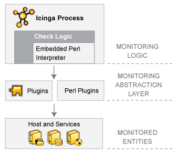

NAME-ICINGA Plugins
===================

Einführung
----------

NAME-ICINGA enthält nicht, wie viele andere Überwachungs-Tools, interne
Mechanismen zur Prüfung des Zustands von Hosts und Services in Ihrem
Netzwerk. NAME-ICINGA verlässt sich statt dessen auf externe Programme
(Plugins genannt), die all die schmutzige Arbeit tun.

Was sind Plugins?
-----------------

Plugins sind kompilierte Programme oder Scripts (Perl-Scripts,
Shell-Scripts, usw.), die von einer Kommandozeile aus laufen können, um
den Status eines Hosts oder Service zu prüfen. NAME-ICINGA benutzt die
Ergebnisse von Plugins, um den aktuellen Status von Hosts oder Services
in Ihrem Netzwerk zu ermitteln.

NAME-ICINGA wird ein Plugin immer dann ausführen, wenn die Notwendigkeit
besteht, den Status eines Hosts oder Service zu prüfen. Das Plugin tut
*etwas* (beachten Sie den sehr allgemeinen Ausdruck), um die Prüfung
auszuführen und dann einfach die Ergebnisse an NAME-ICINGA
zurückzuliefern. NAME-ICINGA wird die Ergebnisse verarbeiten, die es vom
Plugin erhält, und dann notwendige Aktionen ausführen (starten von
[Eventhandlern](#eventhandlers), senden von
[Benachrichtigungen](#notifications), etc).

Plugins als eine Abstraktionsschicht
------------------------------------

Plugins arbeiten wie eine Abstraktionsschicht zwischen der
Überwachungslogik im NAME-ICINGA-Dämon und den eigentlichen Services und
Hosts, die überwacht werden.

Der Vorteil dieses Typs von Plugin-Architektur ist, dass Sie fast alles
überwachen können, was Ihnen einfällt. Wenn Sie den Prozess der
Überwachung automatisieren können, können Sie es mit NAME-ICINGA
überwachen. Es gibt bereits eine Menge von Plugins, die erzeugt wurden,
um grundlegende Ressourcen wie z.B. Prozessorauslastung,
Plattenbelegung, Ping-Raten usw. zu überwachen. Wenn Sie etwas anderes
überwachen möchten, werfen Sie einen Blick in die Dokumentation zu
[Plugins schreiben](#pluginapi) und erstellen Sie ein eigenes. Es ist
einfach!

Der Nachteil dieses Typs von Plugin-Architektur ist die Tatsache, dass
NAME-ICINGA absolut keine Ahnung davon hat, was Sie überwachen. Sie
könnten Netzwerkverkehr-Statistiken, Datenfehler-Raten, Raumtemperatur,
CPU-Spannung, Lüftergeschwindigkeit, Prozessorauslastung,
Plattenbelegung überwachen oder die Fähigkeit Ihres superphantastischen
Toasters, am Morgen Ihr Brot ordnungsgemäß zu bräunen... NAME-ICINGA
versteht nicht die Besonderheiten dessen, was überwacht wird - es
verfolgt lediglich Veränderungen des *Zustands* dieser Ressourcen. Nur
die Plugins selbst wissen genau, was sie überwachen und wie die
eigentlichen Prüfungen auszuführen sind.

Welche Plugins sind verfügbar?
------------------------------

Es gibt bereits zahlreiche Plugins, um viele verschiedene Arten von
Geräten und Services zu überwachen, u.a.:

-   PROTOCOL-HTTP, PROTOCOL-POP3, PROTOCOL-IMAP, PROTOCOL-FTP,
    PROTOCOL-SSH, PROTOCOL-DHCP

-   CPU-Auslastung, Plattenbelegung, Speicherauslastung, Anzahl Benutzer

-   Unix/NAME-LINUX, Windows- und Netware-Server

-   Router und Switches

-   etc.

Plugins beschaffen
------------------

Plugins werden nicht mit NAME-ICINGA verteilt, aber Sie finden die
offiziellen NAME-NAGIOS-Plugins zum Download und viele weitere Plugins,
die von NAME-NAGIOS-Benutzern erstellt und gewartet werden, an folgenden
Stellen:

-   NAME-NAGIOS Plugins Project:
    [URL-NAGIOSPLUG-SF](http://sourceforge.net/projects/nagiosplug)

-   NAME-NAGIOS Downloads Page:
    [URL-NAGIOS/download/](http://www.nagios.org//download/)

-   MonitoringExchange:
    [URL-MONITORINGEXCHANGE](http://www.monitoringexchange.org)

Nach dem Herunterladen müssen Sie die Plugins installieren. Bitte lesen
Sie die Dokumentation (falls vorhanden), wie das zu tun ist. Sie könnte
wichtige Informationen über die Voraussetzungen wie z.B. zusätzliche
Pakete oder (Perl-) Module enthalten, wie das Plugin zu installieren ist
bzw. distributionsabhängige Hinweise.

Manchmal müssen Sie das Plugin kompilieren, wobei Sie den Vorgang durch
den Aufruf von "./configure" mit oder ohne Optionen vorbereiten. Bitte
prüfen Sie die Datei `config.log` auf mögliche Fehler zu fehlenden
(devel-)Paketen vor dem Aufuf des eigentlichen Compile-Vorgangs
(meistens "make" oder "make all"). In den meisten Fällen wird das Plugin
durch den Aufruf von "make install" in das Plugins-Verzeichnis (z.B. ``)
kopiert.

Manchmal müssen Sie das Plugin auf Ihre Umgebung anpassen (z.B. den Pfad
zu "utils.pm"). Sie können stattdessen einen logischen Link erzeugen,
der auf das Plugin-Verzeichnis weist, so dass Sie nicht das Plugin
ändern müssen, um diese Änderung zu umgehen und spätere Updates zu
vereinfachen. Das könnte wie folgt geschehen:

     $> mkdir /usr/local/nagios
     $> ln -s /usr/local/icinga/libexec /usr/local/nagios/libexec

> **Note**
>
> Bei Verwendung von Paketen kann der Pfad zum Plugin-Verzeichnis anders
> lauten (z.B. `/usr/lib/plugins`), so dass Sie den Befehl entsprechend
> anpassen müssen.

Zum NAME-ICINGA-Benutzer wechseln
---------------------------------

> **Important**
>
> Führen Sie Plugins immer mit dem NAME-ICINGA-Benutzer aus, denn einige
> Plugins erstellen temporäre Dateien. Wenn Sie Plugins mit einem
> anderen Benutzer ausführen, dann kann der NAME-ICINGA-Benutzer diese
> Dateien ggf. nicht überschreiben. Wenn Sie einen anderen Benutzer
> verwenden, werden Sie nicht feststellen, ob ist der
> NAME-ICINGA-Benutzer überhaupt berechtigt ist, auf bestimmte Dateien
> (z.B. Shared Libraries) zuzugreifen.
>
> Rufen Sie das Plugin nicht mit einem relativen Pfad auf (z.B.
> `./check_test_plugin`). Benutzen Sie immer absolute Pfade, denn so
> macht es auch NAME-ICINGA (z.B.
> `URL-ICINGA-LIBEXEC/check_test_plugin`).
>
> Bitte beachten Sie, dass der NAME-ICINGA-*Benutzer* eine andere
> Umgebung als der NAME-ICINGA-*Prozess* hat. Beim Benutzer wurden
> Login-Skripte durchlaufen und es ist ein Terminal mit der
> Benutzer-Sitzung verbunden, so dass die erfolgreiche Ausführung eines
> Plugins von der Kommandozeile aus nicht (notwendigerweise) bedeutet,
> dass es funktioniert, wenn es vom Prozess ausgeführt wird. Außerdem
> wird der Prozess per Default keine Shell benutzen, sondern Aufrufe von
> popen/execvp ausführen, abhängig vom Befehl (popen falls die
> Kommandozeile Metazeichen enthält, die Bedeutung für die Shell haben
> wie z.B. `!$^&*()~[]\|{};<>?'"`, execvp falls keine Metazeichen
> vorhanden sind).

Wechseln Sie zum NAME-ICINGA-Benutzer, der in `icinga.cfg` definiert
ist, falls noch nicht geschehen, und bereinigen Sie die Umgebung

     #> su - icinga
     #> env -i

Wenn Sie jetzt angemeldet sind, dann springen Sie zum Punkt "Anpassen
der Umgebung".

Bedingt durch das Sicherheitsbewusstsein des Packagers /
Systemadministrators könnte dies fehlschlagen, weil der Account für
Anmeldungen gesperrt ist. Bitten Sie Ihren Systemadministrator, das
vorübergehend zu ändern oder führen Sie einen der folgenden Punkte aus

-   ermitteln Sie die aktuelle Shell aus `/etc/passwd` und ändern Sie
    diese durch Ausführen von

         #> OLD_SHELL=`grep icinga /etc/passwd | sed 's/.*://'`
         #> usermod -s /bin/sh icinga

    führen Sie die Befehle aus, nachdem Sie zum NAME-ICINGA-Benutzer
    gewechselt sind und die Umgebung wie oben beschrieben bereinigt
    haben

    vergessen Sie nicht, die Shell-Einstellung nach dem Testen und
    verlassen der Sitzung wiederherzustellen

         #> usermod -s $OLD_SHELL icinga

-   führen Sie den Befehl über "sudo -u icinga" aus

         #> sudo -u icinga /usr/local/icinga/libexec/sample-plugin.pl ...

Anpassen der Umgebung
---------------------

Einige Prüfungen (wie check\_oracle\_health) hängen davon ab, dass
verschiedene Umgebungsvariablen gesetzt sind. Setzen Sie diese nicht in
`.bashrc` oder anderen benutzerabhängigen Dateien, sondern wählen Sie
dafür eine zentrale Stelle. Das Default-Init-Skript durchläuft die Datei
`/etc/sysconfig/icinga` (wenn sie vorhanden ist), so dass es ein idealer
Platz wäre. Benutzen Sie dafür nicht das Init-Skript selbst, weil Ihre
Änderungen sonst bei Updates ggf. verloren gehen.

Beispiel für `/etc/sysconfig/icinga`

     export ORACLE_HOME=/usr/lib/oracle/11.2/client64
     export LD_LIBRARY_PATH=$ORACLE_HOME/lib
     export PATH=$PATH:$ORACLE_HOME

Nachdem Sie sich angemeldet haben, sind diese Variablen noch nicht
verfügbar, aber das ist ziemlich einfach

     $> . /etc/sysconfig/icinga

Bitte überprüfen Sie die Einstellungen

     $> echo $ORACLE_HOME
     $> echo $LD_LIBRARY_PATH
     $> echo $PATH

Wie benutze ich Plugin X?
-------------------------

Fast alle Plugins zeigen grundlegende Bedienungshinweise an, wenn sie
von der Kommandozeile mit der Option '-h' oder '--help' aufgerufen
werden. Wenn Sie z.B. wissen möchten, wie das Plugins check\_http
arbeitet bzw. welche Optionen es akzeptiert, sollten Sie folgenden
Befehl ausprobieren:

     $> ./check_http --help

Integration eines neuen Plugins
-------------------------------

Nach der Installation des Plugins rufen Sie es mit den nötigen Optionen
von der Kommandozeile aus auf. Wenn dies funktioniert, können Sie es in
NAME-ICINGA integrieren.

Stellen Sie sich vor, dass Sie den folgenden Aufruf benutzt haben:

     URL-ICINGA-LIBEXEC/sample-plugin.pl -H 192.168.1.2 -a argument1 -p parameter -n 5

Die command-Definition enthält zwei Direktiven

-   command\_name: dies ist ein Kurzname, der den Befehl identifiziert.
    Lassen Sie uns *check\_sample* benutzen

-   command\_line: hier definieren Sie den auszuführenden Befehl. Sie
    könnten den Befehl angeben, den Sie auf der Kommandozeile benutzen,
    aber das wäre zu unflexibel. Normalerweise ändert sich das
    Plugin-Verzeichnis (URL-ICINGA-LIBEXEC) nicht, so dass wir eine
    [\$USERn\$](#macrolist-user)-Variable benutzen können, die in der
    resource.cfg definiert werden. Die IP-Adresse ändert sich von Host
    zu Host. Es gibt das Makro
    [\$HOSTADDRESS\$](#macrolist-hostaddress), das wir dafür nutzen
    können. Die Werte der Optionen können sich ändern, so dass auch sie
    flexibel sein sollten. Das könnte zu folgender Definition führen:

<!-- -->

     define command{ 
        command_name check_sample
        command_line $USER1$/sample-plugin.pl -H $HOSTADDRESS$ -a $ARG1$ -p $ARG2$ -n $ARG3$
        }

Dann müssen wir die check\_command-Direktive definieren, die Teil der
Host-/Service-Definition ist. Es beginnt mit dem Kurznamen gefolgt von
den Argumenten, die jeweils durch Ausrufezeichen voneinander getrennt
sind:

     check_command check_sample!argument1!parameter!5

Wie Sie sehen, wird die IP-Adresse nicht angegeben, denn sie wird aus
der Host-Definition genommen.

Das zusammensetzen in umgekehrter Reihenfolge zeigt, wie NAME-ICINGA die
Informationen verarbeitet:

     check_command check_sample!argument1!parameter!5
                                    |         |     +-------------------------------------+
                                    |         +---------------------------------+         |
                                    +---------------------------------+         |         |
                                                                      |         |         |
     Host macro ----------------------------------------+             |         |         |
                                                        |             |         |         |
     User macro --------+                               |             |         |         |
                        |                               |             |         |         |
     command_line      $USER1$/sample-plugin.pl -H $HOSTADDRESS$ -a $ARG1$ -p $ARG2$ -n $ARG3$

    resultiert in:

     URL-ICINGA-LIBEXEC/sample-plugin.pl -H 192.168.1.2 -a argument1 -p parameter -n 5

Neben den bereits genannten gibt es eine Vielzahl von [Makros](#macros),
die die Arbeit erleichtern. Dabei gibt es einige Dinge anzumerken:

-   Alle NAME-ICINGA-Makros benutzen Großbuchstaben und werden in
    Dollarzeichen (\$) eingeschlossen

-   Die meisten Makros haben einen bestimmten Gültigkeitsbereich. Wenn
    Sie versuchen, ein Makro außerhalb dieses Bereichs zu nutzen, dann
    werden Sie statt des erwarteten Wertes lediglich ein Dollarzeichen
    (\$) sehen

-   Die [\$USERn\$](#macrolist-user)-Makros können genutzt werden, um
    sensible Informationen wie z.B. Passwörter zu "verstecken", denn die
    Werte werden im Gegensatz zu den anderen Makros nicht im
    Web-Interface angezeigt. Außerdem können sie verwendet werden, um
    bestimmte Sonderzeichen nutzen zu können, die anderenfalls zu
    Schwierigkeiten führen. Ein Beispiel wäre `USER99=;`. Auf diese
    Weise können Sie ein Semikolon benutzen, das sonst als Start eines
    Kommentars in Ihrer Definition behandelt würde

-   Nachdem es bei deutschsprachigen Personen oftmals zu Problemen
    kommt: [\$HOSTADDRESS\$](#macrolist-hostaddress) wird mit zwei "D"
    geschrieben

**NRPE und "dont\_blame\_nrpe=1"**

Die Benutzung von NRPE mit Argumenten erfordert etwas Aufmerksamkeit.
Wenn wir annehmen, dass Sie die Argumentverarbeitung auf dem entfernten
Rechner in der Datei `nrpe.cfg` mit Hilfe von "dont\_blame\_nrpe=1"
(oder durch "allow\_arguments=1" in `nsc.ini`) aktiviert haben, dann
können Sie Parameter vom NAME-ICINGA-Server an den entfernten Rechner
übergeben. Lassen Sie uns folgende Definitionen annehmen.

Auf dem NAME-ICINGA-Server

     define command{
        command_name check_nrpe
        command_line $USER1$/check_nrpe -H $HOSTADDRESS$ -c $ARG1$ -a $ARG2$
        }

     define service{
        ...
        check_command check_nrpe!check_process!cupsd

Auf dem entfernten Rechner in der NAME-NRPE-Konfigurationsdatei

    ...
    command[check_process]=your_plugin "$ARG1$"

Der NAME-ICINGA-Prozess wird die Definitionen wie folgt auflösen

     check_command check_nrpe!check_process!cupsd
                                    |         |
                                    |         +---------------------------+
                                    +---------------------------+         |
                                                                |         |
     Host macro ----------------------------------+             |         |
                                                  |             |         |
     User macro --------+                         |             |         |
                        |                         |             |         |
     command_line      $USER1$/check_nrpe -H $HOSTADDRESS$ -c $ARG1$ -a $ARG2$

    resultiert in:

     URL-ICINGA-LIBEXEC/check_nrpe -H 192.168.1.2 -c check_process -a cupsd

Auf dem entfernten Rechner erhält der NRPE-Prozess einen Aufruf mit zwei
Parametern: "check\_process" und "cupsd". Der erste wird entfernt, um
den Befehl festzulegen, der auszuführen ist, so dass nur **ein**
Argument an den Befehl übergeben wird!

> **Note**
>
> \$ARG1\$ auf dem entfernten Rechner ist **nicht** das gleiche wie auf
> dem NAME-ICINGA-Server!

Raw command line
----------------

Beginnend mit NAME-ICINGA 1.6 ermöglicht das klassische UI die Anzeige
der Kommandozeile mit aufgelösten Variablen einschließlich der Werte aus
`resource.cfg`. Der Klick auf "ACTIVE" neben "Check type" in den
Host-/Service Check Details gibt Ihnen Zugriff auf diese Informationen.
Wenn Sie noch keine Prüfung definiert haben, dann wählen Sie "View
Config" aus den Hauptmenü auf der linken Seite und dann "Command
expansion". Bitte beachten Sie, dass der Benutzer über die Direktive
[authorized\_for\_full\_command\_resolution](#configcgi-authorized_for_full_command_resolution)
in `cgi.cfg` explizit dazu berechtigt sein muss, die Werte der Variable
aus `resource.cfg` sehen zu dürfen. Außerdem muss der Benutzer, unter
dem der Web-Server läuft, Leseberechtigung auf diese Datei besitzen.

Wenn Sie die Kommandozeile protokollieren möchten, dann müssen Sie
einige Direktiven in `icinga.cfg` auf die folgenden Werte ändern

     #  16 = Host/service checks
     # 256 = Commands
     debug_level=272
     debug_verbosity=2
     max_debug_file_size=1000000000

Schwellwert und Bereiche
------------------------

Einige Plugins unterstützen Bereichsangaben für die Warn- und
Kritisch-Werte. Bitte überprüfen Sie die Dokumentation, ob das der Fall
für das Plugin ist, das Sie benutzen möchten. Das Folgende ist ein
Auszug der (englischsprachigen)
[Entwickler-Richtlinien](http://nagiosplug.sourceforge.net/developer-guidelines.html#THRESHOLDFORMAT):

Ein Bereich ist definiert als ein Start- und Endpunkt (inklusive) auf
einer numerischen Skala (ggf. bis zu +/--Unendlich).

Ein Schwellwert ist ein Bereich mit einem Alarmpegel (entweder Warning
oder Critical).

In der Theorie wird das Plugin eine Prüfung durchführen, die einen
numerischen Wert oder eine Metrik zurückliefert, die dann mit den
Warning- und Critical-Schwellwerten verglichen wird

Dies ist das generelle Format für Bereiche:

`[@]start:end`

Anmerkungen:

1.  start = end, falls :end nicht angegeben ist

2.  start und ":" ist nicht erforderlich, wenn start=0

3.  falls der Bereich vom Format "start:" ist und end nicht angegeben
    wurde, dann ist das Ende als +Unendlich anzunehmen

4.  um -Unendlich anzugeben, benutzen Sie "\~"

5.  Alarm erfolgt, wenn die Metrik außerhalb des durch Start- und Ende
    angegebenen Bereichs liegt (Endpunkte gehören *nicht* zum Bereich)

6.  wenn der Bereich mit "@" beginnt, dann ist zu alamieren, wenn die
    Metrik innerhalb des Bereichs liegt (einschließlich der Endpunkte)

> **Note**
>
> Nicht alle Plugin unterstützen (bisher) die Bereichsnotation.

Beispiele

  ------------------------ -----------------------------------------------------------
  **Bereichsdefinition**   **Alarm, wenn x...**
  10                       \< 0 oder \> 10, (außerhalb des Bereichs von {0 .. 10})
  10:                      \< 10, (außerhalb {10 .. Unendlich})
  \~:10                    \> 10, (außerhalb des Bereichs von {-Unendlich .. 10})
  10:20                    \< 10 oder \> 20, (außerhalb des Bereichs von {10 .. 20})
  @10:20                   \<= 10 and \>= 20, (im Bereich von {10 .. 20})
  ------------------------ -----------------------------------------------------------

Kommandozeilenbeispiele

  ------------------------------ --------------------------------------------------------------------------------------------------------------------------------------
  **Kommandozeile**              **Erklärung**
  check\_stuff -w10 -c20         kritisch, wenn "stuff" größer als 20, andernfalls warnen, wenn größer als 10 (außerdem kritisch, wenn "stuff" kleiner als 0)
  check\_stuff -w\~:10 -c\~:20   das Gleiche wie oben, allerdings ist "stuff" kleiner als Null OK!
  check\_stuff -w10: -c20        kritisch, wenn "stuff" größer als 20, andernfalls warnen, wenn"stuff" kleiner als 10 (außerdem kritisch, wenn "stuff" kleiner als 0)
  check\_stuff -c1:              kritisch, wenn "stuff" kleiner als 1
  check\_stuff -w\~:0 -c10       kritisch, wenn "stuff" größer als 10; warnen, wenn "stuff" größer als 0
  check\_stuff -c5:6             der einzig nicht-kritische Bereich ist 5:6
  check\_stuff -c@10:20          kritisch, wenn "stuff" zwischen 10 und 20 **[1]**
  check\_stuff -w20:30 -c10:40   warnen, wenn "stuff" kleiner als 20 oder größer als 30, kritisch, wenn "stuff" kleiner als 10 oder größer als 40 **[2]**
  ------------------------------ --------------------------------------------------------------------------------------------------------------------------------------

> **Note**
>
> [1]: Bei der Kommandozeile in den Entwickler-Richtlinien fehlt "@",
> anderenfalls wäre die Erklärung falsch (und es gäbe kein Beispiel für
> die @-Notation)
>
> [2]: Bitte beachten Sie, dass das letzte Beispiel geschachtelte
> Bereiche benutzt. Das mag nicht bei allen Plugins funktionieren, die
> Bereichsangaben unterstützen. Es wurde mit check\_snmp getestet

Aktivieren der Definition
-------------------------

Prüfen Sie die Konfiguration mit "/etc/init.d/icinga show-errors" und
bereinigen Sie eventuelle Fehler, bevor Sie NAME-ICINGA mit
"/etc/init.d/icinga restart" neu starten. Warten Sie, bis das Objekt
geprüft wurde und betrachten Sie die Status-Details. Vielleicht gibt es
Fehler.

-   "...resulted in a return code of 127" / "out of bounds"

    Das bedeutet, dass das Plugin nicht an der angegebenen Position
    gefunden wurde oder innerhalb des Plugins eine Datei aufgerufen
    wurde, die nicht gefunden wurde. Wenn Sie \$USERn\$-Makros beim
    Aufruf des Plugins benutzen, dann stellen Sie sicher, dass das
    Makros wirklich auf die Position verweist, wo das Plugin zu finden
    ist (ist das Makro in resource.cfg definiert?).
    Benachrichtigungsbefehle rufen oft ein Mail-Programm auf. Stellen
    Sie sicher, dass der Pfad zum Mail-Programm korrekt ist.

-   "...resulted in a return code of 126"

    Meistens handelt es sich um ein Berechtigungsproblem. Der Benutzer
    kann ggf. das Plugin nicht ausführen bzw. darauf und/oder auf
    zugehörige Dateien zugreifen.

-   "...resulted in a return code of 13"

    Meistens handelt es sich um ein Berechtigungsproblem. Der Benutzer
    kann ggf. das Plugin nicht ausführen bzw. darauf und/oder auf
    zugehörige Dateien zugreifen. Das kann passieren, wenn Sie als root
    ein Plugin ausgeführt haben, das temporäre Dateien anlegt. Der
    NAME-ICINGA-Benutzer ist nicht berechtigt, diese Dateien zu
    überschreiben.

-   (null)

    Der interne Aufruf von execvp lieferte nichts zurück.

Plugin API
----------

Informationen zu technischen Aspekten von Plugins sowie zur Erstellung
Ihrer eigenen Plugins finden Sie [hier](#pluginapi).

Plugins
NAME-ICINGA-Plugins
Wie benutze ich Plugin X?
Plugins
Plugins beschaffen
Plugins
NRPE und Argumente
Plugins
Hinweise zum Aufruf von Plugins
Plugins
Integration eines neuen Plugins
