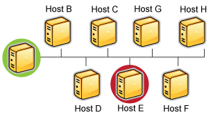

Redundante und Failover-Netzwerk-Überwachung
============================================

Einführung
----------

Dieser Abschnitt beschreibt einige Szenarien zum Implementieren von
redundanten Überwachungs-Hosts auf verschiedenen Arten von
Netzwerk-Layouts. Mit redundanten Hosts können Sie die Überwachung Ihres
Netzwerkes aufrecht erhalten, wenn der primäre Host, auf dem NAME-ICINGA
läuft, ausfällt oder wenn Teile Ihres Netzwerkes unerreichbar werden.

***Anmerkung:*** Wenn Sie gerade lernen, wie NAME-ICINGA zu nutzen ist,
würden wir empfehlen, Redundanz so lange nicht zu implementieren, bis
Sie mit den [Voraussetzungen](#redprerequisites) vertraut sind.
Redundanz ist ein relativ komplexes Thema und es ist noch schwieriger,
es zu implementieren.

Voraussetzungen
---------------

Bevor Sie überhaupt daran denken können, Redundanz mit NAME-ICINGA zu
implementieren, müssen Sie mit folgenden Dingen vertraut werden...

-   Implementieren von [Eventhandlern](#eventhandlers) für Hosts und
    Services

-   Erteilen von [externen Befehlen](#extcommands) an NAME-ICINGA über
    Shell-Scripts

-   Ausführen von Plugins auf entfernten Hosts mit Hilfe des [NAME-NRPE
    Addons](#addons-nrpe) oder einer anderen Methode

-   Überprüfen des Zustands des NAME-ICINGA-Prozesses mit dem
    *check\_nagios* Plugin

Beispielscripts
---------------

Jedes dieser Beispiel-Scripte, die wir in dieser Dokumentation benutzen,
finden Sie im *eventhandlers/*-Unterverzeichnis der
NAME-ICINGA-Distribution. Vielleicht müssen Sie sie modifizieren, damit
sie auf Ihrem System funktionieren...

Scenario 1 - Redundante Üverwachung
-----------------------------------

### Einführung

Dies ist eine einfache (und harmlose) Methode, redundante
Überwachungs-Hosts zu implementieren, und es wird nur gegen eine
begrenzte Anzahl von Ausfällen schützen. Komplexere Setups werden
benötigt, um intelligentere Redundanz, bessere Redundanz über
verschiedene Netzwerk-Segmente hinweg zu bieten.

### Ziele

Das Ziel dieser Art von Redundanz-Implementierung ist einfach. Sowohl
der "Master"- als auch der "Slave"-Host überwachen die gleichen Hosts
und Services auf dem Netzwerk. Unter normalen Umständen wird nur der
"Master"-Host Benachrichtigungen an Kontakte versenden. Wir wollen, dass
der "Slave"-Host die Benachrichtigung von Kontakten übernimmt, wenn:

1.  der "Master"-Host, auf dem NAME-ICINGA läuft, "down" ist oder...

2.  der NAME-ICINGA-Prozess auf dem "Master"-Host aus irgendeinem Grund
    stoppt

### Netzwork-Layout-Diagramm

Das untenstehende Diagramm zeigt ein sehr simples Netzwerk-Setup. Bei
diesem Szenario nehmen wir an, dass auf den Hosts A und E NAME-ICINGA
läuft und alle gezeigten Hosts überwacht werden. Host A ist der
"Master"-Host und Host E der "Slave"-Host.

  ------------------------------------------------------------------------
  
  ------------------------------------------------------------------------

### anfängliche Programmeinstellungen

Auf dem Slave-Host (Host E) wird die ursprüngliche
[enable\_notifications](#configmain-enable_notifications)-Direktive
deaktiviert, so dass dadurch der Versand von Host- oder
Service-Benachrichtigungen verhindert wird. Sie sollten auch
sicherstellen, dass die
[check\_external\_commands](#configmain-check_external_commands)-Direktive
deaktiviert ist. Das war einfach genug...

### anfängliche Konfiguration

Als nächstes sollten wir die Unterschiede zwischen den
[Objekt-Konfigurationsdatei](#configobject) von Master- und
Slave-Host(s) betrachten...

Wir gehen davon aus, dass Sie den Master-Host (Host A) so konfiguriert
haben, dass er alle Services auf den gezeigten Hosts des Diagramms
überwacht. Der Slave-Host (Host E) sollte die gleichen Hosts und
Services überwachen, mit folgenden Zusätzen in der
Konfigurationsdatei...

-   Die Host-Definition für Host A (in der Host-Konfigurationsdatei von
    Host E) sollte einen Host-[Eventhandler](#eventhandlers) enthalten.
    Der Name für den Host-Eventhandler lautet
    *handle-master-host-event*.

-   Die Konfigurationsdatei auf Host E enthält einen Service, der den
    Status des NAME-ICINGA-Prozesses auf Host A prüft. Lassen Sie uns
    annehmen, dass diese Prüfung das *check\_nagios*-Plugin auf Host A
    aufruft. Das kann durch eine der in den **FAQ** beschriebenen
    Methoden erfolgen.

-   Die Service-Definition für den NAME-ICINGA-Prozess auf Host A sollte
    einen [Eventhandler](#eventhandlers)-Eintrag enthalten. Als Namen
    für diese Service-Eventhandler wählen wir
    *handle-master-proc-event*.

Es ist wichtig anzumerken, dass Host A (der Master-Host) keine Ahnung
von Host E (dem Slave-Host) hat. In diesem Szenario besteht ganz einfach
keine Notwendigkeit dazu. Natürlich können Sie von Host A Services auf
Host E überwachen, aber das hat nichts mit der Implementierung von
Redundanz zu tun...

### Eventhandler-Befehlsdefinitionen

Wir müssen kurz innehalten und beschreiben, wie die Befehlsdefinitionen
für die Eventhandler auf dem Slave-Host aussehen. Hier ist ein
Beispiel...

     define command{
        command_name handle-master-host-event
        command_line URL-ICINGA-LIBEXEC/eventhandlers/handle-master-host-event $HOSTSTATE$ $HOSTSTATETYPE$
     }
     define command{
        command_name handle-master-proc-event
        command_line URL-ICINGA-LIBEXEC/eventhandlers/handle-master-proc-event $SERVICESTATE$ $SERVICESTATETYPE$
     }

Dies setzt voraus, dass Sie die Eventhandler-Scripte im Verzeichnis
*URL-ICINGA-LIBEXEC/eventhandlers* abgelegt haben. Sie können sie
ablegen, wohin Sie wollen, aber dann müssen Sie die beigefügten
Beispiele anpassen.

### Eventhandler-Scripte

Okay, lassen Sie uns nun einen Blick darauf werden, wie die
Eventhandler-Scripte aussehen...

Host-Eventhandler (*handle-master-host-event*):

     #!/bin/sh
     # Only take action on hard host states...
     case "$2" in
     HARD)
            case "$1" in
            DOWN)
                    # The master host has gone down!
                    # We should now become the master host and take
                    # over the responsibilities of monitoring the 
                    # network, so enable notifications...
                    URL-ICINGA-LIBEXEC/eventhandlers/enable_notifications
                    ;;
            UP)
                    # The master host has recovered!
                    # We should go back to being the slave host and
                    # let the master host do the monitoring, so 
                    # disable notifications...
                    URL-ICINGA-LIBEXEC/eventhandlers/disable_notifications
                    ;;
            esac
            ;;
     esac
     exit 0

Service-Eventhandler (*handle-master-proc-event*):

     #!/bin/sh
     # Only take action on hard service states...
     case "$2" in
     HARD)
            case "$1" in
            CRITICAL)
                    # The master NAME-ICINGA process is not running!
                    # We should now become the master host and
                    # take over the responsibility of monitoring
                    # the network, so enable notifications...
                    URL-ICINGA-LIBEXEC/eventhandlers/enable_notifications
                    ;;
            WARNING)
            UNKNOWN)
                    # The master NAME-ICINGA process may or may not
                    # be running.. We won't do anything here, but
                    # to be on the safe side you may decide you 
                    # want the slave host to become the master in
                    # these situations...
                    ;;
            OK)
                    # The master NAME-ICINGA process running again!
                    # We should go back to being the slave host, 
                    # so disable notifications...
                    URL-ICINGA-LIBEXEC/eventhandlers/disable_notifications
                    ;;
            esac
            ;;
     esac
     exit 0

### Was tun sie für uns

Auf dem Slave-Host (Host E) sind anfänglich die Benachrichtigungen
deaktiviert, so dass er keine Host- oder Service-Benachrichtigungen
versendet, solange der NAME-ICINGA-Prozess auf dem Master-Host (Host A)
noch läuft.

Der NAME-ICINGA-Prozess auf dem Slave-host (Host E) wird zum
Master-Host, wenn...

-   der Master-Host (Host A) "down" geht und der
    **handle-master-host-event** -Host-Eventhandler ausgeführt wird.

-   der NAME-ICINGA-Prozess auf dem Master-Host (Host A) aufhört zu
    arbeiten und der **handle-master-proc-event** -Service-Eventhandler
    ausgeführt wird.

Wenn bei dem NAME-ICINGA-Prozess auf dem Slave-Host (Host E)
Benachrichtigungen aktiviert sind, kann er Benachrichtigungen über
jegliche Host- und Service-Probleme und Erholungen versenden. An diesem
Punkt hat Host E die Verantwortlichkeiten über die Benachrichtigung von
Kontakten über Host- und Service-Probleme übernommen!

Der NAME-ICINGA-Prozess auf Host E wird wieder zum Host-Slave, wenn...

-   sich Host A wieder erholt und der **handle-master-host-event**
    -Host-Eventhandler ausgeführt wird.

-   sich der NAME-ICINGA-Prozess auf Host A wieder erholt und den
    **handle-master-proc-event** -Service-Eventhandler ausführt.

Wenn bei dem NAME-ICINGA-Prozess auf dem Slave-Host (Host E)
Benachrichtigungen deaktiviert sind, wird er keine Benachrichtigungen
mehr über Host- und Service-Probleme und Erholungen versenden. An diesem
Punkt hat Host E die Verantwortlichkeiten über die Benachrichtigung von
Kontakten über Host- und Service-Probleme an Host A übergeben. Alles ist
wieder so, als wir angefangen haben!

### Zeitverzögerungen

Redundanz bei NAME-ICINGA ist in keinster Weise perfekt. Eins der
offenkundigeren Probleme ist die Verzögerung zwischen dem Ausfall von
Host A und der Übernahme durch Host E. Das ist bedingt durch folgende
Dinge...

-   die Zeit zwischen dem Ausfall des Master-Host und dem ersten Mal,
    dass der Slave-Host ein Problem entdeckt

-   die Zeit, die benötigt wird, um festzustellen, dass der Master-Host
    wirklich ein Problem hat (unter Verwendung von Host- oder
    Service-Prüfwiederholungen auf dem Slave-Host)

-   die Zeit zwischen der Ausführung des Eventhandlers und der Zeit, zu
    der NAME-ICINGA das nächste Mal auf externe Befehle prüft

Sie können diese Verzögerung minimieren durch...

-   eine hohe Frequenz von (Wiederholungs-) Prüfungen für Services auf
    Host E. Das kann durch die *check\_interval*- und
    *retry\_interval*-Optionen in jeder Service-Definition erreicht
    werden.

-   eine Zahl der Host-Wiederholungsprüfungen für Host A (auf Host E),
    die eine schnelle Erkennung von Host-Problemen erlaubt. Das wird
    erreicht durch das *max\_check\_attempts*-Argument in der
    Host-Definition.

-   erhöhen der Frequenz der [external command](#extcommands)-Prüfungen
    auf Host E. Dies wird erreicht durch die Anpassung der
    [command\_check\_interval](#configmain-command_check_interval)-Option
    in der Hauptkonfigurationsdatei.

Wenn sich NAME-ICINGA auf Host A erholt, gibt es ebenfalls eine
Verzögerung, bevor Host E wieder zu einem Slave-Host wird. Das wird
durch folgende Dinge beeinflusst...

-   die Zeit zwischen der Erholung des Master-Hosts und der Zeit, zu der
    der NAME-ICINGA-Prozess auf Host E die Erholung erkennt

-   die Zeit zwischen der Ausführung des Eventhandlers auf Host A und
    der Zeit, zu der NAME-ICINGA-Prozess auf Host E das nächste Mal auf
    externe Befehle prüft

Die genaue Verzögerung zwischen dem Übergang der Verantwortlichkeiten
hängt davon ab, wieviele Services Sie definiert haben, dem Intervall, in
dem Services geprüft werden, und einer Menge pures Glück. Auf jeden
Falls ist es besser als nichts.

### Spezialfälle

Eins sollten Sie beachten: Wenn Host A "down" geht, werden bei Host E
die Benachrichtigungen aktiviert und er übernimmt die Verantwortung für
das Informieren der Kontakte bei Problemen. Wenn sich Host A wieder
erholt, werden bei Host E die Benachrichtigungen deaktiviert. Falls der
NAME-ICINGA-Prozess - wenn sich Host A erholt - auf Host A nicht sauber
startet, gibt es eine Zeitspanne, während der keiner der beiden Hosts
die Kontakte über Probleme informiert! Glücklicherweise berücksichtigt
die Service-Prüflogik in NAME-ICINGA diesen Umstand. Das nächste Mal,
wenn der NAME-ICINGA-Prozess auf Host E den Status des
NAME-ICINGA-Prozesses auf Host A prüft, wird er feststellen, dass dieser
nicht läuft. Auf Host E werden dann wieder die Benachrichtigungen
aktiviert und er wird erneut die Verantwortung für die Benachrichtigung
der Kontakte übernehmen.

Der exakte Wert für die Zeit, während der keiner der Hosts das Netzwerk
überwacht, ist schwer zu ermitteln. Offensichtlich kann diese Zeit durch
die Erhöhung der Frequenz von Service-Prüfungen (auf Host E) für Host A
minimiert werden. Der Rest ist purer Zufall, aber die gesamte
"Blackout"-Zeit sollte nicht allzu hoch sein.

Scenario 2 - Failover Überwachung
---------------------------------

### Einführung

Failover-Überwachung ist ähnlich wie die redundante Überwachung (wie
beschrieben in [Szenario 1](#redundancy-scenario_1)).

### Ziele

Das grundlegende Ziel der Failover-Überwachung besteht darin, dass der
NAME-ICINGA-Prozess auf dem Slave-Host untätig ist, während der
NAME-ICINGA-Prozess auf dem Master-Host läuft. Wenn der Prozess auf dem
Master-Host stoppt (oder der Host "down" geht), übernimmt der
NAME-ICINGA-Prozess auf dem Slave-Host die gesamte Überwachung.

Während es Ihnen die in [Szenario 1](#redundancy-scenario_1)
beschriebene Methode erlaubt, weiterhin Benachrichtigungen zu erhalten,
wenn der Master-Host "down" geht, gibt es einige Fallen. Das größte
Problem besteht darin, dass der Slave-Host die gleichen Hosts und
Services wie der Master *zur gleichen Zeit wie der Master* überwacht!
Dies kann Probleme durch übermäßigen Traffic und Load auf den
überwachten Maschinen verursachen, wenn Sie viele Services definiert
haben. Hier nun, wie Sie das Problem umgehen können.

### Initiale Programm-Einstellungen

Deaktivieren Sie aktive Service-Prüfungen und Benachrichtigungen auf dem
Slave-Host durch die
[execute\_service\_checks](#configmain-execute_service_checks)- und die
[enable\_notifications](#configmain-enable_notifications)-Direktiven.
Dies wird den Slave-Host davon abhalten, Services und Hosts zu
überwachen und Benachrichtigungen zu versenden, während der
NAME-ICINGA-Prozess auf dem Master-Host noch läuft. Stellen Sie außerdem
sicher, dass die
[check\_external\_commands](#configmain-check_external_commands)-Direktive
auf dem Slave-Host aktiviert ist.

### Master-Prozess-Prüfungen

Setzen Sie einen cron-Job auf dem Slave-Host auf, der periodisch (sagen
wir jede Minute) läuft und den Status des NAME-ICINGA-Prozesses auf dem
Master-Host (mit dem *check\_nrpe* auf dem Slave-Host und den [nrpe
daemon](#addons-nrpe) und *check\_nagios*-Plugins auf dem Master-Host)
prüft. Das Script sollte den Return-Code des *check\_nrpe-Plugins*
prüfen. Falls es einen nicht-OK-Status zurückliefert, sollte das Script
den entsprechenden Befehl an das [external command
file](#configmain-command_file) senden, um sowohl die Benachrichtigungen
als auch die aktiven Service-Prüfungen zu aktivieren. Falls das Plugin
einen OK-Status zurückliefert, sollte das Script Befehle an das external
command file senden, um sowohl Benachrichtigungen als auch aktive
Prüfungen zu deaktivieren.

Auf diese Weise läuft jeweils nur ein Prozess, der Hosts und Services
prüft, was wesentlich effizienter ist als alles doppelt zu überwachen.

Auch von Interesse: Sie müssen *nicht* wie in [Szenario
1](#redundancy-scenario_1) beschrieben die Host- und Service-Handler
definieren, weil die Dinge anders behandelt werden.

### Zusätzliche Themen

An diesem Punkt haben Sie ein sehr einfaches Failover-Überwachungs-Setup
implementiert. Trotzdem gibt es einen weiteren Punkt, den Sie
berücksichtigen sollten, damit die Dinge besser laufen.

Das große Problem dabei, wie die Dinge bisher konfiguriert sind, besteht
darin, dass der Slave-Host nicht den aktuellen Status von Hosts und
Services kennt, wenn er die Überwachung übernimmt. Ein Weg, dieses
Problem zu lösen, ist es, die [ocsp
command](#configmain-ocsp_command)-Option auf dem Master-Host zu
aktivieren und alle Service-Prüfergebnisse mit dem [nsca
Addon](#addons-nsca) an den Slave-Host zu schicken. Der Slave-Host wird
dann aktuelle Status-Informationen für alle Services haben, wenn er die
Überwachung übernimmt. Weil aktive Service-Prüfungen auf dem Slave-Host
nicht aktiviert sind, werden sie nicht ausgeführt. Host-Prüfungen
hingegen werden nach Bedarf ausgeführt. Das bedeutet, dass sowohl
Master- als auch Slave-Host Host-Prüfungen ausführen, wenn sie benötigt
werden, was kein Problem darstellen sollte, weil die Mehrzahl der
Überwachung Service-Prüfungen betrifft.

Das ist eigentlich alles, was das Setup betrifft.

Failover
Redundante und Failover-Netzwerk-Überwachung
Überwachung
Redundante und Failover-Netzwerk-Überwachung
Monitoring
Redundante und Failover-Netzwerk-Überwachung
Redundanz
Redundante und Failover-Netzwerk-Überwachung
