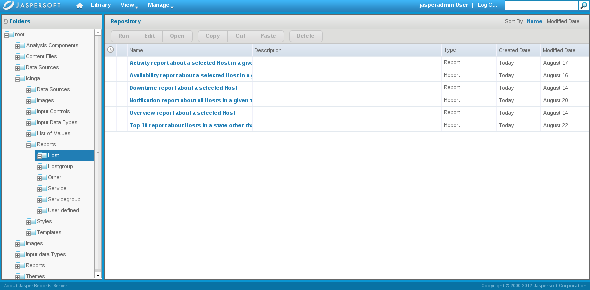

Installation von NAME-REP mit NAME-JASPER
=========================================

NAME-REP basiert auf dem NAME-IDOUTILS-Backend und unterstützt, genau
wie der NAME-CORE, alle großen Datenbankplattformen.

Hier geben wir Ihnen einige Hinweise, wie Sie das NAME-REP mit
NAME-JASPER installieren.

Offizielle Dokumentation
------------------------

Mehr Information finden Sie unter
[http://sourceforge.net/projects/jasperserver/files/JasperServer/JasperServer%205.0.0/JasperReports-Server-CP-Install-Guide.pdf](http://sourceforge.net/projects/jasperserver/files/JasperServer/JasperServer%205.0.0/JasperReports-Server-CP-Install-Guide.pdf)
oder
[http://jasperforge.org/espdocs/espbrowse.php?id=86&type=folder&group\_id=112&parent=86](http://jasperforge.org/espdocs/espbrowse.php?id=86&type=folder&group_id=112&parent=86)

Voraussetzungen
---------------

-   NAME-ICINGA und NAME-IDOUTILS

    Installiert wie in den Schnellstartanleitungen beschrieben, entweder
    über die [Sourcen](#quickstart-idoutils) oder über
    [Distributionspakete](#icinga-packages)

    > **Note**
    >
    > Ab NAME-ICINGA 1.8 gibt es eine Funktion in der Datenbank die alle
    > benötigten SLA- Informationen bereitstellt. Diese Funktion muss
    > zusätzlich zu dem Report- Paket zu in die bestehende NAME-IDOUTILS
    > Datenbank importiert werden.

    NAME-MYSQL

        #> /usr/bin/mysql icinga < icinga-reports-1.9.0/db/icinga/mysql/availability.sql

    Stellen Sie bitte ebenfalls sicher, dass der Datenbank- Benutzer
    (hier icinga@localhost) das Recht EXECUTE besitzt.

        #> /usr/bin/mysql -u root -p <password> icinga
        mysql> GRANT EXECUTE ON icinga.* TO 'icinga'@'localhost' ;
        quit

-   Apache Tomcat

    Nur falls Sie nicht den mit NAME-JASPER gebündelten Tomcat benutzen
    möchten.

         #> apt-get install tomcat6

-   NAME-POSTGRES

    Nur falls Sie nicht das mit JasperServer gebündelte NAME-POSTGRES
    benutzen möchten. NAME-POSTGRES ist für die NAME-JASPER interne
    Speicherung erforderlich.

    > **Note**
    >
    > Das Backend von NAME-JASPER wurde ab Version 4.2.1 von NAME-MYSQL
    > nach NAME-POSTGRES geändert!
    > [Source](http://jasperforge.org/plugins/espnews/browse.php?group_id=112&news_id=292)

-   NAME-JASPER

    > **Note**
    >
    > NAME-JASPER 5.0.0 wird erst ab NAME-REP 1.9 unterstützt! Für die
    > Installation Version des NAME-REP- Paketes \< 1.9 , nutzen Sie
    > bitte mindestens NAME-JASPER 4.5.0.

    Abhängig von Ihrer Architektur (`uname -a`) holen Sie sich den
    entsprechenden Installer - hier im Beispiel x64

         $> wget http://sourceforge.net/projects/jasperserver/files/JasperServer/JasperServer%205.0.0/jasperreports-server-cp-5.0.0-linux-x64-installer.run

         $> chmod +x jasperreports-server-cp-5.0.0-linux-x64-installer.run
         $> sudo ./jasperreports-server-cp-5.0.0-linux-x64-installer.run

    -   stimmen Sie der Lizenz zu

    -   wählen Sie "bundled tomcat"

    -   wählen Sie "bundled postgresql"

        -   wählen Sie eine anderen NAME-POSTGRES-Port, wie z.B. 5443,
            um nicht mit existierenden Einstellungen zu kollidieren

    -   installieren Sie die Beispiel-Reports und "ireports"

    Der Installer wird automatisch die benötigte Datenbank und das
    Schema anlegen und die Beispiele installieren.

    > **Note**
    >
    > Die standardmäßig wird NAME-JASPER nach
    > /opt/jasperreports-server-cp-5.0.0/ installiert. Wenn Sie den
    > NAME-JASPER aktualisieren, versichern Sie sich mit der richtigen
    > Version zu arbeiten!

    *Start*

         #> cd /opt/jasperreports-server-cp-5.0.0/
         #> ./ctlscript.sh start

    Für einzelne Komponenten

         #> ./ctlscript.sh postgresql start|stop
         #> ./ctlscript.sh tomcat start|stop

Icinga Reporting
----------------

Beginnend mit Icinga 1.6 liefert das Paket configure- und make-Skripte.

-   Sourcen

    Laden Sie das Paket von sourceforge herunter und entpacken es. Falls
    Sie ein Problem haben, das ggf. in der Entwickerversion gelöst ist,
    dann holen Sie sich den aktuellen Entwickler-Snapshot aus git

         $> wget http://sourceforge.net/projects/icinga/files/icinga-reporting/1.9.0/icinga-reports-1.9.0.tar.gz; \
            tar xzf icinga-reports-1.9.0.tar.gz; \
            cd icinga-reports-1.9.0

    oder

         $> git clone git://git.icinga.org/icinga-reports.git ; \
            cd icinga-reports

    Falls ein Entwickler Sie gebeten hat, ihren/seinen Branch zu
    benutzen, dann benutzen Sie

         $> git branch localbranch origin/devhead/devbranch
         $> git checkout localbranch
         $> git log

-   Konfigurieren

    Falls Sie den NAME-JASPER vorher nicht mit dem Default-Präfix
    installiert haben, dann müssen Sie configure den Standort mitteilen.

         $> ./configure --with-jasper-server=/opt/jasperreports-server-cp-5.0.0

-   Make

    Rufen Sie 'make' ohne Parameter auf, um eine komplette Liste der
    verfügbaren Optionen zu erhalten.

    -   NAME-MYSQL Connector

        NAME-JASPER wird mit dem NAME-POSTGRES-Connector ausgeliefert,
        aber wenn Sie NAME-MYSQL benötigen, dann bietet das
        NAME-REP-Paket einen Connector zur Installation an.

             #> make install-mysql-connector

        Starten Sie den Tomcat-Server neu

             #> cd /opt/jasperreports-server-cp-5.0.0
             #> ./ctlscript.sh stop tomcat
             #> ./ctlscript.sh start tomcat

    -   Installieren

        Der NAME-JASPER muss gestartet sein!

             #> make install

        Starten Sie den Tomcat-Server neu

             #> cd /opt/jasperreports-server-cp-5.0.0
             #> ./ctlscript.sh stop tomcat
             #> ./ctlscript.sh start tomcat

Konfiguration
-------------

Öffnen Sie das Web-Interface, Standardwerte sind jasperadmin:jasperadmin

<http://127.0.0.1:8080/jasperserver>

-   IDO

    Gehen Sie nach </root/Icinga/datasource> (stellen Sie sicher, dass
    Refine den Wert "changed by anyone" enthält).

    

    -   Editieren Sie die vorhandene "datasource" und stellen Sie Ihre
        Werte ein. MySQL driver: com.mysql.jdbc.Driver MySQL URL:
        jdbc:mysql://localhost:3306/icinga

    -   Testen Sie die Konfiguration und speichern Sie die Verbindung.

    -   Alle Reports in unserem Paket zeigen auf diese "datasource" und
        sollten lauffähig sein.

Reports
-------

Überprüfen Sie, dass die Reports verfügbar und lauffähig sind.

Fehler
------

-   Anzeigefehler

         org.springframework.web.util.NestedServletException: Handler processing failed; 
         nested exception is java.lang.InternalError:
         Can't connect to X11 window server using ':0' as the value of the DISPLAY variable.

    Der Tomcat läuft als root und versucht, auf das X11-Display des
    Benutzers zuzugreifen. Erlauben Sie es für jeden lokalen Benutzer.

         $> xhost +local:all

-   Generierungsfehler

         org.springframework.web.util.NestedServletException: Handler processing failed;
         nested exception is java.lang.NoClassDefFoundError:
         Could not initialize class net.sf.jasperreports.engine.util.JRStyledTextParser

    Es könnte Sun AWT sein, das versucht, auf X11-Klassen zuzugreifen,
    aber tatsächlich ist es die PDF-Generierung für einen Report.

         $> sudo apt-get install msttcorefonts
         $> cd /opt/jasperreports-server-cp-5.0.0
         $> sudo sh ctlscript.sh stop
         $> sudo sh ctlscript.sh start

NAME-REP with NAME-JASPER
NAME-REP
