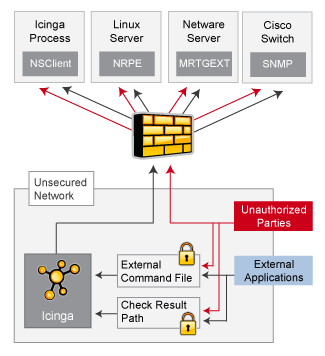
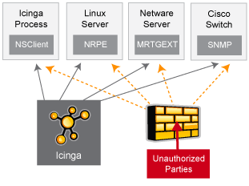
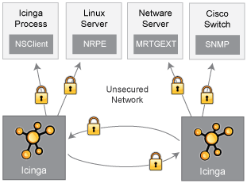

Sicherheitsüberlegungen
=======================

Einführung
----------

Dies ist als ein kurzer Überblick einiger Dinge gedacht, die Sie bei der
Installation von NAME-ICINGA im Hinterkopf behalten sollten, um es in
einer sicheren Weise aufzusetzen.

Ihr Überwachungsrechner sollte als eine Hintertür in Ihre anderen System
betrachtet werden. In vielen Fällen wird dem NAME-ICINGA-Rechner der
Zugriff auf Firewalls gewährt, um entfernte Server zu überwachen. In den
meisten Fällen ist die Abfrage von verschiedenen Informationen der
entfernten Server erlaubt. Überwachenden Servern wird ein gewisses Maß
an Vertrauen entgegen gebracht, damit sie entfernte Systeme abfragen
können. Das bietet einem potenziellen Angreifer eine attraktive
Hintertür zu Ihren Systemen. Ein Angreifer könnte es einfacher haben, in
Ihre Systeme einzudringen, wenn er zuerst den Überwachungsserver
kompromittiert. Das trifft besonders dann zu, wenn Sie gemeinsame
SSH-Schlüssel nutzen, um entfernte Systeme zu überwachen.

Wenn ein Eindringling in der Lage ist, Prüfergebnisse oder externe
Befehle an den NAME-ICINGA-Daemon zu erteilen, hat er die Möglichkeit,
falsche Überwachungsdaten zu übertragen, Sie mit falschen
Benachrichtigungen auf die Palme bringen oder Eventhandler-Scripte
auszulösen. Wenn Sie Eventhandler-Scripte haben, die Services neu
starten, Strom unterbrechen usw., dann kann das ziemlich problematisch
sein.

Ein weiterer zu beachtender Bereich ist die Möglichkeit von
Eindringlingen, Überwachungsdaten (Statusinformationen) zu belauschen,
während sie über den Draht gehen. Wenn Übertragungskanäle nicht
verschlüsselt sind, können Angreifer durch Beobachtung Ihrer
Überwachungsdaten wertvolle Informationen gewinnen. Nehmen Sie als
Beispiel die folgende Situation: ein Angreifer belauscht für eine
gewisse Zeit die Überwachungsdaten und analysiert die typische CPU- und
Plattenauslastung Ihrer Systeme zusammen mit der Zahl der Benutzer, die
typischerweise angemeldet sind. Der Angreifer ist dann in der Lage, die
beste Zeit für die Kompromittierung eines Systems und dessen Ressourcen
(CPU usw.) zu ermitteln, ohne bemerkt zu werden.

Hier sind einige Hinweise, wie Sie Ihre Systeme sichern können, wenn Sie
eine NAME-ICINGA-basierte Überwachungslösung implementieren...

Optimale Verfahren
------------------

1.  **Benutzen Sie eine eigene Überwachungs-Box**. Wir würden empfehlen,
    dass Sie einen Server benutzen, der nur für die Überwachung (und
    ggf. andere administrative Aufgaben) vorgesehen ist. Schützen Sie
    Ihren Überwachungsserver, als wäre es einer der wichtigsten Server
    Ihres Netzwerks. Halten Sie die laufenden Services auf einem Minimum
    und beschränken Sie den Zugang durch TCP-Wrapper, Firewalls usw.
    Weil der NAME-ICINGA-Rechner berechtigt ist, mit Ihren Servern zu
    reden und vielleicht durch Ihre Firewalls zu gehen, kann es ein
    Sicherheitsrisiko sein, wenn Sie Benutzern Zugang zu Ihrem
    Überwachungsserver gewähren. Bedenken Sie, dass es einfacher ist,
    root-Zugang über eine Sicherheitslücke zu bekommen, wenn Sie ein
    lokales Benutzerkonto auf dem System haben.

    

2.  **Lassen Sie NAME-ICINGA nicht als root laufen** . NAME-ICINGA muss
    nicht als root laufen, also tun Sie es nicht. Sie können NAME-ICINGA
    anweisen, die Berechtigungen nach dem Start zu "droppen" und mit
    Hilfe der [icinga\_user](configmain-nagios_user)- und
    [icinga\_group](configmain-nagios_group)-Direktiven in der
    Hauptkonfigurationsdatei unter anderen Benutzer- und/oder
    Gruppenberechtigungen zu laufen. Wenn Sie Eventhandler oder Plugins
    ausführen müssen, die Root-Berechtigungen benötigen, möchten Sie
    vielleicht [sudo](http://www.courtesan.com/sudo/sudo.html) nutzen.

3.  **Verriegeln Sie das Prüfergebnis-Verzeichnis**. Stellen Sie sicher,
    dass nur der *icinga*-Benutzer im [check result
    path](#configmain-check_result_path) lesen und schreiben darf. Wenn
    andere Benutzer außer *icinga* (oder *root*) in diesem Verzeichnis
    schreiben dürfen, dann können sie falsche
    Host-/Service-Prüfergebnisse an den NAME-ICINGA-Daemon senden. Dies
    kann zu Ärger (falschen Benachrichtigungen) oder
    Sicherheitsproblemen (ausgelösten Eventhandlern) führen.

4.  **Verriegeln Sie das External Command File**. Wenn Sie [externe
    Befehle](extcommands.html) aktivieren, dann stellen Sie sicher, dass
    Sie passende Berechtigungen für das
    *URL-ICINGA-BASE/var/rw*-Verzeichnis setzen. Nur der
    NAME-ICINGA-Benutzer (normalerweise *icinga*) und der
    Web-Server-Benutzer (normalerweise *nobody*, *httpd*, *apache2* oder
    *www-data*) sollten Schreibberechtigung für das Commmand-File
    besitzen. Wenn Sie NAME-ICINGA auf einer Maschine installiert haben,
    die der Überwachung und administrativen Aufgaben dient, dann sollte
    das ausreichen. Wenn Sie es auf einer allgemeinen- oder
    Multi-User-Maschine installiert haben (nicht empfohlen) und dem
    Web-Server-Benutzer Schreibberechtigung auf das Command-File geben,
    kann das ein Sicherheitsproblem sein. Sie wollen schließlich nicht,
    dass jeder Benutzer auf Ihrem System NAME-ICINGA über das
    External-Command-File kontrollieren kann. In diesem Fall würden wir
    raten, nur dem *nagios*-Benutzer Schreibberechtigung zu erlauben und
    etwas wie [CGIWrap](http://cgiwrap.sourceforge.net/) zu benutzen, um
    die CGIs als *icinga* statt als *nobody* laufen zu lassen.

5.  **Fordern Sie Authentifizierung bei den CGIs**. Wir empfehlen
    dringend Authentifizierung für den Zugriff auf die CGIs. Sobald Sie
    das tun, lesen Sie die Dokumentation zu Standardberechtigungen von
    authentifizierten Kontakten und autorisieren Sie bestimmte Kontakte
    für zusätzliche Rechte nur, wenn es nötig ist. Eine Anleitung zur
    Einrichtung von Authentifizierung und Autorisierung finden Sie
    [hier](#cgiauth). Wenn Sie mit der
    [use\_authentication](#configcgi-use_authentication)-Direktive die
    Authentifizierung in der CGI-Konfigurationsdatei deaktivieren, wird
    das [command CGI](#cgis-cmd_cgi) das Schreiben jeglicher Befehle in
    das [external command file](#configmain-command_file) verweigern.
    Sie wollen schließlich nicht, dass alle Welt in der Lage ist,
    NAME-ICINGA zu kontrollieren, oder?

6.  **Benutzen Sie absolute Pfade in Befehlsdefinitionen**. Wenn Sie
    Befehle definieren, benutzen Sie den *absoluten Pfad* (keinen
    relativen) für Scripte oder Programm, die Sie ausführen.

7.  **Verstecken Sie sensible Daten mit \$USERn\$-Makros**. Die CGIs
    lesen die [Hauptkonfigurationsdatei](#configmain) und die
    [Objekt-Konfigurationsdatei(en)](#configobject), so dass Sie dort
    keine sensiblen Informationen (Benutzernamen, Passwörter, usw.)
    ablegen sollten. Wenn Sie Benutzernamen und/oder Passwörter in einer
    Befehlsdefinition angeben müssen, dann nutzen Sie ein
    \$USERn\$-[Makro](#macros), um sie zu verstecken. \$USERn\$-Makros
    werden in einer oder mehreren
    [Ressourcen-Dateien](#configmain-resource_file) definiert. Die CGIs
    werden nicht versuchen, den Inhalt von Ressourcen-Dateien zu lesen,
    so dass Sie restriktivere Berechtigungen (600 oder 660) dafür
    benutzen können. Betrachten Sie die Beispiel-*resource.cfg*-Datei im
    Basisverzeichnis der NAME-ICINGA-Distribution für ein Beispiel, wie
    \$USERn\$-Makros zu definieren sind.

8.  **Entfernen Sie gefährliche Zeichen aus Makros**. Benutzen Sie die
    [illegal\_macro\_output\_chars](#configmain-illegal_macro_output_chars)-Direktive,
    um gefährliche Zeichen aus den \$HOSTOUTPUT\$- , \$SERVICEOUTPUT\$-,
    \$HOSTPERFDATA\$- und \$SERVICEPERFDATA\$-Makros zu entfernen, bevor
    sie in Benachrichtigungen usw. benutzt werden. Gefährliche Zeichen
    kann alles sein, was ggf. durch die Shell interpretiert wird und
    dadurch eine Sicherheitslücke öffnet. Ein Beispiel dafür sind
    Backtick-Zeichen (\`) in den \$HOSTOUTPUT\$, \$SERVICEOUTPUT\$,
    \$HOSTPERFDATA\$ und /oder \$SERVICEPERFDATA\$-Makros, die es einem
    Angreifer erlauben, einen beliebigen Befehl als NAME-ICINGA-Benutzer
    auszuführen (ein guter Grund, NAME-ICINGA NICHT als root-Benutzer
    laufen zu lassen).

9.  **Sicherer Zugang zu entfernten Agenten**. Verriegeln Sie den Zugang
    zu Agenten (NAME-NRPE, NSClient, SNMP, usw.) auf entfernten Systemen
    durch Firewalls, Zugangsliste usw. Sie wollen nicht, dass jeder Ihre
    Systeme nach Statusinformationen abfragt. Diese Informationen können
    durch einen Angreifer genutzt werden, um entfernte
    Eventhandler-Scripte auszuführen oder die beste Zeit zu ermitteln,
    um nicht beobachtet zu werden.

    

10. **Sichere Kommunikationskanäle**. Stellen Sie sicher, dass Sie die
    Kommunikationskanäle zwischen verschiedenen
    NAME-ICINGA-Installationen und Ihren Überwachungskanälen
    verschlüsseln, wann immer möglich. Sie wollen nicht, dass jemand
    Statusinformationen belauscht, die über Ihr Netzwerk gehen. Diese
    Informationen können durch einen Angreifer genutzt werden, um die
    beste Zeit für einen unbeobachteten Zugang zu ermitteln.

    

Sicherheitsüberlegungen
