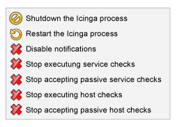

NAME-ICINGA starten und stoppen
===============================

Es gibt mehr als einen Weg, um NAME-ICINGA zu starten, zu stoppen und
erneut zu starten. Hier einige der üblichen...

 Hinweis: Stellen Sie immer sicher, dass Sie Ihre
[Konfiguration überprüfen](#verifyconfig), bevor Sie NAME-ICINGA
(neu)starten.

**NAME-ICINGA starten**

1.  **Init-Script:** Der einfachste Weg, den NAME-ICINGA-Daemon zu
    starten, ist die Nutzung des Init-Scripts:

         #> /etc/rc.d/init.d/icinga start

2.  **manuell:** Sie können NAME-ICINGA manuell mit der
    **-d**-Kommandozeilenoption wie folgt starten:

         #> URL-ICINGA-BIN -d URL-ICINGA-CFG

3.  **Debug Modus:** Im ziemlich seltenen Fall, dass NAME-ICINGA sich
    still ohne Hinweise in den verschiedenen Log-Dateien beendet, können
    Sie NAME-ICINGA durch das Weglassen der Daemon-Option starten:

         #> URL-ICINGA-BIN URL-ICINGA-CFG

    Auf diese Weise wird es im Vordergrund gestartet, so dass eine Menge
    von Meldungen über den Bildschirm laufen, aber es könnte zu einem
    Hinweis ganz am Ende führen.

**NAME-ICINGA erneut starten**

Ein Neustart bzw. neu laden ist notwendig, wenn Sie Ihre
Konfigurationsdateien verändert haben und diese Änderungen aktiv werden
sollen.

1.  **Init-Script:** Der einfachste Weg, den NAME-ICINGA-Daemon neu zu
    starten, ist die Nutzung des Init-Scripts:

         #> /etc/rc.d/init.d/icinga reload

2.  **Web-Interface:** Sie können NAME-ICINGA mit Hilfe des
    Web-Interfaces neu starten. Klicken Sie auf den "Process
    Info"-Navigations-Link und wählen Sie "Restart the NAME-ICINGA
    process":

    

3.  **manuell:** Sie können den NAME-ICINGA-Prozess durch Senden eines
    SIGHUP-Signals neu starten:

         #> kill -HUP <icinga_pid>

**NAME-ICINGA stoppen**

1.  **Init-Script:** Der einfachste Weg, den NAME-ICINGA-Daemon zu
    stoppen, ist die Nutzung des Init-Script:

         #> /etc/rc.d/init.d/icinga stop

2.  **Web-Interface:** Sie können NAME-ICINGA mit Hilfe des
    Web-Interfaces stoppen. Klicken Sie auf den "Process
    Info"-Navigations-Link und wählen Sie "Shutdown the NAME-ICINGA
    process":

    

3.  **manuell:** Sie können den NAME-ICINGA-Prozess durch Senden eines
    SIGTERM-Signals stoppen:

         #> kill <icinga_pid>

**Protokoll-Einstellungen in /usr/local/icinga/etc/icinga.cfg**

Einstellungen für den Daemon:

Definiert ob Nachrichten in die Daemon Logdatei geschrieben werden
sollen (gewöhnlich nach icinga.log). Der Standardwert ist 1 (ja), setzen
des Wertes auf 0 (nein) verhindert den Log der Nachrichten.

    use_daemon_log=0/1

Einstellungen für den Syslog-Dienst:

Wenn Sie möchten, dass NAME-ICINGA Meldungen an den Syslog-Dienst
übergibt, setzen Sie diese Einstellung auf 1.

    use_syslog=0/1

Diese Option kann zusätzlich zur use\_daemon\_log-Option verwendet
werden.

**Verschiedene Optionen**

Falls Sie große Verzögerungen zwischen dem Start von NAME-ICINGA und den
ersten Prüfungen feststellen, dann gibt es verschiedene Optionen, die
[hier](#faststartup) näher beschrieben sind. Dort finden Sie auch die
Option -S, die nähere Informationen zur Scheduling Queue ausgibt.

NAME-ICINGA starten und stoppen
NAME-ICINGA Kommandozeilenoptionen
Option -d (Daemon-Modus)
NAME-ICINGA Log-Optionen
