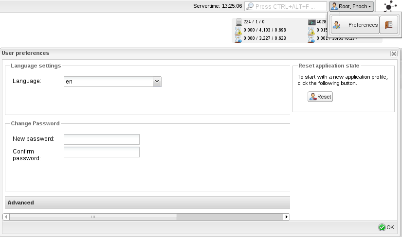

Aktualisierung von NAME-WEB und NAME-WEB Datenbank
==================================================

Aktualisieren von NAME-WEB
--------------------------

Sobald neuere Versionen von NAME-WEB herauskommen, sollten Sie dringend
über eine Aktualisierung nachdenken. Neuere Ausgaben enthalten
Behebungen von kritischen Fehlern, so dass es wichtig ist, aktuell zu
sein. Wenn Sie bereits NAME-WEB, wie in den Schnellstartanleitungen
beschrieben, aus dem Quellcode installiert haben, dann können Sie
einfach neuere Versionen installieren.

Stellen Sie sicher, dass Sie eine vollständige Datensicherung Ihrer
bestehenden NAME-WEB-Installation und der Konfigurationsdateien haben
(wenn Sie Ihre benutzerdefinierte Konfiguration in \*.site.xml- Dateien
erstellt haben, so werden diese während der Aktualisierung nicht
überschrieben!). Wenn irgendetwas schief geht oder nicht funktioniert,
dann können Sie auf diese Weise schnell Ihre alte NAME-WEB-Version
wiederherstellen.

Bitte denken Sie daran, dass `configure` mit den gleichen Optionen wie
bei der vorherigen Installation aufzurufen ist! Die verwendeten Optionen
sehen Sie im `config.log.`

> **Note**
>
> Seit 1.9 ist der Tackle-Cronk in NAME-WEB veraltet.

> **Note**
>
> Mit 1.9 wurde die Datei `.htaccess` enfernt und alle Rewrite Regeln in
> die Apacheconfiguration übernommen.
>
> Bitte aktualisieren Sie ihre Apache Konfiguration `icinga-web.conf`
> (`etc/conf.d/icinga-web.conf` im Quell Tarball) oder führen Sie
> `make install-apache-config` aus.
>
> Beim Update einer vorhandenen Installation sollten die `.htaccess`
> Dateien in `/usr/local/icinga-web/pub/` und
> `/usr/local/icinga-web/pub/soap/` (oder wo Sie NAME-WEB installiert
> haben) entfernt werden.

> **Note**
>
> Beginnend mit 1.8.2 gibt es einen neuen Session-Cache, der beim Update
> von NAME-WEB bzw. der Installation eines neuen Cronks oder Moduls ggf.
> zu Irritationen führen kann. Wenn Sie ein Verhalten feststellen wie
> "Ich kann meinen neu installierten Cronk nicht sehen" oder "nach einem
> Update kann ich nicht auf das Reporting-Cronk zugreifen", dann ist die
> Lösung recht einfach
>
> -   Löschen Sie den xml-Cache
>
> -   Zurücksetzen des Applikationszustands des Benutzers (rechte obere
>     Ecke -\> Preferences)
>
> -   Abmelden und neu anmelden (rechte obere Ecke)
>
>     
>
> **Note**
>
> Bitte beachten Sie, dass es einige wesentliche Änderungen mit Icinga
> 1.5 gab, die ggf. zusätzliche Aktionen erfordern könnten:
>
> -   Die `*.site.xml`-Datei für lokale Konfigurationsanpassungen wurden
>     entfernt, Konfigurationen werden nun unter `etc/conf.d/` abgelegt
>     (oder dem Pfad, der während der Installation mit --with-conf-dir
>     (--with-conf-folder bis NAME-ICINGA 1.6.x) angegeben wurde)
>
> -   Das Log-Verzeichnis befindet sich nun unter `log/` (oder dem Pfad,
>     der während der Installation mit --with-log-folder angegeben
>     wurde)
>
> -   Die Icinga-API wurde entfernt und nun wird Doctrine für alle
>     Datenbank-Transaktionen benutzt (`icinga-io.xml` ist nun
>     `databases.xml`)
>
> -   Befehle werden nun durch den internen Console-Handler versandt
>     (weil die Icinga-API entfernt wurde)
>
> Falls Sie Icinga-Web \<= 1.4x benutzen, dann empfehlen wir eine
> Neuinstallation anstatt einer Aktualisierung. Es ist besser, Ihre
> alten Konfigurationsdateien in die neue Struktur zu kopieren, weil es
> viele geänderte und gelöschte Dateien gibt, um die wir uns bei einer
> Aktualisierung ggf. nicht kümmern.

> **Note**
>
> Falls Sie die PNP Template Extensions für Icinga Web installiert
> haben, müssen Sie diese ebenfalls aktualisieren (sowie den Cache
> leeren!).

Die Aktualisierung von NAME-WEB
-------------------------------

Bitte laden Sie das Archiv von
[http://sourceforge.net/projects/icinga/files/](http://sourceforge.net/projects/icinga/files/)
herunter. Falls Sie ein Problem haben, das in der aktuellen
Entwicklerversion behoben ist, dann klonen Sie den aktuellsten git-
Branch mit :

     #> git clone git://git.icinga.org/icinga-web.git

Entpacken Sie das Archiv (tarball):

     #> tar xzvf icinga-web-VER-ICINGAWEB.tar.gz

Wechseln Sie in das Verzeichnis

     #> cd icinga-web-VER-ICINGAWEB

NAME-WEB bietet diverse Konfigurationsoptionen an:

     #> ./configure 
                    --prefix=/usr/local/icinga-web 
                    --with-web-user=www-data 
                    --with-web-group=www-data 
                    --with-web-path=/icinga-web 
                    --with-web-apache-path=/etc/apache2/conf.d 
                    --with-db-type=mysql 
                    --with-db-host=localhost 
                    --with-db-port=3306 
                    --with-db-name=icinga_web 
                    --with-db-user=icinga_web 
                    --with-db-pass=icinga_web 
                    --with-icinga-api=/usr/local/icinga/share/icinga-api 
                    --with-api-type=APICON API type (default CONNECTION_IDO)
                    --with-api-subtype=TYPE DB driver or network connection
                    --with-api-host=HOST Host to connect (DB or other) (default localhost)
                    --with-api-port=PORT Port for connection (default 3306)
                    --with-api-socket=PATH Path to socket (default none)

> **Note**
>
> Bitte beachten Sie, dass Sie hier die NAME-WEB-Datenbank
> konfigurieren, und nicht die Icinga-IDOUtils-Datenbank! User- und
> Gruppenname des Web-Prozesses sind abhängig von der verwendeten
> Distribution.

Alle configure- Optionen sehen Sie mit:

     #> ./configure --help

> **Note**
>
> Wenn Sie configure ohne weitere Optionen ausführen, erwartet der
> Installer die NAME-API unter /usr/local/icinga/share/icinga-api.

Die Aktualisierung von NAME-WEB unter /usr/local/icinga-web erfolgt mit:

     #> ./configure
     #> make upgrade

> **Note**
>
> Bitte denken Sie daran den Cache zu leeren!

     #> rm -rf app/cache/config/*.php

oder /path/to/clearcache.sh

     #> /usr/local/icinga-web/bin/clearcache.sh

Das war's, Sie können sich nun an Ihrem aktualisierten NAME-WEB
anmelden.

Bekannte Fehler sind [hier](#webtroubleshooting) beschrieben.

Aktualisieren der NAME-WEB Datenbank
------------------------------------

Die Aktualisierung Ihrer NAME-WEB Datenbank ist zwingend erforderlich
sofern es Änderungen am Schema gegeben hat. Sollten Sie kein Update SQL
Script auf das aktuelle Release vorfinden, müssen Sie nichts tun. Wenn
Sie eine ältere NAME-WEB Datenbank-Version aktualisieren, dann müssen
Sie außerdem diese Anpassungen manuell ausführen. Wenn Sie
rpm/deb-Pakete benutzen, lesen Sie bitte die Hinweise und/oder fragen
Sie den Maintainer, der diese Anpassungen in der Installationsroutine
hinzugefügt hat.

> **Note**
>
> Abhängig von den Änderungen und der Größe Ihrer Datenbank kann es eine
> Weile dauern, die Anpassungen durchzuführen. Bitte haben Sie ein wenig
> Geduld und brechen Sie das Script nicht ab, weil sonst ggf. Ihre Daten
> unbrauchbar sind.

Die Update-Dateien finden Sie zusammen mit den
Datenbank-Installationsdateien in
`/path/to/icinga-web/etc/schema/updates`

Die Syntax ist wie folgt

`<rdbm>_<alteVersion>_to_<neueVersion>.sql`

wobei \<rdbm\> mysql, pgsql oder oracle sein kann und \<neueVersion\>
zeigt auf die Version, auf die Sie aktualisieren wollen.

> **Note**
>
> Wenn Sie eine ältere Version aktualisieren wollen und zwischen dieser
> und der aktuellen noch andere Versionen liegen, dann sollten Sie
> beachten, dass Sie auch die dazwischen liegenden Updates inkrementell
> installieren müssen!

1.  Sichern Sie Ihre aktuelle Datenbank vor der Aktualisierung!

2.  Prüfen Sie die laufende NAME-WEB Datenbank- Version und die
    Zielversion. Prüfen Sie, ob zwischen diesen beiden Versionen noch
    andere Versionen liegen und aktualisieren Sie ggf. schrittweise.

3.  Führen Sie die Aktualisierung(en) mit einem Benutzer durch, der über
    die notwendigen Berechtigungen verfügt.

-   **MySQL**

         $ mysql -u root -p icinga_web < /path/to/icinga-web/etc/schema/updates/mysql_<alteVersion>_to_<neueVersion>.sql

    **Postgresql**

         #> su - postgres
         $ psql -U icinga_web -d icinga_web < /path/to/icinga-web/etc/schema/updates/pgsql_<alteVersion>_to_<neueVersion>.sql

-   **Oracle**

         #> su - oracle
         $ sqlplus dbuser/dbpass
         SQL> @oracle_<alteVersion>_to_<neueVersion>.sql

Aktualisierung von NAME-WEB
NAME-WEB
Aktualisierung von
Aktualisierung der NAME-WEB-Datenbank
NAME-WEB
Datenbank-Update
